# ALGORITMOS DETALLADOS DEL SISTEMA AGROAPP
## AnimalDAO y Flujo de Registro de Animal

Fecha: Diciembre 2025
Sistema: AgroApp - Gestión Ganadera

---

# ALGORITMO: AnimalDAO - CAPA DE ACCESO A DATOS

## 1. Entradas y Salidas

### Método: insertarAnimal(animal: Animal)
**Entradas:**
- animal: Animal - Objeto con todos los atributos del animal a insertar

**Salidas:**
- resultado: Long - ID del registro insertado (>0 éxito), -1 si arete duplicado

### Método: actualizarAnimal(animal: Animal)
**Entradas:**
- animal: Animal - Objeto con los datos actualizados (debe incluir ID)

**Salidas:**
- filasAfectadas: Integer - Número de registros modificados (1 éxito, 0 fallo)

### Método: eliminarAnimal(id: Integer)
**Entradas:**
- id: Integer - Identificador único del animal

**Salidas:**
- filasAfectadas: Integer - Número de registros eliminados

### Método: obtenerAnimalPorId(id: Integer)
**Entradas:**
- id: Integer - Identificador único del animal

**Salidas:**
- animal: Animal - Objeto Animal o NULL si no existe

### Método: obtenerTodosLosAnimales()
**Entradas:**
- Ninguna

**Salidas:**
- listaAnimales: List<Animal> - Lista de todos los animales ordenados por nombre

### Método: existeArete(numeroArete: String)
**Entradas:**
- numeroArete: String - Número de arete SINIGA a verificar

**Salidas:**
- existe: Boolean - TRUE si ya existe, FALSE si está disponible

---

## 2. Pseudocódigo

```
CLASE AnimalDAO
    ATRIBUTOS:
        dbHelper: DatabaseHelper
    
    CONSTRUCTOR(dbHelper: DatabaseHelper)
        this.dbHelper = dbHelper
    FIN CONSTRUCTOR
    
    // ========================================
    // MÉTODO: Verificar si existe arete
    // ========================================
    FUNCIÓN existeArete(numeroArete: String): Boolean
        INICIO
            db = dbHelper.obtenerBaseDatosLectura()
            
            cursor = db.consultar(
                tabla = "animales",
                columnas = ["id"],
                condicion = "numero_arete = ?",
                argumentos = [numeroArete]
            )
            
            existe = (cursor != NULL) Y (cursor.cantidad > 0)
            
            SI cursor != NULL ENTONCES
                cursor.cerrar()
            FIN SI
            
            RETORNAR existe
        FIN
    FIN FUNCIÓN
    
    // ========================================
    // MÉTODO: Insertar nuevo animal
    // ========================================
    FUNCIÓN insertarAnimal(animal: Animal): Long
        INICIO
            // Paso 1: Verificar unicidad de arete
            SI existeArete(animal.numeroArete) ENTONCES
                RETORNAR -1  // Arete duplicado
            FIN SI
            
            // Paso 2: Obtener conexión de escritura
            db = dbHelper.obtenerBaseDatosEscritura()
            
            // Paso 3: Preparar valores
            valores = NuevoContenedor()
            valores.agregar("numero_arete", animal.numeroArete)
            valores.agregar("nombre", animal.nombre)
            valores.agregar("raza", animal.raza)
            valores.agregar("sexo", animal.sexo)
            valores.agregar("fecha_nacimiento", animal.fechaNacimiento)
            valores.agregar("fecha_ingreso", animal.fechaIngreso)
            valores.agregar("fecha_salida", animal.fechaSalida)
            valores.agregar("precio_compra", animal.precioCompra)
            valores.agregar("precio_venta", animal.precioVenta)
            valores.agregar("foto", animal.foto)
            valores.agregar("estado", animal.estado)
            valores.agregar("observaciones", animal.observaciones)
            
            // Paso 4: Ejecutar inserción
            idGenerado = db.insertar("animales", NULL, valores)
            
            RETORNAR idGenerado
        FIN
    FIN FUNCIÓN
    
    // ========================================
    // MÉTODO: Actualizar animal existente
    // ========================================
    FUNCIÓN actualizarAnimal(animal: Animal): Integer
        INICIO
            db = dbHelper.obtenerBaseDatosEscritura()
            
            valores = NuevoContenedor()
            valores.agregar("numero_arete", animal.numeroArete)
            valores.agregar("nombre", animal.nombre)
            valores.agregar("raza", animal.raza)
            valores.agregar("sexo", animal.sexo)
            valores.agregar("fecha_nacimiento", animal.fechaNacimiento)
            valores.agregar("fecha_ingreso", animal.fechaIngreso)
            valores.agregar("fecha_salida", animal.fechaSalida)
            valores.agregar("precio_compra", animal.precioCompra)
            valores.agregar("precio_venta", animal.precioVenta)
            valores.agregar("foto", animal.foto)
            valores.agregar("estado", animal.estado)
            valores.agregar("observaciones", animal.observaciones)
            
            filasAfectadas = db.actualizar(
                tabla = "animales",
                valores = valores,
                condicion = "id = ?",
                argumentos = [animal.id]
            )
            
            RETORNAR filasAfectadas
        FIN
    FIN FUNCIÓN
    
    // ========================================
    // MÉTODO: Eliminar animal
    // ========================================
    FUNCIÓN eliminarAnimal(id: Integer): Integer
        INICIO
            db = dbHelper.obtenerBaseDatosEscritura()
            
            filasEliminadas = db.eliminar(
                tabla = "animales",
                condicion = "id = ?",
                argumentos = [id]
            )
            
            RETORNAR filasEliminadas
        FIN
    FIN FUNCIÓN
    
    // ========================================
    // MÉTODO: Obtener animal por ID
    // ========================================
    FUNCIÓN obtenerAnimalPorId(id: Integer): Animal
        INICIO
            db = dbHelper.obtenerBaseDatosLectura()
            animal = NULL
            
            cursor = db.consultar(
                tabla = "animales",
                columnas = TODAS,
                condicion = "id = ?",
                argumentos = [id]
            )
            
            SI cursor != NULL Y cursor.moverAlPrimero() ENTONCES
                animal = convertirCursorAAnimal(cursor)
                cursor.cerrar()
            FIN SI
            
            RETORNAR animal
        FIN
    FIN FUNCIÓN
    
    // ========================================
    // MÉTODO: Obtener todos los animales
    // ========================================
    FUNCIÓN obtenerTodosLosAnimales(): Lista<Animal>
        INICIO
            animales = NuevaLista()
            db = dbHelper.obtenerBaseDatosLectura()
            
            cursor = db.consultar(
                tabla = "animales",
                columnas = TODAS,
                ordenarPor = "nombre ASC"
            )
            
            SI cursor != NULL Y cursor.moverAlPrimero() ENTONCES
                HACER
                    animal = convertirCursorAAnimal(cursor)
                    animales.agregar(animal)
                MIENTRAS cursor.moverAlSiguiente()
                cursor.cerrar()
            FIN SI
            
            RETORNAR animales
        FIN
    FIN FUNCIÓN
    
    // ========================================
    // MÉTODO PRIVADO: Convertir cursor a objeto Animal
    // ========================================
    FUNCIÓN PRIVADA convertirCursorAAnimal(cursor: Cursor): Animal
        INICIO
            RETORNAR NuevoAnimal(
                id = cursor.obtenerEntero("id"),
                numeroArete = cursor.obtenerTexto("numero_arete"),
                nombre = cursor.obtenerTexto("nombre"),
                raza = cursor.obtenerTexto("raza"),
                sexo = cursor.obtenerTexto("sexo"),
                fechaNacimiento = cursor.obtenerTexto("fecha_nacimiento"),
                fechaIngreso = cursor.obtenerTexto("fecha_ingreso"),
                fechaSalida = cursor.obtenerTexto("fecha_salida"),
                precioCompra = cursor.obtenerDecimal("precio_compra"),
                precioVenta = cursor.obtenerDecimal("precio_venta"),
                foto = cursor.obtenerTexto("foto"),
                estado = cursor.obtenerTexto("estado"),
                observaciones = cursor.obtenerTexto("observaciones")
            )
        FIN
    FIN FUNCIÓN
    
FIN CLASE
```

---

## 3. Validaciones Necesarias

### Validaciones en insertarAnimal():
- **Unicidad de Arete**: Consulta previa con existeArete() antes de insertar
- **Campos NOT NULL**: numero_arete, precio_compra, estado son obligatorios
- **Integridad referencial**: No aplica (tabla independiente)

### Validaciones en actualizarAnimal():
- **Existencia del registro**: El ID debe existir en la base de datos
- **Estado del animal**: No permitir actualización si estado es "Vendido" o "Muerto"

### Validaciones en eliminarAnimal():
- **Dependencias**: Verificar que no existan gastos, eventos o historial asociados (opcional, dependiendo de política de negocio)

---

## 4. Manejo de Errores

| Error | Código | Acción | Recuperación |
|-------|--------|--------|--------------|
| Arete duplicado | -1 | Retorna -1 en insertarAnimal | Informar al usuario para cambiar arete |
| SQLException | Exception | Log de error | Reintentar operación o notificar fallo |
| Cursor null | N/A | Retorna lista vacía o null | Verificar conexión a BD |
| ID no encontrado | 0 filas | Retorna null o 0 | Validar ID antes de operar |

---

## 5. Consideraciones Técnicas

### Base de Datos:
- **Tabla**: animales
- **Constraint UNIQUE**: numero_arete
- **Índices**: estado (para filtros frecuentes)
- **Tipo de almacenamiento**: SQLite embebido

### Patrón DAO:
- Separación de lógica de acceso a datos
- DatabaseHelper como Singleton
- Cursores siempre se cierran después de uso
- No se manejan transacciones explícitas (operaciones atómicas simples)

### Gestión de Recursos:
- Cursores cerrados inmediatamente después de uso
- Conexiones gestionadas por DatabaseHelper
- No se mantienen referencias a SQLiteDatabase

---

## 6. Diagrama de Flujo PlantUML - AnimalDAO

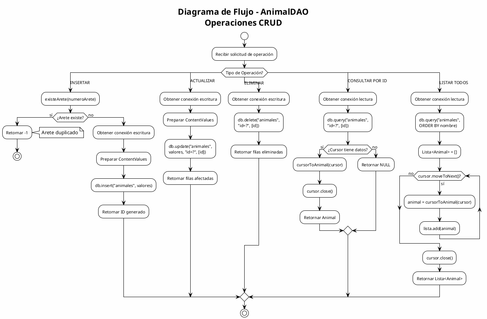

---

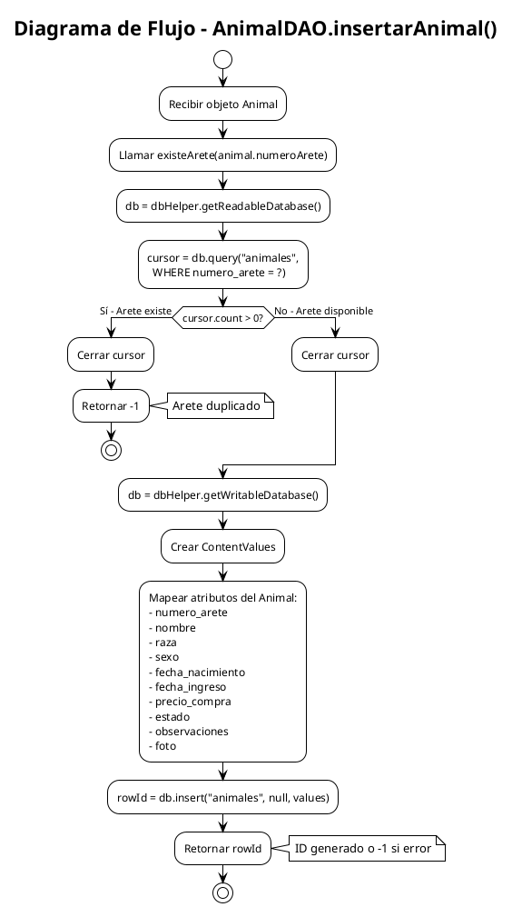

---

# ALGORITMO: FLUJO DETALLADO DE REGISTRO DE ANIMAL

## 1. Entradas y Salidas

**Entradas del Usuario:**
- arete: String - Número de arete SINIGA (exactamente 10 dígitos numéricos)
- raza: String - Selección de Spinner (Angus, Brahman, Hereford, etc.)
- sexo: String - Selección de Spinner ("Macho" o "Hembra")
- fechaNacimiento: String - Formato dd/MM/yyyy (DatePickerDialog)
- fechaIngreso: String - Formato dd/MM/yyyy (DatePickerDialog)
- precioCompra: Double - Valor numérico mayor a cero
- estado: String - Selección de Spinner ("Sano", "Enfermo", etc.)
- observaciones: String - Texto libre (opcional)
- foto: Bitmap - Imagen capturada o seleccionada (opcional)

**Salidas del Sistema:**
- Toast de éxito: "Animal registrado correctamente"
- Toast de error: Mensaje descriptivo del problema
- Navegación: Cierre de Activity y retorno a pantalla anterior
- Resultado en BD: Nuevo registro en tabla "animales"

---

## 2. Pseudocódigo

```
ALGORITMO RegistroAnimalCompleto

// ========================================
// FASE 1: INICIALIZACIÓN DE ACTIVITY
// ========================================
PROCEDIMIENTO onCreate(savedInstanceState)
    INICIO
        // Configurar layout
        setContentView(R.layout.activity_registro_animal)
        
        // Inicializar componentes
        dbHelper = DatabaseHelper.getInstance(contexto)
        animalDAO = NuevoAnimalDAO(dbHelper)
        presenter = NuevoAnimalPresenter(animalDAO, this)
        mainHandler = NuevoHandler(Looper.getMainLooper())
        
        // Inicializar vistas
        inicializarVistas()
        configurarSpinners()
        
        // Determinar modo (nuevo o editar)
        modo = obtenerIntentExtra("modo", "nuevo")
        animalId = obtenerIntentExtra("animalId", -1)
        
        SI modo == "editar" Y animalId != -1 ENTONCES
            configurarTitulo("Editar Animal")
            etArete.deshabilitado = TRUE
            etArete.opacidad = 0.5
            cargarDatosAnimal(animalId)
        SINO
            configurarTitulo("Registrar Animal")
        FIN SI
        
        configurarListeners()
    FIN
FIN PROCEDIMIENTO

// ========================================
// FASE 2: CONFIGURACIÓN DE SPINNERS
// ========================================
PROCEDIMIENTO configurarSpinners()
    INICIO
        razas = ["Angus", "Hereford", "Brahman", "Charolais", 
                 "Simmental", "Limousin", "Brangus", "Santa Gertrudis", 
                 "Holstein", "Jersey", "Otra"]
        spinnerRaza.configurarAdapter(razas)
        
        sexos = ["Macho", "Hembra"]
        spinnerSexo.configurarAdapter(sexos)
        
        estados = ["Sano", "Enfermo", "Vendido", "Muerto"]
        spinnerEstado.configurarAdapter(estados)
    FIN
FIN PROCEDIMIENTO

// ========================================
// FASE 3: CONFIGURACIÓN DE LISTENERS
// ========================================
PROCEDIMIENTO configurarListeners()
    INICIO
        // Inicializar fechas con fecha actual
        fechaActual = formatearFecha(FechaHoy(), "dd/MM/yyyy")
        fechaNacimiento = fechaActual
        fechaIngreso = fechaActual
        btnFechaNacimiento.texto = fechaActual
        btnFechaAdquisicion.texto = fechaActual
        
        // Configurar eventos de botones
        btnFechaNacimiento.alHacerClic = mostrarDatePicker(NACIMIENTO)
        btnFechaAdquisicion.alHacerClic = mostrarDatePicker(INGRESO)
        btnSeleccionarFoto.alHacerClic = seleccionarFotoGaleria()
        btnTomarFoto.alHacerClic = verificarPermisosCamara()
        btnGuardar.alHacerClic = guardarAnimal()
        btnCancelar.alHacerClic = finish()
    FIN
FIN PROCEDIMIENTO

// ========================================
// FASE 4: CAPTURA DE FOTO
// ========================================
PROCEDIMIENTO procesarResultadoImagen(requestCode, resultCode, data)
    INICIO
        SI resultCode == RESULT_OK ENTONCES
            bitmap = NULL
            
            SI requestCode == PICK_IMAGE Y data != NULL ENTONCES
                // Imagen desde galería
                imageUri = data.getData()
                bitmap = cargarBitmapDesdeUri(imageUri)
            SINO SI requestCode == TAKE_PHOTO ENTONCES
                // Imagen desde cámara
                bitmap = decodificarArchivo(currentPhotoPath)
            FIN SI
            
            SI bitmap != NULL ENTONCES
                // Redimensionar a máximo 800px
                maxSize = 800
                ratio = MIN(maxSize / bitmap.ancho, maxSize / bitmap.alto)
                nuevoAncho = REDONDEAR(bitmap.ancho * ratio)
                nuevoAlto = REDONDEAR(bitmap.alto * ratio)
                bitmapRedimensionado = escalarBitmap(bitmap, nuevoAncho, nuevoAlto)
                
                // Comprimir a JPEG 70%
                bufferSalida = NuevoByteArrayOutputStream()
                bitmapRedimensionado.comprimir(JPEG, 70, bufferSalida)
                bytesImagen = bufferSalida.toByteArray()
                
                // Convertir a Base64
                fotoBase64 = codificarBase64(bytesImagen)
                
                // Mostrar preview
                ivFotoAnimal.setImageBitmap(bitmapRedimensionado)
                mostrarToast("Foto guardada correctamente")
            FIN SI
        FIN SI
    FIN
FIN PROCEDIMIENTO

// ========================================
// FASE 5: VALIDACIÓN Y GUARDADO
// ========================================
PROCEDIMIENTO guardarAnimal()
    INICIO
        // Obtener valores de campos
        arete = etArete.texto.trim()
        raza = spinnerRaza.seleccion
        sexo = spinnerSexo.seleccion
        fechaNac = fechaNacimiento
        fechaIng = fechaIngreso
        estado = spinnerEstado.seleccion
        observaciones = etObservaciones.texto.trim()
        
        // ===== VALIDACIÓN 1: Arete obligatorio (RD001) =====
        SI arete.estaVacio() ENTONCES
            mostrarToast("El número de arete es obligatorio")
            etArete.error = "Campo obligatorio"
            etArete.enfocar()
            RETORNAR
        FIN SI
        
        // ===== VALIDACIÓN 2: Formato SINIGA 10 dígitos (RNF004) =====
        SI NO coincideRegex(arete, "\d{10}") ENTONCES
            mostrarToast("El arete debe tener exactamente 10 dígitos numéricos")
            etArete.error = "Formato inválido - debe ser 10 dígitos"
            etArete.enfocar()
            RETORNAR
        FIN SI
        
        // ===== VALIDACIÓN 3: Arete único =====
        SI modo != "editar" ENTONCES
            SI presenter.existeArete(arete) ENTONCES
                mostrarToast("Ya existe un animal con este número de arete")
                etArete.error = "Arete duplicado"
                etArete.enfocar()
                RETORNAR
            FIN SI
        FIN SI
        
        // ===== VALIDACIÓN 4: Precio obligatorio (RD002) =====
        precioStr = etPrecioCompra.texto.trim()
        SI precioStr.estaVacio() ENTONCES
            mostrarToast("El precio de compra es obligatorio")
            etPrecioCompra.error = "Campo obligatorio"
            etPrecioCompra.enfocar()
            RETORNAR
        FIN SI
        
        // ===== VALIDACIÓN 5: Precio numérico válido =====
        INTENTAR
            precioCompra = convertirADecimal(precioStr)
            SI precioCompra <= 0 ENTONCES
                mostrarToast("El precio debe ser mayor a cero")
                etPrecioCompra.error = "Debe ser mayor a 0"
                etPrecioCompra.enfocar()
                RETORNAR
            FIN SI
        CAPTURAR NumberFormatException
            mostrarToast("Ingrese un precio válido")
            etPrecioCompra.error = "Formato inválido"
            etPrecioCompra.enfocar()
            RETORNAR
        FIN INTENTAR
        
        // ===== VALIDACIÓN 6: Fechas coherentes (CP-REG-011) =====
        SI fechaNac > fechaIng ENTONCES
            mostrarToast("La fecha de nacimiento no puede ser posterior al ingreso")
            RETORNAR
        FIN SI
        
        // ===== CREAR OBJETO ANIMAL =====
        animal = NuevoAnimal()
        animal.numeroArete = arete
        animal.nombre = arete  // Usar arete como nombre
        animal.raza = raza
        animal.sexo = sexo
        animal.fechaNacimiento = fechaNac
        animal.fechaIngreso = fechaIng
        animal.precioCompra = precioCompra
        animal.estado = estado
        animal.observaciones = observaciones
        animal.foto = fotoBase64
        
        SI modo == "editar" ENTONCES
            animal.id = animalId
        FIN SI
        
        // ===== GUARDAR USANDO PRESENTER (Asíncrono) =====
        presenter.guardarAnimal(animal, modo == "editar")
    FIN
FIN PROCEDIMIENTO

// ========================================
// FASE 6: CALLBACKS DEL PRESENTER
// ========================================
PROCEDIMIENTO onAnimalGuardado(mensaje)
    INICIO
        ejecutarEnUIThread(
            mostrarToast(mensaje)
            finish()
        )
    FIN
FIN PROCEDIMIENTO

PROCEDIMIENTO onError(mensajeError)
    INICIO
        ejecutarEnUIThread(
            mostrarToast(mensajeError)
        )
    FIN
FIN PROCEDIMIENTO

FIN ALGORITMO
```

---

## 3. Validaciones Necesarias

| # | Validación | Regla | Código Referencia |
|---|------------|-------|-------------------|
| 1 | Arete obligatorio | Campo no vacío | RD001 |
| 2 | Formato SINIGA | Exactamente 10 dígitos numéricos | RNF004 |
| 3 | Arete único | No debe existir en BD | Constraint UNIQUE |
| 4 | Precio obligatorio | Campo no vacío | RD002 |
| 5 | Precio positivo | Valor > 0 | CP-REG-009 |
| 6 | Precio numérico | Debe ser parseable a Double | Validación tipo |
| 7 | Fechas coherentes | fechaNacimiento <= fechaIngreso | CP-REG-011 |
| 8 | Imagen válida | Máximo 800px, JPEG 70% | Límite 1MB |

---

## 4. Manejo de Errores

| Escenario | Detección | Mensaje Usuario | Recuperación |
|-----------|-----------|-----------------|--------------|
| Arete vacío | isEmpty() | "El número de arete es obligatorio" | Enfocar campo |
| Arete formato inválido | !matches("\\d{10}") | "Debe tener exactamente 10 dígitos" | Enfocar campo |
| Arete duplicado | existeArete() == true | "Ya existe un animal con este arete" | Enfocar campo |
| Precio vacío | isEmpty() | "El precio de compra es obligatorio" | Enfocar campo |
| Precio no numérico | NumberFormatException | "Ingrese un precio válido" | Enfocar campo |
| Precio <= 0 | valor <= 0 | "El precio debe ser mayor a cero" | Enfocar campo |
| Fechas incoherentes | fechaNac > fechaIng | "Fecha nacimiento posterior a ingreso" | Corregir fechas |
| Error de BD | SQLException | "Error al guardar. Intente de nuevo" | Mantener datos |
| Error de imagen | IOException/OOM | "Error al procesar imagen" | Continuar sin foto |
| Permiso cámara denegado | grantResults[0] != GRANTED | "Permiso de cámara denegado" | Usar galería |

---

## 5. Consideraciones Técnicas

### Arquitectura MVP:
- **Vista (View)**: RegistroAnimalActivity implementa AnimalPresenter.AnimalView
- **Presentador (Presenter)**: AnimalPresenter coordina lógica
- **Modelo (Model)**: AnimalDAO + Animal entity

### Procesamiento Asíncrono:
- ExecutorService para operaciones de BD
- Handler para actualizar UI en hilo principal
- Callbacks para comunicación Presenter → View

### Gestión de Imágenes:
- Redimensionamiento máximo 800px (ancho o alto)
- Compresión JPEG 70%
- Almacenamiento como String Base64
- Límite recomendado: ~1MB por registro

### Ciclo de Vida:
- onCreate: Inicialización completa
- onDestroy: presenter.destruir() para liberar recursos
- onActivityResult: Procesar resultado de cámara/galería

---

## 6. Diagrama de Flujo PlantUML - Registro de Animal

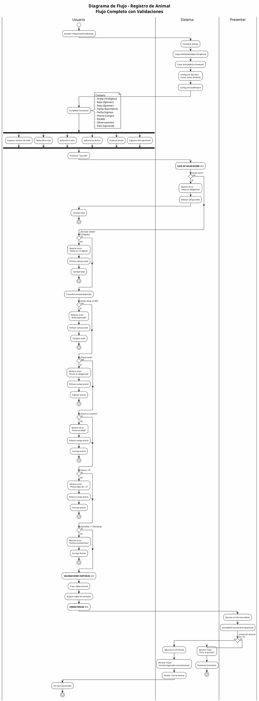

---

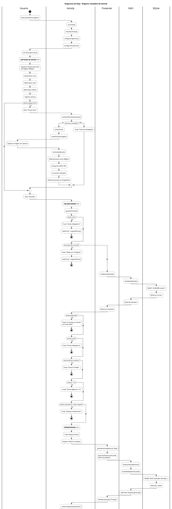

---

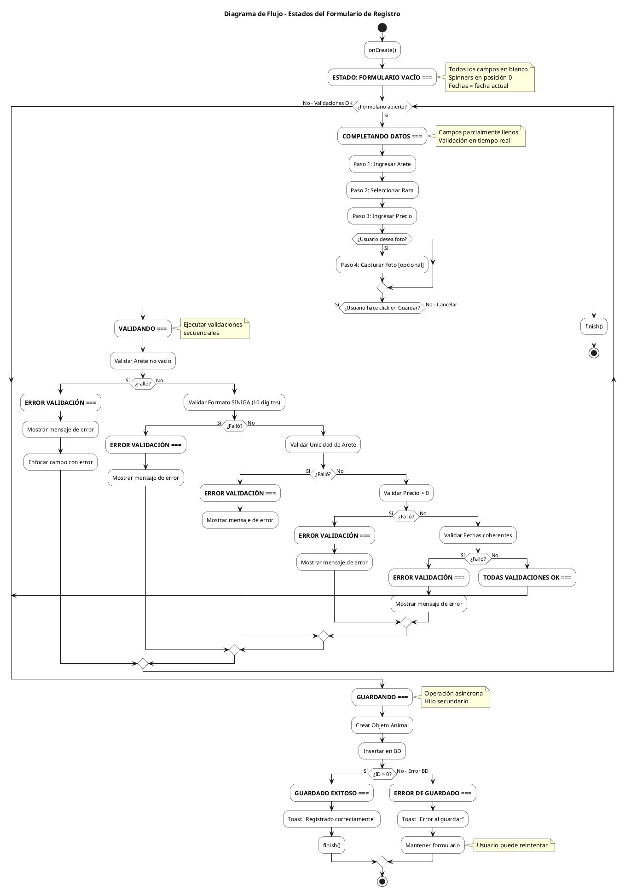

---

# ALGORITMO: MostrarDatePicker - SELECTOR DE FECHA

## 1. Entradas y Salidas

### Método: mostrarDatePicker(esFechaNacimiento: Boolean)

**Entradas:**
- esFechaNacimiento: Boolean - TRUE para fecha nacimiento, FALSE para fecha ingreso
- calendar: Calendar - Instancia de calendario con fecha actual
- this (Context) - Contexto de la Activity

**Salidas:**
- fechaNacimiento[0]: String - Fecha seleccionada en formato "dd/MM/yyyy" (si esFechaNacimiento = TRUE)
- fechaIngreso[0]: String - Fecha seleccionada en formato "dd/MM/yyyy" (si esFechaNacimiento = FALSE)
- Actualización visual del Button correspondiente

**Efectos Secundarios:**
- Muestra DatePickerDialog modal al usuario
- Actualiza el texto del botón con la fecha seleccionada

---

## 2. Pseudocódigo

```
FUNCIÓN mostrarDatePicker(esFechaNacimiento: Boolean)
    INICIO
        // Paso 1: Crear formateador de fecha
        formatoFecha = nuevo SimpleDateFormat("dd/MM/yyyy", Locale.porDefecto())
        
        // Paso 2: Crear diálogo de selección de fecha
        dialogoFecha = nuevo DatePickerDialog(
            contexto = this,
            callback = (vista, año, mes, dia) -> {
                // Callback ejecutado cuando usuario selecciona fecha
                
                // Paso 3: Actualizar calendario con fecha seleccionada
                calendar.establecer(año, mes, dia)
                
                // Paso 4: Formatear fecha a String
                fechaFormateada = formatoFecha.formato(calendar.obtenerTiempo())
                
                // Paso 5: Asignar fecha según tipo
                SI esFechaNacimiento ENTONCES
                    fechaNacimiento[0] = fechaFormateada
                    btnFechaNacimiento.establecerTexto(fechaFormateada)
                SINO
                    fechaIngreso[0] = fechaFormateada
                    btnFechaAdquisicion.establecerTexto(fechaFormateada)
                FIN SI
            },
            // Parámetros iniciales del DatePicker
            añoInicial = calendar.obtener(YEAR),
            mesInicial = calendar.obtener(MONTH),
            diaInicial = calendar.obtener(DAY_OF_MONTH)
        )
        
        // Paso 6: Mostrar diálogo
        dialogoFecha.mostrar()
    FIN
FIN FUNCIÓN
```

---

## 3. Validaciones del Algoritmo

| # | Validación | Descripción | Acción si Falla |
|---|------------|-------------|-----------------|
| 1 | Formato de fecha | dd/MM/yyyy (patrón SimpleDateFormat) | N/A - Formato fijo |
| 2 | Locale por defecto | Usa configuración regional del dispositivo | Fallback a formato estándar |
| 3 | Coherencia de fechas | Fecha nacimiento ≤ Fecha ingreso | Se valida en guardarAnimal() |

---

## 4. Manejo de Errores

| Error | Causa | Tratamiento |
|-------|-------|-------------|
| NullPointerException | Calendar no inicializado | Calendar se inicializa en onCreate() |
| ParseException | Fecha inválida | SimpleDateFormat maneja internamente |
| WindowManager$BadTokenException | Activity destruida | Verificar isFinishing() antes de mostrar |

---

## 5. Consideraciones Técnicas

### Patrón de Diseño
- **Callback Pattern**: DatePickerDialog usa OnDateSetListener como callback
- **Array de un elemento**: fechaNacimiento[0] y fechaIngreso[0] permiten modificar desde lambda

### Ciclo de Vida
- El diálogo sobrevive rotación de pantalla
- Se cierra automáticamente si Activity se destruye

### Locale
- SimpleDateFormat usa Locale.getDefault() para formato regional
- Garantiza consistencia con preferencias del usuario

---

## 6. Diagrama PlantUML - Flujo de MostrarDatePicker

### 6.1 Diagrama de Flujo

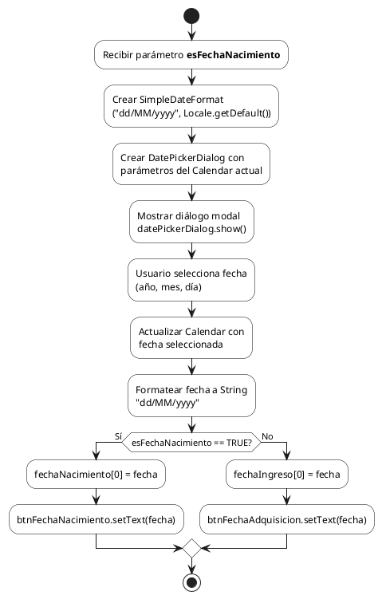

### 6.2 Diagrama de Flujo - Interacción Completa

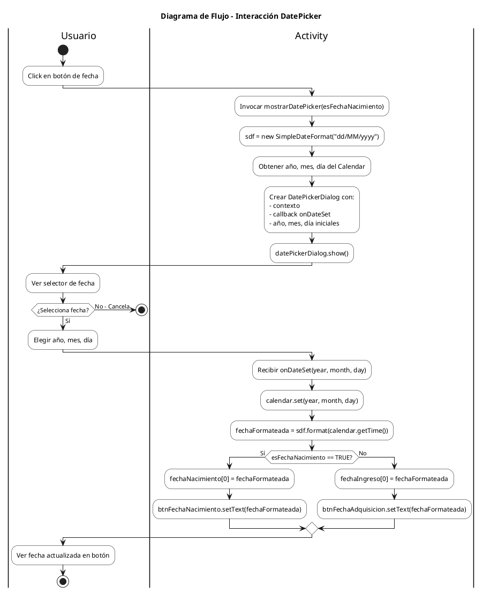

---

# ALGORITMO: InicializarVistas - VINCULACIÓN DE COMPONENTES UI

## 1. Entradas y Salidas

### Método: inicializarVistas()

**Entradas:**
- this (Activity) - Contexto con acceso a findViewById()
- R.id.* - Referencias a IDs definidos en layout XML

**Salidas:**
- Asignación de 11 variables de instancia con referencias a Views:
  - etArete: EditText
  - btnFechaNacimiento: Button
  - btnFechaAdquisicion: Button
  - etPrecioCompra: EditText
  - etObservaciones: EditText
  - spinnerRaza: Spinner
  - spinnerSexo: Spinner
  - spinnerEstado: Spinner
  - ivFotoAnimal: ImageView
  - btnSeleccionarFoto: Button
  - btnTomarFoto: Button
  - btnGuardar: Button
  - btnCancelar: Button

**Precondiciones:**
- setContentView() debe haberse ejecutado previamente
- El layout activity_registro_animal.xml debe contener todos los IDs referenciados

---

## 2. Pseudocódigo

```
FUNCIÓN inicializarVistas()
    INICIO
        // ========================================
        // SECCIÓN 1: CAMPOS DE ENTRADA DE TEXTO
        // ========================================
        
        // Campo de texto para número de arete SINIGA
        etArete = buscarVistaPorId(R.id.etArete)
        
        // Campo de texto para precio de compra
        etPrecioCompra = buscarVistaPorId(R.id.etPrecioCompra)
        
        // Campo de texto para observaciones (opcional)
        etObservaciones = buscarVistaPorId(R.id.etObservaciones)
        
        // ========================================
        // SECCIÓN 2: BOTONES DE FECHA
        // ========================================
        
        // Botón que muestra DatePicker para fecha nacimiento
        btnFechaNacimiento = buscarVistaPorId(R.id.btnFechaNacimiento)
        
        // Botón que muestra DatePicker para fecha ingreso
        btnFechaAdquisicion = buscarVistaPorId(R.id.btnFechaAdquisicion)
        
        // ========================================
        // SECCIÓN 3: SPINNERS (SELECTORES)
        // ========================================
        
        // Spinner de selección de raza
        spinnerRaza = buscarVistaPorId(R.id.spinnerRaza)
        
        // Spinner de selección de sexo (Macho/Hembra)
        spinnerSexo = buscarVistaPorId(R.id.spinnerSexo)
        
        // Spinner de estado del animal
        spinnerEstado = buscarVistaPorId(R.id.spinnerEstado)
        
        // ========================================
        // SECCIÓN 4: COMPONENTES DE IMAGEN
        // ========================================
        
        // ImageView para mostrar foto del animal
        ivFotoAnimal = buscarVistaPorId(R.id.ivFotoAnimal)
        
        // Botón para seleccionar foto de galería
        btnSeleccionarFoto = buscarVistaPorId(R.id.btnSeleccionarFoto)
        
        // Botón para tomar foto con cámara
        btnTomarFoto = buscarVistaPorId(R.id.btnTomarFoto)
        
        // ========================================
        // SECCIÓN 5: BOTONES DE ACCIÓN
        // ========================================
        
        // Botón guardar - Ejecuta validaciones y persiste
        btnGuardar = buscarVistaPorId(R.id.btnGuardar)
        
        // Botón cancelar - Cierra Activity sin guardar
        btnCancelar = buscarVistaPorId(R.id.btnCancelar)
    FIN
FIN FUNCIÓN
```

---

## 3. Mapeo de Componentes UI

| Variable | Tipo | ID en XML | Propósito |
|----------|------|-----------|-----------|
| etArete | EditText | R.id.etArete | Número de arete SINIGA (10 dígitos) |
| etPrecioCompra | EditText | R.id.etPrecioCompra | Precio en formato decimal |
| etObservaciones | EditText | R.id.etObservaciones | Notas adicionales (opcional) |
| btnFechaNacimiento | Button | R.id.btnFechaNacimiento | Abre DatePicker nacimiento |
| btnFechaAdquisicion | Button | R.id.btnFechaAdquisicion | Abre DatePicker ingreso |
| spinnerRaza | Spinner | R.id.spinnerRaza | Lista de razas bovinas |
| spinnerSexo | Spinner | R.id.spinnerSexo | Macho / Hembra |
| spinnerEstado | Spinner | R.id.spinnerEstado | Sano, Enfermo, Vendido, Muerto |
| ivFotoAnimal | ImageView | R.id.ivFotoAnimal | Vista previa de imagen |
| btnSeleccionarFoto | Button | R.id.btnSeleccionarFoto | Intent a galería |
| btnTomarFoto | Button | R.id.btnTomarFoto | Intent a cámara |
| btnGuardar | Button | R.id.btnGuardar | Ejecuta guardarAnimal() |
| btnCancelar | Button | R.id.btnCancelar | Ejecuta finish() |

---

## 4. Manejo de Errores

| Error | Causa | Tratamiento |
|-------|-------|-------------|
| NullPointerException | ID no existe en layout XML | Verificar consistency layout-código |
| ClassCastException | Tipo de View incorrecto | Verificar declaración en XML |
| IllegalStateException | Llamado antes de setContentView() | Respetar orden en onCreate() |

---

## 5. Consideraciones Técnicas

### Orden de Ejecución
```
onCreate()
    └── setContentView(R.layout.activity_registro_animal)  // PRIMERO
    └── inicializarVistas()                                 // SEGUNDO
    └── configurarSpinners()                                // TERCERO
    └── configurarListeners()                               // CUARTO
```

### Patrón View Binding vs findViewById
- El código actual usa **findViewById()** tradicional
- Alternativa moderna: **View Binding** (generación automática de clases binding)

### Gestión de Memoria
- Las referencias se mantienen como variables de instancia
- Se liberan automáticamente cuando Activity es destruida

---

## 6. Diagrama PlantUML - Inicialización de Vistas

### 6.1 Diagrama de Flujo

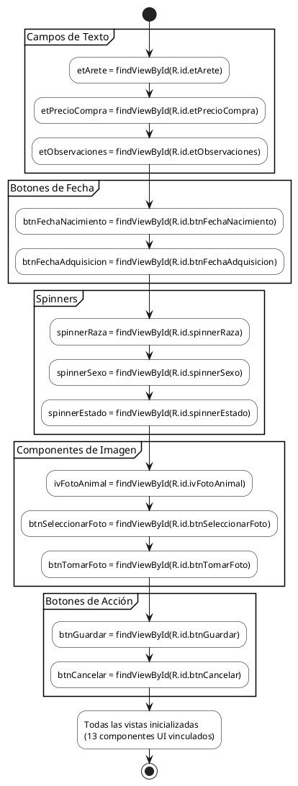

### 6.2 Diagrama de Flujo - Vinculación de Componentes

```plantuml
@startuml InicializarVistas_FlujoVinculacion
skinparam activityBackgroundColor White
skinparam activityBorderColor Black

title Diagrama de Flujo - Vinculación de 13 Componentes UI

start

:Verificar que setContentView()
ya fue ejecutado;

|EditText (3)|
:etArete = findViewById(R.id.etArete);
if (etArete != null?) then (Sí)
    :Vinculación exitosa;
else (No)
    :ERROR: ID no encontrado;
    stop
endif

:etPrecioCompra = findViewById(R.id.etPrecioCompra);
:etObservaciones = findViewById(R.id.etObservaciones);

|Button - Fechas (2)|
:btnFechaNacimiento = findViewById(R.id.btnFechaNacimiento);
:btnFechaAdquisicion = findViewById(R.id.btnFechaAdquisicion);

|Spinner (3)|
:spinnerRaza = findViewById(R.id.spinnerRaza);
:spinnerSexo = findViewById(R.id.spinnerSexo);
:spinnerEstado = findViewById(R.id.spinnerEstado);

|ImageView (1)|
:ivFotoAnimal = findViewById(R.id.ivFotoAnimal);

|Button - Foto (2)|
:btnSeleccionarFoto = findViewById(R.id.btnSeleccionarFoto);
:btnTomarFoto = findViewById(R.id.btnTomarFoto);

|Button - Acción (2)|
:btnGuardar = findViewById(R.id.btnGuardar);
:btnCancelar = findViewById(R.id.btnCancelar);

|Resultado|
:13 componentes vinculados exitosamente;
note right
  EditText: 3
  Button: 6
  Spinner: 3
  ImageView: 1
end note

stop

@enduml
```

---

# ALGORITMO: ConfigurarListeners - ASIGNACIÓN DE EVENTOS

## 1. Entradas y Salidas

### Método: configurarListeners()

**Entradas:**
- Referencias a Views previamente inicializadas (btnFecha*, btnFoto*, btnGuardar, btnCancelar)
- calendar: Calendar - Instancia con fecha actual

**Salidas:**
- 6 listeners OnClickListener asignados a botones
- Valores iniciales en fechaNacimiento[0] y fechaIngreso[0]
- Texto inicial en btnFechaNacimiento y btnFechaAdquisicion

**Efectos Secundarios:**
- Formatea fecha actual como texto inicial en botones de fecha
- Vincula acciones a cada botón

---

## 2. Pseudocódigo

```
FUNCIÓN configurarListeners()
    INICIO
        // ========================================
        // FASE 1: INICIALIZACIÓN DE FECHAS
        // ========================================
        
        // Crear formateador de fecha
        formatoFecha = nuevo SimpleDateFormat("dd/MM/yyyy", Locale.porDefecto())
        
        // Establecer fecha actual como valor inicial
        fechaActual = formatoFecha.formato(calendar.obtenerTiempo())
        
        // Inicializar arrays de fecha con valor actual
        fechaNacimiento[0] = fechaActual
        fechaIngreso[0] = fechaActual
        
        // Mostrar fecha actual en botones
        btnFechaNacimiento.establecerTexto(fechaNacimiento[0])
        btnFechaAdquisicion.establecerTexto(fechaIngreso[0])
        
        // ========================================
        // FASE 2: LISTENERS DE FECHA
        // ========================================
        
        // Listener para fecha de nacimiento
        btnFechaNacimiento.alHacerClic = lambda -> {
            mostrarDatePicker(esFechaNacimiento = TRUE)
        }
        
        // Listener para fecha de ingreso
        btnFechaAdquisicion.alHacerClic = lambda -> {
            mostrarDatePicker(esFechaNacimiento = FALSE)
        }
        
        // ========================================
        // FASE 3: LISTENERS DE FOTO
        // ========================================
        
        // Listener para seleccionar de galería
        btnSeleccionarFoto.alHacerClic = lambda -> {
            seleccionarFoto()
        }
        
        // Listener para tomar foto con cámara
        btnTomarFoto.alHacerClic = lambda -> {
            verificarPermisosCamara()
        }
        
        // ========================================
        // FASE 4: LISTENERS DE ACCIÓN PRINCIPAL
        // ========================================
        
        // Listener para guardar animal
        btnGuardar.alHacerClic = lambda -> {
            guardarAnimal()
        }
        
        // Listener para cancelar y salir
        btnCancelar.alHacerClic = lambda -> {
            finish()  // Cierra la Activity
        }
    FIN
FIN FUNCIÓN
```

---

## 3. Tabla de Listeners Configurados

| Botón | Evento | Método Invocado | Descripción |
|-------|--------|-----------------|-------------|
| btnFechaNacimiento | onClick | mostrarDatePicker(true) | Abre DatePicker para nacimiento |
| btnFechaAdquisicion | onClick | mostrarDatePicker(false) | Abre DatePicker para ingreso |
| btnSeleccionarFoto | onClick | seleccionarFoto() | Intent ACTION_PICK a galería |
| btnTomarFoto | onClick | verificarPermisosCamara() | Verifica permiso, luego cámara |
| btnGuardar | onClick | guardarAnimal() | Valida y persiste datos |
| btnCancelar | onClick | finish() | Cierra Activity sin guardar |

---

## 4. Flujo de Dependencias entre Métodos

```
configurarListeners()
    ├── mostrarDatePicker(boolean)
    │       └── Actualiza fechaNacimiento[0] o fechaIngreso[0]
    │
    ├── seleccionarFoto()
    │       └── startActivityForResult(PICK_IMAGE)
    │           └── onActivityResult() procesa imagen
    │
    ├── verificarPermisosCamara()
    │       ├── Permiso concedido → tomarFoto()
    │       │       └── startActivityForResult(TAKE_PHOTO)
    │       │           └── onActivityResult() procesa imagen
    │       └── Permiso denegado → Toast error
    │
    ├── guardarAnimal()
    │       └── 10 validaciones → presenter.registrarAnimal()
    │
    └── finish()
            └── Cierra Activity
```

---

## 5. Manejo de Errores

| Error | Causa | Tratamiento |
|-------|-------|-------------|
| NullPointerException | Vista no inicializada | Llamar inicializarVistas() antes |
| IllegalStateException | Calendar no inicializado | Inicializar en onCreate() |

---

## 6. Consideraciones Técnicas

### Expresiones Lambda (Java 8)
- Android soporta lambdas desde API 24 o con desugaring
- Sintaxis: `v -> metodo()` equivale a `new OnClickListener() { onClick(v) { metodo(); } }`

### Arrays de un elemento
- `fechaNacimiento[0]` y `fechaIngreso[0]` permiten modificación desde lambdas
- Alternativa: usar variables AtomicReference o miembros de clase

### Orden de Configuración
1. **inicializarVistas()** - Obtiene referencias
2. **configurarSpinners()** - Carga datos en Spinners
3. **configurarListeners()** - Asigna eventos (DEBE ser último)

---

## 7. Diagrama PlantUML - Configuración de Listeners

### 7.1 Diagrama de Flujo

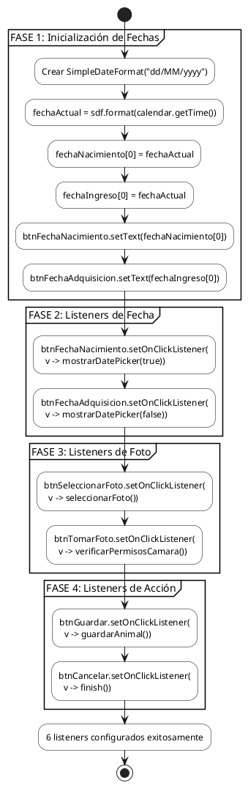

### 7.2 Diagrama de Flujo - Evento de Usuario

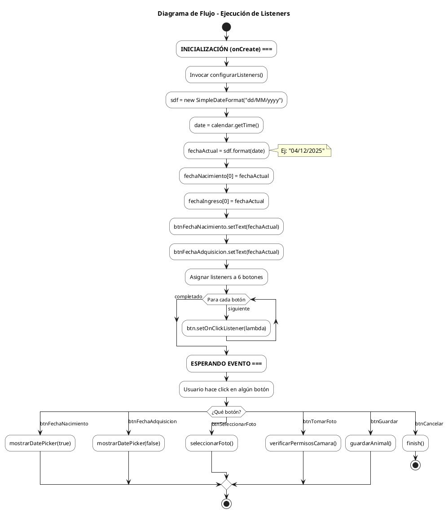

### 7.3 Diagrama de Flujo - Mapa de Listeners

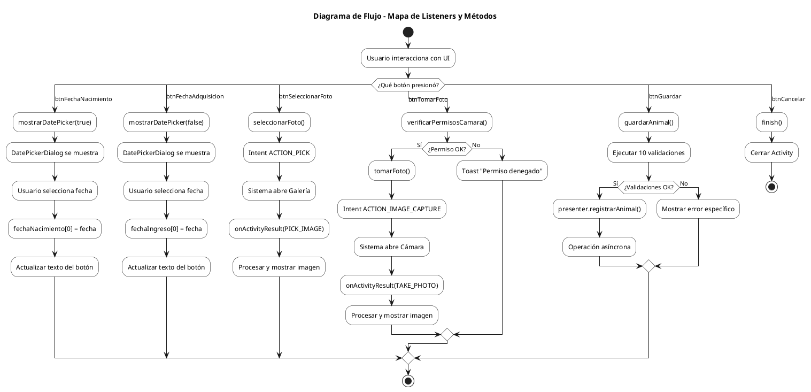

### 7.4 Diagrama de Flujo - Ciclo de Vida de Listeners

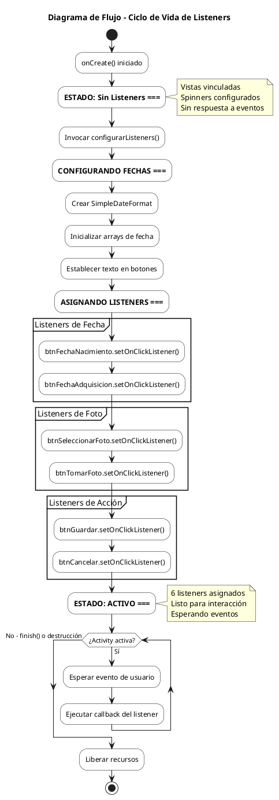

---

# ALGORITMO: guardarAnimal() - PERSISTENCIA DE DATOS

## 1. Entradas y Salidas

### Método: guardarAnimal()

**Entradas (desde UI):**
- etArete.getText() : String - Número de arete SINIGA
- spinnerRaza.getSelectedItem() : String - Raza seleccionada
- spinnerSexo.getSelectedItem() : String - Sexo (Macho/Hembra)
- fechaNacimiento[0] : String - Fecha nacimiento (dd/MM/yyyy)
- fechaIngreso[0] : String - Fecha ingreso (dd/MM/yyyy)
- spinnerEstado.getSelectedItem() : String - Estado del animal
- etObservaciones.getText() : String - Observaciones opcionales
- etPrecioCompra.getText() : String - Precio de compra
- fotoBase64 : String - Imagen codificada en Base64
- modo : String - "nuevo" o "editar"
- animalId : Integer - ID del animal (solo en modo editar)

**Salidas:**
- Registro insertado/actualizado en SQLite
- Toast de éxito o error
- Cierre de Activity (en éxito)

**Validaciones Aplicadas:**
1. Arete obligatorio y no vacío
2. Formato SINIGA (10 dígitos numéricos)
3. Arete único en base de datos
4. Sexo seleccionado
5. Fecha nacimiento obligatoria
6. Fecha ingreso obligatoria
7. Precio obligatorio
8. Precio formato numérico válido
9. Precio mayor a cero
10. Fecha nacimiento ≤ Fecha ingreso

---

## 2. Pseudocódigo

```
FUNCIÓN guardarAnimal()
    INICIO
        // ========================================
        // FASE 1: EXTRACCIÓN DE DATOS DE UI
        // ========================================
        
        arete = etArete.obtenerTexto().recortar()
        raza = spinnerRaza.obtenerItemSeleccionado().aString()
        sexo = spinnerSexo.obtenerItemSeleccionado().aString()
        fechaNac = fechaNacimiento[0]
        fechaIng = fechaIngreso[0]
        estado = spinnerEstado.obtenerItemSeleccionado().aString()
        observaciones = etObservaciones.obtenerTexto().recortar()
        
        // ========================================
        // FASE 2: VALIDACIONES DE CAMPOS OBLIGATORIOS
        // ========================================
        
        // Validación 1: Arete obligatorio (RD001)
        SI arete.estaVacio() ENTONCES
            mostrarToast("El número de arete es obligatorio")
            etArete.establecerError("Campo obligatorio")
            etArete.solicitarFoco()
            RETORNAR  // Salir del método
        FIN SI
        
        // Validación 2: Formato SINIGA de 10 dígitos (RD001/RNF004)
        SI NO arete.coincideCon("\\d{10}") ENTONCES
            mostrarToast("El arete debe tener 10 dígitos numéricos (formato SINIGA)")
            etArete.establecerError("Formato inválido - debe ser 10 dígitos")
            etArete.solicitarFoco()
            RETORNAR
        FIN SI
        
        // Validación 3: Arete único usando Presenter
        SI NO presenter.validarArete(arete) ENTONCES
            RETORNAR  // El presenter muestra el mensaje de error
        FIN SI
        
        // Validación 4: Sexo obligatorio
        SI sexo.estaVacio() ENTONCES
            mostrarToast("Debe seleccionar el sexo del animal")
            RETORNAR
        FIN SI
        
        // Validación 5: Fecha de nacimiento obligatoria
        SI fechaNac == NULL O fechaNac.estaVacio() ENTONCES
            mostrarToast("Debe seleccionar la fecha de nacimiento")
            RETORNAR
        FIN SI
        
        // Validación 6: Fecha de ingreso obligatoria
        SI fechaIng == NULL O fechaIng.estaVacio() ENTONCES
            mostrarToast("Debe seleccionar la fecha de ingreso")
            RETORNAR
        FIN SI
        
        // ========================================
        // FASE 3: VALIDACIÓN DE PRECIO
        // ========================================
        
        precioStr = etPrecioCompra.obtenerTexto().recortar()
        
        // Validación 7: Precio obligatorio (RD002)
        SI precioStr.estaVacio() ENTONCES
            mostrarToast("El precio de compra es obligatorio (RD002)")
            etPrecioCompra.establecerError("Campo obligatorio")
            etPrecioCompra.solicitarFoco()
            RETORNAR
        FIN SI
        
        // Validación 8: Formato numérico válido
        INTENTAR
            precioCompra = convertirADouble(precioStr)
            
            // Validación 9: Precio mayor a cero
            SI precioCompra <= 0 ENTONCES
                mostrarToast("El precio debe ser mayor a cero")
                etPrecioCompra.establecerError("Debe ser mayor a 0")
                etPrecioCompra.solicitarFoco()
                RETORNAR
            FIN SI
        CAPTURAR NumberFormatException
            mostrarToast("Ingrese un precio válido")
            etPrecioCompra.establecerError("Formato inválido")
            etPrecioCompra.solicitarFoco()
            RETORNAR
        FIN INTENTAR
        
        // Validación 9b: Precio no negativo (vía Presenter)
        SI NO presenter.validarPrecio(precioCompra, "El precio") ENTONCES
            RETORNAR
        FIN SI
        
        // Validación 10: Fechas coherentes (CP-REG-011)
        SI NO presenter.validarFechasCoherentes(fechaNac, fechaIng) ENTONCES
            RETORNAR
        FIN SI
        
        // ========================================
        // FASE 4: CONSTRUCCIÓN DEL OBJETO ANIMAL
        // ========================================
        
        animal = nuevo Animal()
        animal.establecerNumeroArete(arete)
        animal.establecerNombre(arete)  // Usar arete como nombre
        animal.establecerRaza(raza)
        animal.establecerSexo(sexo)
        animal.establecerFechaNacimiento(fechaNac)
        animal.establecerFechaIngreso(fechaIng)
        animal.establecerPrecioCompra(precioCompra)
        animal.establecerEstado(estado)
        animal.establecerObservaciones(observaciones)
        animal.establecerFoto(fotoBase64)
        
        // Si es modo edición, asignar ID existente
        SI modo.igual("editar") ENTONCES
            animal.establecerId(animalId)
        FIN SI
        
        // ========================================
        // FASE 5: PERSISTENCIA ASÍNCRONA
        // ========================================
        
        // Delegar al Presenter (patrón MVP)
        // El Presenter ejecutará en hilo secundario y notificará vía callbacks
        presenter.guardarAnimal(animal, modo.igual("editar"))
        
    FIN
FIN FUNCIÓN
```

---

## 3. Tabla de Validaciones

| # | Código | Validación | Campo | Mensaje de Error | Acción |
|---|--------|------------|-------|------------------|--------|
| 1 | RD001 | Arete obligatorio | etArete | "El número de arete es obligatorio" | Focus + Error |
| 2 | RD001/RNF004 | Formato SINIGA | etArete | "Debe tener 10 dígitos numéricos" | Focus + Error |
| 3 | CP-REG-006 | Arete único | etArete | "Ya existe un animal con este arete" | Via Presenter |
| 4 | - | Sexo obligatorio | spinnerSexo | "Debe seleccionar el sexo" | Toast |
| 5 | - | Fecha nacimiento | btnFechaNacimiento | "Debe seleccionar fecha nacimiento" | Toast |
| 6 | - | Fecha ingreso | btnFechaAdquisicion | "Debe seleccionar fecha ingreso" | Toast |
| 7 | RD002 | Precio obligatorio | etPrecioCompra | "El precio es obligatorio" | Focus + Error |
| 8 | - | Precio numérico | etPrecioCompra | "Ingrese un precio válido" | Focus + Error |
| 9 | CP-REG-009 | Precio > 0 | etPrecioCompra | "Debe ser mayor a cero" | Focus + Error |
| 10 | CP-REG-011 | Fechas coherentes | - | "Nacimiento debe ser ≤ ingreso" | Via Presenter |

---

## 4. Manejo de Errores

| Error | Causa | Tratamiento |
|-------|-------|-------------|
| Validación fallida | Datos incorrectos | Toast + setError + requestFocus |
| NumberFormatException | Precio no numérico | Toast + setError |
| Arete duplicado | Ya existe en BD | Presenter muestra error |
| Error de BD | Falla SQLite | Callback onError del Presenter |

---

## 5. Diagrama PlantUML - Flujo de guardarAnimal()

### 5.1 Diagrama de Flujo Principal

```plantuml
@startuml GuardarAnimal_Flujo
skinparam activityBackgroundColor White
skinparam activityBorderColor Black

start

partition "FASE 1: Extracción de Datos" {
    :Obtener datos de UI\n(arete, raza, sexo, fechas,\nprecio, observaciones);
}

partition "FASE 2: Validaciones Obligatorias" {
    if (arete vacío?) then (Sí)
        :Toast "Arete obligatorio";
        :etArete.setError();
        :etArete.requestFocus();
        stop
    endif
    
    if (arete NO coincide \\d{10}?) then (Sí)
        :Toast "Formato SINIGA inválido";
        :etArete.setError();
        stop
    endif
    
    if (presenter.validarArete() == FALSE?) then (Sí)
        :Presenter muestra error\n"Arete duplicado";
        stop
    endif
    
    if (sexo vacío?) then (Sí)
        :Toast "Seleccione sexo";
        stop
    endif
    
    if (fechaNacimiento vacía?) then (Sí)
        :Toast "Seleccione fecha nacimiento";
        stop
    endif
    
    if (fechaIngreso vacía?) then (Sí)
        :Toast "Seleccione fecha ingreso";
        stop
    endif
}

partition "FASE 3: Validación de Precio" {
    if (precioStr vacío?) then (Sí)
        :Toast "Precio obligatorio";
        :etPrecioCompra.setError();
        stop
    endif
    
    if (precio NO es numérico?) then (Sí)
        :Toast "Precio inválido";
        :etPrecioCompra.setError();
        stop
    endif
    
    if (precio <= 0?) then (Sí)
        :Toast "Precio debe ser > 0";
        :etPrecioCompra.setError();
        stop
    endif
    
    if (fechas NO coherentes?) then (Sí)
        :Presenter muestra error;
        stop
    endif
}

partition "FASE 4: Construcción de Objeto" {
    :Crear Animal();
    :Asignar todos los atributos;
    
    if (modo == "editar"?) then (Sí)
        :animal.setId(animalId);
    endif
}

partition "FASE 5: Persistencia" {
    :presenter.guardarAnimal(\n  animal, esEdicion);
    note right
        Ejecuta en hilo secundario
        Notifica vía callbacks:
        - onAnimalGuardado()
        - onError()
    end note
}

stop

@enduml
```

### 5.2 Diagrama de Flujo - Persistencia Asíncrona

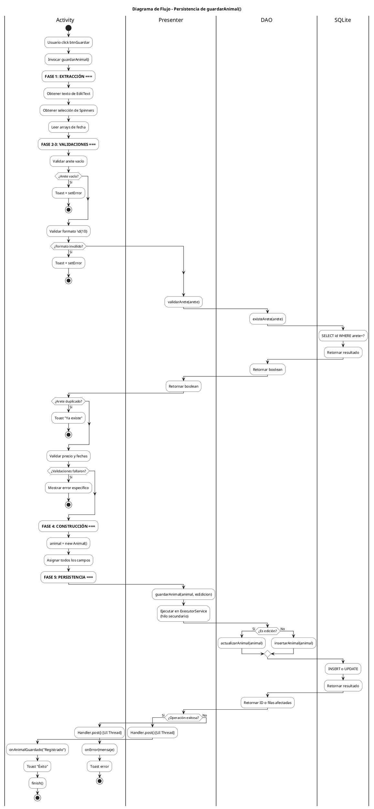

---

# ALGORITMO: AnimalDAO - OPERACIONES CRUD COMPLETAS

## 1. Descripción General

La clase `AnimalDAO` (Data Access Object) implementa el patrón DAO para encapsular todas las operaciones de acceso a datos de la entidad Animal, proporcionando una capa de abstracción entre la lógica de negocio y SQLite.

---

## 2. Entradas y Salidas por Método

| Método | Entradas | Salidas | Descripción |
|--------|----------|---------|-------------|
| existeArete(String) | numeroArete | boolean | Verifica unicidad de arete |
| insertarAnimal(Animal) | objeto Animal | long (ID o -1) | Inserta nuevo registro |
| actualizarAnimal(Animal) | objeto Animal | int (filas afectadas) | Actualiza registro existente |
| eliminarAnimal(int) | id | int (filas afectadas) | Elimina por ID |
| obtenerAnimalPorId(int) | id | Animal o null | Consulta individual |
| obtenerTodosLosAnimales() | ninguna | List<Animal> | Consulta todos |
| obtenerAnimalesPorEstado(String) | estado | List<Animal> | Filtra por estado |
| cursorToAnimal(Cursor) | cursor BD | Animal | Conversión interna |

---

## 3. Pseudocódigo Completo

```
CLASE AnimalDAO
    
    // ========================================
    // ATRIBUTOS
    // ========================================
    PRIVADO dbHelper: DatabaseHelper
    
    // ========================================
    // CONSTRUCTOR
    // ========================================
    CONSTRUCTOR(dbHelper: DatabaseHelper)
        this.dbHelper = dbHelper
    FIN CONSTRUCTOR
    
    // ========================================
    // MÉTODO: existeArete - Verificar unicidad
    // ========================================
    FUNCIÓN existeArete(numeroArete: String): Boolean
        INICIO
            // Obtener conexión de solo lectura
            db = dbHelper.obtenerBaseDatosLectura()
            
            // Ejecutar consulta
            cursor = db.consultar(
                tabla = "animales",
                columnas = ["id"],
                seleccion = "numero_arete = ?",
                argumentosSeleccion = [numeroArete],
                groupBy = NULL,
                having = NULL,
                orderBy = NULL
            )
            
            // Verificar si hay resultados
            existe = (cursor != NULL) Y (cursor.obtenerCantidad() > 0)
            
            // Cerrar cursor para liberar recursos
            SI cursor != NULL ENTONCES
                cursor.cerrar()
            FIN SI
            
            RETORNAR existe
        FIN
    FIN FUNCIÓN
    
    // ========================================
    // MÉTODO: insertarAnimal - CREATE
    // ========================================
    FUNCIÓN insertarAnimal(animal: Animal): Long
        INICIO
            // Paso 1: Verificar duplicidad de arete
            SI existeArete(animal.obtenerNumeroArete()) ENTONCES
                RETORNAR -1  // Código de error: arete duplicado
            FIN SI
            
            // Paso 2: Obtener conexión de escritura
            db = dbHelper.obtenerBaseDatosEscritura()
            
            // Paso 3: Crear ContentValues con los datos
            valores = nuevo ContentValues()
            valores.poner(COL_ARETE, animal.obtenerNumeroArete())
            valores.poner(COL_NOMBRE, animal.obtenerNombre())
            valores.poner(COL_RAZA, animal.obtenerRaza())
            valores.poner(COL_SEXO, animal.obtenerSexo())
            valores.poner(COL_FECHA_NACIMIENTO, animal.obtenerFechaNacimiento())
            valores.poner(COL_FECHA_INGRESO, animal.obtenerFechaIngreso())
            valores.poner(COL_FECHA_SALIDA, animal.obtenerFechaSalida())
            valores.poner(COL_PRECIO_COMPRA, animal.obtenerPrecioCompra())
            valores.poner(COL_PRECIO_VENTA, animal.obtenerPrecioVenta())
            valores.poner(COL_FOTO, animal.obtenerFoto())
            valores.poner(COL_ESTADO, animal.obtenerEstado())
            valores.poner(COL_OBSERVACIONES, animal.obtenerObservaciones())
            
            // Paso 4: Ejecutar inserción
            idInsertado = db.insertar("animales", NULL, valores)
            
            RETORNAR idInsertado  // ID del nuevo registro o -1 si error
        FIN
    FIN FUNCIÓN
    
    // ========================================
    // MÉTODO: actualizarAnimal - UPDATE
    // ========================================
    FUNCIÓN actualizarAnimal(animal: Animal): Integer
        INICIO
            // Paso 1: Obtener conexión de escritura
            db = dbHelper.obtenerBaseDatosEscritura()
            
            // Paso 2: Crear ContentValues con los datos actualizados
            valores = nuevo ContentValues()
            valores.poner(COL_ARETE, animal.obtenerNumeroArete())
            valores.poner(COL_NOMBRE, animal.obtenerNombre())
            valores.poner(COL_RAZA, animal.obtenerRaza())
            valores.poner(COL_SEXO, animal.obtenerSexo())
            valores.poner(COL_FECHA_NACIMIENTO, animal.obtenerFechaNacimiento())
            valores.poner(COL_FECHA_INGRESO, animal.obtenerFechaIngreso())
            valores.poner(COL_FECHA_SALIDA, animal.obtenerFechaSalida())
            valores.poner(COL_PRECIO_COMPRA, animal.obtenerPrecioCompra())
            valores.poner(COL_PRECIO_VENTA, animal.obtenerPrecioVenta())
            valores.poner(COL_FOTO, animal.obtenerFoto())
            valores.poner(COL_ESTADO, animal.obtenerEstado())
            valores.poner(COL_OBSERVACIONES, animal.obtenerObservaciones())
            
            // Paso 3: Ejecutar actualización con condición WHERE
            filasAfectadas = db.actualizar(
                tabla = "animales",
                valores = valores,
                condicion = "id = ?",
                argumentos = [animal.obtenerId().aString()]
            )
            
            RETORNAR filasAfectadas  // 1 si éxito, 0 si no encontrado
        FIN
    FIN FUNCIÓN
    
    // ========================================
    // MÉTODO: eliminarAnimal - DELETE
    // ========================================
    FUNCIÓN eliminarAnimal(id: Integer): Integer
        INICIO
            // Paso 1: Obtener conexión de escritura
            db = dbHelper.obtenerBaseDatosEscritura()
            
            // Paso 2: Ejecutar eliminación
            filasAfectadas = db.eliminar(
                tabla = "animales",
                condicion = "id = ?",
                argumentos = [id.aString()]
            )
            
            RETORNAR filasAfectadas  // 1 si eliminado, 0 si no encontrado
        FIN
    FIN FUNCIÓN
    
    // ========================================
    // MÉTODO: obtenerAnimalPorId - READ (uno)
    // ========================================
    FUNCIÓN obtenerAnimalPorId(id: Integer): Animal
        INICIO
            // Paso 1: Obtener conexión de lectura
            db = dbHelper.obtenerBaseDatosLectura()
            animal = NULL
            
            // Paso 2: Ejecutar consulta
            cursor = db.consultar(
                tabla = "animales",
                columnas = NULL,  // Todas las columnas
                seleccion = "id = ?",
                argumentos = [id.aString()],
                groupBy = NULL,
                having = NULL,
                orderBy = NULL
            )
            
            // Paso 3: Procesar resultado
            SI cursor != NULL Y cursor.moverAlPrimero() ENTONCES
                animal = cursorToAnimal(cursor)
                cursor.cerrar()
            FIN SI
            
            RETORNAR animal  // Animal o NULL si no existe
        FIN
    FIN FUNCIÓN
    
    // ========================================
    // MÉTODO: obtenerTodosLosAnimales - READ (todos)
    // ========================================
    FUNCIÓN obtenerTodosLosAnimales(): Lista<Animal>
        INICIO
            animales = nueva ListaVacia<Animal>()
            db = dbHelper.obtenerBaseDatosLectura()
            
            // Consultar todos, ordenados por nombre
            cursor = db.consultar(
                tabla = "animales",
                columnas = NULL,
                seleccion = NULL,
                argumentos = NULL,
                groupBy = NULL,
                having = NULL,
                orderBy = "nombre ASC"
            )
            
            // Iterar sobre todos los registros
            SI cursor != NULL Y cursor.moverAlPrimero() ENTONCES
                HACER
                    animales.agregar(cursorToAnimal(cursor))
                MIENTRAS cursor.moverAlSiguiente()
                cursor.cerrar()
            FIN SI
            
            RETORNAR animales
        FIN
    FIN FUNCIÓN
    
    // ========================================
    // MÉTODO: obtenerAnimalesPorEstado - READ (filtrado)
    // ========================================
    FUNCIÓN obtenerAnimalesPorEstado(estado: String): Lista<Animal>
        INICIO
            animales = nueva ListaVacia<Animal>()
            db = dbHelper.obtenerBaseDatosLectura()
            
            cursor = db.consultar(
                tabla = "animales",
                columnas = NULL,
                seleccion = "estado = ?",
                argumentos = [estado],
                groupBy = NULL,
                having = NULL,
                orderBy = "nombre ASC"
            )
            
            SI cursor != NULL Y cursor.moverAlPrimero() ENTONCES
                HACER
                    animales.agregar(cursorToAnimal(cursor))
                MIENTRAS cursor.moverAlSiguiente()
                cursor.cerrar()
            FIN SI
            
            RETORNAR animales
        FIN
    FIN FUNCIÓN
    
    // ========================================
    // MÉTODO PRIVADO: cursorToAnimal - Conversión
    // ========================================
    FUNCIÓN PRIVADA cursorToAnimal(cursor: Cursor): Animal
        INICIO
            RETORNAR nuevo Animal(
                id = cursor.obtenerEntero(indiceColumna("id")),
                numeroArete = cursor.obtenerString(indiceColumna("numero_arete")),
                nombre = cursor.obtenerString(indiceColumna("nombre")),
                raza = cursor.obtenerString(indiceColumna("raza")),
                sexo = cursor.obtenerString(indiceColumna("sexo")),
                fechaNacimiento = cursor.obtenerString(indiceColumna("fecha_nacimiento")),
                fechaIngreso = cursor.obtenerString(indiceColumna("fecha_ingreso")),
                fechaSalida = cursor.obtenerString(indiceColumna("fecha_salida")),
                precioCompra = cursor.obtenerDouble(indiceColumna("precio_compra")),
                precioVenta = cursor.obtenerDouble(indiceColumna("precio_venta")),
                foto = cursor.obtenerString(indiceColumna("foto")),
                estado = cursor.obtenerString(indiceColumna("estado")),
                observaciones = cursor.obtenerString(indiceColumna("observaciones"))
            )
        FIN
    FIN FUNCIÓN

FIN CLASE
```

---

## 4. Diagrama de Flujo - Estructura AnimalDAO

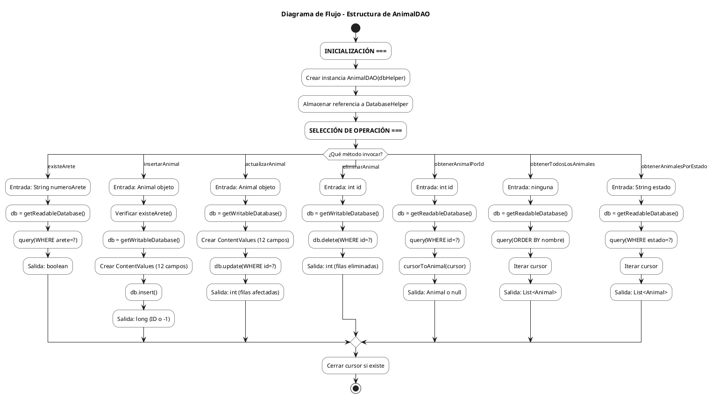

---

## 5. Diagrama de Flujo - Operaciones CRUD

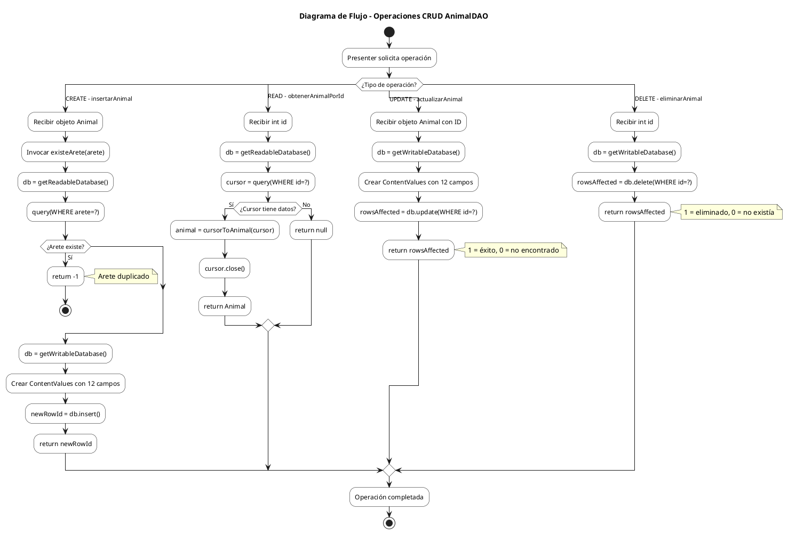

---

## 6. Diagrama de Flujo - Ciclo de Vida de Registro

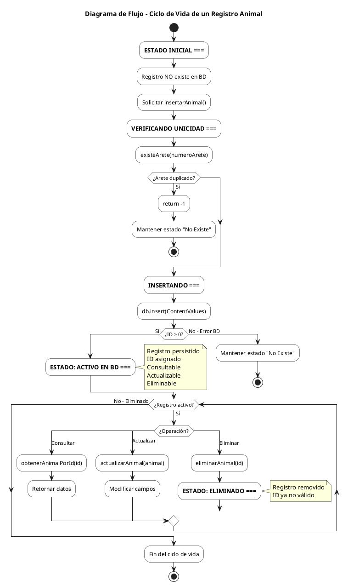

---

# ALGORITMO: seleccionarFoto() - SELECCIÓN DESDE GALERÍA

## 1. Entradas y Salidas

### Método: seleccionarFoto()

**Entradas:**
- this (Activity Context) - Contexto para lanzar Intent

**Salidas:**
- Intent lanzado hacia app de Galería del sistema
- Resultado manejado en onActivityResult() con requestCode = PICK_IMAGE (1)

**Flujo Posterior (onActivityResult):**
- imageUri : Uri - URI de la imagen seleccionada
- bitmap : Bitmap - Imagen cargada en memoria
- fotoBase64 : String - Imagen codificada para almacenamiento

---

## 2. Pseudocódigo

```
// ========================================
// CONSTANTES
// ========================================
CONSTANTE PICK_IMAGE = 1  // Request code para identificar resultado

// ========================================
// MÉTODO: seleccionarFoto - Lanzar Intent a Galería
// ========================================
FUNCIÓN seleccionarFoto()
    INICIO
        // Paso 1: Crear Intent para seleccionar imagen
        intent = nuevo Intent(Intent.ACTION_PICK, 
                              MediaStore.Images.Media.EXTERNAL_CONTENT_URI)
        
        // Paso 2: Lanzar Activity esperando resultado
        iniciarActivityParaResultado(intent, PICK_IMAGE)
        
        // NOTA: El resultado se procesa en onActivityResult()
    FIN
FIN FUNCIÓN

// ========================================
// MÉTODO: onActivityResult - Procesar imagen seleccionada
// ========================================
FUNCIÓN onActivityResult(requestCode: Integer, resultCode: Integer, data: Intent)
    INICIO
        // Llamar al método padre
        super.onActivityResult(requestCode, resultCode, data)
        
        // Verificar que la operación fue exitosa
        SI resultCode == RESULT_OK ENTONCES
            bitmap = NULL
            
            INTENTAR
                // ========================================
                // CASO: Imagen desde Galería
                // ========================================
                SI requestCode == PICK_IMAGE Y data != NULL ENTONCES
                    
                    // Paso 1: Obtener URI de la imagen
                    imageUri = data.obtenerData()
                    
                    // Paso 2: Decodificar imagen a Bitmap
                    bitmap = MediaStore.Images.Media.getBitmap(
                        this.obtenerContentResolver(),
                        imageUri
                    )
                FIN SI
                
                // ========================================
                // PROCESAMIENTO COMÚN DE IMAGEN
                // ========================================
                SI bitmap != NULL ENTONCES
                    
                    // Paso 3: Calcular dimensiones de redimensionamiento
                    maxSize = 800  // Tamaño máximo en píxeles
                    width = bitmap.obtenerAncho()
                    height = bitmap.obtenerAlto()
                    
                    // Calcular ratio manteniendo proporción
                    ratio = minimo(maxSize / width, maxSize / height)
                    nuevoAncho = redondear(width * ratio)
                    nuevoAlto = redondear(height * ratio)
                    
                    // Paso 4: Redimensionar bitmap
                    bitmapRedimensionado = Bitmap.crearEscalado(
                        bitmap, 
                        nuevoAncho, 
                        nuevoAlto, 
                        filtro = TRUE
                    )
                    
                    // Paso 5: Convertir a Base64 (JPEG 70%)
                    baos = nuevo ByteArrayOutputStream()
                    bitmapRedimensionado.comprimir(
                        formato = JPEG,
                        calidad = 70,
                        stream = baos
                    )
                    bytesImagen = baos.aByteArray()
                    fotoBase64 = Base64.codificar(bytesImagen, Base64.DEFAULT)
                    
                    // Paso 6: Mostrar vista previa en ImageView
                    ivFotoAnimal.establecerImageBitmap(bitmapRedimensionado)
                    
                    // Paso 7: Notificar al usuario
                    mostrarToast("Foto guardada correctamente")
                    
                FIN SI
                
            CAPTURAR IOException e
                e.imprimirStackTrace()
                mostrarToast("Error al cargar la foto")
            FIN INTENTAR
            
        FIN SI
    FIN
FIN FUNCIÓN
```

---

## 3. Tabla de Procesamiento de Imagen

| Paso | Operación | Entrada | Salida | Propósito |
|------|-----------|---------|--------|-----------|
| 1 | Obtener URI | Intent.getData() | Uri | Referencia a imagen |
| 2 | Decodificar | Uri + ContentResolver | Bitmap | Imagen en memoria |
| 3 | Calcular ratio | width, height, maxSize | ratio float | Mantener proporción |
| 4 | Redimensionar | Bitmap original | Bitmap 800px max | Reducir tamaño |
| 5 | Comprimir JPEG | Bitmap | byte[] | Formato compacto |
| 6 | Codificar Base64 | byte[] | String | Almacenable en SQLite |
| 7 | Mostrar preview | Bitmap | ImageView | Feedback visual |

---

## 4. Manejo de Errores

| Error | Causa | Tratamiento |
|-------|-------|-------------|
| resultCode != RESULT_OK | Usuario canceló selección | No hacer nada |
| data == null | Intent vacío | Verificar antes de procesar |
| IOException | Error leyendo archivo | Toast + printStackTrace |
| OutOfMemoryError | Imagen muy grande | Redimensionar a 800px máximo |

---

## 5. Consideraciones Técnicas

### Permisos Requeridos
- **READ_EXTERNAL_STORAGE**: Requerido en Android < 10
- **READ_MEDIA_IMAGES**: Requerido en Android 13+ (API 33)
- **Scoped Storage**: En Android 10+ ACTION_PICK funciona sin permisos explícitos

### Optimización de Memoria
- Redimensionamiento a máximo 800px evita OutOfMemoryError
- Compresión JPEG 70% reduce tamaño sin pérdida visible
- Base64 aumenta ~33% el tamaño pero es compatible con SQLite TEXT

### Alternativas Modernas
- **ActivityResultContracts.PickVisualMedia**: API 19+, preferida
- **Photo Picker**: Android 13+, sin permisos necesarios

---

## 6. Diagrama PlantUML - Flujo de Selección de Galería

### 6.1 Diagrama de Flujo

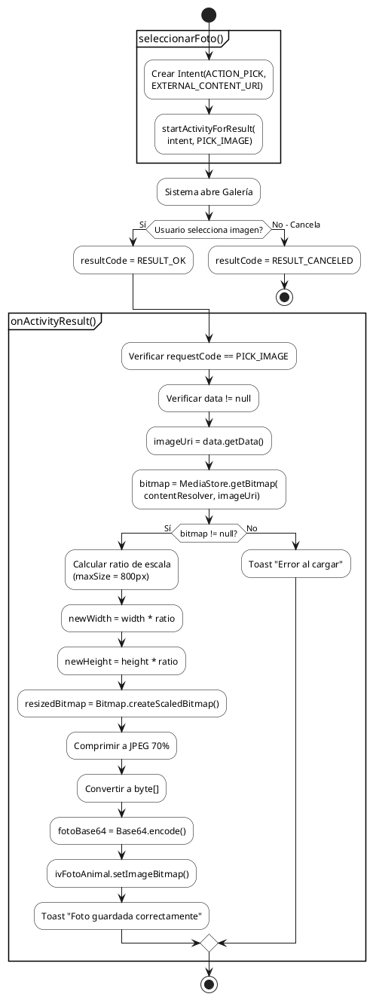

### 6.2 Diagrama de Flujo - Proceso Completo de Selección

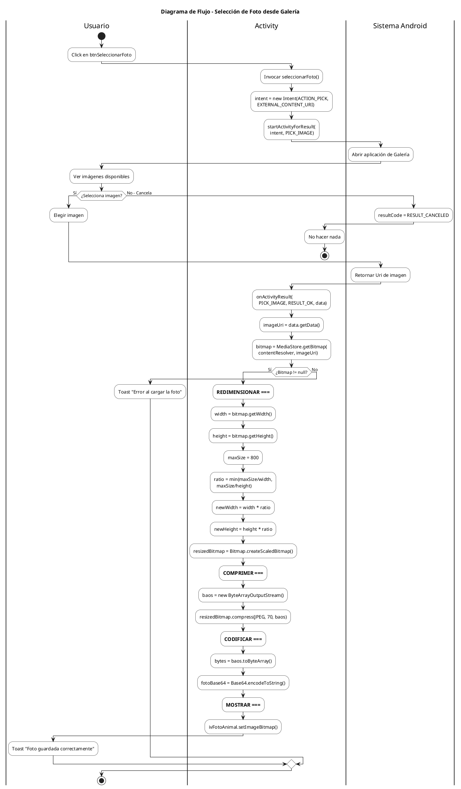

### 6.3 Diagrama de Flujo - Ciclo de Vida de Imagen

```plantuml
@startuml SeleccionarFoto_FlujoCicloVida
skinparam activityBackgroundColor White
skinparam activityBorderColor Black

title Diagrama de Flujo - Ciclo de Vida de Imagen

start

:=== ESTADO: SIN IMAGEN ===;
note right
  fotoBase64 = ""
  ivFotoAnimal vacío
end note

while (¿Formulario activo?) is (Sí)
    
    if (¿Usuario solicita foto?) then (Sí)
        :Invocar seleccionarFoto();
        
        :=== ESPERANDO GALERÍA ===;
        :Intent ACTION_PICK lanzado;
        :Activity en pausa;
        
        if (¿Usuario selecciona imagen?) then (Sí)
            :=== PROCESANDO IMAGEN ===;
            
            :Paso 1: Obtener URI;
            :Paso 2: Decodificar Bitmap;
            :Paso 3: Redimensionar (max 800px);
            :Paso 4: Comprimir JPEG 70%;
            :Paso 5: Codificar Base64;
            
            if (¿Proceso exitoso?) then (Sí)
                :=== ESTADO: IMAGEN CARGADA ===;
                note right
                  fotoBase64 contiene datos
                  ivFotoAnimal muestra preview
                  Lista para guardar
                end note
            else (No - IOException)
                :Toast "Error al cargar";
                :Mantener estado sin imagen;
            endif
            
        else (No - Cancela)
            :Mantener estado actual;
        endif
        
    else (No)
        if (¿Usuario guarda animal?) then (Sí)
            :guardarAnimal();
            :Incluir fotoBase64 en Animal;
            break
        endif
    endif
    
endwhile (No - finish())

stop

@enduml
```

---

# ALGORITMO: Capturar Foto con Camara y Guardar Archivo

## 1. Descripcion General

Este algoritmo implementa la captura de fotografias utilizando la camara del dispositivo Android, almacenando la imagen en un archivo temporal y procesandola para su persistencia en la base de datos SQLite mediante codificacion Base64.

---

## 2. Entradas y Salidas

### Metodo: verificarPermisosCamara()
**Entradas:**
- this (Context) - Contexto de la Activity
- android.Manifest.permission.CAMERA - Permiso requerido

**Salidas:**
- Invocacion a tomarFoto() si permiso concedido
- Solicitud de permiso si no esta otorgado

### Metodo: tomarFoto()
**Entradas:**
- this (Context) - Contexto de la Activity
- packageName - Nombre del paquete para FileProvider

**Salidas:**
- photoUri: Uri - URI del archivo de imagen creado
- currentPhotoPath: String - Ruta absoluta del archivo temporal
- Intent lanzado hacia aplicacion de camara

### Metodo: crearArchivoImagen()
**Entradas:**
- Timestamp actual del sistema
- storageDir: File - Directorio de almacenamiento externo

**Salidas:**
- File - Archivo temporal .jpg creado
- currentPhotoPath: String - Ruta absoluta asignada

### Metodo: onActivityResult() [Caso TAKE_PHOTO]
**Entradas:**
- requestCode: Integer = TAKE_PHOTO (2)
- resultCode: Integer = RESULT_OK
- currentPhotoPath: String - Ruta del archivo guardado

**Salidas:**
- bitmap: Bitmap - Imagen decodificada
- fotoBase64: String - Imagen codificada en Base64
- Actualizacion de ivFotoAnimal (ImageView)

---

## 3. Pseudocodigo

```
// ========================================
// CONSTANTES
// ========================================
CONSTANTE TAKE_PHOTO = 2
CONSTANTE CAMERA_PERMISSION_CODE = 100
CONSTANTE MAX_SIZE = 800  // Tamano maximo en pixeles
CONSTANTE JPEG_QUALITY = 70  // Porcentaje de compresion

// ========================================
// VARIABLES DE INSTANCIA
// ========================================
VARIABLE photoUri: Uri = NULL
VARIABLE currentPhotoPath: String = ""
VARIABLE fotoBase64: String = ""

// ========================================
// METODO: verificarPermisosCamara
// ========================================
FUNCION verificarPermisosCamara()
    INICIO
        // Paso 1: Verificar si el permiso ya esta concedido
        SI ContextCompat.checkSelfPermission(this, CAMERA) != PERMISSION_GRANTED ENTONCES
            // Paso 2: Solicitar permiso al usuario
            ActivityCompat.requestPermissions(
                this,
                permisos = [android.Manifest.permission.CAMERA],
                codigoSolicitud = CAMERA_PERMISSION_CODE
            )
        SINO
            // Paso 3: Permiso ya concedido, proceder a tomar foto
            tomarFoto()
        FIN SI
    FIN
FIN FUNCION

// ========================================
// METODO: onRequestPermissionsResult (Callback)
// ========================================
FUNCION onRequestPermissionsResult(requestCode: Int, permissions: String[], grantResults: Int[])
    INICIO
        super.onRequestPermissionsResult(requestCode, permissions, grantResults)
        
        SI requestCode == CAMERA_PERMISSION_CODE ENTONCES
            SI grantResults.length > 0 Y grantResults[0] == PERMISSION_GRANTED ENTONCES
                tomarFoto()
            SINO
                mostrarToast("Permiso de camara denegado")
            FIN SI
        FIN SI
    FIN
FIN FUNCION

// ========================================
// METODO: tomarFoto
// ========================================
FUNCION tomarFoto()
    INICIO
        takePictureIntent = nuevo Intent(MediaStore.ACTION_IMAGE_CAPTURE)
        
        INTENTAR
            photoFile = crearArchivoImagen()
            
            SI photoFile != NULL ENTONCES
                photoUri = FileProvider.getUriForFile(
                    contexto = this,
                    authority = getPackageName() + ".fileprovider",
                    archivo = photoFile
                )
                
                takePictureIntent.putExtra(MediaStore.EXTRA_OUTPUT, photoUri)
                startActivityForResult(takePictureIntent, TAKE_PHOTO)
            FIN SI
            
        CAPTURAR IOException ex
            mostrarToast("Error al crear archivo de imagen")
            
        CAPTURAR Exception e
            mostrarToast("No se pudo abrir la camara")
        FIN INTENTAR
    FIN
FIN FUNCION

// ========================================
// METODO: crearArchivoImagen
// ========================================
FUNCION crearArchivoImagen(): File LANZA IOException
    INICIO
        timeStamp = SimpleDateFormat("yyyyMMdd_HHmmss", Locale.getDefault()).format(new Date())
        imageFileName = "ANIMAL_" + timeStamp + "_"
        storageDir = getExternalFilesDir(Environment.DIRECTORY_PICTURES)
        
        image = File.createTempFile(
            prefijo = imageFileName,
            sufijo = ".jpg",
            directorio = storageDir
        )
        
        currentPhotoPath = image.getAbsolutePath()
        RETORNAR image
    FIN
FIN FUNCION
```

---

## 4. Extracto de Codigo Java

### 4.1 Metodo verificarPermisosCamara()

```java
private void verificarPermisosCamara() {
    if (ContextCompat.checkSelfPermission(this, android.Manifest.permission.CAMERA) 
            != PackageManager.PERMISSION_GRANTED) {
        ActivityCompat.requestPermissions(this, 
            new String[]{android.Manifest.permission.CAMERA}, 
            CAMERA_PERMISSION_CODE);
    } else {
        tomarFoto();
    }
}
```

### 4.2 Metodo tomarFoto()

```java
private void tomarFoto() {
    Intent takePictureIntent = new Intent(MediaStore.ACTION_IMAGE_CAPTURE);
    try {
        File photoFile = crearArchivoImagen();
        if (photoFile != null) {
            photoUri = FileProvider.getUriForFile(this,
                getPackageName() + ".fileprovider",
                photoFile);
            takePictureIntent.putExtra(MediaStore.EXTRA_OUTPUT, photoUri);
            startActivityForResult(takePictureIntent, TAKE_PHOTO);
        }
    } catch (IOException ex) {
        Toast.makeText(this, "Error al crear archivo de imagen", Toast.LENGTH_SHORT).show();
    } catch (Exception e) {
        Toast.makeText(this, "No se pudo abrir la camara", Toast.LENGTH_SHORT).show();
    }
}
```

### 4.3 Metodo crearArchivoImagen()

```java
private File crearArchivoImagen() throws IOException {
    String timeStamp = new SimpleDateFormat("yyyyMMdd_HHmmss", Locale.getDefault()).format(new Date());
    String imageFileName = "ANIMAL_" + timeStamp + "_";
    File storageDir = getExternalFilesDir(Environment.DIRECTORY_PICTURES);
    File image = File.createTempFile(imageFileName, ".jpg", storageDir);
    currentPhotoPath = image.getAbsolutePath();
    return image;
}
```

---

## 5. Diagrama de Flujo - Captura de Foto con Camara

```plantuml
@startuml CapturarFoto_FlujoPrincipal
skinparam activityBackgroundColor White
skinparam activityBorderColor Black

title Diagrama de Flujo - Captura de Foto con Camara

|Usuario|
start
:Click en btnTomarFoto;

|Activity|
:Invocar verificarPermisosCamara();

if (Permiso CAMERA concedido?) then (Si)
    :Invocar tomarFoto();
else (No)
    :requestPermissions(CAMERA);
    
    |Sistema Android|
    :Mostrar dialogo de permiso;
    
    |Usuario|
    if (Usuario concede permiso?) then (Si)
        |Activity|
        :onRequestPermissionsResult(GRANTED);
        :Invocar tomarFoto();
    else (No)
        |Activity|
        :onRequestPermissionsResult(DENIED);
        :Toast "Permiso de camara denegado";
        stop
    endif
endif

:=== CREAR ARCHIVO TEMPORAL ===;

:timeStamp = format("yyyyMMdd_HHmmss");
:imageFileName = "ANIMAL_" + timeStamp;
:storageDir = getExternalFilesDir(PICTURES);

:image = File.createTempFile(
  imageFileName, ".jpg", storageDir);

if (Archivo creado exitosamente?) then (Si)
    :currentPhotoPath = image.getAbsolutePath();
else (No - IOException)
    :Toast "Error al crear archivo";
    stop
endif

:=== CONFIGURAR INTENT ===;

:photoUri = FileProvider.getUriForFile(
  this, packageName + ".fileprovider", photoFile);

:takePictureIntent = new Intent(ACTION_IMAGE_CAPTURE);
:takePictureIntent.putExtra(EXTRA_OUTPUT, photoUri);

:startActivityForResult(takePictureIntent, TAKE_PHOTO);

|Sistema Android|
:Abrir aplicacion de Camara;

|Usuario|
:Visualizar visor de camara;

if (Usuario captura foto?) then (Si)
    :Presionar boton de captura;
    :Confirmar foto;
else (No - Cancela)
    |Activity|
    :resultCode = RESULT_CANCELED;
    :No procesar;
    stop
endif

|Sistema Android|
:Guardar imagen en photoUri;
:resultCode = RESULT_OK;

|Activity|
:onActivityResult(TAKE_PHOTO, RESULT_OK, data);

:=== PROCESAR IMAGEN ===;

:bitmap = BitmapFactory.decodeFile(currentPhotoPath);

if (Bitmap != null?) then (Si)
    :width = bitmap.getWidth();
    :height = bitmap.getHeight();
    :ratio = min(800/width, 800/height);
    :newWidth = round(width * ratio);
    :newHeight = round(height * ratio);
    
    :resizedBitmap = Bitmap.createScaledBitmap();
    
    :baos = new ByteArrayOutputStream();
    :resizedBitmap.compress(JPEG, 70, baos);
    :imageBytes = baos.toByteArray();
    :fotoBase64 = Base64.encodeToString(imageBytes);
    
    :ivFotoAnimal.setImageBitmap(resizedBitmap);
    
    |Usuario|
    :Ver preview de foto;
    :Toast "Foto guardada correctamente";
else (No)
    :Toast "Error al procesar imagen";
endif

stop

@enduml
```

---

# ALGORITMO: VALIDACION COMPLETA - Registro de Animal

## 1. Descripcion General

Este algoritmo implementa las 10 validaciones obligatorias para el registro de animales en AgroApp, garantizando la integridad de datos segun los requerimientos funcionales (RD001, RD002, RNF004).

---

## 2. Tabla de Validaciones

| # | Codigo | Campo | Validacion | Mensaje de Error | Requisito |
|---|--------|-------|------------|------------------|-----------|
| 1 | VAL-001 | arete | No vacio | "El numero de arete es obligatorio" | RD001 |
| 2 | VAL-002 | arete | Formato \\d{10} | "Debe tener 10 digitos numericos (formato SINIGA)" | RD001/RNF004 |
| 3 | VAL-003 | arete | Unico en BD | "Ya existe un animal con este arete" | CP-REG-006 |
| 4 | VAL-004 | raza | Seleccionado | N/A (siempre tiene valor por defecto) | - |
| 5 | VAL-005 | sexo | No vacio | "Debe seleccionar el sexo del animal" | - |
| 6 | VAL-006 | fechaNacimiento | No vacia | "Debe seleccionar la fecha de nacimiento" | - |
| 7 | VAL-007 | fechaIngreso | No vacia | "Debe seleccionar la fecha de ingreso" | - |
| 8 | VAL-008 | precio | No vacio | "El precio de compra es obligatorio (RD002)" | RD002 |
| 9 | VAL-009 | precio | Numerico > 0 | "El precio de compra debe ser mayor a cero" | CP-REG-009 |
| 10 | VAL-010 | fechas | fechaNac <= fechaIng | "Fecha de nacimiento debe ser anterior o igual a fecha de ingreso" | CP-REG-011 |

---

## 3. Pseudocodigo

```
// ========================================
// METODO: guardarAnimal() - VALIDACION COMPLETA
// ========================================
FUNCION guardarAnimal()
    INICIO
        // FASE 1: EXTRACCION DE DATOS DE UI
        arete = etArete.getText().toString().trim()
        raza = spinnerRaza.getSelectedItem().toString()
        sexo = spinnerSexo.getSelectedItem().toString()
        fechaNac = fechaNacimiento[0]
        fechaIng = fechaIngreso[0]
        estado = spinnerEstado.getSelectedItem().toString()
        observaciones = etObservaciones.getText().toString().trim()
        precioStr = etPrecioCompra.getText().toString().trim()
        
        // FASE 2: VALIDACION DE ARETE
        
        // VAL-001: Arete obligatorio
        SI arete.isEmpty() ENTONCES
            mostrarToast("El numero de arete es obligatorio")
            etArete.setError("Campo obligatorio")
            etArete.requestFocus()
            RETORNAR
        FIN SI
        
        // VAL-002: Formato SINIGA (10 digitos numericos)
        SI NO arete.matches("\\d{10}") ENTONCES
            mostrarToast("Debe tener 10 digitos numericos (formato SINIGA)")
            etArete.setError("Formato invalido - debe ser 10 digitos")
            etArete.requestFocus()
            RETORNAR
        FIN SI
        
        // VAL-003: Arete unico en base de datos
        SI NO presenter.validarArete(arete) ENTONCES
            RETORNAR
        FIN SI
        
        // FASE 3: VALIDACION DE CAMPOS OBLIGATORIOS
        
        // VAL-005: Sexo obligatorio
        SI sexo.isEmpty() ENTONCES
            mostrarToast("Debe seleccionar el sexo del animal")
            RETORNAR
        FIN SI
        
        // VAL-006: Fecha de nacimiento obligatoria
        SI fechaNac == NULL O fechaNac.isEmpty() ENTONCES
            mostrarToast("Debe seleccionar la fecha de nacimiento")
            RETORNAR
        FIN SI
        
        // VAL-007: Fecha de ingreso obligatoria
        SI fechaIng == NULL O fechaIng.isEmpty() ENTONCES
            mostrarToast("Debe seleccionar la fecha de ingreso")
            RETORNAR
        FIN SI
        
        // FASE 4: VALIDACION DE PRECIO
        
        // VAL-008: Precio obligatorio
        SI precioStr.isEmpty() ENTONCES
            mostrarToast("El precio de compra es obligatorio (RD002)")
            etPrecioCompra.setError("Campo obligatorio")
            etPrecioCompra.requestFocus()
            RETORNAR
        FIN SI
        
        // VAL-009: Precio numerico y mayor a cero
        INTENTAR
            precioCompra = Double.parseDouble(precioStr)
            
            SI precioCompra <= 0 ENTONCES
                mostrarToast("El precio de compra debe ser mayor a cero")
                etPrecioCompra.setError("Debe ser mayor a 0")
                etPrecioCompra.requestFocus()
                RETORNAR
            FIN SI
            
        CAPTURAR NumberFormatException
            mostrarToast("Ingrese un precio valido")
            etPrecioCompra.setError("Formato invalido")
            etPrecioCompra.requestFocus()
            RETORNAR
        FIN INTENTAR
        
        // FASE 5: VALIDACION DE COHERENCIA DE FECHAS
        
        // VAL-010: Fecha nacimiento <= Fecha ingreso
        SI NO presenter.validarFechasCoherentes(fechaNac, fechaIng) ENTONCES
            RETORNAR
        FIN SI
        
        // FASE 6: TODAS LAS VALIDACIONES PASARON
        animal = nuevo Animal()
        animal.setNumeroArete(arete)
        animal.setNombre(arete)
        animal.setRaza(raza)
        animal.setSexo(sexo)
        animal.setFechaNacimiento(fechaNac)
        animal.setFechaIngreso(fechaIng)
        animal.setPrecioCompra(precioCompra)
        animal.setEstado(estado)
        animal.setObservaciones(observaciones)
        animal.setFoto(fotoBase64)
        
        SI modo.equals("editar") ENTONCES
            animal.setId(animalId)
        FIN SI
        
        presenter.guardarAnimal(animal, modo.equals("editar"))
        
    FIN
FIN FUNCION
```

---

## 4. Diagrama de Flujo - Validacion Completa

```plantuml
@startuml ValidacionCompleta_FlujoPrincipal
skinparam activityBackgroundColor White
skinparam activityBorderColor Black

title Diagrama de Flujo - Validacion Completa de Registro de Animal

start

:Usuario hace click en btnGuardar;

:=== FASE 1: EXTRACCION DE DATOS ===;

:arete = etArete.getText().trim();
:raza = spinnerRaza.getSelectedItem();
:sexo = spinnerSexo.getSelectedItem();
:fechaNac = fechaNacimiento[0];
:fechaIng = fechaIngreso[0];
:precioStr = etPrecioCompra.getText().trim();

:=== FASE 2: VALIDACION DE ARETE ===;

:VAL-001: Arete vacio?;
if (arete.isEmpty()?) then (Si)
    :Toast "Arete es obligatorio";
    :etArete.setError("Campo obligatorio");
    :etArete.requestFocus();
    #Pink:VALIDACION FALLIDA;
    stop
endif

:VAL-002: Formato SINIGA valido?;
if (NO arete.matches("\\d{10}")?) then (Si - Invalido)
    :Toast "Debe tener 10 digitos numericos";
    :etArete.setError("Formato invalido");
    :etArete.requestFocus();
    #Pink:VALIDACION FALLIDA;
    stop
endif

:VAL-003: Arete unico en BD?;
:resultado = presenter.validarArete(arete);
if (resultado == FALSE?) then (Si - Duplicado)
    :Toast "Ya existe un animal con este arete";
    #Pink:VALIDACION FALLIDA;
    stop
endif

:=== FASE 3: CAMPOS OBLIGATORIOS ===;

:VAL-005: Sexo seleccionado?;
if (sexo.isEmpty()?) then (Si)
    :Toast "Debe seleccionar el sexo";
    #Pink:VALIDACION FALLIDA;
    stop
endif

:VAL-006: Fecha nacimiento presente?;
if (fechaNac == null O vacia?) then (Si)
    :Toast "Debe seleccionar fecha nacimiento";
    #Pink:VALIDACION FALLIDA;
    stop
endif

:VAL-007: Fecha ingreso presente?;
if (fechaIng == null O vacia?) then (Si)
    :Toast "Debe seleccionar fecha ingreso";
    #Pink:VALIDACION FALLIDA;
    stop
endif

:=== FASE 4: VALIDACION DE PRECIO ===;

:VAL-008: Precio vacio?;
if (precioStr.isEmpty()?) then (Si)
    :Toast "Precio es obligatorio (RD002)";
    :etPrecioCompra.setError("Campo obligatorio");
    :etPrecioCompra.requestFocus();
    #Pink:VALIDACION FALLIDA;
    stop
endif

:VAL-009: Precio numerico valido?;
:INTENTAR: precioCompra = parseDouble(precioStr);
if (NumberFormatException?) then (Si)
    :Toast "Ingrese un precio valido";
    :etPrecioCompra.setError("Formato invalido");
    #Pink:VALIDACION FALLIDA;
    stop
endif

if (precioCompra <= 0?) then (Si)
    :Toast "Precio debe ser mayor a cero";
    :etPrecioCompra.setError("Debe ser > 0");
    #Pink:VALIDACION FALLIDA;
    stop
endif

:=== FASE 5: COHERENCIA DE FECHAS ===;

:VAL-010: Fechas coherentes?;
:resultado = presenter.validarFechasCoherentes(fechaNac, fechaIng);
if (resultado == FALSE?) then (Si - Incoherente)
    :Toast "Fecha nacimiento debe ser
    anterior o igual a fecha ingreso";
    #Pink:VALIDACION FALLIDA;
    stop
endif

:=== FASE 6: TODAS VALIDACIONES OK ===;
#LightGreen:10 VALIDACIONES PASADAS;

:Crear objeto Animal;
:Asignar todos los atributos validados;

if (modo == "editar"?) then (Si)
    :animal.setId(animalId);
endif

:presenter.guardarAnimal(animal, esEdicion);

#LightBlue:PERSISTENCIA INICIADA;

stop

@enduml
```


---

## 5. Casos de Prueba Cubiertos

| Caso de Prueba | Validacion | Escenario | Resultado Esperado |
|----------------|------------|-----------|-------------------|
| CP-REG-001 | VAL-001 | Arete vacio | Error "Campo obligatorio" |
| CP-REG-002 | VAL-002 | Arete con letras | Error "10 digitos numericos" |
| CP-REG-003 | VAL-002 | Arete < 10 digitos | Error "Formato invalido" |
| CP-REG-004 | VAL-002 | Arete > 10 digitos | Error "Formato invalido" |
| CP-REG-005 | VAL-002 | Arete = 10 digitos | Pasa validacion |
| CP-REG-006 | VAL-003 | Arete duplicado | Error "Ya existe" |
| CP-REG-007 | VAL-005 | Sin sexo | Error "Seleccione sexo" |
| CP-REG-008 | VAL-008 | Precio vacio | Error "Campo obligatorio" |
| CP-REG-009 | VAL-009 | Precio negativo | Error "Mayor a cero" |
| CP-REG-010 | VAL-009 | Precio = 0 | Error "Mayor a cero" |
| CP-REG-011 | VAL-010 | FechaNac > FechaIng | Error "Fechas incoherentes" |
| CP-REG-012 | TODAS | Datos validos | Registro exitoso |

