# PSEUDOCÓDIGO PARA DIAGRAMAS DE FLUJO (MERMAID)
## Sistema AgroApp - Gestión Ganadera

---

# 1. PSEUDOCÓDIGO: DAO - Operaciones CRUD

## Diagrama General de la Clase

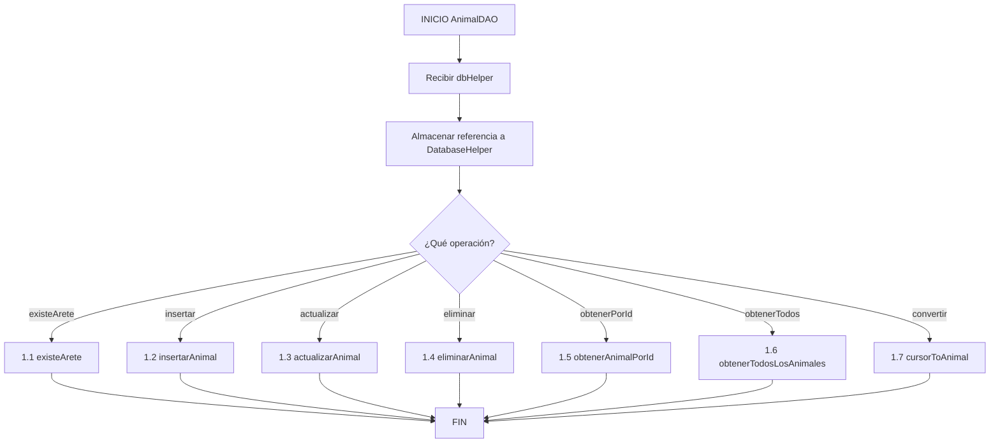

---

## 1.1 existeArete(numeroArete)

```
FUNCIÓN existeArete(numeroArete: String): Boolean
ENTRADA: numeroArete - Número de arete a buscar
SALIDA: Boolean - VERDADERO si existe, FALSO si no

INICIO
    |
    V
    db ← dbHelper.getReadableDatabase()
    |
    V
    cursor ← db.query("animales", ["id"], "numero_arete = ?", [numeroArete])
    |
    V
    ¿cursor ≠ NULL Y cursor.getCount() > 0?
    |
    +---> SÍ ---> existe ← VERDADERO
    |
    +---> NO ---> existe ← FALSO
    |
    V
    ¿cursor ≠ NULL?
    |
    +---> SÍ ---> cursor.close()
    |
    V
    RETORNAR existe
    |
    V
FIN
```

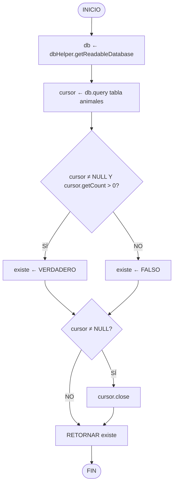

---

## 1.2 insertarAnimal(animal)

```
FUNCIÓN insertarAnimal(animal: Animal): Long
ENTRADA: animal - Objeto Animal con todos los datos
SALIDA: Long - ID insertado o -1 si error

INICIO
    |
    V
    ¿existeArete(animal.getNumeroArete())?
    |
    +---> SÍ ---> RETORNAR -1 ---> FIN
    |
    +---> NO
          |
          V
    db ← dbHelper.getWritableDatabase()
    |
    V
    valores ← NUEVO ContentValues()
    |
    V
    valores.put("numero_arete", animal.getNumeroArete())
    valores.put("nombre", animal.getNombre())
    valores.put("raza", animal.getRaza())
    valores.put("sexo", animal.getSexo())
    valores.put("fecha_nacimiento", animal.getFechaNacimiento())
    valores.put("fecha_ingreso", animal.getFechaIngreso())
    valores.put("fecha_salida", animal.getFechaSalida())
    valores.put("precio_compra", animal.getPrecioCompra())
    valores.put("precio_venta", animal.getPrecioVenta())
    valores.put("foto", animal.getFoto())
    valores.put("estado", animal.getEstado())
    valores.put("observaciones", animal.getObservaciones())
    |
    V
    idInsertado ← db.insert("animales", NULL, valores)
    |
    V
    RETORNAR idInsertado
    |
    V
FIN
```

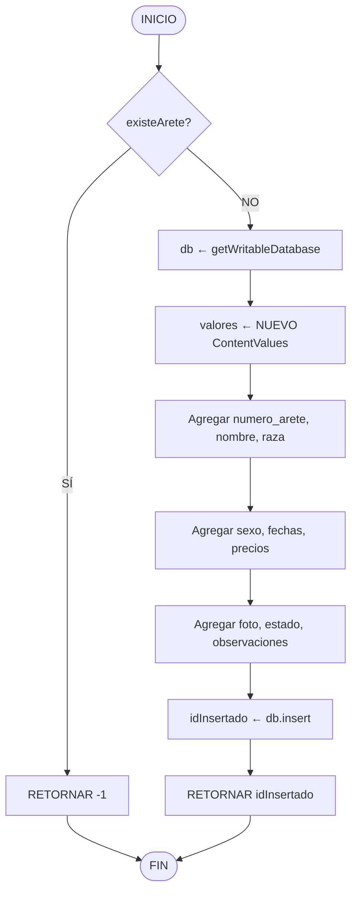

---

## 1.3 actualizarAnimal(animal)

```
FUNCIÓN actualizarAnimal(animal: Animal): Integer
ENTRADA: animal - Objeto Animal con datos actualizados incluyendo ID
SALIDA: Integer - Número de filas afectadas (1 = éxito, 0 = no encontrado)

INICIO
    |
    V
    db ← dbHelper.getWritableDatabase()
    |
    V
    valores ← NUEVO ContentValues()
    |
    V
    valores.put("numero_arete", animal.getNumeroArete())
    valores.put("nombre", animal.getNombre())
    valores.put("raza", animal.getRaza())
    valores.put("sexo", animal.getSexo())
    valores.put("fecha_nacimiento", animal.getFechaNacimiento())
    valores.put("fecha_ingreso", animal.getFechaIngreso())
    valores.put("fecha_salida", animal.getFechaSalida())
    valores.put("precio_compra", animal.getPrecioCompra())
    valores.put("precio_venta", animal.getPrecioVenta())
    valores.put("foto", animal.getFoto())
    valores.put("estado", animal.getEstado())
    valores.put("observaciones", animal.getObservaciones())
    |
    V
    filasAfectadas ← db.update("animales", valores, "id = ?", [animal.getId()])
    |
    V
    RETORNAR filasAfectadas
    |
    V
FIN
```

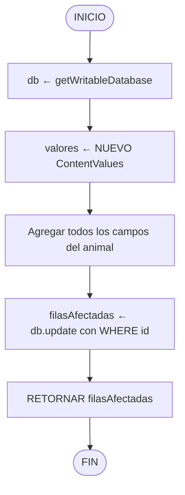

---

## 1.4 eliminarAnimal(id)

```
FUNCIÓN eliminarAnimal(id: Integer): Integer
ENTRADA: id - ID del animal a eliminar
SALIDA: Integer - Número de filas eliminadas

INICIO
    |
    V
    db ← dbHelper.getWritableDatabase()
    |
    V
    filasEliminadas ← db.delete("animales", "id = ?", [id])
    |
    V
    RETORNAR filasEliminadas
    |
    V
FIN

NOTA: Por CASCADE se eliminan automáticamente:
  - calendario_sanitario (animal_id)
  - historial_clinico (animal_id)
  - gastos (animal_id)
  - alimentacion (animal_id)
```

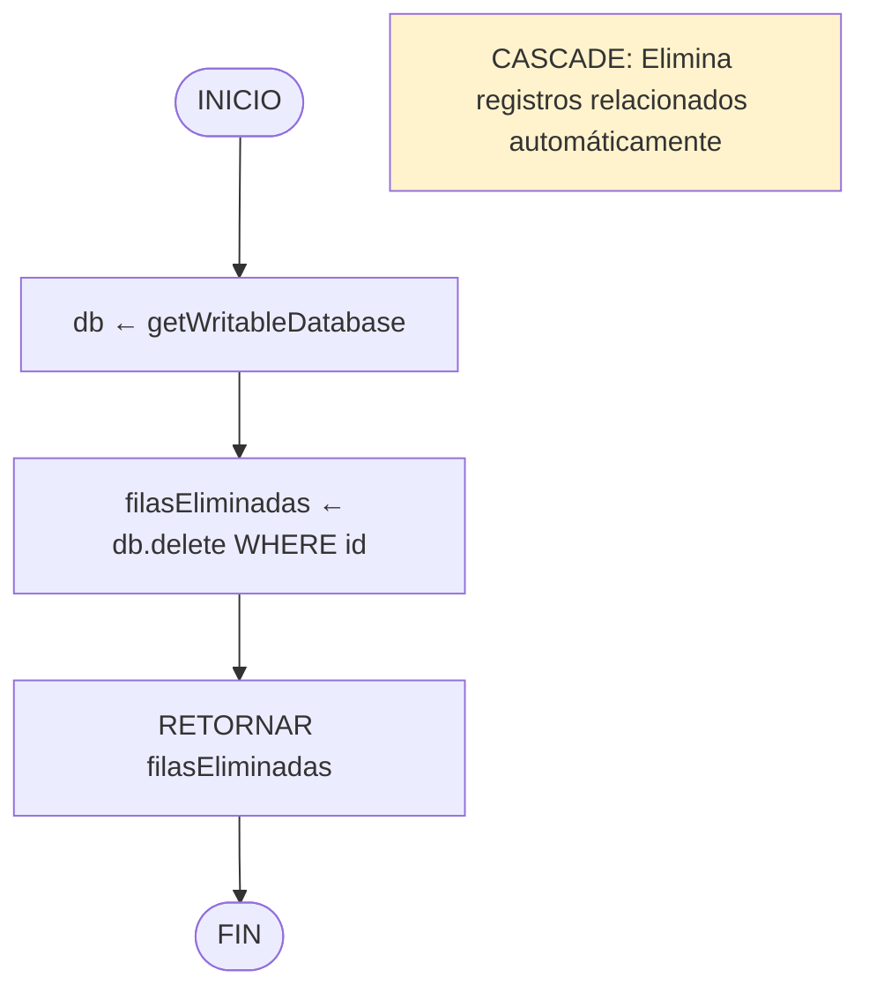

---

## 1.5 obtenerAnimalPorId(id)

```
FUNCIÓN obtenerAnimalPorId(id: Integer): Animal
ENTRADA: id - ID del animal a consultar
SALIDA: Animal - Objeto Animal o NULL si no existe

INICIO
    |
    V
    db ← dbHelper.getReadableDatabase()
    |
    V
    animal ← NULL
    |
    V
    cursor ← db.query("animales", TODAS_COLUMNAS, "id = ?", [id])
    |
    V
    ¿cursor ≠ NULL Y cursor.moveToFirst()?
    |
    +---> SÍ ---> animal ← cursorToAnimal(cursor)
    |             cursor.close()
    |
    +---> NO
    |
    V
    RETORNAR animal
    |
    V
FIN
```

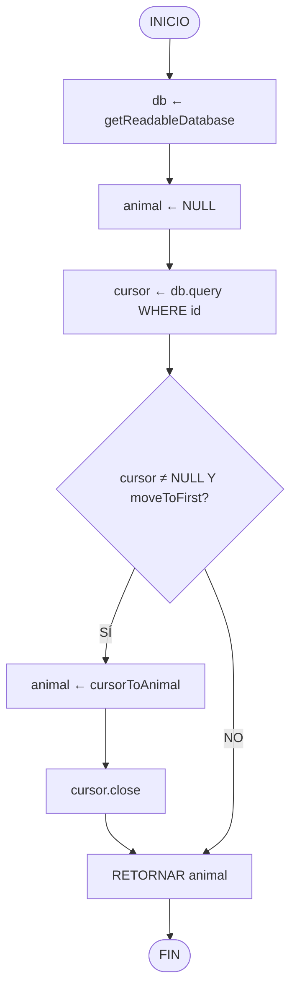

---

## 1.6 obtenerTodosLosAnimales()

```
FUNCIÓN obtenerTodosLosAnimales(): Lista<Animal>
ENTRADA: Ninguna
SALIDA: Lista<Animal> - Lista con todos los animales ordenados por nombre

INICIO
    |
    V
    animales ← NUEVA Lista<Animal>()
    |
    V
    db ← dbHelper.getReadableDatabase()
    |
    V
    cursor ← db.query("animales", TODAS_COLUMNAS, NULL, NULL, "nombre ASC")
    |
    V
    ¿cursor ≠ NULL Y cursor.moveToFirst()?
    |
    +---> NO ---> RETORNAR animales (lista vacía) ---> FIN
    |
    +---> SÍ
          |
          V
    REPETIR
        animal ← cursorToAnimal(cursor)
        animales.agregar(animal)
    MIENTRAS cursor.moveToNext()
    |
    V
    cursor.close()
    |
    V
    RETORNAR animales
    |
    V
FIN
```

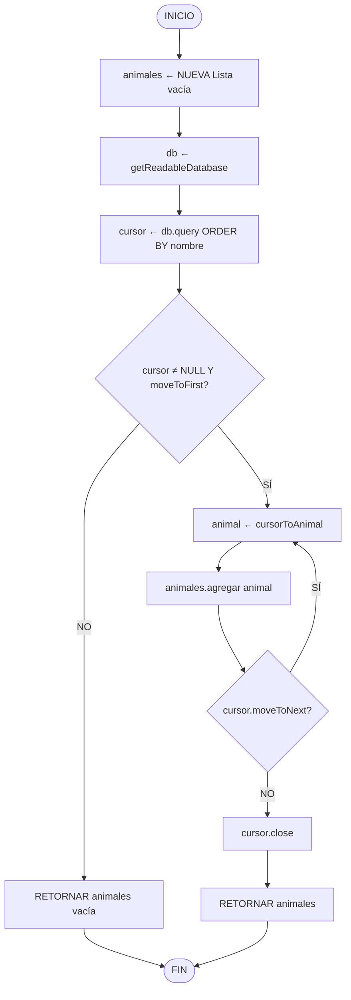

---

## 1.7 cursorToAnimal(cursor)

```
FUNCIÓN cursorToAnimal(cursor: Cursor): Animal
ENTRADA: cursor - Cursor posicionado en un registro
SALIDA: Animal - Objeto Animal con todos los datos

INICIO
    |
    V
    animal ← NUEVO Animal(
        cursor.getInt("id"),
        cursor.getString("numero_arete"),
        cursor.getString("nombre"),
        cursor.getString("raza"),
        cursor.getString("sexo"),
        cursor.getString("fecha_nacimiento"),
        cursor.getString("fecha_ingreso"),
        cursor.getString("fecha_salida"),
        cursor.getDouble("precio_compra"),
        cursor.getDouble("precio_venta"),
        cursor.getString("foto"),
        cursor.getString("estado"),
        cursor.getString("observaciones")
    )
    |
    V
    RETORNAR animal
    |
    V
FIN
```

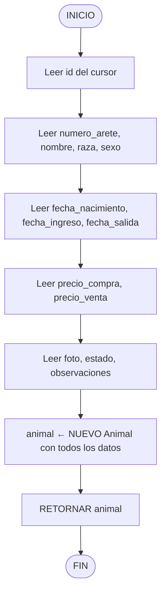

---

# 2. PSEUDOCÓDIGO: Flujo Detallado de Registro de Animal

```
PROCEDIMIENTO registrarAnimalCompleto()
ENTRADA: Datos del formulario UI
SALIDA: Animal guardado en BD o mensaje de error

INICIO
    |
    V
    ========== FASE 1: OBTENER DATOS ==========
    arete ← etArete.getText().trim()
    raza ← spinnerRaza.getSelectedItem()
    sexo ← spinnerSexo.getSelectedItem()
    fechaNac ← fechaNacimiento[0]
    fechaIng ← fechaIngreso[0]
    estado ← spinnerEstado.getSelectedItem()
    observaciones ← etObservaciones.getText().trim()
    precioStr ← etPrecioCompra.getText().trim()
    |
    V
    ========== FASE 2: VALIDACIONES ==========
    |
    V
    ¿arete.isEmpty()?
    +---> SÍ ---> Toast("Arete obligatorio") ---> RETORNAR
    +---> NO
          |
          V
    ¿arete NO matches "\\d{10}"?
    +---> SÍ ---> Toast("Formato SINIGA inválido") ---> RETORNAR
    +---> NO
          |
          V
    ¿presenter.validarArete(arete) = FALSO?
    +---> SÍ ---> RETORNAR
    +---> NO
          |
          V
    ¿sexo.isEmpty()?
    +---> SÍ ---> Toast("Sexo obligatorio") ---> RETORNAR
    +---> NO
          |
          V
    ¿fechaNac = NULL O vacío?
    +---> SÍ ---> Toast("Fecha nacimiento obligatoria") ---> RETORNAR
    +---> NO
          |
          V
    ¿fechaIng = NULL O vacío?
    +---> SÍ ---> Toast("Fecha ingreso obligatoria") ---> RETORNAR
    +---> NO
          |
          V
    ¿precioStr.isEmpty()?
    +---> SÍ ---> Toast("Precio obligatorio") ---> RETORNAR
    +---> NO
          |
          V
    INTENTAR
        precioCompra ← Double.parseDouble(precioStr)
        ¿precioCompra ≤ 0?
        +---> SÍ ---> Toast("Precio debe ser > 0") ---> RETORNAR
    CAPTURAR NumberFormatException
        Toast("Precio inválido") ---> RETORNAR
    |
    V
    ¿presenter.validarFechasCoherentes(fechaNac, fechaIng) = FALSO?
    +---> SÍ ---> RETORNAR
    +---> NO
          |
          V
    ========== FASE 3: CREAR OBJETO ==========
    animal ← NUEVO Animal()
    animal.setNumeroArete(arete)
    animal.setNombre(arete)
    animal.setRaza(raza)
    animal.setSexo(sexo)
    animal.setFechaNacimiento(fechaNac)
    animal.setFechaIngreso(fechaIng)
    animal.setPrecioCompra(precioCompra)
    animal.setEstado(estado)
    animal.setObservaciones(observaciones)
    animal.setFoto(fotoBase64)
    |
    V
    ¿modo = "editar"?
    +---> SÍ ---> animal.setId(animalId)
    +---> NO
          |
          V
    ========== FASE 4: GUARDAR ==========
    presenter.guardarAnimal(animal, modo = "editar")
    |
    V
FIN
```

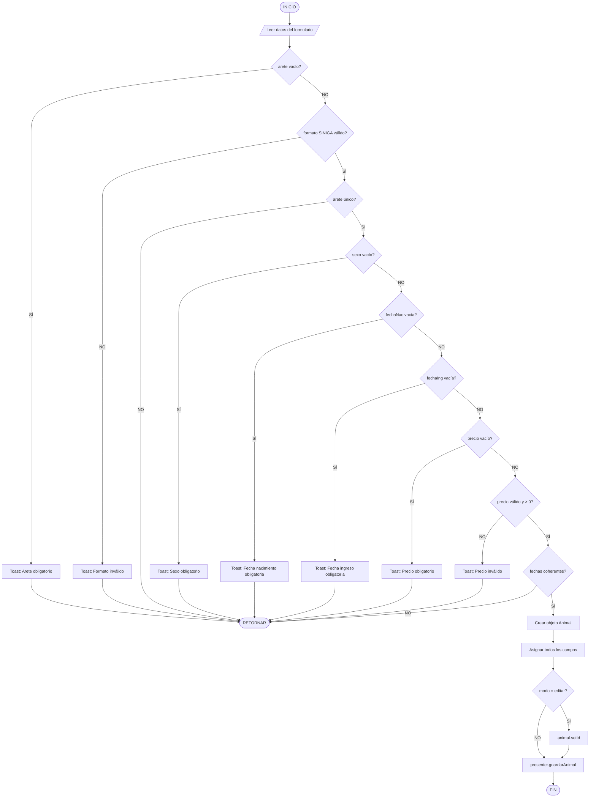

---

# 3. PSEUDOCÓDIGO: DatePickers

```
PROCEDIMIENTO mostrarDatePicker(esFechaNacimiento: Boolean)
ENTRADA: esFechaNacimiento - TRUE para fecha nacimiento, FALSE para fecha ingreso
SALIDA: Fecha seleccionada mostrada en botón correspondiente

INICIO
    |
    V
    sdf ← NUEVO SimpleDateFormat("dd/MM/yyyy", Locale.getDefault())
    |
    V
    year ← calendar.get(Calendar.YEAR)
    month ← calendar.get(Calendar.MONTH)
    day ← calendar.get(Calendar.DAY_OF_MONTH)
    |
    V
    datePickerDialog ← NUEVO DatePickerDialog(this, listener, year, month, day)
    |
    V
    MOSTRAR datePickerDialog
    |
    V
    [USUARIO SELECCIONA FECHA]
    |
    V
    calendar.set(año, mes, día seleccionados)
    |
    V
    fecha ← sdf.format(calendar.getTime())
    |
    V
    ¿esFechaNacimiento?
    |
    +---> SÍ ---> fechaNacimiento[0] ← fecha
    |             btnFechaNacimiento.setText(fecha)
    |
    +---> NO ---> fechaIngreso[0] ← fecha
                  btnFechaAdquisicion.setText(fecha)
    |
    V
FIN
```

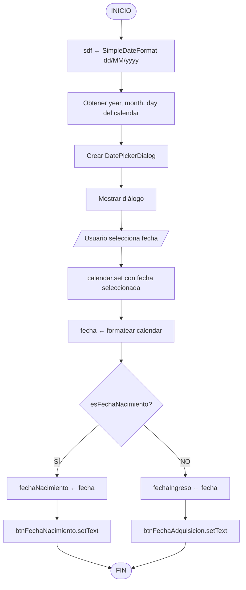

---

# 4. PSEUDOCÓDIGO: Inicialización de Vistas

```
PROCEDIMIENTO inicializarVistas()
ENTRADA: Ninguna
SALIDA: Todas las referencias a vistas UI inicializadas

INICIO
    |
    V
    ========== CAMPOS DE TEXTO ==========
    etArete ← findViewById(R.id.etArete)
    etPrecioCompra ← findViewById(R.id.etPrecioCompra)
    etObservaciones ← findViewById(R.id.etObservaciones)
    |
    V
    ========== BOTONES DE FECHA ==========
    btnFechaNacimiento ← findViewById(R.id.btnFechaNacimiento)
    btnFechaAdquisicion ← findViewById(R.id.btnFechaAdquisicion)
    |
    V
    ========== SPINNERS ==========
    spinnerRaza ← findViewById(R.id.spinnerRaza)
    spinnerSexo ← findViewById(R.id.spinnerSexo)
    spinnerEstado ← findViewById(R.id.spinnerEstado)
    |
    V
    ========== IMAGEN ==========
    ivFotoAnimal ← findViewById(R.id.ivFotoAnimal)
    |
    V
    ========== BOTONES DE ACCIÓN ==========
    btnSeleccionarFoto ← findViewById(R.id.btnSeleccionarFoto)
    btnTomarFoto ← findViewById(R.id.btnTomarFoto)
    btnGuardar ← findViewById(R.id.btnGuardar)
    btnCancelar ← findViewById(R.id.btnCancelar)
    |
    V
FIN
```

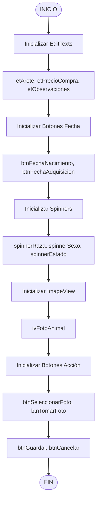

---

# 5. PSEUDOCÓDIGO: Configuración de Listeners

```
PROCEDIMIENTO configurarListeners()
ENTRADA: Ninguna
SALIDA: Todos los eventos de botones configurados

INICIO
    |
    V
    sdf ← NUEVO SimpleDateFormat("dd/MM/yyyy", Locale.getDefault())
    |
    V
    ========== INICIALIZAR FECHAS ==========
    fechaNacimiento[0] ← sdf.format(calendar.getTime())
    fechaIngreso[0] ← sdf.format(calendar.getTime())
    btnFechaNacimiento.setText(fechaNacimiento[0])
    btnFechaAdquisicion.setText(fechaIngreso[0])
    |
    V
    ========== CONFIGURAR LISTENERS ==========
    |
    V
    btnFechaNacimiento.setOnClickListener → mostrarDatePicker(VERDADERO)
    |
    V
    btnFechaAdquisicion.setOnClickListener → mostrarDatePicker(FALSO)
    |
    V
    btnSeleccionarFoto.setOnClickListener → seleccionarFoto()
    |
    V
    btnTomarFoto.setOnClickListener → verificarPermisosCamara()
    |
    V
    btnGuardar.setOnClickListener → guardarAnimal()
    |
    V
    btnCancelar.setOnClickListener → finish()
    |
    V
FIN
```

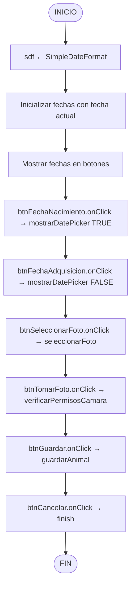

---

# 6. PSEUDOCÓDIGO: Ciclo de Vida de la Activity

## 6.1 onCreate

```
PROCEDIMIENTO onCreate(savedInstanceState: Bundle)
ENTRADA: savedInstanceState - Estado guardado previo (puede ser NULL)
SALIDA: Activity inicializada y lista para uso

INICIO
    |
    V
    super.onCreate(savedInstanceState)
    |
    V
    setContentView(R.layout.activity_registro_animal)
    |
    V
    ¿getSupportActionBar() ≠ NULL?
    +---> SÍ ---> getSupportActionBar().setDisplayHomeAsUpEnabled(VERDADERO)
    +---> NO
          |
          V
    ========== INICIALIZAR DEPENDENCIAS ==========
    dbHelper ← DatabaseHelper.getInstance(this)
    animalDAO ← NUEVO AnimalDAO(dbHelper)
    mainHandler ← NUEVO Handler(Looper.getMainLooper())
    presenter ← NUEVO AnimalPresenter(animalDAO, this)
    calendar ← Calendar.getInstance()
    |
    V
    inicializarVistas()
    |
    V
    configurarSpinners()
    |
    V
    ========== OBTENER MODO ==========
    modo ← getIntent().getStringExtra("modo")
    ¿modo = NULL?
    +---> SÍ ---> modo ← "nuevo"
    +---> NO
          |
          V
    animalId ← getIntent().getIntExtra("animalId", -1)
    |
    V
    ¿modo = "editar" Y animalId ≠ -1?
    |
    +---> SÍ ---> getSupportActionBar().setTitle("Editar Animal")
    |             etArete.setEnabled(FALSO)
    |             etArete.setAlpha(0.5f)
    |             cargarDatosAnimal()
    |
    +---> NO ---> getSupportActionBar().setTitle("Registrar Animal")
    |
    V
    configurarListeners()
    |
    V
FIN
```

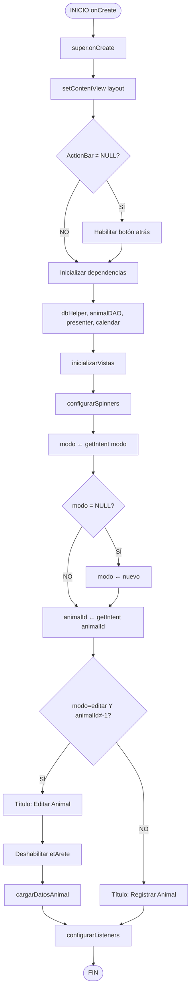

## 6.2 onResume, onPause, onDestroy

```
PROCEDIMIENTO onResume()
INICIO
    super.onResume()
    verificarSesion()
FIN

PROCEDIMIENTO verificarSesion()
INICIO
    prefs ← getSharedPreferences("SessionPrefs")
    ultimaActividad ← prefs.getLong("lastActivityTime", 0)
    tiempoActual ← System.currentTimeMillis()
    
    ¿ultimaActividad > 0 Y (tiempoActual - ultimaActividad) > 10000?
    +---> SÍ ---> mostrarDialogoContraseña()
    +---> NO
FIN

PROCEDIMIENTO onPause()
INICIO
    super.onPause()
    guardarTiempoActividad()
FIN

PROCEDIMIENTO guardarTiempoActividad()
INICIO
    prefs ← getSharedPreferences("SessionPrefs")
    prefs.edit().putLong("lastActivityTime", System.currentTimeMillis()).apply()
FIN

PROCEDIMIENTO onDestroy()
INICIO
    super.onDestroy()
    ¿presenter ≠ NULL?
    +---> SÍ ---> presenter.destruir()
    +---> NO
FIN
```

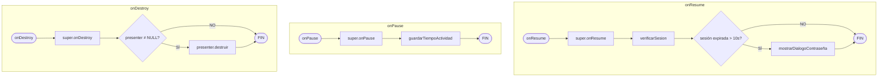

---

# 7. PSEUDOCÓDIGO: Método guardarAnimal()

```
PROCEDIMIENTO guardarAnimal()
ENTRADA: Datos de las vistas del formulario
SALIDA: Animal guardado o mensajes de error

INICIO
    |
    V
    ========== PASO 1: OBTENER DATOS ==========
    arete ← etArete.getText().toString().trim()
    raza ← spinnerRaza.getSelectedItem().toString()
    sexo ← spinnerSexo.getSelectedItem().toString()
    fechaNac ← fechaNacimiento[0]
    fechaIng ← fechaIngreso[0]
    estado ← spinnerEstado.getSelectedItem().toString()
    observaciones ← etObservaciones.getText().toString().trim()
    precioStr ← etPrecioCompra.getText().toString().trim()
    |
    V
    ========== PASO 2: VALIDACIONES ==========
    |
    V
    ¿arete.isEmpty()?
    +---> SÍ ---> Toast("Arete obligatorio")
    |             etArete.setError("Campo obligatorio")
    |             etArete.requestFocus()
    |             RETORNAR
    +---> NO
          |
          V
    ¿NO arete.matches("\\d{10}")?
    +---> SÍ ---> Toast("Formato SINIGA: 10 dígitos")
    |             etArete.setError("Formato inválido")
    |             RETORNAR
    +---> NO
          |
          V
    ¿NO presenter.validarArete(arete)?
    +---> SÍ ---> RETORNAR
    +---> NO
          |
          V
    ¿sexo.isEmpty()?
    +---> SÍ ---> Toast("Seleccione sexo") ---> RETORNAR
    +---> NO
          |
          V
    ¿fechaNac = NULL O vacío?
    +---> SÍ ---> Toast("Fecha nacimiento obligatoria") ---> RETORNAR
    +---> NO
          |
          V
    ¿fechaIng = NULL O vacío?
    +---> SÍ ---> Toast("Fecha ingreso obligatoria") ---> RETORNAR
    +---> NO
          |
          V
    ¿precioStr.isEmpty()?
    +---> SÍ ---> Toast("Precio obligatorio")
    |             etPrecioCompra.setError("Campo obligatorio")
    |             RETORNAR
    +---> NO
          |
          V
    INTENTAR
        precioCompra ← Double.parseDouble(precioStr)
        ¿precioCompra ≤ 0?
        +---> SÍ ---> Toast("Precio > 0") ---> RETORNAR
    CAPTURAR NumberFormatException
        Toast("Precio inválido") ---> RETORNAR
    |
    V
    ¿NO presenter.validarFechasCoherentes(fechaNac, fechaIng)?
    +---> SÍ ---> RETORNAR
    +---> NO
          |
          V
    ========== PASO 3: CREAR OBJETO ==========
    animal ← NUEVO Animal()
    animal.setNumeroArete(arete)
    animal.setNombre(arete)
    animal.setRaza(raza)
    animal.setSexo(sexo)
    animal.setFechaNacimiento(fechaNac)
    animal.setFechaIngreso(fechaIng)
    animal.setPrecioCompra(precioCompra)
    animal.setEstado(estado)
    animal.setObservaciones(observaciones)
    animal.setFoto(fotoBase64)
    |
    V
    ¿modo.equals("editar")?
    +---> SÍ ---> animal.setId(animalId)
    +---> NO
          |
          V
    ========== PASO 4: GUARDAR ==========
    presenter.guardarAnimal(animal, modo.equals("editar"))
    |
    V
FIN
```

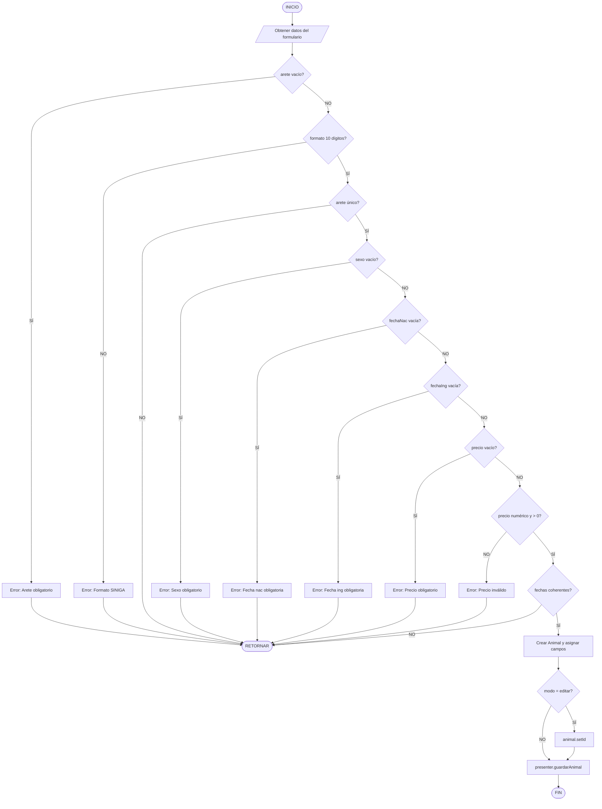

---

# 8. PSEUDOCÓDIGO: ValidarIdentificadorAnimal (Arete SINIGA)

```
FUNCIÓN validarIdentificadorAnimal(arete: String): Boolean
ENTRADA: arete - Número de identificación del animal
SALIDA: TRUE si el arete es válido y único, FALSE en caso contrario

INICIO
    |
    V
    ¿arete = NULL?
    +---> SÍ ---> RETORNAR FALSO
    +---> NO
          |
          V
    arete ← arete.trim()
    |
    V
    ¿arete.isEmpty()?
    +---> SÍ ---> Toast("Arete obligatorio")
    |             RETORNAR FALSO
    +---> NO
          |
          V
    ¿arete.length() ≠ 10?
    +---> SÍ ---> Toast("Debe tener 10 caracteres")
    |             RETORNAR FALSO
    +---> NO
          |
          V
    ¿NO arete.matches("\\d{10}")?
    +---> SÍ ---> Toast("Solo dígitos numéricos")
    |             RETORNAR FALSO
    +---> NO
          |
          V
    ¿animalDAO.existeArete(arete)?
    |
    +---> SÍ ---> ¿NO modoEdicion?
    |             |
    |             +---> SÍ ---> Toast("Arete duplicado")
    |             |             RETORNAR FALSO
    |             +---> NO
    |                   |
    +---> NO -----------+
          |
          V
    RETORNAR VERDADERO
    |
    V
FIN
```

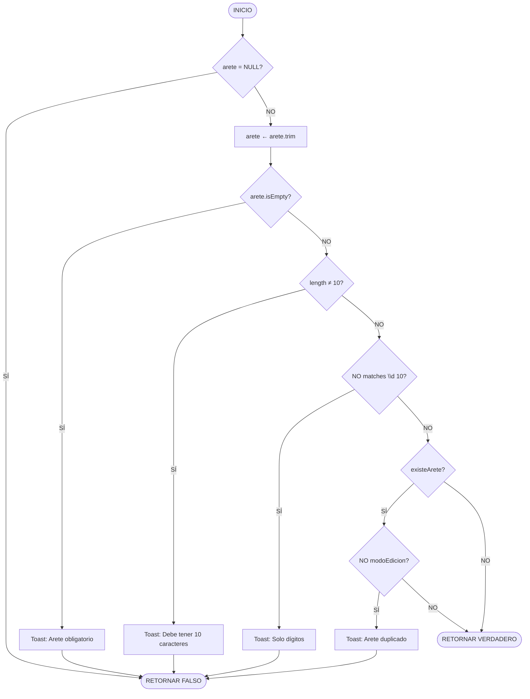

---

# 9. PSEUDOCÓDIGO: Validación Completa - Registro de Animal

```
FUNCIÓN validacionCompletaRegistro(arete, raza, sexo, fechaNacimiento, 
                                   fechaIngreso, precioStr, modo): Boolean
ENTRADA: Todos los campos del formulario de registro
SALIDA: TRUE si todas las validaciones pasan, FALSE si alguna falla

INICIO
    |
    V
    ========== VALIDACIÓN 1: ARETE OBLIGATORIO ==========
    ¿arete.isEmpty()?
    +---> SÍ ---> error ← "Arete obligatorio"
    |             RETORNAR FALSO
    +---> NO
          |
          V
    ========== VALIDACIÓN 2: FORMATO SINIGA ==========
    ¿NO arete.matches("\\d{10}")?
    +---> SÍ ---> error ← "Formato SINIGA: 10 dígitos"
    |             RETORNAR FALSO
    +---> NO
          |
          V
    ========== VALIDACIÓN 3: ARETE ÚNICO ==========
    ¿modo = "nuevo" Y animalDAO.existeArete(arete)?
    +---> SÍ ---> error ← "Arete ya registrado"
    |             RETORNAR FALSO
    +---> NO
          |
          V
    ========== VALIDACIÓN 4: RAZA SELECCIONADA ==========
    ¿raza = NULL O raza.isEmpty()?
    +---> SÍ ---> error ← "Seleccione raza"
    |             RETORNAR FALSO
    +---> NO
          |
          V
    ========== VALIDACIÓN 5: SEXO SELECCIONADO ==========
    ¿sexo = NULL O sexo.isEmpty()?
    +---> SÍ ---> error ← "Seleccione sexo"
    |             RETORNAR FALSO
    +---> NO
          |
          V
    ========== VALIDACIÓN 6: FECHA NACIMIENTO ==========
    ¿fechaNacimiento = NULL O vacía?
    +---> SÍ ---> error ← "Fecha nacimiento requerida"
    |             RETORNAR FALSO
    +---> NO
          |
          V
    ========== VALIDACIÓN 7: FECHA INGRESO ==========
    ¿fechaIngreso = NULL O vacía?
    +---> SÍ ---> error ← "Fecha ingreso requerida"
    |             RETORNAR FALSO
    +---> NO
          |
          V
    ========== VALIDACIÓN 8: PRECIO OBLIGATORIO ==========
    ¿precioStr.isEmpty()?
    +---> SÍ ---> error ← "Precio obligatorio"
    |             RETORNAR FALSO
    +---> NO
          |
          V
    ========== VALIDACIÓN 9: PRECIO NUMÉRICO ==========
    INTENTAR
        precio ← Double.parseDouble(precioStr)
    CAPTURAR NumberFormatException
        error ← "Precio inválido"
        RETORNAR FALSO
    |
    V
    ========== VALIDACIÓN 10: PRECIO POSITIVO ==========
    ¿precio ≤ 0?
    +---> SÍ ---> error ← "Precio > 0"
    |             RETORNAR FALSO
    +---> NO
          |
          V
    ========== VALIDACIÓN 11: COHERENCIA FECHAS ==========
    fechaNac ← parsearFecha(fechaNacimiento)
    fechaIng ← parsearFecha(fechaIngreso)
    |
    V
    ¿fechaNac > fechaIng?
    +---> SÍ ---> error ← "Nacimiento posterior al ingreso"
    |             RETORNAR FALSO
    +---> NO
          |
          V
    ========== VALIDACIÓN 12: FECHAS NO FUTURAS ==========
    ¿fechaNac > fechaActual O fechaIng > fechaActual?
    +---> SÍ ---> error ← "Fechas no pueden ser futuras"
    |             RETORNAR FALSO
    +---> NO
          |
          V
    RETORNAR VERDADERO
    |
    V
FIN
```

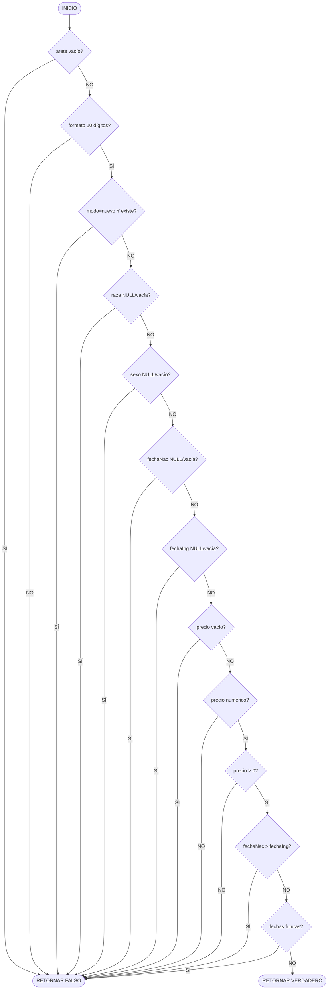

---

# 10. PSEUDOCÓDIGO: Flujo de Captura de Foto

```
PROCEDIMIENTO flujoCapturaFoto(fuente: String)
ENTRADA: fuente - "galería" o "cámara"
SALIDA: Imagen capturada y procesada en fotoBase64

INICIO
    |
    V
    ¿fuente = "galería"?
    +---> SÍ ---> seleccionarFoto()
    |             |
    +---> NO      V
          |       [Abre selector de imágenes]
          V       |
    ¿fuente = "cámara"?
    +---> SÍ ---> verificarPermisosCamara()
    |             |
    |             V
    |       [Si permiso OK → abrirCamara()]
    |             |
    +---> NO      V
          |
          V
    [Usuario selecciona/captura imagen]
    |
    V
    onActivityResult(requestCode, resultCode, data)
    |
    V
    procesarImagen(bitmap)
    |
    V
    fotoBase64 ← resultado codificado
    |
    V
    ivFotoAnimal.setImageBitmap(resizedBitmap)
    |
    V
FIN
```

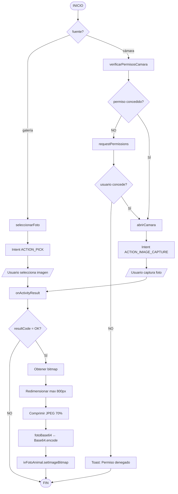

---

# 11. PSEUDOCÓDIGO: Selección desde Galería

```
PROCEDIMIENTO seleccionarFoto()
ENTRADA: Ninguna
SALIDA: Inicia selector de imágenes del sistema

INICIO
    |
    V
    intent ← NUEVO Intent(Intent.ACTION_PICK)
    |
    V
    intent.setData(MediaStore.Images.Media.EXTERNAL_CONTENT_URI)
    |
    V
    startActivityForResult(intent, PICK_IMAGE)
    |
    V
    [PICK_IMAGE = 1]
    |
    V
FIN
```

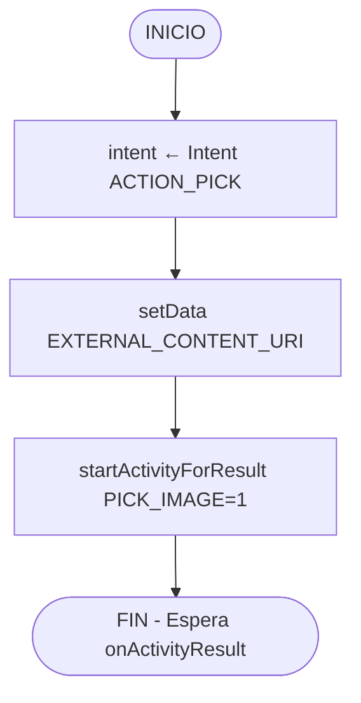

## 11.1 procesarResultadoGaleria

```
FUNCIÓN procesarResultadoGaleria(data: Intent): Bitmap
ENTRADA: data - Intent con resultado del selector
SALIDA: Bitmap de la imagen o NULL

INICIO
    |
    V
    ¿data ≠ NULL?
    +---> SÍ ---> imageUri ← data.getData()
    |             |
    |             V
    |             bitmap ← MediaStore.Images.Media.getBitmap(
    |                         contentResolver, imageUri)
    |             |
    |             V
    |             RETORNAR bitmap
    |
    +---> NO ---> RETORNAR NULL
    |
    V
FIN
```

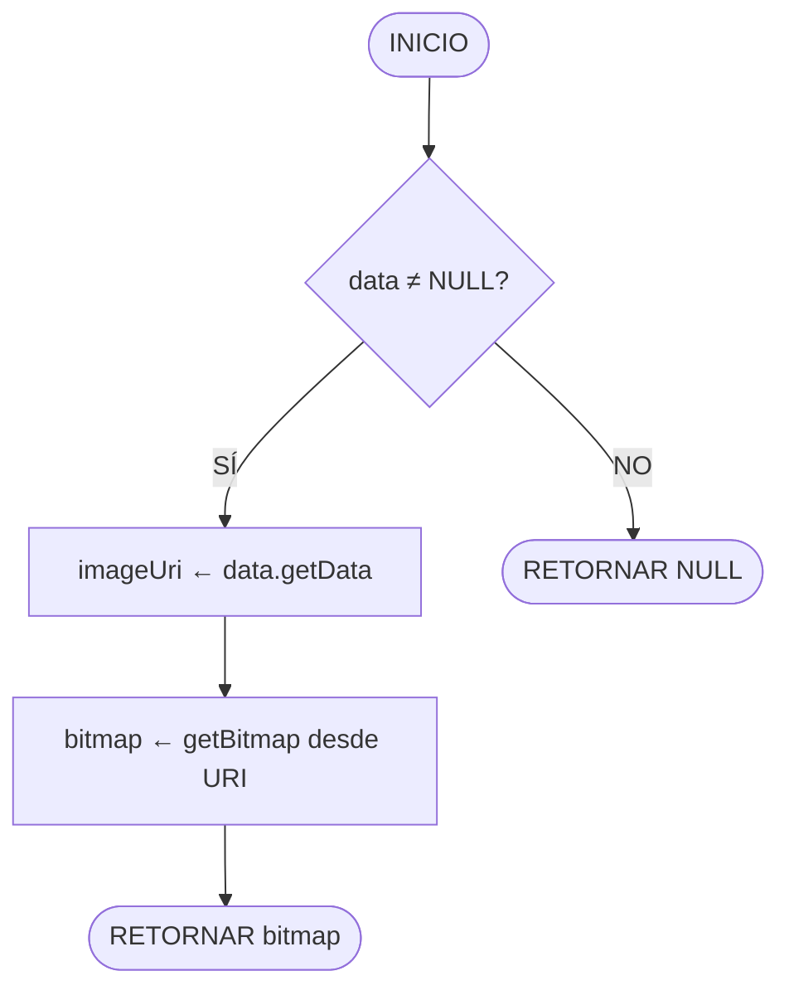

---

# 12. PSEUDOCÓDIGO: Captura desde Cámara

```
PROCEDIMIENTO tomarFoto()
ENTRADA: Ninguna
SALIDA: Inicia cámara del dispositivo

INICIO
    |
    V
    takePictureIntent ← NUEVO Intent(MediaStore.ACTION_IMAGE_CAPTURE)
    |
    V
    INTENTAR
        |
        V
        photoFile ← crearArchivoImagen()
        |
        V
        ¿photoFile ≠ NULL?
        |
        +---> SÍ ---> photoUri ← FileProvider.getUriForFile(
        |                         this,
        |                         getPackageName() + ".fileprovider",
        |                         photoFile)
        |             |
        |             V
        |             takePictureIntent.putExtra(EXTRA_OUTPUT, photoUri)
        |             |
        |             V
        |             startActivityForResult(takePictureIntent, TAKE_PHOTO)
        |             [TAKE_PHOTO = 2]
        |
        +---> NO ---> [No hacer nada]
    |
    CAPTURAR IOException
        Toast("Error al crear archivo de imagen")
    |
    CAPTURAR Exception
        Toast("No se pudo abrir la cámara")
    |
    V
FIN
```

```mermaid
flowchart TD
    A([INICIO]) --> B[takePictureIntent ← ACTION_IMAGE_CAPTURE]
    B --> C[INTENTAR]
    C --> D[photoFile ← crearArchivoImagen]
    D --> E{photoFile ≠ NULL?}
    E -->|SÍ| F[photoUri ← FileProvider.getUriForFile]
    F --> G[putExtra EXTRA_OUTPUT]
    G --> H[startActivityForResult TAKE_PHOTO=2]
    H --> I([FIN])
    E -->|NO| I
    C --> J{IOException?}
    J -->|SÍ| K[Toast: Error crear archivo]
    K --> I
    C --> L{Exception?}
    L -->|SÍ| M[Toast: No se pudo abrir cámara]
    M --> I
```

## 12.1 crearArchivoImagen

```
FUNCIÓN crearArchivoImagen(): File
ENTRADA: Ninguna
SALIDA: File - Archivo temporal para la imagen

INICIO
    |
    V
    timeStamp ← SimpleDateFormat("yyyyMMdd_HHmmss").format(NUEVO Date())
    |
    V
    imageFileName ← "ANIMAL_" + timeStamp + "_"
    |
    V
    storageDir ← getExternalFilesDir(Environment.DIRECTORY_PICTURES)
    |
    V
    image ← File.createTempFile(imageFileName, ".jpg", storageDir)
    |
    V
    currentPhotoPath ← image.getAbsolutePath()
    |
    V
    RETORNAR image
    |
    V
FIN
```

```mermaid
flowchart TD
    A([INICIO]) --> B[timeStamp ← formato yyyyMMdd_HHmmss]
    B --> C[imageFileName ← ANIMAL_ + timeStamp]
    C --> D[storageDir ← DIRECTORY_PICTURES]
    D --> E[image ← createTempFile .jpg]
    E --> F[currentPhotoPath ← absolutePath]
    F --> G([RETORNAR image])
```

## 12.2 procesarResultadoCamara

```
FUNCIÓN procesarResultadoCamara(): Bitmap
ENTRADA: Ninguna (usa currentPhotoPath global)
SALIDA: Bitmap de la imagen capturada

INICIO
    |
    V
    bitmap ← BitmapFactory.decodeFile(currentPhotoPath)
    |
    V
    RETORNAR bitmap
    |
    V
FIN
```

```mermaid
flowchart TD
    A([INICIO]) --> B[bitmap ← decodeFile currentPhotoPath]
    B --> C([RETORNAR bitmap])
```

---

# 13. PSEUDOCÓDIGO: ProcesarImagenAnimal

```
FUNCIÓN procesarImagenAnimal(bitmap: Bitmap): String
ENTRADA: bitmap - Imagen capturada o seleccionada
SALIDA: String Base64 de la imagen procesada

INICIO
    |
    V
    ¿bitmap = NULL?
    +---> SÍ ---> RETORNAR ""
    +---> NO
          |
          V
    ========== PASO 1: CALCULAR DIMENSIONES ==========
    maxSize ← 800
    width ← bitmap.getWidth()
    height ← bitmap.getHeight()
    |
    V
    ratio ← MIN(maxSize / width, maxSize / height)
    |
    V
    newWidth ← REDONDEAR(width * ratio)
    newHeight ← REDONDEAR(height * ratio)
    |
    V
    ========== PASO 2: REDIMENSIONAR ==========
    resizedBitmap ← Bitmap.createScaledBitmap(
                        bitmap, newWidth, newHeight, VERDADERO)
    |
    V
    ========== PASO 3: COMPRIMIR ==========
    baos ← NUEVO ByteArrayOutputStream()
    resizedBitmap.compress(Bitmap.CompressFormat.JPEG, 70, baos)
    |
    V
    imageBytes ← baos.toByteArray()
    |
    V
    ========== PASO 4: CODIFICAR BASE64 ==========
    fotoBase64 ← Base64.encodeToString(imageBytes, Base64.DEFAULT)
    |
    V
    ========== PASO 5: MOSTRAR PREVIEW ==========
    ivFotoAnimal.setImageBitmap(resizedBitmap)
    Toast("Foto guardada correctamente")
    |
    V
    RETORNAR fotoBase64
    |
    V
FIN
```

```mermaid
flowchart TD
    A([INICIO]) --> B{bitmap = NULL?}
    B -->|SÍ| C([RETORNAR cadena vacía])
    B -->|NO| D[maxSize ← 800]
    D --> E[Obtener width, height originales]
    E --> F[ratio ← MIN maxSize/width, maxSize/height]
    F --> G[Calcular newWidth, newHeight]
    G --> H[resizedBitmap ← createScaledBitmap]
    H --> I[baos ← ByteArrayOutputStream]
    I --> J[compress JPEG calidad 70%]
    J --> K[imageBytes ← toByteArray]
    K --> L[fotoBase64 ← Base64.encodeToString]
    L --> M[ivFotoAnimal.setImageBitmap]
    M --> N[Toast: Foto guardada]
    N --> O([RETORNAR fotoBase64])
```

---

# 14. PSEUDOCÓDIGO: Solicitud de Permisos

## 14.1 verificarPermisosCamara

```
PROCEDIMIENTO verificarPermisosCamara()
ENTRADA: Ninguna
SALIDA: Abre cámara o solicita permisos

INICIO
    |
    V
    estadoPermiso ← ContextCompat.checkSelfPermission(
                        this, Manifest.permission.CAMERA)
    |
    V
    ¿estadoPermiso ≠ PERMISSION_GRANTED?
    |
    +---> SÍ ---> ActivityCompat.requestPermissions(
    |                 this,
    |                 [Manifest.permission.CAMERA],
    |                 CAMERA_PERMISSION_CODE)  // 100
    |             |
    |             V
    |             [Espera onRequestPermissionsResult]
    |
    +---> NO ---> tomarFoto()
    |
    V
FIN
```

```mermaid
flowchart TD
    A([INICIO]) --> B[estadoPermiso ← checkSelfPermission CAMERA]
    B --> C{permiso concedido?}
    C -->|NO| D[requestPermissions CAMERA code=100]
    D --> E([Espera callback])
    C -->|SÍ| F[tomarFoto]
    F --> G([FIN])
```

## 14.2 onRequestPermissionsResult

```
PROCEDIMIENTO onRequestPermissionsResult(requestCode, permissions[], grantResults[])
ENTRADA: requestCode, permissions[], grantResults[]
SALIDA: Ejecuta acción según permiso concedido

INICIO
    |
    V
    super.onRequestPermissionsResult(requestCode, permissions, grantResults)
    |
    V
    ¿requestCode = CAMERA_PERMISSION_CODE?
    |
    +---> SÍ ---> ¿grantResults.length > 0?
    |             |
    |             +---> SÍ ---> ¿grantResults[0] = PERMISSION_GRANTED?
    |             |             |
    |             |             +---> SÍ ---> tomarFoto()
    |             |             |
    |             |             +---> NO ---> Toast("Permiso denegado")
    |             |
    |             +---> NO ---> [No hacer nada]
    |
    +---> NO ---> [Otro permiso, ignorar]
    |
    V
FIN
```

```mermaid
flowchart TD
    A([INICIO]) --> B[super.onRequestPermissionsResult]
    B --> C{requestCode = CAMERA_PERMISSION_CODE?}
    C -->|NO| D([FIN])
    C -->|SÍ| E{grantResults.length > 0?}
    E -->|NO| D
    E -->|SÍ| F{grantResults 0 = GRANTED?}
    F -->|SÍ| G[tomarFoto]
    G --> D
    F -->|NO| H[Toast: Permiso denegado]
    H --> D
```

---

# 15. PSEUDOCÓDIGO: onActivityResult (Procesamiento de Foto)

```
PROCEDIMIENTO onActivityResult(requestCode: Integer, resultCode: Integer, data: Intent)
ENTRADA: requestCode, resultCode, data
SALIDA: Imagen procesada y mostrada en UI

INICIO
    |
    V
    super.onActivityResult(requestCode, resultCode, data)
    |
    V
    ¿resultCode = RESULT_OK?
    +---> NO ---> FIN
    +---> SÍ
          |
          V
    bitmap ← NULL
    |
    V
    INTENTAR
        |
        V
        ========== OPCIÓN 1: DESDE GALERÍA ==========
        ¿requestCode = PICK_IMAGE Y data ≠ NULL?
        |
        +---> SÍ ---> imageUri ← data.getData()
        |             bitmap ← MediaStore.Images.Media.getBitmap(
        |                         contentResolver, imageUri)
        |
        +---> NO
              |
              V
        ========== OPCIÓN 2: DESDE CÁMARA ==========
        ¿requestCode = TAKE_PHOTO?
        |
        +---> SÍ ---> bitmap ← BitmapFactory.decodeFile(currentPhotoPath)
        |
        +---> NO
              |
              V
        ========== PROCESAR SI HAY BITMAP ==========
        ¿bitmap ≠ NULL?
        |
        +---> SÍ ---> // Redimensionar
        |             maxSize ← 800
        |             width ← bitmap.getWidth()
        |             height ← bitmap.getHeight()
        |             ratio ← MIN(maxSize / width, maxSize / height)
        |             newWidth ← REDONDEAR(width * ratio)
        |             newHeight ← REDONDEAR(height * ratio)
        |             resizedBitmap ← Bitmap.createScaledBitmap(
        |                                 bitmap, newWidth, newHeight, VERDADERO)
        |             |
        |             V
        |             // Convertir a Base64
        |             baos ← NUEVO ByteArrayOutputStream()
        |             resizedBitmap.compress(JPEG, 70, baos)
        |             imageBytes ← baos.toByteArray()
        |             fotoBase64 ← Base64.encodeToString(imageBytes, DEFAULT)
        |             |
        |             V
        |             // Mostrar en UI
        |             ivFotoAnimal.setImageBitmap(resizedBitmap)
        |             Toast("Foto guardada correctamente")
        |
        +---> NO ---> [No hacer nada]
    |
    CAPTURAR IOException
        e.printStackTrace()
        Toast("Error al cargar la foto")
    |
    V
FIN
```

```mermaid
flowchart TD
    A([INICIO]) --> B[super.onActivityResult]
    B --> C{resultCode = OK?}
    C -->|NO| Z([FIN])
    C -->|SÍ| D[bitmap ← NULL]
    D --> E{requestCode = PICK_IMAGE Y data ≠ NULL?}
    E -->|SÍ| F[imageUri ← data.getData]
    F --> G[bitmap ← getBitmap desde URI]
    E -->|NO| H{requestCode = TAKE_PHOTO?}
    H -->|SÍ| I[bitmap ← decodeFile currentPhotoPath]
    H -->|NO| J{bitmap ≠ NULL?}
    G --> J
    I --> J
    J -->|NO| Z
    J -->|SÍ| K[Calcular ratio para max 800px]
    K --> L[resizedBitmap ← createScaledBitmap]
    L --> M[Comprimir JPEG 70%]
    M --> N[fotoBase64 ← Base64.encode]
    N --> O[ivFotoAnimal.setImageBitmap]
    O --> P[Toast: Foto guardada]
    P --> Z
    
    Q[CAPTURAR IOException] --> R[Toast: Error al cargar foto]
    R --> Z
```

---

## RESUMEN DE PSEUDOCÓDIGOS CON DIAGRAMAS MERMAID

| No. | Pseudocódigo | Propósito | Mermaid |
|-----|--------------|-----------|:-------:|
| 1.1 | existeArete | Verificar si un arete ya existe en BD | ✅ |
| 1.2 | insertarAnimal | Insertar nuevo animal en BD | ✅ |
| 1.3 | actualizarAnimal | Actualizar animal existente | ✅ |
| 1.4 | eliminarAnimal | Eliminar animal por ID | ✅ |
| 1.5 | obtenerAnimalPorId | Consultar animal específico | ✅ |
| 1.6 | obtenerTodosLosAnimales | Listar todos los animales | ✅ |
| 1.7 | cursorToAnimal | Convertir cursor a objeto Animal | ✅ |
| 2 | registrarAnimalCompleto | Flujo completo de registro | ✅ |
| 3 | mostrarDatePicker | Selector de fecha | ✅ |
| 4 | inicializarVistas | Inicialización de componentes UI | ✅ |
| 5 | configurarListeners | Configuración de eventos | ✅ |
| 6.1 | onCreate | Ciclo de vida - creación | ✅ |
| 6.2 | onResume/onPause/onDestroy | Ciclo de vida - estados | ✅ |
| 7 | guardarAnimal | Método principal de guardado | ✅ |
| 8 | validarIdentificadorAnimal | Validación de arete SINIGA | ✅ |
| 9 | validacionCompletaRegistro | Todas las validaciones | ✅ |
| 10 | flujoCapturaFoto | Flujo general de captura | ✅ |
| 11 | seleccionarFoto | Selección desde galería | ✅ |
| 12 | tomarFoto | Captura desde cámara | ✅ |
| 12.1 | crearArchivoImagen | Crear archivo temporal imagen | ✅ |
| 13 | procesarImagenAnimal | Redimensionar, comprimir, Base64 | ✅ |
| 14.1 | verificarPermisosCamara | Verificar permisos Android | ✅ |
| 14.2 | onRequestPermissionsResult | Callback de permisos | ✅ |
| 15 | onActivityResult | Procesamiento de resultado foto | ✅ |

---

## GUÍA DE USO DE DIAGRAMAS MERMAID

### Sintaxis Básica

```mermaid
flowchart TD
    A([INICIO/FIN])       %% Nodo ovalado - Terminador
    B[Proceso]            %% Nodo rectangular - Proceso
    C{Decisión?}          %% Nodo rombo - Decisión
    D[/Entrada-Salida/]   %% Nodo paralelogramo - I/O
    E[(Base de Datos)]    %% Nodo cilindro - BD
```

### Conexiones

```
A --> B           %% Flecha simple
A -->|Etiqueta| B %% Flecha con etiqueta
A --- B           %% Línea sin flecha
```

### Direcciones del Flujo

- `TD` o `TB` = Top to Down (Arriba hacia Abajo)
- `LR` = Left to Right (Izquierda a Derecha)
- `BT` = Bottom to Top (Abajo hacia Arriba)
- `RL` = Right to Left (Derecha a Izquierda)

### Subgrafos

```mermaid
flowchart TD
    subgraph NombreGrupo
        A --> B
    end
```

---

> **Nota**: Todos los pseudocódigos incluyen código Mermaid listo para copiar y renderizar. Los diagramas reflejan exactamente la lógica del código fuente de AgroApp.
