# DIAGRAMAS UML DEL SISTEMA AGROAPP
## Documentación Técnica en Sintaxis PlantUML

Fecha: Diciembre 2025
Sistema: AgroApp - Gestión Ganadera
Versión: 1.0

---

# ÍNDICE DE DIAGRAMAS

| Seccion | Diagrama | Descripcion |
|---------|----------|-------------|
| **DOMINIO** | 2 | Modelo de Dominio - Negocio Ganadero (Realidad Actual SIN SISTEMA) |
| | 2.1 | Modelo de Dominio - Vista Simplificada |
| | 2.2 | Diagrama de Objetos (Ejemplo Real de Ganaderia) |
| | 2.3 | Problematica de la Gestion Manual |
| **ENTIDAD-RELACION** | 3 | Diagrama Entidad-Relacion (Notacion UML) |
| | 3.1 | Diagrama E-R Simplificado |
| **CONTEXTO** | 1 | Diagrama de Contexto del Sistema (AgroApp) |
| | 1.1 | Diagrama de Contexto Detallado - Flujos de Datos |
| | 1.2 | Diagrama de Contexto - Casos de Uso de Alto Nivel |
| **DISEÑO** | 5 | Diagrama de Clases Completo del Sistema |
| **NAVEGACION** | 40 | Navegacion desde Login hasta Dashboard |
| | 41 | Navegacion Completa de Gestion de Animales |
| | 42 | Navegacion de Calendario Sanitario |
| | 43 | Navegacion de Control de Gastos |
| | 44 | Navegacion Completa del Sistema (General) |
| | 45 | Navegacion Cross-Module |

> **NOTA IMPORTANTE:**  
> El **Modelo de Dominio (Sección 2)** representa la **REALIDAD ACTUAL** del negocio ganadero,  
> es decir, cómo opera el ganadero HOY con sus herramientas manuales (libreta, memoria, calendario).  
> NO incluye ningún concepto del sistema AgroApp.  
> Los diagramas de Contexto y Diseño (Secciones 1 y 5) representan la **SOLUCIÓN PROPUESTA**.

---

# DIAGRAMA 2: MODELO DE DOMINIO UML
## Conceptos del Negocio Ganadero (Realidad Actual)

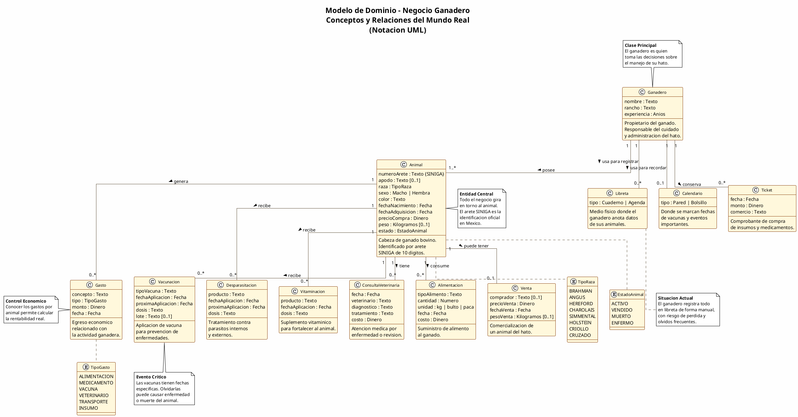
```plantuml
@startuml ModeloDominio
!theme plain
skinparam classAttributeIconSize 0
skinparam classFontSize 12
skinparam packageFontSize 14
skinparam linetype ortho
skinparam backgroundColor #FEFEFE
skinparam class {
    BackgroundColor #FFF8DC
    BorderColor #8B4513
    ArrowColor #5D4E37
}

title Modelo de Dominio - Negocio Ganadero\nConceptos y Relaciones del Mundo Real\n(Notacion UML)

' ========== CLASE PRINCIPAL ==========

class Ganadero {
    nombre : Texto
    rancho : Texto
    experiencia : Anios
    --
    Propietario del ganado.
    Responsable del cuidado
    y administracion del hato.
}

' ========== ENTIDAD CENTRAL ==========

class Animal {
    numeroArete : Texto {SINIGA}
    apodo : Texto [0..1]
    raza : TipoRaza
    sexo : Macho | Hembra
    color : Texto
    fechaNacimiento : Fecha
    fechaAdquisicion : Fecha
    precioCompra : Dinero
    peso : Kilogramos [0..1]
    estado : EstadoAnimal
    --
    Cabeza de ganado bovino.
    Identificado por arete
    SINIGA de 10 digitos.
}

' ========== EVENTOS SANITARIOS ==========

class Vacunacion {
    tipoVacuna : Texto
    fechaAplicacion : Fecha
    proximaAplicacion : Fecha
    dosis : Texto
    lote : Texto [0..1]
    --
    Aplicacion de vacuna
    para prevencion de
    enfermedades.
}

class Desparasitacion {
    producto : Texto
    fechaAplicacion : Fecha
    proximaAplicacion : Fecha
    dosis : Texto
    --
    Tratamiento contra
    parasitos internos
    y externos.
}

class Vitaminacion {
    producto : Texto
    fechaAplicacion : Fecha
    dosis : Texto
    --
    Suplemento vitaminico
    para fortalecer al animal.
}

class ConsultaVeterinaria {
    fecha : Fecha
    veterinario : Texto
    diagnostico : Texto
    tratamiento : Texto
    costo : Dinero
    --
    Atencion medica por
    enfermedad o revision.
}

' ========== REGISTROS ECONOMICOS ==========

class Gasto {
    concepto : Texto
    tipo : TipoGasto
    monto : Dinero
    fecha : Fecha
    --
    Egreso economico
    relacionado con
    la actividad ganadera.
}

class Alimentacion {
    tipoAlimento : Texto
    cantidad : Numero
    unidad : kg | bulto | paca
    fecha : Fecha
    costo : Dinero
    --
    Suministro de alimento
    al ganado.
}

class Venta {
    comprador : Texto [0..1]
    precioVenta : Dinero
    fechaVenta : Fecha
    pesoVenta : Kilogramos [0..1]
    --
    Comercializacion de
    un animal del hato.
}

' ========== HERRAMIENTAS DE REGISTRO ACTUAL ==========

class Libreta {
    tipo : Cuaderno | Agenda
    --
    Medio fisico donde el
    ganadero anota datos
    de sus animales.
}

class Calendario {
    tipo : Pared | Bolsillo
    --
    Donde se marcan fechas
    de vacunas y eventos
    importantes.
}

class Ticket {
    fecha : Fecha
    monto : Dinero
    comercio : Texto
    --
    Comprobante de compra
    de insumos y medicamentos.
}

' ========== ENUMERACIONES ==========

enum TipoRaza {
    BRAHMAN
    ANGUS
    HEREFORD
    CHAROLAIS
    SIMMENTAL
    HOLSTEIN
    CRIOLLO
    CRUZADO
}

enum EstadoAnimal {
    ACTIVO
    VENDIDO
    MUERTO
    ENFERMO
}

enum TipoGasto {
    ALIMENTACION
    MEDICAMENTO
    VACUNA
    VETERINARIO
    TRANSPORTE
    INSUMO
}

' ========== RELACIONES ==========

' Ganadero y sus animales
Ganadero "1" -- "1..*" Animal : posee >

' Ganadero y herramientas de registro
Ganadero "1" -- "0..*" Libreta : usa para registrar >
Ganadero "1" -- "0..1" Calendario : usa para recordar >
Ganadero "1" -- "0..*" Ticket : conserva >

' Animal y eventos sanitarios
Animal "1" -- "0..*" Vacunacion : recibe >
Animal "1" -- "0..*" Desparasitacion : recibe >
Animal "1" -- "0..*" Vitaminacion : recibe >
Animal "1" -- "0..*" ConsultaVeterinaria : tiene >

' Animal y registros economicos
Animal "1" -- "0..*" Gasto : genera >
Animal "1" -- "0..*" Alimentacion : consume >
Animal "1" -- "0..1" Venta : puede tener >

' Enumeraciones
Animal .. TipoRaza
Animal .. EstadoAnimal
Gasto .. TipoGasto

' ========== NOTAS ==========

note top of Ganadero
  **Clase Principal**
  El ganadero es quien
  toma las decisiones sobre
  el manejo de su hato.
end note

note right of Animal
  **Entidad Central**
  Todo el negocio gira
  en torno al animal.
  El arete SINIGA es la
  identificacion oficial
  en Mexico.
end note

note bottom of Vacunacion
  **Evento Critico**
  Las vacunas tienen fechas
  especificas. Olvidarlas
  puede causar enfermedad
  o muerte del animal.
end note

note left of Gasto
  **Control Economico**
  Conocer los gastos por
  animal permite calcular
  la rentabilidad real.
end note

note bottom of Libreta
  **Situacion Actual**
  El ganadero registra todo
  en libreta de forma manual,
  con riesgo de perdida y
  olvidos frecuentes.
end note

@enduml
```

---

## MODELO DE DOMINIO - Vista Simplificada

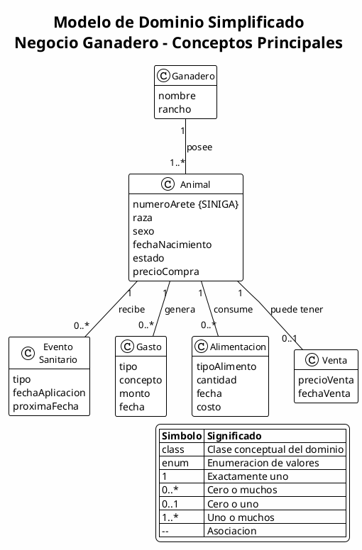
```plantuml
@startuml ModeloDominioSimplificado
!theme plain
skinparam classAttributeIconSize 0
skinparam classFontSize 13
skinparam linetype polyline
skinparam backgroundColor #FEFEFE

title Modelo de Dominio Simplificado\nNegocio Ganadero - Conceptos Principales

hide methods

' ========== CONCEPTOS PRINCIPALES ==========

class Ganadero {
    nombre
    rancho
}

class Animal {
    numeroArete {SINIGA}
    raza
    sexo
    fechaNacimiento
    estado
    precioCompra
}

class "Evento\nSanitario" as EventoSanitario {
    tipo
    fechaAplicacion
    proximaFecha
}

class Gasto {
    tipo
    concepto
    monto
    fecha
}

class Alimentacion {
    tipoAlimento
    cantidad
    fecha
    costo
}

class Venta {
    precioVenta
    fechaVenta
}

' ========== RELACIONES ==========

Ganadero "1" -- "1..*" Animal : posee

Animal "1" -- "0..*" EventoSanitario : recibe
Animal "1" -- "0..*" Gasto : genera
Animal "1" -- "0..*" Alimentacion : consume
Animal "1" -- "0..1" Venta : puede tener

' ========== LEYENDA ==========

legend right
  |= Simbolo |= Significado |
  | class | Clase conceptual del dominio |
  | enum | Enumeracion de valores |
  | 1 | Exactamente uno |
  | 0..* | Cero o muchos |
  | 0..1 | Cero o uno |
  | 1..* | Uno o muchos |
  | -- | Asociacion |
endlegend

@enduml
```

---

## MODELO DE DOMINIO - Diagrama de Objetos (Ejemplo Real)

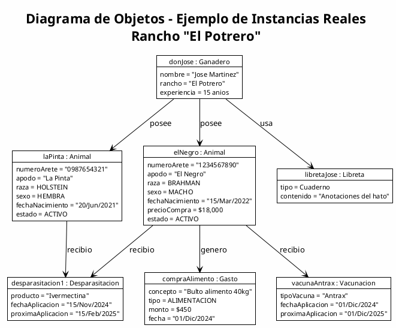
```plantuml
@startuml DiagramaObjetos
!theme plain
skinparam objectFontSize 11
skinparam backgroundColor #FEFEFE

title Diagrama de Objetos - Ejemplo de Instancias Reales\nRancho "El Potrero"

' ========== INSTANCIAS ==========

object "donJose : Ganadero" as g1 {
    nombre = "Jose Martinez"
    rancho = "El Potrero"
    experiencia = 15 anios
}

object "elNegro : Animal" as a1 {
    numeroArete = "1234567890"
    apodo = "El Negro"
    raza = BRAHMAN
    sexo = MACHO
    fechaNacimiento = "15/Mar/2022"
    precioCompra = $18,000
    estado = ACTIVO
}

object "laPinta : Animal" as a2 {
    numeroArete = "0987654321"
    apodo = "La Pinta"
    raza = HOLSTEIN
    sexo = HEMBRA
    fechaNacimiento = "20/Jun/2021"
    estado = ACTIVO
}

object "vacunaAntrax : Vacunacion" as v1 {
    tipoVacuna = "Antrax"
    fechaAplicacion = "01/Dic/2024"
    proximaAplicacion = "01/Dic/2025"
}

object "desparasitacion1 : Desparasitacion" as d1 {
    producto = "Ivermectina"
    fechaAplicacion = "15/Nov/2024"
    proximaAplicacion = "15/Feb/2025"
}

object "compraAlimento : Gasto" as ga1 {
    concepto = "Bulto alimento 40kg"
    tipo = ALIMENTACION
    monto = $450
    fecha = "01/Dic/2024"
}

object "libretaJose : Libreta" as lib {
    tipo = Cuaderno
    contenido = "Anotaciones del hato"
}

' ========== ENLACES ==========

g1 --> a1 : posee
g1 --> a2 : posee
g1 --> lib : usa

a1 --> v1 : recibio
a1 --> d1 : recibio
a1 --> ga1 : genero

a2 --> d1 : recibio

@enduml
```

---

## MODELO DE DOMINIO - Problemas de la Gestion Manual

```plantuml
@startuml ProblemasGestionManual
!theme plain
skinparam classAttributeIconSize 0
skinparam classFontSize 12
skinparam backgroundColor #FEFEFE
skinparam class {
    BackgroundColor #FFE4E1
    BorderColor #DC143C
}

title Problematica Actual - Gestion Ganadera Manual\n(Justificacion del Sistema AgroApp)

' ========== PROBLEMAS PRINCIPALES ==========

package "Problemas de Registro" <<Rectangle>> #FFF0F0 {
    
    class "Registros\nIncompletos" as P1 <<Problema>> {
        descripcion : "Datos faltantes"
        frecuencia : Alta
        --
        El ganadero olvida anotar
        informacion importante como
        fechas, precios o tratamientos.
    }
    
    class "Informacion\nDesorganizada" as P2 <<Problema>> {
        descripcion : "Sin estructura"
        frecuencia : Alta
        --
        Anotaciones dispersas en
        diferentes paginas sin
        orden cronologico.
    }
    
    class "Letra\nIlegible" as P3 <<Problema>> {
        descripcion : "Dificil lectura"
        frecuencia : Media
        --
        Con el tiempo, la propia
        escritura se vuelve
        dificil de descifrar.
    }
}

package "Problemas de Memoria" <<Rectangle>> #FFFAF0 {
    
    class "Olvido de\nVacunacion" as P4 <<Problema>> {
        impacto : Critico
        consecuencia : Enfermedad
        --
        No recordar cuando toca
        la proxima vacuna pone
        en riesgo la salud del hato.
    }
    
    class "Olvido de\nDesparasitacion" as P5 <<Problema>> {
        impacto : Alto
        consecuencia : Bajo peso
        --
        Parasitos reducen el
        rendimiento y peso
        del animal.
    }
    
    class "Confision de\nFechas" as P6 <<Problema>> {
        impacto : Medio
        consecuencia : Desorden
        --
        Mezclar fechas de diferentes
        animales o eventos.
    }
}

package "Problemas Economicos" <<Rectangle>> #F0FFF0 {
    
    class "Sin Control\nde Gastos" as P7 <<Problema>> {
        impacto : Alto
        consecuencia : Perdidas
        --
        No saber cuanto se ha
        invertido en cada animal
        ni el total de gastos.
    }
    
    class "Calculo Manual\nde Ganancias" as P8 <<Problema>> {
        impacto : Alto
        consecuencia : Errores
        --
        Sumar y restar a mano
        genera errores en el
        calculo de rentabilidad.
    }
    
    class "Tickets\nPerdidos" as P9 <<Problema>> {
        impacto : Medio
        consecuencia : Sin comprobantes
        --
        Comprobantes de compra
        extraviados o deteriorados.
    }
}

package "Problemas de Conservacion" <<Rectangle>> #F0F8FF {
    
    class "Libreta\nDeteriorada" as P10 <<Problema>> {
        causa : Agua, uso, tiempo
        consecuencia : Perdida total
        --
        La libreta se moja, rompe
        o deteriora perdiendo
        toda la informacion.
    }
    
    class "Sin\nRespaldo" as P11 <<Problema>> {
        causa : Medio fisico
        consecuencia : Irrecuperable
        --
        No existe copia de la
        informacion. Si se pierde,
        no hay forma de recuperar.
    }
}

' ========== CONSECUENCIAS ==========

class "CONSECUENCIAS" as Conseq <<Resultado>> #FF6347 {
    --
    - Muerte de animales por falta de vacunas
    - Perdidas economicas no detectadas
    - Desconocimiento de rentabilidad real
    - Estres y preocupacion del ganadero
    - Decisiones basadas en informacion incompleta
}

' ========== RELACIONES ==========

P1 --> Conseq
P2 --> Conseq
P4 --> Conseq
P5 --> Conseq
P7 --> Conseq
P8 --> Conseq
P10 --> Conseq
P11 --> Conseq

@enduml
```

---

# DIAGRAMA 3: DIAGRAMA ENTIDAD-RELACIÓN
## Notación UML Estándar - Base de Datos del Sistema AgroApp

> **Nota:** Este diagrama representa la estructura de la base de datos SQLite.
> En UML, las claves foráneas se representan mediante **asociaciones** entre clases,
> no como atributos. La cardinalidad indica la multiplicidad de la relación.

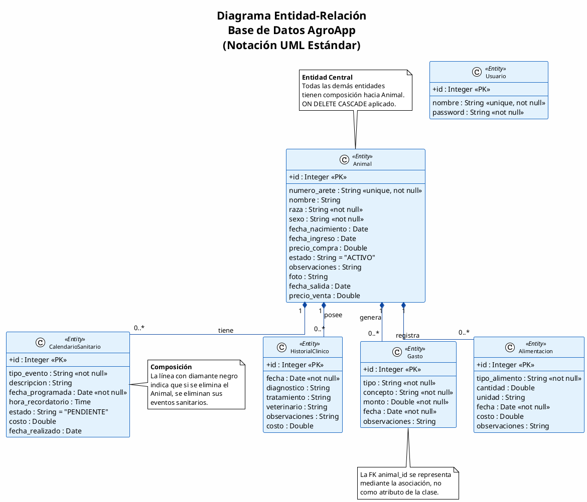
```plantuml
@startuml DiagramaEntidadRelacion
!theme plain
skinparam classAttributeIconSize 0
skinparam classFontSize 11
skinparam packageFontSize 13
skinparam linetype ortho
skinparam backgroundColor #FEFEFE

skinparam class {
    BackgroundColor #E3F2FD
    BorderColor #1565C0
    ArrowColor #0D47A1
}

title Diagrama Entidad-Relación\nBase de Datos AgroApp\n(Notación UML Estándar)

' ========================================
' ENTIDADES
' ========================================

class Usuario <<Entity>> {
    + id : Integer <<PK>>
    --
    nombre : String <<unique, not null>>
    password : String <<not null>>
}

class Animal <<Entity>> {
    + id : Integer <<PK>>
    --
    numero_arete : String <<unique, not null>>
    nombre : String
    raza : String <<not null>>
    sexo : String <<not null>>
    fecha_nacimiento : Date
    fecha_ingreso : Date
    precio_compra : Double
    estado : String = "ACTIVO"
    observaciones : String
    foto : String
    fecha_salida : Date
    precio_venta : Double
}

class CalendarioSanitario <<Entity>> {
    + id : Integer <<PK>>
    --
    tipo_evento : String <<not null>>
    descripcion : String
    fecha_programada : Date <<not null>>
    hora_recordatorio : Time
    estado : String = "PENDIENTE"
    costo : Double
    fecha_realizado : Date
}

class HistorialClinico <<Entity>> {
    + id : Integer <<PK>>
    --
    fecha : Date <<not null>>
    diagnostico : String
    tratamiento : String
    veterinario : String
    observaciones : String
    costo : Double
}

class Gasto <<Entity>> {
    + id : Integer <<PK>>
    --
    tipo : String <<not null>>
    concepto : String <<not null>>
    monto : Double <<not null>>
    fecha : Date <<not null>>
    observaciones : String
}

class Alimentacion <<Entity>> {
    + id : Integer <<PK>>
    --
    tipo_alimento : String <<not null>>
    cantidad : Double
    unidad : String
    fecha : Date <<not null>>
    costo : Double
    observaciones : String
}

' ========================================
' ASOCIACIONES (Representan Foreign Keys)
' ========================================

Animal "1" *-- "0..*" CalendarioSanitario : tiene
Animal "1" *-- "0..*" HistorialClinico : posee
Animal "1" *-- "0..*" Gasto : genera
Animal "1" *-- "0..*" Alimentacion : registra

' ========================================
' NOTAS UML
' ========================================

note top of Animal
  **Entidad Central**
  Todas las demás entidades
  tienen composición hacia Animal.
  ON DELETE CASCADE aplicado.
end note

note right of CalendarioSanitario
  **Composición**
  La línea con diamante negro
  indica que si se elimina el
  Animal, se eliminan sus
  eventos sanitarios.
end note

note bottom of Gasto
  La FK animal_id se representa
  mediante la asociación, no
  como atributo de la clase.
end note

@enduml
```

---

## DIAGRAMA 3.1: DIAGRAMA E-R CON ASOCIACIONES NAVEGABLES

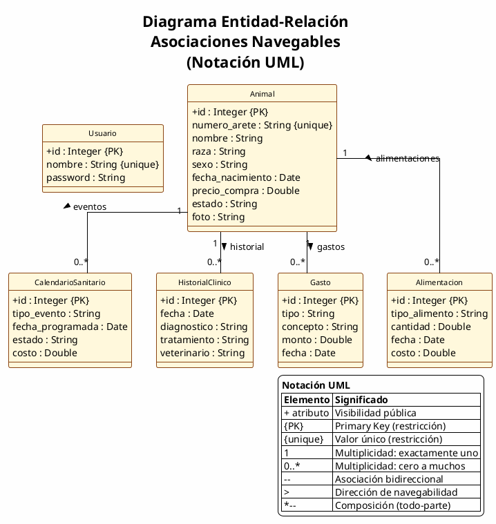
```plantuml
@startuml DiagramaERNavegable
!theme plain
skinparam classAttributeIconSize 0
skinparam classFontSize 11
skinparam linetype ortho
skinparam backgroundColor #FEFEFE

skinparam class {
    BackgroundColor #FFF8DC
    BorderColor #8B4513
}

title Diagrama Entidad-Relación\nAsociaciones Navegables\n(Notación UML)

hide circle

' ========================================
' ENTIDADES CON ATRIBUTOS CLAVE
' ========================================

class Usuario {
    + id : Integer {PK}
    nombre : String {unique}
    password : String
}

class Animal {
    + id : Integer {PK}
    numero_arete : String {unique}
    nombre : String
    raza : String
    sexo : String
    fecha_nacimiento : Date
    precio_compra : Double
    estado : String
    foto : String
}

class CalendarioSanitario {
    + id : Integer {PK}
    tipo_evento : String
    fecha_programada : Date
    estado : String
    costo : Double
}

class HistorialClinico {
    + id : Integer {PK}
    fecha : Date
    diagnostico : String
    tratamiento : String
    veterinario : String
}

class Gasto {
    + id : Integer {PK}
    tipo : String
    concepto : String
    monto : Double
    fecha : Date
}

class Alimentacion {
    + id : Integer {PK}
    tipo_alimento : String
    cantidad : Double
    fecha : Date
    costo : Double
}

' ========================================
' ASOCIACIONES CON NOMBRES DE ROL
' ========================================

Animal "1" -- "0..*" CalendarioSanitario : eventos >
Animal "1" -- "0..*" HistorialClinico : historial >
Animal "1" -- "0..*" Gasto : gastos >
Animal "1" -- "0..*" Alimentacion : alimentaciones >

' ========================================
' LEYENDA UML ESTÁNDAR
' ========================================

legend right
  **Notación UML**
  |= Elemento |= Significado |
  | + atributo | Visibilidad pública |
  | {PK} | Primary Key (restricción) |
  | {unique} | Valor único (restricción) |
  | 1 | Multiplicidad: exactamente uno |
  | 0..* | Multiplicidad: cero a muchos |
  | -- | Asociación bidireccional |
  | > | Dirección de navegabilidad |
  | *-- | Composición (todo-parte) |
endlegend

@enduml
```

---

## DIAGRAMA 3.2: MODELO FÍSICO DE DATOS

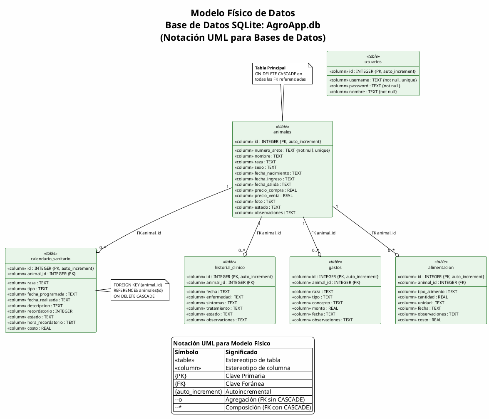
```plantuml
@startuml ModeloFisico
!theme plain
skinparam backgroundColor #FEFEFE
skinparam defaultFontSize 10

skinparam class {
    BackgroundColor #E8F5E9
    BorderColor #2E7D32
}

title Modelo Físico de Datos\nBase de Datos SQLite: AgroApp.db\n(Notación UML para Bases de Datos)

hide circle

' ========================================
' TABLAS COMO CLASES CON ESTEREOTIPO
' ========================================

class usuarios <<table>> {
    «column» id : INTEGER {PK, auto_increment}
    --
    «column» username : TEXT {not null, unique}
    «column» password : TEXT {not null}
    «column» nombre : TEXT {not null}
}

class animales <<table>> {
    «column» id : INTEGER {PK, auto_increment}
    --
    «column» numero_arete : TEXT {not null, unique}
    «column» nombre : TEXT
    «column» raza : TEXT
    «column» sexo : TEXT
    «column» fecha_nacimiento : TEXT
    «column» fecha_ingreso : TEXT
    «column» fecha_salida : TEXT
    «column» precio_compra : REAL
    «column» precio_venta : REAL
    «column» foto : TEXT
    «column» estado : TEXT
    «column» observaciones : TEXT
}

class calendario_sanitario <<table>> {
    «column» id : INTEGER {PK, auto_increment}
    «column» animal_id : INTEGER {FK}
    --
    «column» raza : TEXT
    «column» tipo : TEXT
    «column» fecha_programada : TEXT
    «column» fecha_realizada : TEXT
    «column» descripcion : TEXT
    «column» recordatorio : INTEGER
    «column» estado : TEXT
    «column» hora_recordatorio : TEXT
    «column» costo : REAL
}

class historial_clinico <<table>> {
    «column» id : INTEGER {PK, auto_increment}
    «column» animal_id : INTEGER {FK}
    --
    «column» fecha : TEXT
    «column» enfermedad : TEXT
    «column» sintomas : TEXT
    «column» tratamiento : TEXT
    «column» estado : TEXT
    «column» observaciones : TEXT
}

class gastos <<table>> {
    «column» id : INTEGER {PK, auto_increment}
    «column» animal_id : INTEGER {FK}
    --
    «column» raza : TEXT
    «column» tipo : TEXT
    «column» concepto : TEXT
    «column» monto : REAL
    «column» fecha : TEXT
    «column» observaciones : TEXT
}

class alimentacion <<table>> {
    «column» id : INTEGER {PK, auto_increment}
    «column» animal_id : INTEGER {FK}
    --
    «column» tipo_alimento : TEXT
    «column» cantidad : REAL
    «column» unidad : TEXT
    «column» fecha : TEXT
    «column» observaciones : TEXT
    «column» costo : REAL
}

' ========================================
' RELACIONES FK (Referencias)
' ========================================

animales "1" --o "0..*" calendario_sanitario : FK animal_id
animales "1" --o "0..*" historial_clinico : FK animal_id
animales "1" --o "0..*" gastos : FK animal_id
animales "1" --o "0..*" alimentacion : FK animal_id

' ========================================
' NOTAS
' ========================================

note top of animales
  **Tabla Principal**
  ON DELETE CASCADE en
  todas las FK referenciadas
end note

note right of calendario_sanitario
  FOREIGN KEY (animal_id)
  REFERENCES animales(id)
  ON DELETE CASCADE
end note

' ========================================
' LEYENDA
' ========================================

legend bottom
  **Notación UML para Modelo Físico**
  |= Símbolo |= Significado |
  | <<table>> | Estereotipo de tabla |
  | «column» | Estereotipo de columna |
  | {PK} | Clave Primaria |
  | {FK} | Clave Foránea |
  | {auto_increment} | Autoincremental |
  | --o | Agregación (FK sin CASCADE) |
  | --* | Composición (FK con CASCADE) |
endlegend

@enduml
```

---

# DIAGRAMA 1: DIAGRAMA DE CONTEXTO DEL SISTEMA
## Nivel 0 - Vista de Alto Nivel

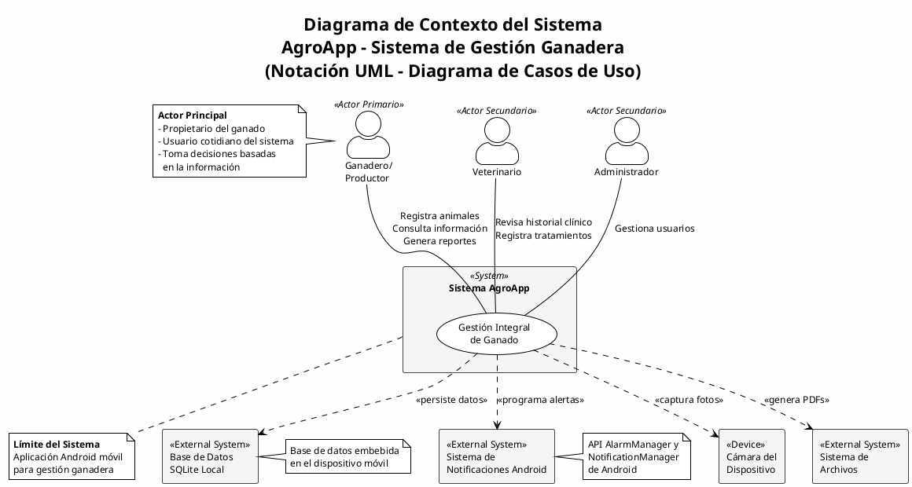
```plantuml
@startuml DiagramaContexto
!theme plain
skinparam actorStyle awesome
skinparam packageStyle rectangle
skinparam defaultFontSize 12
skinparam backgroundColor #FEFEFE
skinparam rectangleBorderColor #444444
skinparam rectangleBackgroundColor #F5F5F5

title Diagrama de Contexto del Sistema\nAgroApp - Sistema de Gestión Ganadera\n(Notación UML - Diagrama de Casos de Uso)

' ========== ACTORES PRIMARIOS (Izquierda) ==========
actor "Ganadero/\nProductor" as Usuario <<Actor Primario>>
actor "Veterinario" as Veterinario <<Actor Secundario>>
actor "Administrador" as Admin <<Actor Secundario>>

' ========== LÍMITE DEL SISTEMA (Centro) ==========
rectangle "Sistema AgroApp" as SistemaLimite <<System>> {
    usecase "Gestión Integral\nde Ganado" as UC_Principal
}

' ========== ACTORES SECUNDARIOS - SISTEMAS EXTERNOS (Derecha) ==========
rectangle "<<External System>>\nBase de Datos\nSQLite Local" as BD
rectangle "<<External System>>\nSistema de\nNotificaciones Android" as Notif
rectangle "<<Device>>\nCámara del\nDispositivo" as Camara
rectangle "<<External System>>\nSistema de\nArchivos" as Archivos

' ========== RELACIONES ACTORES HUMANOS - SISTEMA ==========
' Líneas de asociación sólidas (sin punta de flecha para actores primarios)
Usuario -- UC_Principal : Registra animales\nConsulta información\nGenera reportes

Veterinario -- UC_Principal : Revisa historial clínico\nRegistra tratamientos

Admin -- UC_Principal : Gestiona usuarios

' ========== RELACIONES SISTEMA - ACTORES EXTERNOS ==========
' Dependencias dirigidas del sistema hacia los sistemas externos
UC_Principal ..> BD : <<persiste datos>>
UC_Principal ..> Notif : <<programa alertas>>
UC_Principal ..> Camara : <<captura fotos>>
UC_Principal ..> Archivos : <<genera PDFs>>

' ========== NOTAS ==========
note left of Usuario
  **Actor Principal**
  - Propietario del ganado
  - Usuario cotidiano del sistema
  - Toma decisiones basadas
    en la información
end note

note bottom of SistemaLimite
  **Límite del Sistema**
  Aplicación Android móvil
  para gestión ganadera
end note

note right of BD
  Base de datos embebida
  en el dispositivo móvil
end note

note right of Notif
  API AlarmManager y
  NotificationManager
  de Android
end note

@enduml
```

---

## DIAGRAMA DE CONTEXTO DETALLADO - CON FLUJOS DE DATOS

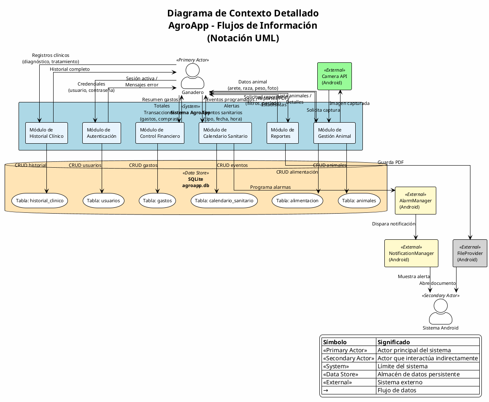
```plantuml
@startuml DiagramaContextoDetallado
!theme plain
skinparam actorStyle awesome
skinparam packageStyle rectangle
skinparam defaultFontSize 11
skinparam backgroundColor #FEFEFE
skinparam linetype ortho

title Diagrama de Contexto Detallado\nAgroApp - Flujos de Información\n(Notación UML)

' ========== ACTORES ==========
actor "Ganadero" as Ganadero <<Primary Actor>>
actor "Sistema Android" as Android <<Secondary Actor>>

' ========== SISTEMA ==========
rectangle "Sistema AgroApp" as AgroApp <<System>> #ADD8E6 {
    
    rectangle "Módulo de\nAutenticación" as ModAuth #E8F4FD
    rectangle "Módulo de\nGestión Animal" as ModAnimal #E8F4FD
    rectangle "Módulo de\nCalendario Sanitario" as ModCalendario #E8F4FD
    rectangle "Módulo de\nControl Financiero" as ModFinanzas #E8F4FD
    rectangle "Módulo de\nReportes" as ModReportes #E8F4FD
    rectangle "Módulo de\nHistorial Clínico" as ModHistorial #E8F4FD
}

' ========== ALMACENES DE DATOS ==========
database "SQLite\nagroapp.db" as SQLite <<Data Store>> #FFE4B5 {
    storage "Tabla: usuarios" as TUsuarios
    storage "Tabla: animales" as TAnimales
    storage "Tabla: calendario_sanitario" as TCalendario
    storage "Tabla: gastos" as TGastos
    storage "Tabla: historial_clinico" as THistorial
    storage "Tabla: alimentacion" as TAlimentacion
}

' ========== SISTEMAS EXTERNOS ==========
rectangle "AlarmManager\n(Android)" as AlarmManager <<External>> #FFFACD
rectangle "NotificationManager\n(Android)" as NotifManager <<External>> #FFFACD
rectangle "Camera API\n(Android)" as CameraAPI <<External>> #98FB98
rectangle "FileProvider\n(Android)" as FileProvider <<External>> #D3D3D3

' ========== FLUJOS ENTRADA (ACTOR -> SISTEMA) ==========
Ganadero -down-> ModAuth : Credenciales\n(usuario, contraseña)
Ganadero -down-> ModAnimal : Datos animal\n(arete, raza, peso, foto)
Ganadero -down-> ModCalendario : Eventos sanitarios\n(tipo, fecha, hora)
Ganadero -down-> ModFinanzas : Transacciones\n(gastos, compras)
Ganadero -down-> ModHistorial : Registros clínicos\n(diagnóstico, tratamiento)
Ganadero -down-> ModReportes : Solicitud reportes\n(filtros, período)

' ========== FLUJOS SALIDA (SISTEMA -> ACTOR) ==========
ModAuth -up-> Ganadero : Sesión activa /\nMensajes error
ModAnimal -up-> Ganadero : Lista animales /\nDetalles
ModCalendario -up-> Ganadero : Eventos programados /\nAlertas
ModFinanzas -up-> Ganadero : Resumen gastos /\nTotales
ModHistorial -up-> Ganadero : Historial completo
ModReportes -up-> Ganadero : Reportes PDF /\nEstadísticas

' ========== FLUJOS SISTEMA -> BASE DE DATOS ==========
ModAuth --> TUsuarios : CRUD usuarios
ModAnimal --> TAnimales : CRUD animales
ModCalendario --> TCalendario : CRUD eventos
ModFinanzas --> TGastos : CRUD gastos
ModHistorial --> THistorial : CRUD historial
ModAnimal --> TAlimentacion : CRUD alimentación

' ========== FLUJOS SISTEMA -> ANDROID ==========
ModCalendario --> AlarmManager : Programa alarmas
AlarmManager --> NotifManager : Dispara notificación
NotifManager --> Android : Muestra alerta

ModAnimal --> CameraAPI : Solicita captura
CameraAPI --> ModAnimal : Imagen capturada

ModReportes --> FileProvider : Guarda PDF
FileProvider --> Android : Abre documento

' ========== LEYENDA ==========
legend right
  |= Símbolo |= Significado |
  | <<Primary Actor>> | Actor principal del sistema |
  | <<Secondary Actor>> | Actor que interactúa indirectamente |
  | <<System>> | Límite del sistema |
  | <<Data Store>> | Almacén de datos persistente |
  | <<External>> | Sistema externo |
  | → | Flujo de datos |
endlegend

@enduml
```

---

## DIAGRAMA DE CONTEXTO - CASOS DE USO DE ALTO NIVEL

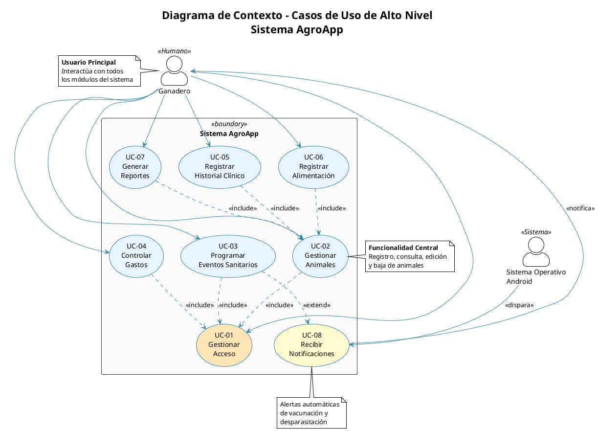
```plantuml
@startuml DiagramaContextoCasosUso
!theme plain
skinparam actorStyle awesome
skinparam usecase {
    BackgroundColor #E8F4FD
    BorderColor #2E86AB
    ArrowColor #2E86AB
}
skinparam rectangle {
    BackgroundColor #FAFAFA
    BorderColor #333333
}

title Diagrama de Contexto - Casos de Uso de Alto Nivel\nSistema AgroApp

' ========== ACTORES ==========
actor "Ganadero" as Ganadero <<Humano>>
actor "Sistema Operativo\nAndroid" as SO <<Sistema>>

' ========== LÍMITE DEL SISTEMA ==========
rectangle "Sistema AgroApp" <<boundary>> {
    
    ' --- Autenticación ---
    usecase "UC-01\nGestionar\nAcceso" as UC01 #FFE4B5
    
    ' --- Gestión de Animales ---
    usecase "UC-02\nGestionar\nAnimales" as UC02
    
    ' --- Calendario Sanitario ---
    usecase "UC-03\nProgramar\nEventos Sanitarios" as UC03
    
    ' --- Control Financiero ---
    usecase "UC-04\nControlar\nGastos" as UC04
    
    ' --- Historial Clínico ---
    usecase "UC-05\nRegistrar\nHistorial Clínico" as UC05
    
    ' --- Alimentación ---
    usecase "UC-06\nRegistrar\nAlimentación" as UC06
    
    ' --- Reportes ---
    usecase "UC-07\nGenerar\nReportes" as UC07
    
    ' --- Notificaciones ---
    usecase "UC-08\nRecibir\nNotificaciones" as UC08 #FFFACD
}

' ========== RELACIONES GANADERO ==========
Ganadero --> UC01
Ganadero --> UC02
Ganadero --> UC03
Ganadero --> UC04
Ganadero --> UC05
Ganadero --> UC06
Ganadero --> UC07
Ganadero <-- UC08 : <<notifica>>

' ========== RELACIONES SISTEMA OPERATIVO ==========
SO --> UC08 : <<dispara>>

' ========== RELACIONES ENTRE CASOS DE USO ==========
UC02 ..> UC01 : <<include>>
UC03 ..> UC01 : <<include>>
UC04 ..> UC01 : <<include>>
UC05 ..> UC02 : <<include>>
UC06 ..> UC02 : <<include>>
UC07 ..> UC02 : <<include>>
UC03 ..> UC08 : <<extend>>

' ========== NOTAS ==========
note right of UC02
  **Funcionalidad Central**
  Registro, consulta, edición
  y baja de animales
end note

note bottom of UC08
  Alertas automáticas
  de vacunación y
  desparasitación
end note

note left of Ganadero
  **Usuario Principal**
  Interactúa con todos
  los módulos del sistema
end note

@enduml
```

---

## DIAGRAMA DE CONTEXTO - COMPONENTES Y DEPENDENCIAS

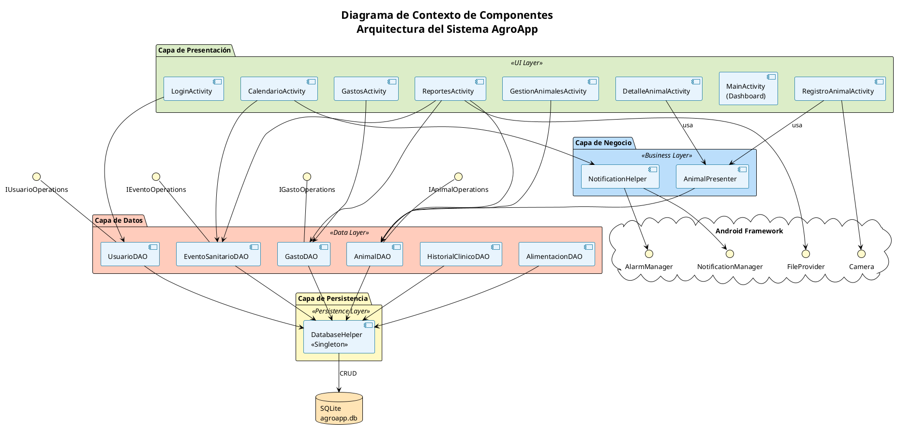
```plantuml
@startuml DiagramaContextoComponentes
!theme plain
skinparam component {
    BackgroundColor #E8F4FD
    BorderColor #2E86AB
}
skinparam interface {
    BackgroundColor #FFFACD
}
skinparam database {
    BackgroundColor #FFE4B5
}

title Diagrama de Contexto de Componentes\nArquitectura del Sistema AgroApp

' ========== CAPA DE PRESENTACIÓN ==========
package "Capa de Presentación" <<UI Layer>> #DCEDC8 {
    component [LoginActivity] as Login
    component [MainActivity\n(Dashboard)] as Main
    component [GestionAnimalesActivity] as GestionAnim
    component [RegistroAnimalActivity] as RegAnimal
    component [DetalleAnimalActivity] as DetAnimal
    component [CalendarioActivity] as Calendario
    component [GastosActivity] as Gastos
    component [ReportesActivity] as Reportes
}

' ========== CAPA DE LÓGICA DE NEGOCIO ==========
package "Capa de Negocio" <<Business Layer>> #BBDEFB {
    component [AnimalPresenter] as Presenter
    component [NotificationHelper] as NotifHelper
}

' ========== CAPA DE ACCESO A DATOS ==========
package "Capa de Datos" <<Data Layer>> #FFCCBC {
    component [AnimalDAO] as AnimalDAO
    component [UsuarioDAO] as UsuarioDAO
    component [EventoSanitarioDAO] as EventoDAO
    component [GastoDAO] as GastoDAO
    component [HistorialClinicoDAO] as HistorialDAO
    component [AlimentacionDAO] as AlimDAO
}

' ========== CAPA DE PERSISTENCIA ==========
package "Capa de Persistencia" <<Persistence Layer>> #FFF9C4 {
    component [DatabaseHelper\n<<Singleton>>] as DBHelper
}

' ========== RECURSOS EXTERNOS ==========
database "SQLite\nagroapp.db" as DB

cloud "Android Framework" as Android {
    interface "AlarmManager" as IAlarm
    interface "NotificationManager" as INotif
    interface "Camera" as ICam
    interface "FileProvider" as IFile
}

' ========== INTERFACES PROPORCIONADAS ==========
interface "IAnimalOperations" as IAnimal
interface "IUsuarioOperations" as IUsuario
interface "IEventoOperations" as IEvento
interface "IGastoOperations" as IGasto

' ========== CONEXIONES PRESENTACIÓN -> NEGOCIO ==========
RegAnimal --> Presenter : usa
DetAnimal --> Presenter : usa

' ========== CONEXIONES PRESENTACIÓN -> DATOS ==========
Login --> UsuarioDAO
GestionAnim --> AnimalDAO
Calendario --> EventoDAO
Gastos --> GastoDAO
Reportes --> AnimalDAO
Reportes --> GastoDAO
Reportes --> EventoDAO

' ========== CONEXIONES NEGOCIO -> DATOS ==========
Presenter --> AnimalDAO
NotifHelper --> IAlarm
NotifHelper --> INotif

' ========== CONEXIONES DATOS -> PERSISTENCIA ==========
AnimalDAO --> DBHelper
UsuarioDAO --> DBHelper
EventoDAO --> DBHelper
GastoDAO --> DBHelper
HistorialDAO --> DBHelper
AlimDAO --> DBHelper

' ========== CONEXIONES PERSISTENCIA -> BD ==========
DBHelper --> DB : CRUD

' ========== INTERFACES EXPUESTAS ==========
AnimalDAO -up- IAnimal
UsuarioDAO -up- IUsuario
EventoDAO -up- IEvento
GastoDAO -up- IGasto

' ========== CONEXIONES A ANDROID ==========
Calendario --> NotifHelper
RegAnimal --> ICam
Reportes --> IFile

@enduml
```

---

# DIAGRAMA 5: DIAGRAMA DE CLASES DEL SISTEMA
## Dividido por Capas para Mejor Visualización

---

## DIAGRAMA 5.1: CAPA DE PRESENTACIÓN - ACTIVITIES PRINCIPALES

```plantuml
@startuml CapaPresentacionPrincipal
!theme plain
skinparam classAttributeIconSize 0
skinparam classFontSize 11
skinparam packageFontSize 13

title Diagrama 5.1 - Capa de Presentación (Activities Principales)\nSistema AgroApp

package "Capa de Presentación - Core" <<Frame>> {
    
    abstract class BaseActivity <<Activity>> {
        - SESSION_TIMEOUT: long = 10000
        - lastInteractionTime: long
        - sessionHandler: Handler
        - sessionRunnable: Runnable
        - isSessionActive: boolean
        --
        # onCreate(savedInstanceState: Bundle): void
        # onResume(): void
        # onPause(): void
        # onUserInteraction(): void
        - startSessionTimer(): void
        - stopSessionTimer(): void
        - showPasswordDialog(): void
        - validatePassword(password: String): void
        # getSessionTimeout(): long
    }

    class LoginActivity <<Activity>> {
        - etUsuario: EditText
        - etPassword: EditText
        - btnLogin: Button
        - btnRegistrar: Button
        - usuarioDAO: UsuarioDAO
        --
        # onCreate(savedInstanceState: Bundle): void
        - initViews(): void
        - setupListeners(): void
        - validarCredenciales(): void
        - registrarUsuario(): void
        - navegarAMain(): void
    }

    class MainActivity <<Activity>> {
        - tvBienvenida: TextView
        - cardAnimales: CardView
        - cardCalendario: CardView
        - cardGastos: CardView
        - cardReportes: CardView
        - cardRecomendaciones: CardView
        - nombreUsuario: String
        --
        # onCreate(savedInstanceState: Bundle): void
        - initViews(): void
        - setupNavigationCards(): void
        - cargarDatosUsuario(): void
        - navegarAGestionAnimales(): void
        - navegarACalendario(): void
        - navegarAGastos(): void
        - navegarAReportes(): void
        - cerrarSesion(): void
    }

    class GestionAnimalesActivity <<Activity>> {
        - recyclerView: RecyclerView
        - adapter: AnimalAdapter
        - animalDAO: AnimalDAO
        - fabAgregar: FloatingActionButton
        - searchView: SearchView
        - listaAnimales: List<Animal>
        --
        # onCreate(savedInstanceState: Bundle): void
        # onResume(): void
        - initViews(): void
        - setupRecyclerView(): void
        - cargarAnimales(): void
        - filtrarAnimales(query: String): void
        - navegarARegistro(): void
        - navegarADetalle(animal: Animal): void
    }

    class RegistroAnimalActivity <<Activity>> {
        - etArete: EditText
        - spinnerRaza: Spinner
        - spinnerSexo: Spinner
        - etFechaNacimiento: EditText
        - etFechaIngreso: EditText
        - etPrecioCompra: EditText
        - spinnerEstado: Spinner
        - ivFoto: ImageView
        - btnGuardar: Button
        - presenter: AnimalPresenter
        - modoEdicion: boolean
        --
        # onCreate(savedInstanceState: Bundle): void
        - initViews(): void
        - setupDatePickers(): void
        - setupSpinners(): void
        - validarCampos(): boolean
        - validarAreteSINIGA(arete: String): boolean
        - guardarAnimal(): void
        + onAnimalGuardado(id: long): void
        + onError(mensaje: String): void
    }

    class DetalleAnimalActivity <<Activity>> {
        - animal: Animal
        - animalDAO: AnimalDAO
        - gastoDAO: GastoDAO
        - tvArete: TextView
        - tvEstado: TextView
        - ivFoto: ImageView
        - tvInversion: TextView
        - btnEditar: Button
        - btnVender: Button
        - btnEliminar: Button
        --
        # onCreate(savedInstanceState: Bundle): void
        - cargarDatosAnimal(): void
        - calcularInversion(): double
        - calcularEdad(): String
        - mostrarDialogoVenta(): void
        - registrarVenta(precio: double): void
        - eliminarAnimal(): void
    }
}

' Relaciones de herencia
BaseActivity <|-- LoginActivity
BaseActivity <|-- MainActivity
BaseActivity <|-- GestionAnimalesActivity
BaseActivity <|-- RegistroAnimalActivity
BaseActivity <|-- DetalleAnimalActivity

' Navegación
LoginActivity ..> MainActivity : navega
MainActivity ..> GestionAnimalesActivity : navega
GestionAnimalesActivity ..> RegistroAnimalActivity : navega
GestionAnimalesActivity ..> DetalleAnimalActivity : navega
DetalleAnimalActivity ..> RegistroAnimalActivity : editar

@enduml
```

---

## DIAGRAMA 5.2: CAPA DE PRESENTACIÓN - ACTIVITIES SECUNDARIAS

```plantuml
@startuml CapaPresentacionSecundaria
!theme plain
skinparam classAttributeIconSize 0
skinparam classFontSize 11
skinparam packageFontSize 13

title Diagrama 5.2 - Capa de Presentación (Activities Secundarias)\nSistema AgroApp

package "Capa de Presentación - Módulos" <<Frame>> {
    
    abstract class BaseActivity <<Activity>> {
        # onCreate(savedInstanceState: Bundle): void
        # onResume(): void
        # onPause(): void
        # getSessionTimeout(): long
    }

    class CalendarioActivity <<Activity>> {
        - recyclerView: RecyclerView
        - adapter: EventoSanitarioAdapter
        - eventoDAO: EventoSanitarioDAO
        - fabAgregar: FloatingActionButton
        - spinnerFiltroRaza: Spinner
        - listaEventos: List<EventoSanitario>
        --
        # onCreate(savedInstanceState: Bundle): void
        - cargarEventos(): void
        - filtrarPorRaza(raza: String): void
        - mostrarDialogoNuevoEvento(): void
        - programarNotificaciones(): void
        - marcarComoRealizado(): void
    }

    class EventosSanitariosActivity <<Activity>> {
        - animalId: int
        - recyclerView: RecyclerView
        - adapter: EventoSanitarioAdapter
        - eventoDAO: EventoSanitarioDAO
        --
        # onCreate(savedInstanceState: Bundle): void
        - cargarEventosAnimal(): void
        - agregarEvento(): void
    }

    class GastosActivity <<Activity>> {
        - recyclerView: RecyclerView
        - adapter: GastoAdapter
        - gastoDAO: GastoDAO
        - fabAgregar: FloatingActionButton
        - spinnerFiltroAnimal: Spinner
        - tvTotalGastos: TextView
        - animalIdFiltro: int
        --
        # onCreate(savedInstanceState: Bundle): void
        - cargarGastos(): void
        - calcularTotal(): void
        - filtrarPorAnimal(animalId: int): void
        - eliminarGasto(gasto: Gasto): void
    }

    class RegistroComprasActivity <<Activity>> {
        - etNombreCompra: EditText
        - etPrecioTotal: EditText
        - spinnerTipo: Spinner
        - checkBoxes: List<CheckBox>
        - tvPrecioPorAnimal: TextView
        - btnRegistrar: Button
        --
        # onCreate(savedInstanceState: Bundle): void
        - cargarAnimales(): void
        - calcularPrecioPorAnimal(): void
        - validarCampos(): boolean
        - registrarCompraDividida(): void
    }

    class AlimentacionActivity <<Activity>> {
        - animalId: int
        - recyclerView: RecyclerView
        - adapter: AlimentacionAdapter
        - alimentacionDAO: AlimentacionDAO
        --
        # onCreate(savedInstanceState: Bundle): void
        - cargarRegistros(): void
        - registrarAlimentacion(): void
    }

    class HistorialClinicoActivity <<Activity>> {
        - animalId: int
        - recyclerView: RecyclerView
        - adapter: HistorialClinicoAdapter
        - historialDAO: HistorialClinicoDAO
        --
        # onCreate(savedInstanceState: Bundle): void
        - cargarHistorial(): void
        - agregarRegistro(): void
    }

    class ReportesActivity <<Activity>> {
        - tvTotalAnimales: TextView
        - tvAnimalesActivos: TextView
        - tvTotalGastos: TextView
        - btnGenerarPDF: Button
        - animalDAO: AnimalDAO
        - gastoDAO: GastoDAO
        - eventoDAO: EventoSanitarioDAO
        --
        # onCreate(savedInstanceState: Bundle): void
        - cargarEstadisticas(): void
        - verificarVacunasPendientes(): void
        - generarReportePDF(): void
    }

    class RecomendacionesActivity <<Activity>> {
        - listViewRecomendaciones: ListView
        --
        # onCreate(savedInstanceState: Bundle): void
        - cargarRecomendaciones(): void
    }
}

' Herencia
BaseActivity <|-- CalendarioActivity
BaseActivity <|-- EventosSanitariosActivity
BaseActivity <|-- GastosActivity
BaseActivity <|-- RegistroComprasActivity
BaseActivity <|-- AlimentacionActivity
BaseActivity <|-- HistorialClinicoActivity
BaseActivity <|-- ReportesActivity
BaseActivity <|-- RecomendacionesActivity

' Navegación
GastosActivity ..> RegistroComprasActivity : navega

@enduml
```

---

## DIAGRAMA 5.3: CAPA DE DATOS - DAOs Y DATABASE

```plantuml
@startuml CapaDatos
!theme plain
skinparam classAttributeIconSize 0
skinparam classFontSize 11
skinparam packageFontSize 13

title Diagrama 5.3 - Capa de Acceso a Datos (DAO + Database)\nSistema AgroApp

package "Capa de Base de Datos" <<Database>> {
    
    class DatabaseHelper <<Singleton>> <<SQLiteOpenHelper>> {
        - {static} DATABASE_NAME: String = "agroapp.db"
        - {static} DATABASE_VERSION: int = 2
        - {static} instance: DatabaseHelper
        --
        - DatabaseHelper(context: Context)
        + {static} getInstance(context: Context): DatabaseHelper
        + onCreate(db: SQLiteDatabase): void
        + onUpgrade(db: SQLiteDatabase, oldVersion: int, newVersion: int): void
        + onConfigure(db: SQLiteDatabase): void
        - crearTablaUsuarios(db: SQLiteDatabase): void
        - crearTablaAnimales(db: SQLiteDatabase): void
        - crearTablaCalendarioSanitario(db: SQLiteDatabase): void
        - crearTablaHistorialClinico(db: SQLiteDatabase): void
        - crearTablaGastos(db: SQLiteDatabase): void
        - crearTablaAlimentacion(db: SQLiteDatabase): void
    }
}

package "Capa de Acceso a Datos" <<Frame>> {
    
    class AnimalDAO <<DAO>> {
        - dbHelper: DatabaseHelper
        - database: SQLiteDatabase
        --
        + AnimalDAO(context: Context)
        + abrir(): void
        + cerrar(): void
        + insertarAnimal(animal: Animal): long
        + actualizarAnimal(animal: Animal): int
        + eliminarAnimal(id: int): int
        + obtenerAnimalPorId(id: int): Animal
        + obtenerTodosLosAnimales(): List<Animal>
        + obtenerAnimalesPorEstado(estado: String): List<Animal>
        + existeArete(arete: String): boolean
        - cursorToAnimal(cursor: Cursor): Animal
    }

    class UsuarioDAO <<DAO>> {
        - dbHelper: DatabaseHelper
        - database: SQLiteDatabase
        --
        + UsuarioDAO(context: Context)
        + insertarUsuario(usuario: Usuario): long
        + validarCredenciales(nombre: String, password: String): Usuario
        + existeUsuario(nombre: String): boolean
    }

    class EventoSanitarioDAO <<DAO>> {
        - dbHelper: DatabaseHelper
        - database: SQLiteDatabase
        --
        + EventoSanitarioDAO(context: Context)
        + insertarEvento(evento: EventoSanitario): long
        + actualizarEvento(evento: EventoSanitario): int
        + eliminarEvento(id: int): int
        + obtenerEventosPorAnimal(animalId: int): List<EventoSanitario>
        + obtenerEventosPorRaza(raza: String): List<EventoSanitario>
        + obtenerEventosPendientes(): List<EventoSanitario>
    }

    class GastoDAO <<DAO>> {
        - dbHelper: DatabaseHelper
        - database: SQLiteDatabase
        --
        + GastoDAO(context: Context)
        + insertarGasto(gasto: Gasto): long
        + eliminarGasto(id: int): int
        + obtenerGastosPorAnimal(animalId: int): List<Gasto>
        + obtenerTodosLosGastos(): List<Gasto>
        + obtenerTotalGastos(): double
        + obtenerTotalGastosPorAnimal(animalId: int): double
    }

    class AlimentacionDAO <<DAO>> {
        - dbHelper: DatabaseHelper
        - database: SQLiteDatabase
        --
        + AlimentacionDAO(context: Context)
        + insertarAlimentacion(alimentacion: Alimentacion): long
        + obtenerAlimentacionPorAnimal(animalId: int): List<Alimentacion>
        + eliminarAlimentacion(id: int): int
    }

    class HistorialClinicoDAO <<DAO>> {
        - dbHelper: DatabaseHelper
        - database: SQLiteDatabase
        --
        + HistorialClinicoDAO(context: Context)
        + insertarRegistro(registro: HistorialClinico): long
        + obtenerHistorialPorAnimal(animalId: int): List<HistorialClinico>
        + eliminarRegistro(id: int): int
    }
}

' Relaciones con DatabaseHelper
AnimalDAO --> DatabaseHelper : <<usa>>
UsuarioDAO --> DatabaseHelper : <<usa>>
EventoSanitarioDAO --> DatabaseHelper : <<usa>>
GastoDAO --> DatabaseHelper : <<usa>>
AlimentacionDAO --> DatabaseHelper : <<usa>>
HistorialClinicoDAO --> DatabaseHelper : <<usa>>

@enduml
```

---

## DIAGRAMA 5.4: CAPA DE MODELOS - ENTIDADES

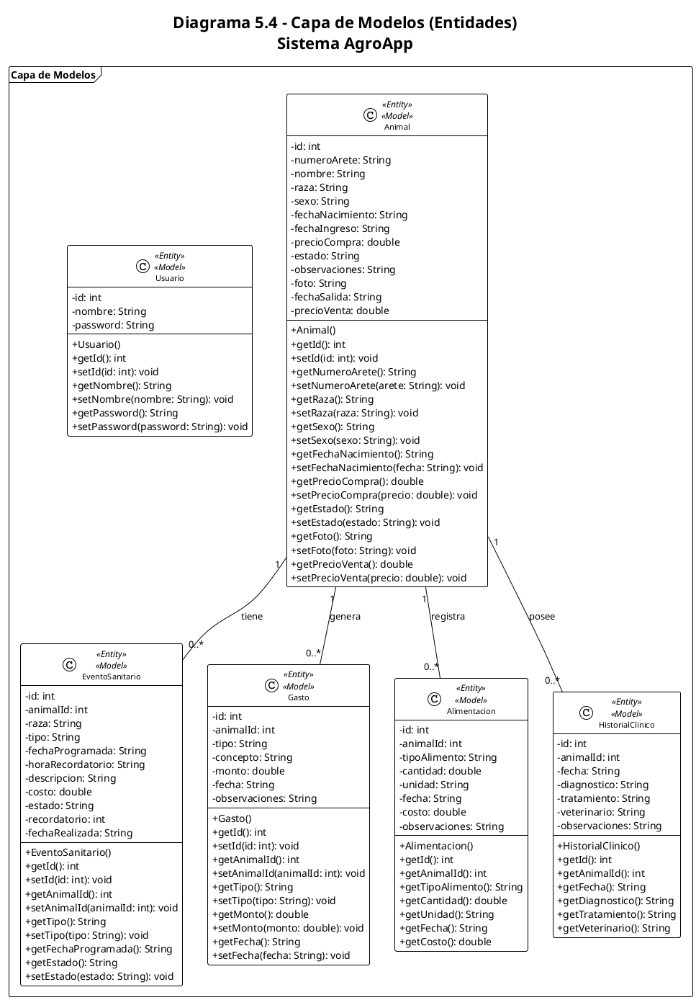
```plantuml
@startuml CapaModelos
!theme plain
skinparam classAttributeIconSize 0
skinparam classFontSize 11
skinparam packageFontSize 13

title Diagrama 5.4 - Capa de Modelos (Entidades)\nSistema AgroApp

package "Capa de Modelos" <<Frame>> {
    
    class Animal <<Entity>> <<Model>> {
        - id: int
        - numeroArete: String
        - nombre: String
        - raza: String
        - sexo: String
        - fechaNacimiento: String
        - fechaIngreso: String
        - precioCompra: double
        - estado: String
        - observaciones: String
        - foto: String
        - fechaSalida: String
        - precioVenta: double
        --
        + Animal()
        + getId(): int
        + setId(id: int): void
        + getNumeroArete(): String
        + setNumeroArete(arete: String): void
        + getRaza(): String
        + setRaza(raza: String): void
        + getSexo(): String
        + setSexo(sexo: String): void
        + getFechaNacimiento(): String
        + setFechaNacimiento(fecha: String): void
        + getPrecioCompra(): double
        + setPrecioCompra(precio: double): void
        + getEstado(): String
        + setEstado(estado: String): void
        + getFoto(): String
        + setFoto(foto: String): void
        + getPrecioVenta(): double
        + setPrecioVenta(precio: double): void
    }

    class Usuario <<Entity>> <<Model>> {
        - id: int
        - nombre: String
        - password: String
        --
        + Usuario()
        + getId(): int
        + setId(id: int): void
        + getNombre(): String
        + setNombre(nombre: String): void
        + getPassword(): String
        + setPassword(password: String): void
    }

    class EventoSanitario <<Entity>> <<Model>> {
        - id: int
        - animalId: int
        - raza: String
        - tipo: String
        - fechaProgramada: String
        - horaRecordatorio: String
        - descripcion: String
        - costo: double
        - estado: String
        - recordatorio: int
        - fechaRealizada: String
        --
        + EventoSanitario()
        + getId(): int
        + setId(id: int): void
        + getAnimalId(): int
        + setAnimalId(animalId: int): void
        + getTipo(): String
        + setTipo(tipo: String): void
        + getFechaProgramada(): String
        + getEstado(): String
        + setEstado(estado: String): void
    }

    class Gasto <<Entity>> <<Model>> {
        - id: int
        - animalId: int
        - tipo: String
        - concepto: String
        - monto: double
        - fecha: String
        - observaciones: String
        --
        + Gasto()
        + getId(): int
        + setId(id: int): void
        + getAnimalId(): int
        + setAnimalId(animalId: int): void
        + getTipo(): String
        + setTipo(tipo: String): void
        + getMonto(): double
        + setMonto(monto: double): void
        + getFecha(): String
        + setFecha(fecha: String): void
    }

    class Alimentacion <<Entity>> <<Model>> {
        - id: int
        - animalId: int
        - tipoAlimento: String
        - cantidad: double
        - unidad: String
        - fecha: String
        - costo: double
        - observaciones: String
        --
        + Alimentacion()
        + getId(): int
        + getAnimalId(): int
        + getTipoAlimento(): String
        + getCantidad(): double
        + getUnidad(): String
        + getFecha(): String
        + getCosto(): double
    }

    class HistorialClinico <<Entity>> <<Model>> {
        - id: int
        - animalId: int
        - fecha: String
        - diagnostico: String
        - tratamiento: String
        - veterinario: String
        - observaciones: String
        --
        + HistorialClinico()
        + getId(): int
        + getAnimalId(): int
        + getFecha(): String
        + getDiagnostico(): String
        + getTratamiento(): String
        + getVeterinario(): String
    }
}

' Relaciones entre entidades
Animal "1" -- "0..*" EventoSanitario : tiene
Animal "1" -- "0..*" Gasto : genera
Animal "1" -- "0..*" Alimentacion : registra
Animal "1" -- "0..*" HistorialClinico : posee

@enduml
```

---

## DIAGRAMA 5.5: CAPA DE ADAPTADORES Y PRESENTER

```plantuml
@startuml CapaAdaptadoresPresenter
!theme plain
skinparam classAttributeIconSize 0
skinparam classFontSize 11
skinparam packageFontSize 13

title Diagrama 5.5 - Capa de Adaptadores y Presenter\nSistema AgroApp

package "Capa de Presentador (MVP)" <<Frame>> {
    
    interface "AnimalPresenter.View" as AnimalView <<Interface>> {
        + onAnimalGuardado(id: long): void
        + onAnimalActualizado(): void
        + onAnimalEliminado(): void
        + onAnimalesCargados(animales: List<Animal>): void
        + onAnimalCargado(animal: Animal): void
        + onError(mensaje: String): void
    }

    interface "AnimalPresenter.CargarAnimalCallback" as CargarAnimalCallback <<Interface>> {
        + onAnimalCargado(animal: Animal): void
        + onError(mensaje: String): void
    }

    class AnimalPresenter <<Presenter>> {
        - view: AnimalPresenter.View
        - animalDAO: AnimalDAO
        - executor: ExecutorService
        - handler: Handler
        --
        + AnimalPresenter(view: View, context: Context)
        + guardarAnimal(animal: Animal): void
        + actualizarAnimal(animal: Animal): void
        + eliminarAnimal(animalId: int): void
        + cargarAnimales(): void
        + cargarAnimalPorId(id: int, callback: CargarAnimalCallback): void
        + existeArete(arete: String): boolean
        - ejecutarEnBackground(runnable: Runnable): void
        - ejecutarEnUI(runnable: Runnable): void
    }
}

package "Capa de Adaptadores" <<Frame>> {
    
    abstract class "RecyclerView.Adapter" as RecyclerAdapter <<AndroidComponent>> {
        + onCreateViewHolder(parent: ViewGroup, viewType: int): ViewHolder
        + onBindViewHolder(holder: ViewHolder, position: int): void
        + getItemCount(): int
    }

    class AnimalAdapter <<Adapter>> {
        - listaAnimales: List<Animal>
        - listener: OnAnimalClickListener
        --
        + AnimalAdapter(lista: List<Animal>, listener: OnAnimalClickListener)
        + onBindViewHolder(holder: ViewHolder, position: int): void
        + getItemCount(): int
        + actualizarLista(nuevaLista: List<Animal>): void
    }

    class EventoSanitarioAdapter <<Adapter>> {
        - listaEventos: List<EventoSanitario>
        - listener: OnEventoClickListener
        --
        + onBindViewHolder(holder: ViewHolder, position: int): void
        + getItemCount(): int
        + actualizarLista(nuevaLista: List<EventoSanitario>): void
    }

    class GastoAdapter <<Adapter>> {
        - listaGastos: List<Gasto>
        - listener: OnGastoClickListener
        --
        + onBindViewHolder(holder: ViewHolder, position: int): void
        + getItemCount(): int
        + actualizarLista(nuevaLista: List<Gasto>): void
    }

    class AlimentacionAdapter <<Adapter>> {
        - listaAlimentacion: List<Alimentacion>
        --
        + onBindViewHolder(holder: ViewHolder, position: int): void
        + getItemCount(): int
    }

    class HistorialClinicoAdapter <<Adapter>> {
        - listaHistorial: List<HistorialClinico>
        --
        + onBindViewHolder(holder: ViewHolder, position: int): void
        + getItemCount(): int
    }
}

package "Capa de Utilidades" <<Frame>> {
    
    class NotificationHelper <<Utility>> <<Service>> {
        - {static} CHANNEL_ID: String = "agroapp_channel"
        - context: Context
        --
        + NotificationHelper(context: Context)
        + crearCanalNotificacion(): void
        + programarNotificacion(evento: EventoSanitario): void
        + cancelarNotificacion(eventoId: int): void
    }

    class NotificationReceiver <<BroadcastReceiver>> {
        --
        + onReceive(context: Context, intent: Intent): void
        - mostrarNotificacion(context: Context, titulo: String, mensaje: String): void
    }
}

' Herencia de Adapters
RecyclerAdapter <|-- AnimalAdapter
RecyclerAdapter <|-- EventoSanitarioAdapter
RecyclerAdapter <|-- GastoAdapter
RecyclerAdapter <|-- AlimentacionAdapter
RecyclerAdapter <|-- HistorialClinicoAdapter

' Relación Presenter
AnimalPresenter o-- AnimalView : notifica

' Relación Notificaciones
NotificationHelper ..> NotificationReceiver : programa

@enduml
```

---

## DIAGRAMA 5.6: RELACIONES ENTRE CAPAS (ARQUITECTURA MVP)

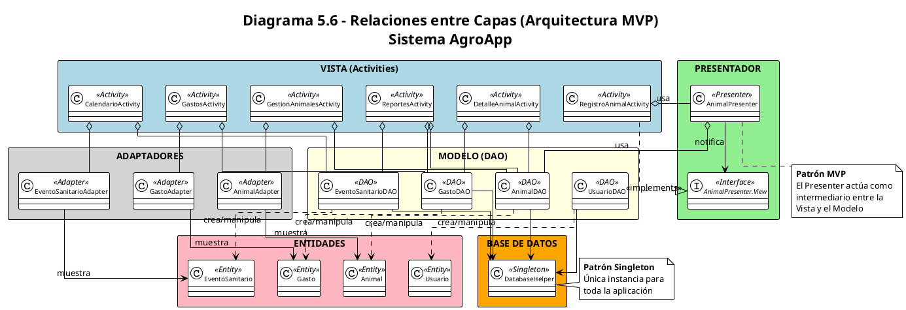
```plantuml
@startuml RelacionesCapas
!theme plain
skinparam classAttributeIconSize 0
skinparam classFontSize 10
skinparam packageFontSize 12
skinparam linetype ortho

title Diagrama 5.6 - Relaciones entre Capas (Arquitectura MVP)\nSistema AgroApp

package "VISTA (Activities)" <<Rectangle>> #LightBlue {
    class RegistroAnimalActivity <<Activity>>
    class GestionAnimalesActivity <<Activity>>
    class DetalleAnimalActivity <<Activity>>
    class CalendarioActivity <<Activity>>
    class GastosActivity <<Activity>>
    class ReportesActivity <<Activity>>
}

package "PRESENTADOR" <<Rectangle>> #LightGreen {
    class AnimalPresenter <<Presenter>>
    interface "AnimalPresenter.View" as IView <<Interface>>
}

package "MODELO (DAO)" <<Rectangle>> #LightYellow {
    class AnimalDAO <<DAO>>
    class EventoSanitarioDAO <<DAO>>
    class GastoDAO <<DAO>>
    class UsuarioDAO <<DAO>>
}

package "ENTIDADES" <<Rectangle>> #LightPink {
    class Animal <<Entity>>
    class EventoSanitario <<Entity>>
    class Gasto <<Entity>>
    class Usuario <<Entity>>
}

package "ADAPTADORES" <<Rectangle>> #LightGray {
    class AnimalAdapter <<Adapter>>
    class EventoSanitarioAdapter <<Adapter>>
    class GastoAdapter <<Adapter>>
}

package "BASE DE DATOS" <<Rectangle>> #Orange {
    class DatabaseHelper <<Singleton>>
}

' === RELACIONES MVP ===
RegistroAnimalActivity ..|> IView : <<implements>>
RegistroAnimalActivity o-- AnimalPresenter : usa
AnimalPresenter o-- AnimalDAO : usa
AnimalPresenter --> IView : notifica

' === RELACIONES ACTIVITY - DAO ===
GestionAnimalesActivity o-- AnimalDAO
GestionAnimalesActivity o-- AnimalAdapter
DetalleAnimalActivity o-- AnimalDAO
DetalleAnimalActivity o-- GastoDAO
CalendarioActivity o-- EventoSanitarioDAO
CalendarioActivity o-- EventoSanitarioAdapter
GastosActivity o-- GastoDAO
GastosActivity o-- GastoAdapter
ReportesActivity o-- AnimalDAO
ReportesActivity o-- GastoDAO
ReportesActivity o-- EventoSanitarioDAO

' === RELACIONES DAO - DATABASE ===
AnimalDAO --> DatabaseHelper
EventoSanitarioDAO --> DatabaseHelper
GastoDAO --> DatabaseHelper
UsuarioDAO --> DatabaseHelper

' === RELACIONES DAO - ENTIDADES ===
AnimalDAO ..> Animal : crea/manipula
EventoSanitarioDAO ..> EventoSanitario : crea/manipula
GastoDAO ..> Gasto : crea/manipula
UsuarioDAO ..> Usuario : crea/manipula

' === RELACIONES ADAPTER - ENTIDADES ===
AnimalAdapter --> Animal : muestra
EventoSanitarioAdapter --> EventoSanitario : muestra
GastoAdapter --> Gasto : muestra

note bottom of AnimalPresenter
  **Patrón MVP**
  El Presenter actúa como
  intermediario entre la
  Vista y el Modelo
end note

note right of DatabaseHelper
  **Patrón Singleton**
  Única instancia para
  toda la aplicación
end note

@enduml
```

---

# ILUSTRACIÓN 40: NAVEGACIÓN DESDE LOGIN HASTA DASHBOARD
## Diagrama de Navegación de Autenticación

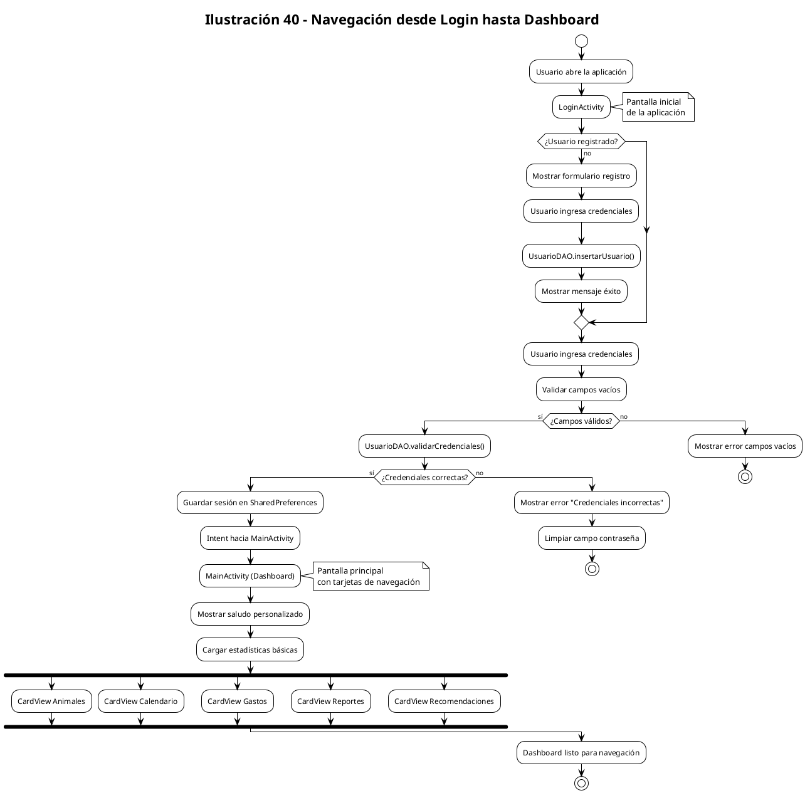
```plantuml
@startuml NavegacionLoginDashboard
!theme plain
skinparam activityFontSize 12
skinparam arrowFontSize 10

title Ilustración 40 - Navegación desde Login hasta Dashboard

start

:Usuario abre la aplicación;

:LoginActivity;
note right
  Pantalla inicial
  de la aplicación
end note

if (¿Usuario registrado?) then (no)
    :Mostrar formulario registro;
    :Usuario ingresa credenciales;
    :UsuarioDAO.insertarUsuario();
    :Mostrar mensaje éxito;
endif

:Usuario ingresa credenciales;

:Validar campos vacíos;

if (¿Campos válidos?) then (sí)
    :UsuarioDAO.validarCredenciales();
    
    if (¿Credenciales correctas?) then (sí)
        :Guardar sesión en SharedPreferences;
        :Intent hacia MainActivity;
        
        :MainActivity (Dashboard);
        note right
          Pantalla principal
          con tarjetas de navegación
        end note
        
        :Mostrar saludo personalizado;
        :Cargar estadísticas básicas;
        
        fork
            :CardView Animales;
        fork again
            :CardView Calendario;
        fork again
            :CardView Gastos;
        fork again
            :CardView Reportes;
        fork again
            :CardView Recomendaciones;
        end fork
        
    else (no)
        :Mostrar error "Credenciales incorrectas";
        :Limpiar campo contraseña;
        stop
    endif
else (no)
    :Mostrar error campos vacíos;
    stop
endif

:Dashboard listo para navegación;

stop

@enduml
```

---

# ILUSTRACIÓN 41: NAVEGACIÓN COMPLETA DE GESTIÓN DE ANIMALES
## Diagrama de Navegación del Módulo de Animales

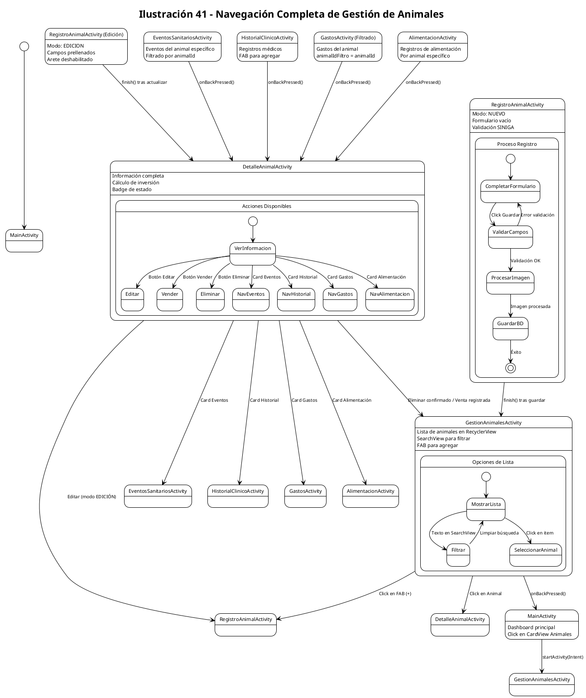
```plantuml
@startuml NavegacionGestionAnimales
!theme plain
skinparam stateFontSize 11
skinparam arrowFontSize 10

title Ilustración 41 - Navegación Completa de Gestión de Animales

[*] --> MainActivity

state "MainActivity" as Main {
    Main : Dashboard principal
    Main : Click en CardView Animales
}

Main --> GestionAnimalesActivity : startActivity(Intent)

state "GestionAnimalesActivity" as Gestion {
    Gestion : Lista de animales en RecyclerView
    Gestion : SearchView para filtrar
    Gestion : FAB para agregar
    
    state "Opciones de Lista" as OpcionesLista {
        [*] --> MostrarLista
        MostrarLista --> Filtrar : Texto en SearchView
        Filtrar --> MostrarLista : Limpiar búsqueda
        MostrarLista --> SeleccionarAnimal : Click en item
    }
}

Gestion --> RegistroAnimalActivity : Click en FAB (+)

state "RegistroAnimalActivity" as Registro {
    Registro : Modo: NUEVO
    Registro : Formulario vacío
    Registro : Validación SINIGA
    
    state "Proceso Registro" as ProcesoRegistro {
        [*] --> CompletarFormulario
        CompletarFormulario --> ValidarCampos : Click Guardar
        ValidarCampos --> ProcesarImagen : Validación OK
        ProcesarImagen --> GuardarBD : Imagen procesada
        GuardarBD --> [*] : Éxito
        ValidarCampos --> CompletarFormulario : Error validación
    }
}

Registro --> Gestion : finish() tras guardar

Gestion --> DetalleAnimalActivity : Click en Animal

state "DetalleAnimalActivity" as Detalle {
    Detalle : Información completa
    Detalle : Cálculo de inversión
    Detalle : Badge de estado
    
    state "Acciones Disponibles" as Acciones {
        [*] --> VerInformacion
        VerInformacion --> Editar : Botón Editar
        VerInformacion --> Vender : Botón Vender
        VerInformacion --> Eliminar : Botón Eliminar
        VerInformacion --> NavEventos : Card Eventos
        VerInformacion --> NavHistorial : Card Historial
        VerInformacion --> NavGastos : Card Gastos
        VerInformacion --> NavAlimentacion : Card Alimentación
    }
}

Detalle --> RegistroAnimalActivity : Editar (modo EDICIÓN)

state "RegistroAnimalActivity (Edición)" as RegistroEdicion {
    RegistroEdicion : Modo: EDICION
    RegistroEdicion : Campos prellenados
    RegistroEdicion : Arete deshabilitado
}

RegistroEdicion --> Detalle : finish() tras actualizar

Detalle --> EventosSanitariosActivity : Card Eventos

state "EventosSanitariosActivity" as EventosAnimal {
    EventosAnimal : Eventos del animal específico
    EventosAnimal : Filtrado por animalId
}

EventosAnimal --> Detalle : onBackPressed()

Detalle --> HistorialClinicoActivity : Card Historial

state "HistorialClinicoActivity" as Historial {
    Historial : Registros médicos
    Historial : FAB para agregar
}

Historial --> Detalle : onBackPressed()

Detalle --> GastosActivity : Card Gastos

state "GastosActivity (Filtrado)" as GastosFiltrado {
    GastosFiltrado : Gastos del animal
    GastosFiltrado : animalIdFiltro = animalId
}

GastosFiltrado --> Detalle : onBackPressed()

Detalle --> AlimentacionActivity : Card Alimentación

state "AlimentacionActivity" as Alimentacion {
    Alimentacion : Registros de alimentación
    Alimentacion : Por animal específico
}

Alimentacion --> Detalle : onBackPressed()

Detalle --> Gestion : Eliminar confirmado / Venta registrada

Gestion --> Main : onBackPressed()

@enduml
```

---

# ILUSTRACIÓN 42: NAVEGACIÓN DE CALENDARIO SANITARIO
## Diagrama de Navegación del Módulo de Calendario

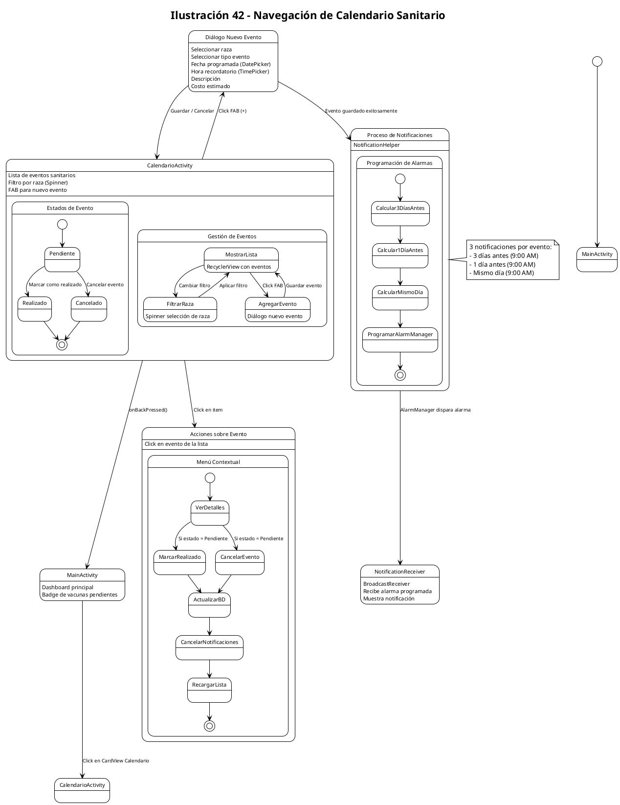
```plantuml
@startuml NavegacionCalendarioSanitario
!theme plain
skinparam stateFontSize 11
skinparam arrowFontSize 10

title Ilustración 42 - Navegación de Calendario Sanitario

[*] --> MainActivity

state "MainActivity" as Main {
    Main : Dashboard principal
    Main : Badge de vacunas pendientes
}

Main --> CalendarioActivity : Click en CardView Calendario

state "CalendarioActivity" as Calendario {
    Calendario : Lista de eventos sanitarios
    Calendario : Filtro por raza (Spinner)
    Calendario : FAB para nuevo evento
    
    state "Estados de Evento" as EstadosEvento {
        [*] --> Pendiente
        Pendiente --> Realizado : Marcar como realizado
        Pendiente --> Cancelado : Cancelar evento
        Realizado --> [*]
        Cancelado --> [*]
    }
    
    state "Gestión de Eventos" as GestionEventos {
        MostrarLista : RecyclerView con eventos
        FiltrarRaza : Spinner selección de raza
        AgregarEvento : Diálogo nuevo evento
        
        MostrarLista --> FiltrarRaza : Cambiar filtro
        FiltrarRaza --> MostrarLista : Aplicar filtro
        MostrarLista --> AgregarEvento : Click FAB
        AgregarEvento --> MostrarLista : Guardar evento
    }
}

state "Diálogo Nuevo Evento" as DialogoEvento {
    DialogoEvento : Seleccionar raza
    DialogoEvento : Seleccionar tipo evento
    DialogoEvento : Fecha programada (DatePicker)
    DialogoEvento : Hora recordatorio (TimePicker)
    DialogoEvento : Descripción
    DialogoEvento : Costo estimado
}

Calendario --> DialogoEvento : Click FAB (+)
DialogoEvento --> Calendario : Guardar / Cancelar

state "Proceso de Notificaciones" as Notificaciones {
    Notificaciones : NotificationHelper
    
    state "Programación de Alarmas" as Alarmas {
        [*] --> Calcular3DíasAntes
        Calcular3DíasAntes --> Calcular1DíaAntes
        Calcular1DíaAntes --> CalcularMismoDía
        CalcularMismoDía --> ProgramarAlarmManager
        ProgramarAlarmManager --> [*]
    }
}

DialogoEvento --> Notificaciones : Evento guardado exitosamente

state "Acciones sobre Evento" as AccionesEvento {
    AccionesEvento : Click en evento de la lista
    
    state "Menú Contextual" as MenuContextual {
        [*] --> VerDetalles
        VerDetalles --> MarcarRealizado : Si estado = Pendiente
        VerDetalles --> CancelarEvento : Si estado = Pendiente
        MarcarRealizado --> ActualizarBD
        CancelarEvento --> ActualizarBD
        ActualizarBD --> CancelarNotificaciones
        CancelarNotificaciones --> RecargarLista
        RecargarLista --> [*]
    }
}

Calendario --> AccionesEvento : Click en item

state "NotificationReceiver" as Receiver {
    Receiver : BroadcastReceiver
    Receiver : Recibe alarma programada
    Receiver : Muestra notificación
}

Notificaciones --> Receiver : AlarmManager dispara alarma

Calendario --> Main : onBackPressed()

note right of Notificaciones
  3 notificaciones por evento:
  - 3 días antes (9:00 AM)
  - 1 día antes (9:00 AM)
  - Mismo día (9:00 AM)
end note

@enduml
```

---

# ILUSTRACIÓN 43: NAVEGACIÓN DE CONTROL DE GASTOS
## Diagrama de Navegación del Módulo de Gastos

```plantuml
@startuml NavegacionControlGastos
!theme plain
skinparam stateFontSize 11
skinparam arrowFontSize 10

title Ilustración 43 - Navegación de Control de Gastos

[*] --> MainActivity

state "MainActivity" as Main {
    Main : Dashboard principal
}

Main --> GastosActivity : Click en CardView Gastos

state "GastosActivity" as Gastos {
    Gastos : Lista de todos los gastos
    Gastos : Total de gastos mostrado
    Gastos : Filtro por animal (Spinner)
    Gastos : FAB para registrar compra
    
    state "Modos de Vista" as ModosVista {
        [*] --> VistaGeneral
        VistaGeneral : animalIdFiltro = -1
        VistaGeneral : Todos los gastos
        
        VistaGeneral --> VistaFiltrada : Seleccionar animal en Spinner
        
        VistaFiltrada : animalIdFiltro = ID seleccionado
        VistaFiltrada : Solo gastos del animal
        
        VistaFiltrada --> VistaGeneral : Seleccionar "Todos"
    }
    
    state "Cálculo de Totales" as Totales {
        [*] --> ObtenerGastos
        ObtenerGastos --> SumarMontos
        SumarMontos --> MostrarTotal
        MostrarTotal --> [*]
    }
}

Gastos --> RegistroComprasActivity : Click FAB (+)

state "RegistroComprasActivity" as RegistroCompras {
    RegistroCompras : Registro de compra dividida
    RegistroCompras : Nombre de la compra
    RegistroCompras : Precio total
    RegistroCompras : Tipo de gasto (Spinner)
    RegistroCompras : Selección múltiple de animales
    
    state "Proceso de Registro" as ProcesoCompra {
        [*] --> CargarAnimales
        CargarAnimales --> MostrarCheckboxes
        MostrarCheckboxes --> SeleccionarAnimales
        SeleccionarAnimales --> CalcularDivisión
        CalcularDivisión --> MostrarPrecioPorAnimal
        MostrarPrecioPorAnimal --> Validar
        Validar --> InsertarGastos : Validación OK
        InsertarGastos --> [*] : N inserciones
    }
    
    state "Búsqueda de Animales" as BusquedaAnimales {
        [*] --> MostrarTodos
        MostrarTodos --> Filtrar : Texto en SearchView
        Filtrar : Por arete o raza
        Filtrar --> MostrarTodos : Limpiar
    }
}

RegistroCompras --> Gastos : finish() tras guardar

state "Acciones sobre Gasto" as AccionesGasto {
    AccionesGasto : Click en item de la lista
    
    state "Diálogo de Confirmación" as DialogoEliminar {
        [*] --> MostrarDialogo
        MostrarDialogo --> Confirmar : Click Eliminar
        MostrarDialogo --> Cancelar : Click Cancelar
        Confirmar --> EliminarBD
        EliminarBD --> RecargarLista
        RecargarLista --> [*]
        Cancelar --> [*]
    }
}

Gastos --> AccionesGasto : Long click en item

state "Desde DetalleAnimalActivity" as DesdeDetalle {
    DesdeDetalle : Navegación alternativa
    DesdeDetalle : animalIdFiltro = animalId
}

DesdeDetalle --> Gastos : Intent con EXTRA_ANIMAL_ID

note right of RegistroCompras
  Fórmula de división:
  precioPorAnimal = precioTotal / cantidadSeleccionados
  
  Se crea un registro de gasto
  por cada animal seleccionado
end note

Gastos --> Main : onBackPressed()

@enduml
```

---

# ILUSTRACIÓN 44: NAVEGACIÓN COMPLETA DEL SISTEMA
## Diagrama General de Navegación

```plantuml
@startuml NavegacionCompletaSistema
!theme plain
skinparam stateFontSize 10
skinparam arrowFontSize 9
left to right direction

title Ilustración 44 - Navegación Completa del Sistema AgroApp

[*] --> LoginActivity

state "Autenticación" as Auth {
    state "LoginActivity" as Login {
        Login : Validar credenciales
        Login : Registrar nuevo usuario
    }
}

Login --> MainActivity : Autenticación exitosa

state "Dashboard Principal" as Dashboard {
    state "MainActivity" as Main {
        Main : Tarjetas de navegación
        Main : Saludo personalizado
        Main : Resumen rápido
    }
}

state "Módulo Animales" as ModuloAnimales {
    state "GestionAnimalesActivity" as GestionAnimales {
        GestionAnimales : Lista animales
        GestionAnimales : Búsqueda
    }
    
    state "RegistroAnimalActivity" as RegistroAnimal {
        RegistroAnimal : Nuevo / Editar
        RegistroAnimal : Validación SINIGA
    }
    
    state "DetalleAnimalActivity" as DetalleAnimal {
        DetalleAnimal : Info completa
        DetalleAnimal : Inversión
        DetalleAnimal : Acciones
    }
}

state "Módulo Calendario" as ModuloCalendario {
    state "CalendarioActivity" as Calendario {
        Calendario : Eventos sanitarios
        Calendario : Filtro por raza
    }
    
    state "EventosSanitariosActivity" as EventosAnimal {
        EventosAnimal : Eventos por animal
    }
}

state "Módulo Gastos" as ModuloGastos {
    state "GastosActivity" as Gastos {
        Gastos : Lista gastos
        Gastos : Filtro por animal
    }
    
    state "RegistroComprasActivity" as RegistroCompras {
        RegistroCompras : Compra dividida
    }
}

state "Módulo Salud" as ModuloSalud {
    state "HistorialClinicoActivity" as Historial {
        Historial : Registros médicos
    }
    
    state "AlimentacionActivity" as Alimentacion {
        Alimentacion : Control alimentación
    }
}

state "Módulo Reportes" as ModuloReportes {
    state "ReportesActivity" as Reportes {
        Reportes : Estadísticas
        Reportes : Generar PDF
    }
    
    state "RecomendacionesActivity" as Recomendaciones {
        Recomendaciones : Guías ganaderas
    }
}

' Navegación desde Dashboard
Main --> GestionAnimales : Card Animales
Main --> Calendario : Card Calendario
Main --> Gastos : Card Gastos
Main --> Reportes : Card Reportes
Main --> Recomendaciones : Card Recomendaciones

' Navegación en Módulo Animales
GestionAnimales --> RegistroAnimal : FAB (+)
GestionAnimales --> DetalleAnimal : Click item
DetalleAnimal --> RegistroAnimal : Editar
RegistroAnimal --> GestionAnimales : Guardar
RegistroAnimal --> DetalleAnimal : Actualizar

' Navegación desde Detalle Animal
DetalleAnimal --> EventosAnimal : Card Eventos
DetalleAnimal --> Historial : Card Historial
DetalleAnimal --> Gastos : Card Gastos (filtrado)
DetalleAnimal --> Alimentacion : Card Alimentación

' Navegación en Módulo Gastos
Gastos --> RegistroCompras : FAB (+)
RegistroCompras --> Gastos : Guardar

' Retornos al Dashboard
GestionAnimales --> Main : Back
Calendario --> Main : Back
Gastos --> Main : Back
Reportes --> Main : Back
Recomendaciones --> Main : Back

' Retornos a Detalle
EventosAnimal --> DetalleAnimal : Back
Historial --> DetalleAnimal : Back
Alimentacion --> DetalleAnimal : Back

' Logout
Main --> Login : Cerrar sesión

@enduml
```

---

# ILUSTRACIÓN 45: NAVEGACIÓN CROSS-MODULE
## Diagrama de Navegación entre Módulos

```plantuml
@startuml NavegacionCrossModule
!theme plain
skinparam componentFontSize 11
skinparam arrowFontSize 10

title Ilustración 45 - Navegación Cross-Module (Entre Módulos)

package "Punto de Entrada" {
    [LoginActivity] as Login
}

package "Hub Central" {
    [MainActivity] as Main
    note bottom of Main
        Centro de navegación
        Todas las rutas pasan
        por aquí
    end note
}

package "Módulo de Animales" <<Rectangle>> {
    [GestionAnimalesActivity] as GestionAnimales
    [RegistroAnimalActivity] as RegistroAnimal
    [DetalleAnimalActivity] as DetalleAnimal
}

package "Módulo de Calendario Sanitario" <<Rectangle>> {
    [CalendarioActivity] as Calendario
    [EventosSanitariosActivity] as EventosAnimal
}

package "Módulo de Control Financiero" <<Rectangle>> {
    [GastosActivity] as Gastos
    [RegistroComprasActivity] as RegistroCompras
}

package "Módulo de Salud Animal" <<Rectangle>> {
    [HistorialClinicoActivity] as Historial
    [AlimentacionActivity] as Alimentacion
}

package "Módulo de Análisis" <<Rectangle>> {
    [ReportesActivity] as Reportes
    [RecomendacionesActivity] as Recomendaciones
}

package "Servicios de Sistema" <<Rectangle>> {
    [NotificationHelper] as Notificaciones
    [NotificationReceiver] as Receiver
}

' Flujo de autenticación
Login --> Main : Intent\n(usuario autenticado)

' Navegación directa desde Dashboard
Main --> GestionAnimales : CARD_ANIMALES
Main --> Calendario : CARD_CALENDARIO
Main --> Gastos : CARD_GASTOS
Main --> Reportes : CARD_REPORTES
Main --> Recomendaciones : CARD_RECOMENDACIONES

' Navegación interna Módulo Animales
GestionAnimales --> RegistroAnimal : ACTION_NEW
GestionAnimales --> DetalleAnimal : ACTION_VIEW\n(EXTRA_ANIMAL_ID)
DetalleAnimal --> RegistroAnimal : ACTION_EDIT\n(EXTRA_ANIMAL_ID)

' Cross-Module: Detalle Animal hacia otros módulos
DetalleAnimal --> EventosAnimal : EXTRA_ANIMAL_ID\n<<cross-module>>
DetalleAnimal --> Historial : EXTRA_ANIMAL_ID\n<<cross-module>>
DetalleAnimal --> Gastos : EXTRA_ANIMAL_ID\n(filtrado)\n<<cross-module>>
DetalleAnimal --> Alimentacion : EXTRA_ANIMAL_ID\n<<cross-module>>

' Navegación interna Módulo Gastos
Gastos --> RegistroCompras : ACTION_NEW

' Calendario usa servicios de sistema
Calendario --> Notificaciones : Programar\nnotificaciones
Notificaciones --> Receiver : AlarmManager\n<<broadcast>>

' Reportes accede a datos de múltiples módulos
Reportes ..> GestionAnimales : Consulta\nAnimalDAO
Reportes ..> Gastos : Consulta\nGastoDAO
Reportes ..> Calendario : Consulta\nEventoSanitarioDAO

note right of DetalleAnimal
  **Punto de Integración Principal**
  
  DetalleAnimalActivity actúa como
  hub secundario, permitiendo
  navegación hacia módulos de:
  - Eventos Sanitarios
  - Historial Clínico
  - Gastos (filtrados)
  - Alimentación
  
  Siempre pasa EXTRA_ANIMAL_ID
end note

note bottom of Reportes
  **Acceso Cross-DAO**
  
  ReportesActivity consulta
  múltiples DAOs para generar
  estadísticas consolidadas:
  - AnimalDAO
  - GastoDAO
  - EventoSanitarioDAO
end note

note left of Notificaciones
  **Servicios Asíncronos**
  
  NotificationHelper programa
  alarmas que se disparan
  independientemente de la
  Activity activa
end note

@enduml
```

---

# RESUMEN DE DIAGRAMAS

## Flujos de Navegación Principales

| Origen | Destino | Tipo | Datos Transferidos |
|--------|---------|------|-------------------|
| LoginActivity | MainActivity | Directo | nombreUsuario |
| MainActivity | GestionAnimalesActivity | Directo | - |
| MainActivity | CalendarioActivity | Directo | - |
| MainActivity | GastosActivity | Directo | - |
| MainActivity | ReportesActivity | Directo | - |
| GestionAnimalesActivity | RegistroAnimalActivity | Nuevo | - |
| GestionAnimalesActivity | DetalleAnimalActivity | Ver | EXTRA_ANIMAL_ID |
| DetalleAnimalActivity | RegistroAnimalActivity | Editar | EXTRA_ANIMAL_ID |
| DetalleAnimalActivity | EventosSanitariosActivity | Cross-Module | EXTRA_ANIMAL_ID |
| DetalleAnimalActivity | HistorialClinicoActivity | Cross-Module | EXTRA_ANIMAL_ID |
| DetalleAnimalActivity | GastosActivity | Cross-Module | EXTRA_ANIMAL_ID |
| DetalleAnimalActivity | AlimentacionActivity | Cross-Module | EXTRA_ANIMAL_ID |
| GastosActivity | RegistroComprasActivity | Nuevo | - |

## Constantes de Navegación

| Constante | Valor | Uso |
|-----------|-------|-----|
| EXTRA_ANIMAL_ID | "animal_id" | Transferir ID de animal entre Activities |
| EXTRA_MODO | "modo" | Indicar modo NUEVO o EDICION |
| EXTRA_USUARIO | "usuario" | Nombre del usuario autenticado |
| REQUEST_CODE_REGISTRO | 1001 | startActivityForResult para registro |
| REQUEST_CODE_EDICION | 1002 | startActivityForResult para edición |

---

# DIAGRAMA DE ESTADOS DE NAVEGACIÓN DE LA APLICACIÓN
## Estado Completo del Sistema con Transiciones

```plantuml
@startuml DiagramaEstadosNavegacion
!theme plain
skinparam stateFontSize 11
skinparam arrowFontSize 9
skinparam backgroundColor #FEFEFE

title Diagrama de Estados de Navegación - Sistema AgroApp\nCiclo de Vida Completo de la Aplicación

[*] --> AppIniciando : Usuario abre app

state "Inicialización" as Init {
    state "AppIniciando" as AppIniciando
    AppIniciando : Carga de recursos
    AppIniciando : Inicialización DatabaseHelper
    AppIniciando : Verificar SharedPreferences
}

AppIniciando --> SesionActiva : Sesión guardada válida
AppIniciando --> NoAutenticado : Sin sesión previa

' ==================== ESTADO NO AUTENTICADO ====================
state "No Autenticado" as NoAutenticado {
    
    state "LoginActivity" as Login {
        Login : etUsuario: EditText
        Login : etPassword: EditText
        Login : btnLogin: Button
        Login : btnRegistrar: Button
        
        state "Esperando Credenciales" as EsperandoCredenciales
        state "Validando" as Validando
        state "Registrando Usuario" as Registrando
        state "Error Autenticación" as ErrorAuth
        
        [*] --> EsperandoCredenciales
        EsperandoCredenciales --> Validando : Click btnLogin
        EsperandoCredenciales --> Registrando : Click btnRegistrar
        Validando --> ErrorAuth : Credenciales inválidas
        ErrorAuth --> EsperandoCredenciales : Usuario corrige
        Registrando --> EsperandoCredenciales : Registro exitoso
        Registrando --> ErrorAuth : Usuario duplicado
    }
}

Login --> SesionActiva : Autenticación exitosa\nGuardar en SharedPreferences

' ==================== ESTADO SESIÓN ACTIVA ====================
state "Sesión Activa" as SesionActiva {
    
    state "BaseActivity Control" as BaseControl {
        BaseControl : sessionHandler: Handler
        BaseControl : lastInteractionTime: long
        BaseControl : SESSION_TIMEOUT: 10000ms
        
        state "Sesión Válida" as SesionValida
        state "Timeout Detectado" as TimeoutDetectado
        state "Diálogo Contraseña" as DialogoPassword
        state "Validando Contraseña" as ValidandoPassword
        
        [*] --> SesionValida
        SesionValida --> TimeoutDetectado : Sin interacción > 10s
        TimeoutDetectado --> DialogoPassword : Mostrar AlertDialog
        DialogoPassword --> ValidandoPassword : Usuario ingresa contraseña
        ValidandoPassword --> SesionValida : Contraseña correcta
        ValidandoPassword --> DialogoPassword : Contraseña incorrecta
    }
    
    ' ==================== DASHBOARD ====================
    state "Dashboard" as Dashboard {
        state "MainActivity" as Main {
            Main : tvBienvenida: TextView
            Main : cardAnimales: CardView
            Main : cardCalendario: CardView
            Main : cardGastos: CardView
            Main : cardReportes: CardView
            Main : cardRecomendaciones: CardView
            
            state "Mostrando Dashboard" as MostrandoDashboard
            state "Navegando a Módulo" as NavegandoModulo
            
            [*] --> MostrandoDashboard
            MostrandoDashboard --> NavegandoModulo : Click en Card
        }
    }
    
    ' ==================== MÓDULO ANIMALES ====================
    state "Módulo Animales" as ModuloAnimales {
        
        state "GestionAnimalesActivity" as GestionAnimales {
            GestionAnimales : recyclerView: RecyclerView
            GestionAnimales : adapter: AnimalAdapter
            GestionAnimales : searchView: SearchView
            
            state "Cargando Lista" as CargandoLista
            state "Mostrando Lista" as MostrandoLista
            state "Filtrando" as Filtrando
            state "Lista Vacía" as ListaVacia
            
            [*] --> CargandoLista
            CargandoLista --> MostrandoLista : Animales encontrados
            CargandoLista --> ListaVacia : Sin animales
            MostrandoLista --> Filtrando : Texto en SearchView
            Filtrando --> MostrandoLista : Resultados encontrados
            Filtrando --> ListaVacia : Sin resultados
            ListaVacia --> MostrandoLista : Limpiar filtro
        }
        
        state "RegistroAnimalActivity" as RegistroAnimal {
            RegistroAnimal : Modo: NUEVO | EDICION
            RegistroAnimal : presenter: AnimalPresenter
            
            state "Formulario Vacío" as FormularioVacio
            state "Formulario con Datos" as FormularioDatos
            state "Capturando Foto" as CapturandoFoto
            state "Validando Campos" as ValidandoCampos
            state "Error Validación" as ErrorValidacion
            state "Guardando" as Guardando
            state "Guardado Exitoso" as GuardadoExitoso
            
            [*] --> FormularioVacio : Modo NUEVO
            [*] --> FormularioDatos : Modo EDICION
            FormularioVacio --> FormularioDatos : Usuario llena campos
            FormularioDatos --> CapturandoFoto : Click en ImageView
            CapturandoFoto --> FormularioDatos : Foto capturada
            FormularioDatos --> ValidandoCampos : Click Guardar
            ValidandoCampos --> ErrorValidacion : Campos inválidos
            ValidandoCampos --> Guardando : Validación OK
            ErrorValidacion --> FormularioDatos : Usuario corrige
            Guardando --> GuardadoExitoso : DAO.insertar() exitoso
            GuardadoExitoso --> [*]
        }
        
        state "DetalleAnimalActivity" as DetalleAnimal {
            DetalleAnimal : animal: Animal
            DetalleAnimal : tvInversion: TextView
            
            state "Cargando Detalle" as CargandoDetalle
            state "Mostrando Detalle" as MostrandoDetalle
            state "Confirmando Venta" as ConfirmandoVenta
            state "Confirmando Eliminación" as ConfirmandoEliminacion
            state "Procesando Venta" as ProcesandoVenta
            state "Eliminando" as Eliminando
            
            [*] --> CargandoDetalle
            CargandoDetalle --> MostrandoDetalle : Animal cargado
            MostrandoDetalle --> ConfirmandoVenta : Click Vender
            MostrandoDetalle --> ConfirmandoEliminacion : Click Eliminar
            ConfirmandoVenta --> ProcesandoVenta : Confirmar precio
            ConfirmandoVenta --> MostrandoDetalle : Cancelar
            ProcesandoVenta --> [*] : Venta registrada
            ConfirmandoEliminacion --> Eliminando : Confirmar
            ConfirmandoEliminacion --> MostrandoDetalle : Cancelar
            Eliminando --> [*] : Animal eliminado
        }
    }
    
    ' ==================== MÓDULO CALENDARIO ====================
    state "Módulo Calendario" as ModuloCalendario {
        
        state "CalendarioActivity" as Calendario {
            Calendario : recyclerView: RecyclerView
            Calendario : spinnerFiltroRaza: Spinner
            
            state "Cargando Eventos" as CargandoEventos
            state "Mostrando Eventos" as MostrandoEventos
            state "Filtrando por Raza" as FiltrandoRaza
            state "Creando Evento" as CreandoEvento
            state "Programando Notificación" as ProgramandoNotificacion
            
            [*] --> CargandoEventos
            CargandoEventos --> MostrandoEventos : Eventos cargados
            MostrandoEventos --> FiltrandoRaza : Cambiar Spinner
            FiltrandoRaza --> MostrandoEventos : Aplicar filtro
            MostrandoEventos --> CreandoEvento : Click FAB
            CreandoEvento --> ProgramandoNotificacion : Evento guardado
            ProgramandoNotificacion --> MostrandoEventos : Notificación programada
        }
        
        state "EventosSanitariosActivity" as EventosAnimal {
            EventosAnimal : animalId: int
            
            state "Cargando Eventos Animal" as CargandoEventosAnimal
            state "Mostrando Eventos Animal" as MostrandoEventosAnimal
            
            [*] --> CargandoEventosAnimal
            CargandoEventosAnimal --> MostrandoEventosAnimal
        }
    }
    
    ' ==================== MÓDULO GASTOS ====================
    state "Módulo Gastos" as ModuloGastos {
        
        state "GastosActivity" as Gastos {
            Gastos : tvTotalGastos: TextView
            Gastos : animalIdFiltro: int
            
            state "Cargando Gastos" as CargandoGastos
            state "Mostrando Gastos" as MostrandoGastos
            state "Vista Filtrada" as VistaFiltrada
            state "Calculando Total" as CalculandoTotal
            
            [*] --> CargandoGastos
            CargandoGastos --> CalculandoTotal : Gastos cargados
            CalculandoTotal --> MostrandoGastos : Total calculado
            MostrandoGastos --> VistaFiltrada : Seleccionar animal
            VistaFiltrada --> CalculandoTotal : Recalcular
            VistaFiltrada --> MostrandoGastos : Ver todos
        }
        
        state "RegistroComprasActivity" as RegistroCompras {
            RegistroCompras : checkBoxes: List<CheckBox>
            RegistroCompras : tvPrecioPorAnimal: TextView
            
            state "Cargando Animales" as CargandoAnimalesCompra
            state "Seleccionando Animales" as SeleccionandoAnimales
            state "Calculando División" as CalculandoDivision
            state "Registrando Gastos" as RegistrandoGastos
            
            [*] --> CargandoAnimalesCompra
            CargandoAnimalesCompra --> SeleccionandoAnimales : Animales cargados
            SeleccionandoAnimales --> CalculandoDivision : Cambio en selección
            CalculandoDivision --> SeleccionandoAnimales : Precio actualizado
            SeleccionandoAnimales --> RegistrandoGastos : Click Registrar
            RegistrandoGastos --> [*] : Gastos insertados
        }
    }
    
    ' ==================== MÓDULO SALUD ====================
    state "Módulo Salud" as ModuloSalud {
        
        state "HistorialClinicoActivity" as Historial {
            state "Cargando Historial" as CargandoHistorial
            state "Mostrando Historial" as MostrandoHistorial
            state "Agregando Registro" as AgregandoRegistro
            
            [*] --> CargandoHistorial
            CargandoHistorial --> MostrandoHistorial
            MostrandoHistorial --> AgregandoRegistro : Click FAB
            AgregandoRegistro --> MostrandoHistorial : Registro guardado
        }
        
        state "AlimentacionActivity" as Alimentacion {
            state "Cargando Alimentación" as CargandoAlimentacion
            state "Mostrando Alimentación" as MostrandoAlimentacion
            state "Agregando Alimentación" as AgregandoAlimentacion
            
            [*] --> CargandoAlimentacion
            CargandoAlimentacion --> MostrandoAlimentacion
            MostrandoAlimentacion --> AgregandoAlimentacion : Click FAB
            AgregandoAlimentacion --> MostrandoAlimentacion : Registro guardado
        }
    }
    
    ' ==================== MÓDULO REPORTES ====================
    state "Módulo Reportes" as ModuloReportes {
        
        state "ReportesActivity" as Reportes {
            state "Cargando Estadísticas" as CargandoEstadisticas
            state "Mostrando Estadísticas" as MostrandoEstadisticas
            state "Generando PDF" as GenerandoPDF
            state "PDF Generado" as PDFGenerado
            
            [*] --> CargandoEstadisticas
            CargandoEstadisticas --> MostrandoEstadisticas
            MostrandoEstadisticas --> GenerandoPDF : Click Generar PDF
            GenerandoPDF --> PDFGenerado : PDF creado
            PDFGenerado --> MostrandoEstadisticas : Compartir/Cerrar
        }
        
        state "RecomendacionesActivity" as Recomendaciones {
            state "Cargando Recomendaciones" as CargandoRecomendaciones
            state "Mostrando Recomendaciones" as MostrandoRecomendaciones
            
            [*] --> CargandoRecomendaciones
            CargandoRecomendaciones --> MostrandoRecomendaciones
        }
    }
    
    ' ==================== TRANSICIONES ENTRE MÓDULOS ====================
    Dashboard --> ModuloAnimales : cardAnimales.onClick()
    Dashboard --> ModuloCalendario : cardCalendario.onClick()
    Dashboard --> ModuloGastos : cardGastos.onClick()
    Dashboard --> ModuloReportes : cardReportes.onClick() /\ncardRecomendaciones.onClick()
    
    ModuloAnimales --> Dashboard : onBackPressed()
    ModuloCalendario --> Dashboard : onBackPressed()
    ModuloGastos --> Dashboard : onBackPressed()
    ModuloReportes --> Dashboard : onBackPressed()
    
    ' Navegación interna Módulo Animales
    GestionAnimales --> RegistroAnimal : fabAgregar.onClick()
    GestionAnimales --> DetalleAnimal : adapter.onItemClick()
    DetalleAnimal --> RegistroAnimal : btnEditar.onClick()
    RegistroAnimal --> GestionAnimales : finish()
    DetalleAnimal --> GestionAnimales : finish() [eliminado/vendido]
    
    ' Cross-module desde Detalle Animal
    DetalleAnimal --> EventosAnimal : cardEventos.onClick()
    DetalleAnimal --> Historial : cardHistorial.onClick()
    DetalleAnimal --> Gastos : cardGastos.onClick()
    DetalleAnimal --> Alimentacion : cardAlimentacion.onClick()
    
    EventosAnimal --> DetalleAnimal : onBackPressed()
    Historial --> DetalleAnimal : onBackPressed()
    Alimentacion --> DetalleAnimal : onBackPressed()
    
    ' Navegación interna Módulo Gastos
    Gastos --> RegistroCompras : fabAgregar.onClick()
    RegistroCompras --> Gastos : finish()
}

' ==================== CIERRE DE SESIÓN ====================
SesionActiva --> NoAutenticado : Cerrar sesión\nLimpiar SharedPreferences

' ==================== ESTADO DE BACKGROUND ====================
state "App en Background" as Background {
    Background : onPause() llamado
    Background : Recursos liberados
    
    state "NotificationReceiver Activo" as ReceiverActivo {
        ReceiverActivo : Alarmas programadas
        ReceiverActivo : BroadcastReceiver registrado
    }
}

SesionActiva --> Background : onPause() / Home button
Background --> SesionActiva : onResume()
Background --> [*] : Sistema mata proceso

' ==================== NOTAS EXPLICATIVAS ====================
note right of BaseControl
  **Control de Sesión por Inactividad**
  
  BaseActivity implementa timeout:
  - Handler con postDelayed()
  - 10 segundos sin interacción
  - Diálogo modal de contraseña
  - No permite continuar sin validar
end note

note left of ModuloAnimales
  **Flujo Principal de Animales**
  
  1. Lista → Ver todos los animales
  2. Registro → Crear nuevo animal
  3. Detalle → Info completa + acciones
  4. Cross-module → Acceso a otros módulos
     filtrando por animalId
end note

note bottom of Background
  **Notificaciones en Background**
  
  Las alarmas programadas por
  NotificationHelper se ejecutan
  incluso con la app cerrada.
  
  AlarmManager → NotificationReceiver
end note

@enduml
```

---

# DIAGRAMA DE ESTADOS SIMPLIFICADO
## Vista Compacta de Estados Principales

```plantuml
@startuml EstadosSimplificado
!theme plain
skinparam stateFontSize 12

title Estados de Navegación - Vista Simplificada

[*] --> Inicializando

state "Inicializando" as Init
state "No Autenticado" as NoAuth
state "Autenticado" as Auth

Init --> NoAuth : Sin sesión
Init --> Auth : Sesión válida

state NoAuth {
    [*] --> Login
    Login : Esperando credenciales
    Login --> Login : Error
}

NoAuth --> Auth : Login exitoso

state Auth {
    [*] --> Dashboard
    
    state Dashboard {
        [*] --> Idle
        Idle : Esperando acción
    }
    
    state "Módulo Animales" as Animales {
        [*] --> Lista
        Lista --> Registro : Nuevo
        Lista --> Detalle : Ver
        Detalle --> Registro : Editar
        Detalle --> SubMódulos : Cross-module
        SubMódulos --> Detalle : Back
        Registro --> Lista : Guardar
    }
    
    state "Módulo Calendario" as Calendario {
        [*] --> Eventos
        Eventos --> NuevoEvento : Crear
        NuevoEvento --> Eventos : Guardar
    }
    
    state "Módulo Gastos" as Gastos {
        [*] --> ListaGastos
        ListaGastos --> NuevaCompra : Crear
        NuevaCompra --> ListaGastos : Guardar
    }
    
    state "Módulo Reportes" as Reportes {
        [*] --> Estadísticas
        Estadísticas --> PDF : Generar
        PDF --> Estadísticas : Listo
    }
    
    Dashboard --> Animales : Card
    Dashboard --> Calendario : Card
    Dashboard --> Gastos : Card
    Dashboard --> Reportes : Card
    
    Animales --> Dashboard : Back
    Calendario --> Dashboard : Back
    Gastos --> Dashboard : Back
    Reportes --> Dashboard : Back
}

Auth --> NoAuth : Logout
Auth --> Background : Pause
Background --> Auth : Resume
Background --> [*] : Kill

@enduml
```

---

# MATRIZ DE TRANSICIONES DE ESTADO

| Estado Origen | Evento/Acción | Estado Destino | Condición |
|---------------|---------------|----------------|-----------|
| [Inicial] | App abierta | Inicializando | - |
| Inicializando | Verificar SharedPreferences | No Autenticado | Sin sesión guardada |
| Inicializando | Verificar SharedPreferences | Sesión Activa | Sesión válida |
| Login | Click btnLogin | Validando | Campos no vacíos |
| Validando | UsuarioDAO.validar() | Dashboard | Credenciales correctas |
| Validando | UsuarioDAO.validar() | Error Auth | Credenciales incorrectas |
| Dashboard | Click cardAnimales | Gestion Animales | - |
| Dashboard | Click cardCalendario | Calendario | - |
| Dashboard | Click cardGastos | Gastos | - |
| Dashboard | Click cardReportes | Reportes | - |
| Gestion Animales | Click FAB | Registro Animal | modo = NUEVO |
| Gestion Animales | Click item lista | Detalle Animal | animalId pasado |
| Detalle Animal | Click btnEditar | Registro Animal | modo = EDICION |
| Detalle Animal | Click cardEventos | Eventos Animal | animalId pasado |
| Detalle Animal | Click btnVender | Confirmando Venta | estado != VENDIDO |
| Confirmando Venta | Confirmar precio | [Gestion Animales] | Venta registrada |
| Registro Animal | Click Guardar | Validando Campos | - |
| Validando Campos | Validación OK | Guardando | - |
| Guardando | DAO.insertar() OK | [Estado anterior] | finish() |
| Cualquier Activity | onPause() | Background | Sistema/Usuario |
| Background | onResume() | Estado anterior | - |
| Sesión Activa | Timeout 10s | Diálogo Password | Sin interacción |
| Diálogo Password | Contraseña correcta | Estado anterior | - |
| Dashboard | Click cerrar sesión | Login | Limpiar SharedPreferences |

---

Documento generado para el Sistema AgroApp - Diciembre 2025
