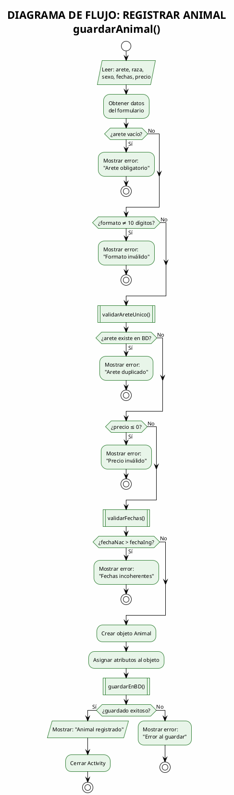
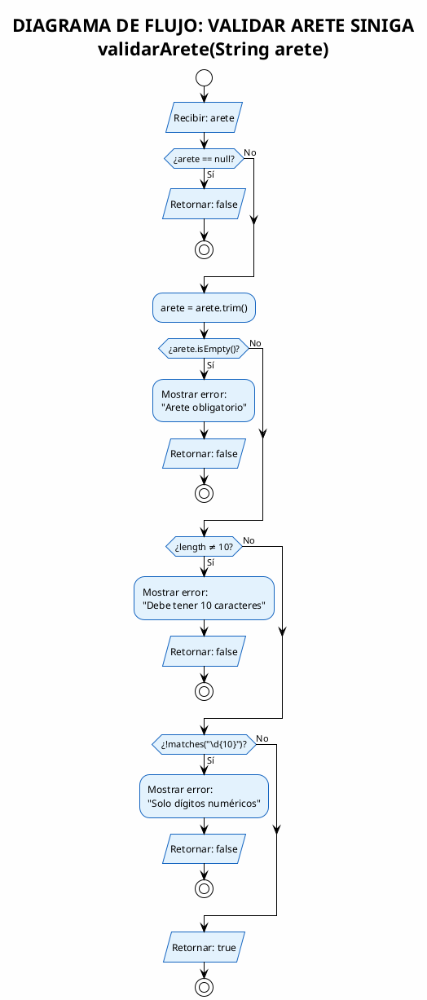
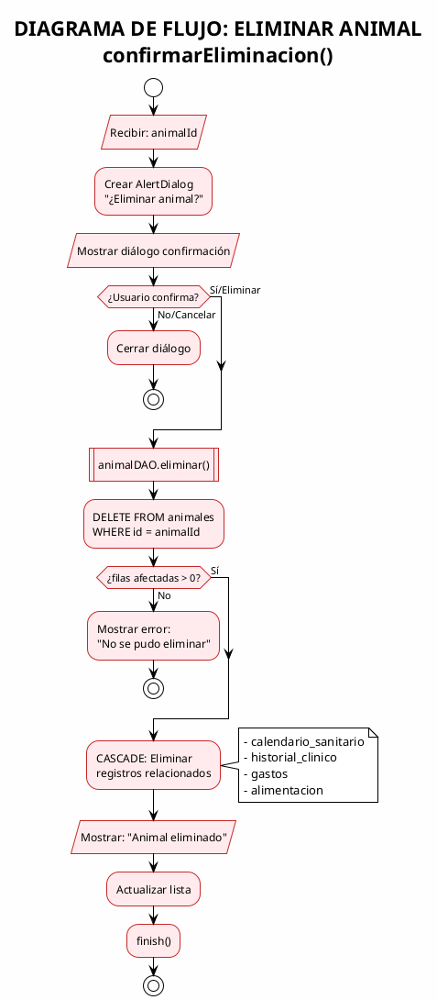
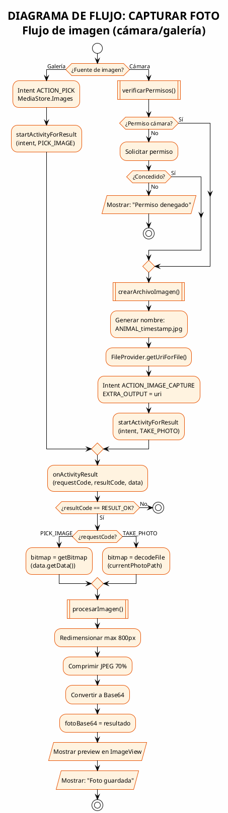
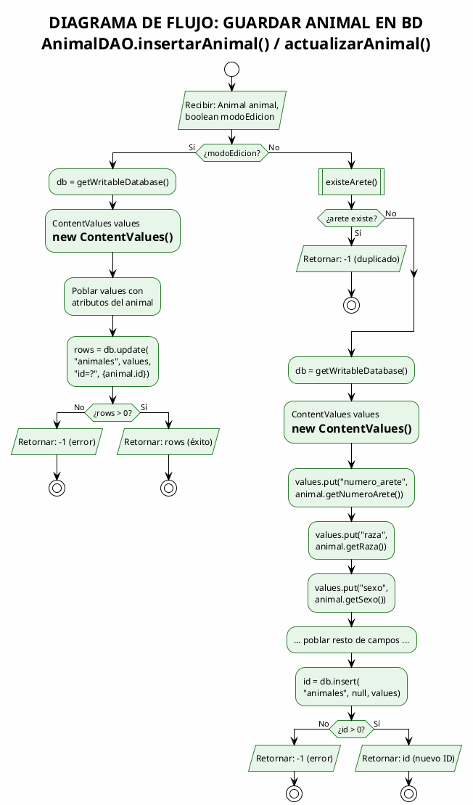
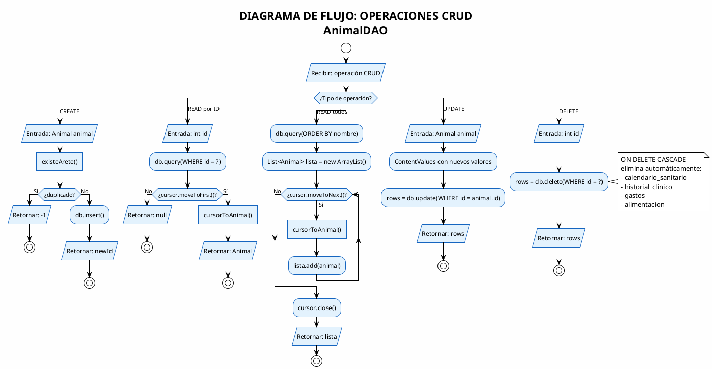
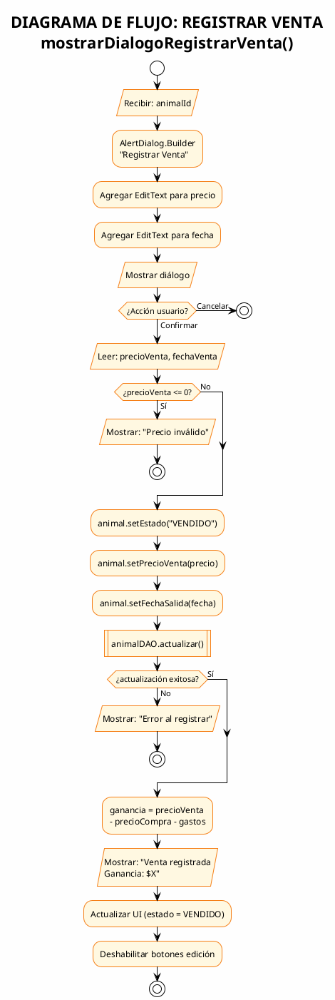
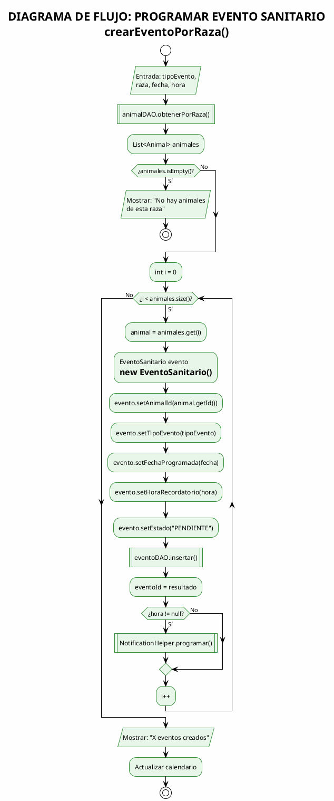
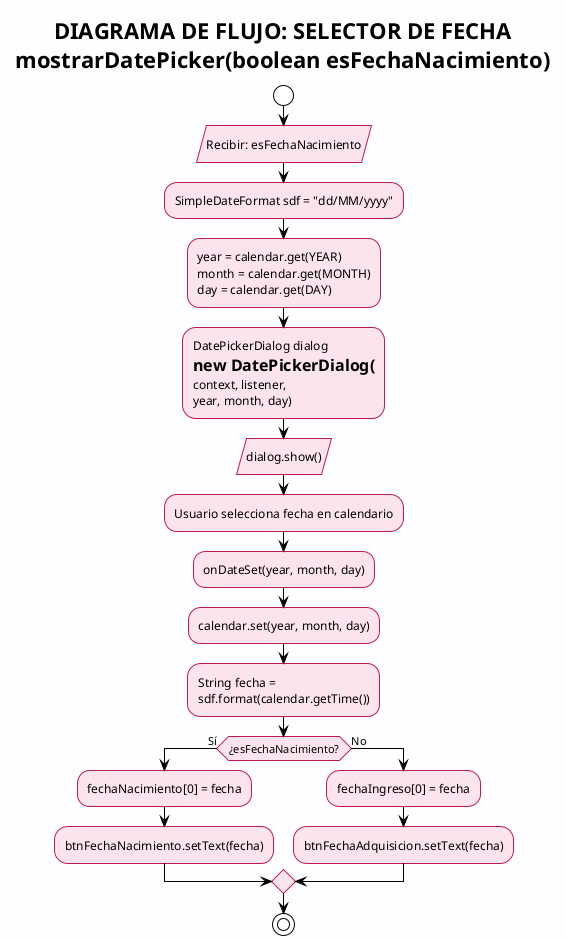
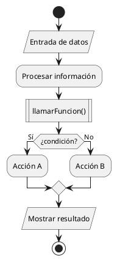

# Diagramas de Flujo - Algoritmos del Sistema AgroApp
## Notación Clásica de Diagramas de Flujo (Sintaxis Corregida)

### Simbología Utilizada

| Símbolo | Nombre | Descripción |
|---------|--------|-------------|
| ⬭ (Óvalo) | Inicio/Fin | Indica el comienzo o término del diagrama |
| ▭ (Rectángulo) | Proceso/Acción | Representa una operación o instrucción |
| ◇ (Rombo) | Decisión | Punto de bifurcación condicional |
| ▱ (Paralelogramo) | Entrada/Salida | Entrada o salida de datos |
| ⬡ (Rectángulo doble) | Subprograma | Llamada a otro procedimiento |
| ○ (Círculo) | Conector | Une partes del diagrama |

---

## Índice de Diagramas

| No. | Algoritmo | Descripción |
|-----|-----------|-------------|
| 1 | Registrar Animal | Flujo completo de registro |
| 2 | Validar Arete SINIGA | Validación de identificador |
| 3 | Eliminar Animal | Eliminación con confirmación |
| 4 | Capturar Foto | Cámara o galería |
| 5 | Guardar Animal en BD | Persistencia |
| 6 | Operaciones CRUD DAO | Acceso a datos |
| 7 | Registrar Venta | Proceso de venta |
| 8 | Programar Evento Sanitario | Calendario sanitario |
| 9 | Mostrar DatePicker | Selector de fecha |
| 10 | Ciclo de Vida Activity | Lifecycle Android |

---

## 1. Diagrama de Flujo: Registrar Animal



---

## 2. Diagrama de Flujo: Validar Arete SINIGA



---

## 3. Diagrama de Flujo: Eliminar Animal



---

## 4. Diagrama de Flujo: Capturar Foto



---

## 5. Diagrama de Flujo: Guardar Animal en BD



---

## 6. Diagrama de Flujo: Operaciones CRUD DAO



---

## 7. Diagrama de Flujo: Registrar Venta



---

## 8. Diagrama de Flujo: Programar Evento Sanitario



---

## 9. Diagrama de Flujo: Mostrar DatePicker



---

## 10. Diagrama de Flujo: Ciclo de Vida Activity

```plantuml
@startuml DF_CicloVida
!theme plain
skinparam backgroundColor #FEFEFE
skinparam ActivityBackgroundColor #E3F2FD
skinparam ActivityBorderColor #1976D2
skinparam DiamondBackgroundColor #FFF9C4

title DIAGRAMA DE FLUJO: CICLO DE VIDA ACTIVITY\nBaseActivity + RegistroAnimalActivity

start

partition onCreate {
  :onCreate(Bundle);
  :super.onCreate();
  :setContentView() layout XML;
  :inicializarVistas();
  :configurarSpinners();
  :configurarListeners();
}

partition onStart {
  :onStart();
}

partition onResume {
  :onResume();
  :BaseActivity.verificarSesion()|
  
  if (¿tiempo > 10 segundos?) then (Sí)
    :Mostrar diálogo contraseña/
    if (¿Contraseña correcta?) then (No)
      :Volver a LoginActivity;
      stop
    else (Sí)
    endif
  else (No)
  endif
}

:ACTIVITY RUNNING;

repeat
  :Usuario interactúa;
repeat while (¿Continúa en primer plano?) is (Sí)
->No;

partition onPause {
  :onPause();
  :BaseActivity.guardarTiempoActividad()|
  :SharedPreferences.putLong(timestamp);
}

partition onStop {
  :onStop();
}

if (¿Vuelve?) then (Sí)
  :onRestart();
  backward :onStart();
else (No)
endif

partition onDestroy {
  :onDestroy();
  :presenter.destruir()
  ExecutorService.shutdown();
  :Liberar recursos;
}

stop

@enduml
```

---

## Leyenda de Símbolos PlantUML (Sintaxis Correcta)

| PlantUML | Símbolo Clásico | Descripción |
|----------|-----------------|-------------|
| `start` | Óvalo verde | Inicio del diagrama |
| `stop` | Óvalo rojo | Fin del diagrama |
| `:Texto;` | Rectángulo | Acción o proceso |
| `:Texto\|` | Rectángulo con línea | Subprograma/Llamada |
| `:Texto/` | Paralelogramo | Entrada/Salida de datos |
| `if...then...else...endif` | Rombo | Decisión binaria |
| `switch...case...endswitch` | Rombos múltiples | Decisión múltiple |
| `while...endwhile` | Bucle | Iteración |
| `partition` | Grupo | Agrupa actividades |
| `note` | Nota | Documentación |

---

## Notas sobre la Sintaxis

### Símbolos de terminación en actividades:

```
:Proceso normal;          <- Termina con punto y coma
:Subprograma()|           <- Termina con pipe (subrutina)  
:Entrada o Salida/        <- Termina con slash (I/O)
```

### Ejemplo de cada tipo:



---

> **Nota**: Esta versión usa la sintaxis correcta de diagramas de actividad de PlantUML. Cada actividad usa los terminadores apropiados para indicar su tipo.
