# Diagramas de Flujo - Algoritmos del Sistema AgroApp
## Notación UML en PlantUML

---

## Índice de Diagramas

| No. | Algoritmo | Actividad Principal |
|-----|-----------|---------------------|
| 1 | Registrar Animal | RegistroAnimalActivity.guardarAnimal() |
| 2 | Actualizar Animal | RegistroAnimalActivity.guardarAnimal() (modo editar) |
| 3 | Eliminar Animal | DetalleAnimalActivity.confirmarEliminacion() |
| 4 | Consultar Animal | DetalleAnimalActivity.cargarDatos() |
| 5 | Registrar Venta | DetalleAnimalActivity.mostrarDialogoRegistrarVenta() |
| 6 | Programar Evento Sanitario | CalendarioActivity.crearEventoPorRaza() |
| 7 | Flujo de Notificaciones | NotificationHelper.programarNotificacion() |
| 8 | Marcar Evento como Realizado | EventosSanitariosActivity.mostrarOpcionesEvento() |
| 9 | Consultar Gastos con Filtro | GastosActivity.cargarGastos() |
| 10 | Registro de Compra Dividida | RegistroComprasActivity.guardarCompra() |
| 11 | Registrar Alimento | AlimentacionActivity.guardarAlimentacion() |
| 12 | Visualizar Estadística del Hato | MainActivity.cargarEstadisticas() |

---

## 1. Algoritmo: Registrar Animal


---

## 2. Algoritmo: Actualizar Animal


---

## 3. Algoritmo: Eliminar Animal

```plantuml
@startuml DiagramaFlujo_EliminarAnimal
!theme plain
skinparam activityBackgroundColor #FFEBEE
skinparam activityBorderColor #C62828
skinparam activityDiamondBackgroundColor #FFF9C4

title Diagrama de Flujo: Eliminar Animal\n(DetalleAnimalActivity.confirmarEliminacion())

|Usuario|
start
:Visualiza DetalleAnimalActivity;
:Presiona botón "Eliminar";

|DetalleAnimalActivity|
:confirmarEliminacion();
:animal = animalDAO.obtenerAnimalPorId(animalId);
:nombreAnimal = animal.getNombre();

:Crear AlertDialog.Builder;
:setTitle("⚠️ Confirmar Eliminación");
note right
  Mensaje de advertencia:
  "¿Está seguro de eliminar a {nombre}?
  
  ⚠️ ADVERTENCIA: Esta acción eliminará:
  • Todos los eventos sanitarios
  • Todo el historial clínico
  • Todos los registros de alimentación
  • Todos los gastos asociados
  
  Esta acción NO se puede deshacer."
end note

:show();

|Usuario|
if (¿Usuario confirma "Sí, eliminar"?) then (Cancelar)
  :dialog.dismiss();
  stop
endif

|DetalleAnimalActivity|
:Ejecutar eliminación;
:animalDAO.eliminarAnimal(animalId);

|AnimalDAO|
:db.delete("animales", "id = ?", animalId);
note right
  ON DELETE CASCADE elimina automáticamente:
  - eventos_sanitarios
  - gastos
  - alimentacion
  - historial_clinico
end note

|DetalleAnimalActivity|
:Toast.makeText("Animal eliminado exitosamente");
:finish();

|Usuario|
:Regresa a GestionAnimalesActivity;
:Lista de animales se actualiza;
stop

@enduml
```



---

## 4. Algoritmo: Consultar Animal

```plantuml
@startuml DiagramaFlujo_ConsultarAnimal
!theme plain
skinparam activityBackgroundColor #E8EAF6
skinparam activityBorderColor #3F51B5
skinparam activityDiamondBackgroundColor #FFF9C4

title Diagrama de Flujo: Consultar Animal\n(DetalleAnimalActivity.cargarDatos())

|Usuario|
start
:Selecciona animal en GestionAnimalesActivity;
:Tap en item de RecyclerView;

|GestionAnimalesActivity|
:Intent intent = new Intent(DetalleAnimalActivity);
:intent.putExtra("animalId", animal.getId());
:startActivity(intent);

|DetalleAnimalActivity|
:onCreate();
:animalId = getIntent().getIntExtra("animalId", -1);
:dbHelper = DatabaseHelper.getInstance(this);
:animalDAO = new AnimalDAO(dbHelper);
:gastoDAO = new GastoDAO(dbHelper);

:long startTime = System.currentTimeMillis();
note right: Medición RNF001 (< 2 segundos)

:inicializarVistas();
:cargarDatos();

:animal = animalDAO.obtenerAnimalPorId(animalId);

if (¿animal != null?) then (No)
  :mostrarError("Animal no encontrado");
  stop
endif

' Cargar datos del header
:tvNombre.setText(animal.getNombre());
:tvArete.setText("Arete: " + animal.getNumeroArete());

' Cargar foto
if (¿animal.getFoto() != null && !isEmpty?) then (Sí)
  :byte[] decoded = Base64.decode(animal.getFoto());
  :Bitmap bitmap = BitmapFactory.decodeByteArray(decoded);
  :ivFotoAnimal.setImageBitmap(bitmap);
endif

' Configurar badge estado
:badgeEstado.setText(estado);
:configurarBadgeEstado(estado);
note right
  switch(estado):
    "sano" → Verde #16a34a
    "enfermo" → Rojo #dc2626
    "vendido" → Morado #7e22ce
    "muerto" → Gris #6b7280
end note

' Cargar información grid
:tvRaza.setText(animal.getRaza());
:tvSexo.setText(animal.getSexo());
:tvEdad.setText(calcularEdad(animal.getFechaNacimiento()));
:tvFechaNacimiento.setText(animal.getFechaNacimiento());
:tvFechaIngreso.setText(animal.getFechaIngreso());

' Calcular inversión total (RD004)
:double precioCompra = animal.getPrecioCompra();
:double totalGastos = gastoDAO.obtenerTotalGastosPorAnimal(animalId);
:double inversionTotal = precioCompra + totalGastos;

:tvInversionTotal.setText(currencyFormatter.format(inversionTotal));
:tvPrecioCompra.setText("Compra: " + formatear(precioCompra));
:tvTotalGastos.setText("Gastos: " + formatear(totalGastos));

' Mostrar ganancia si vendido
if (¿animal.getFechaSalida() != null && precioVenta > 0?) then (Sí)
  :double ganancia = precioVenta - inversionTotal;
  :layoutGanancia.setVisibility(VISIBLE);
  :tvGanancia.setText(formatear(ganancia));
  if (¿ganancia >= 0?) then (Sí)
    :tvGanancia.setTextColor(Verde);
  else (No)
    :tvGanancia.setTextColor(Rojo);
  endif
  :btnRegistrarVenta.setVisibility(GONE);
else (No)
  :layoutGanancia.setVisibility(GONE);
  :btnRegistrarVenta.setVisibility(VISIBLE);
endif

:configurarListeners();

:long loadTime = System.currentTimeMillis() - startTime;
if (¿loadTime > 2000?) then (Sí)
  :Log.w("Tiempo de carga alto: " + loadTime + "ms");
  note right: Violación RNF001
endif

|Usuario|
:Visualiza información completa del animal;
stop

@enduml
```



---

## 5. Algoritmo: Registrar Venta


---

## 6. Algoritmo: Programar Evento Sanitario

```plantuml
@startuml DiagramaFlujo_ProgramarEventoSanitario
!theme plain
skinparam activityBackgroundColor #E0F7FA
skinparam activityBorderColor #00838F
skinparam activityDiamondBackgroundColor #FFF9C4

title Diagrama de Flujo: Programar Evento Sanitario\n(CalendarioActivity.crearEventoPorRaza())

|Usuario|
start
:Accede a CalendarioActivity;
:Presiona "Nuevo Evento";

|CalendarioActivity|
:mostrarDialogoNuevoEvento();
:View dialogView = inflate(dialog_evento_sanitario);

:Spinner spinnerRaza = findViewById(spinnerRaza);
:Spinner spinnerTipo = findViewById(spinnerTipo);
:Button btnFechaEvento = findViewById(btnFechaEvento);
:Button btnHoraEvento = findViewById(btnHoraEvento);
:EditText etDescripcion = findViewById(etDescripcion);
:EditText etCosto = findViewById(etCosto);

' Cargar razas únicas
:List<Animal> animales = animalDAO.obtenerTodosLosAnimales();
:Set<String> razasSet = new HashSet<>();
:foreach animal -> razasSet.add(animal.getRaza());
:spinnerRaza.setAdapter(razasSet);

' Configurar tipos
:String[] tipos = {"Vacuna", "Desparasitación", "Vitaminas", "Otro"};
:spinnerTipo.setAdapter(tipos);

' Configurar fecha y hora por defecto
:fechaSeleccionada = formato.format(Calendar.getInstance());
:horaSeleccionada = "09:00";

:dialog.show();

|Usuario|
:Selecciona raza;
:Selecciona tipo de evento;
:Selecciona fecha programada;
:Selecciona hora del recordatorio;
:Ingresa descripción;
:Ingresa costo (opcional);
:Presiona "Guardar";

|CalendarioActivity|
' Validar costo
:String costoStr = etCosto.getText();
:double costo = 0;

if (¿costoStr no está vacío?) then (Sí)
  :costo = Double.parseDouble(costoStr);
  if (¿costo < 0?) then (Sí)
    :Toast("El costo no puede ser negativo");
    stop
  endif
endif

if (¿razas.length > 0?) then (Sí)
  :String razaSeleccionada = spinnerRaza.getSelectedItem();
  :crearEventoPorRaza(razaSeleccionada, tipo, fecha, hora, descripcion, costo, sdf);
endif

|crearEventoPorRaza()|
:EventoSanitario evento = new EventoSanitario();
:evento.setRaza(raza);
:evento.setTipo(tipo);
:evento.setFechaProgramada(fecha);
:evento.setHoraRecordatorio(hora);
:evento.setDescripcion(descripcion);
:evento.setCosto(costo);
:evento.setEstado("Pendiente");
:evento.setRecordatorio(1);
note right: Recordatorio activado

:long eventoId = eventoDAO.insertarEvento(evento);
:evento.setId((int) eventoId);

|EventoSanitarioDAO|
:db.insert("eventos_sanitarios", valores);
:return lastInsertRowId;

|CalendarioActivity|
' Programar notificación
:evento.setFechaEvento(sdf.parse(fechaProgramada));
:NotificationHelper.programarNotificacion(this, evento);

|NotificationHelper|
:Ver Diagrama 7 - Flujo de Notificaciones;

|CalendarioActivity|
:Toast("Evento creado para raza " + razaSeleccionada);
:recreate();
note right: Recargar vista con nuevo evento

|Usuario|
:Evento aparece en calendario;
:Recibirá notificaciones según RF009;
stop

@enduml
```



---

## 7. Algoritmo: Flujo de Notificaciones

```plantuml
@startuml DiagramaFlujo_Notificaciones
!theme plain
skinparam activityBackgroundColor #FFFDE7
skinparam activityBorderColor #F9A825
skinparam activityDiamondBackgroundColor #FFF9C4

title Diagrama de Flujo: Flujo de Notificaciones (RF009)\n(NotificationHelper.programarNotificacion())

|CalendarioActivity|
start
:Crear evento sanitario;
:NotificationHelper.programarNotificacion(context, evento);

|NotificationHelper|
:programarNotificacion(context, evento);

if (¿evento.getRecordatorio() != 1?) then (Sí)
  :return;
  note right: Recordatorio desactivado
  stop
endif

:SimpleDateFormat sdf = new SimpleDateFormat("dd/MM/yyyy");
:Calendar calendar = Calendar.getInstance();
:calendar.setTime(sdf.parse(evento.getFechaProgramada()));

fork
  :Notificación 3 días antes;
  :programarNotificacionIndividual(context, evento, calendar, -3, "🔔 Recordatorio: ");
fork again
  :Notificación 1 día antes;
  :programarNotificacionIndividual(context, evento, calendar, -1, "⚠️ Recordatorio urgente: ");
fork again
  :Notificación mismo día;
  :programarNotificacionIndividual(context, evento, calendar, 0, "🚨 ¡HOY! ");
end fork

|programarNotificacionIndividual()|
:AlarmManager alarmManager = getSystemService(ALARM_SERVICE);

:Intent intent = new Intent(context, NotificationReceiver.class);
:intent.putExtra("titulo", prefijo + evento.getTipo());
:intent.putExtra("mensaje", evento.getDescripcion());
:intent.putExtra("eventoId", evento.getId());

' Calcular request code único
:int requestCode = evento.getId() * 100 + (diasOffset + 10);
note right
  Ejemplos:
  EventoId=5, -3 días → 5*100 + 7 = 507
  EventoId=5, -1 día  → 5*100 + 9 = 509
  EventoId=5, mismo día → 5*100 + 10 = 510
end note

:PendingIntent pendingIntent = PendingIntent.getBroadcast();

:Calendar calNotif = (Calendar) fechaEvento.clone();
:calNotif.add(Calendar.DAY_OF_MONTH, diasOffset);
:calNotif.set(Calendar.HOUR_OF_DAY, 9);
:calNotif.set(Calendar.MINUTE, 0);
note right: Todas las notificaciones a las 9:00 AM

:long triggerTime = calNotif.getTimeInMillis();
:long currentTime = System.currentTimeMillis();

if (¿triggerTime > currentTime?) then (Sí)
  if (¿Build.VERSION >= Android M?) then (Sí)
    :alarmManager.setExactAndAllowWhileIdle(RTC_WAKEUP, triggerTime, pendingIntent);
    note right: Mayor precisión en Doze mode
  else (No)
    :alarmManager.setExact(RTC_WAKEUP, triggerTime, pendingIntent);
  endif
else (No)
  :No programar (fecha pasada);
endif

|Sistema Android - AlarmManager|
:Almacena alarma programada;

== Cuando llega la hora programada ==

|NotificationReceiver|
:onReceive(context, intent);
:String titulo = intent.getStringExtra("titulo");
:String mensaje = intent.getStringExtra("mensaje");

:NotificationManager nm = getSystemService();
:NotificationCompat.Builder builder = new Builder();
:builder.setSmallIcon(R.drawable.ic_notification);
:builder.setContentTitle(titulo);
:builder.setContentText(mensaje);
:builder.setPriority(PRIORITY_HIGH);

:nm.notify(eventoId, builder.build());

|Usuario|
:Recibe notificación en dispositivo;
:Tap en notificación → Abre CalendarioActivity;
stop

@enduml
```

---

## 8. Algoritmo: Marcar Evento como Realizado

```plantuml
@startuml DiagramaFlujo_MarcarEventoRealizado
!theme plain
skinparam activityBackgroundColor #E8F5E9
skinparam activityBorderColor #388E3C
skinparam activityDiamondBackgroundColor #FFF9C4

title Diagrama de Flujo: Marcar Evento como Realizado\n(EventosSanitariosActivity.mostrarOpcionesEvento())

|Usuario|
start
:Accede a EventosSanitariosActivity;
:Tap en evento del RecyclerView;

|EventosSanitariosActivity|
:adapter.onItemClick(evento);
:mostrarOpcionesEvento(evento);

:String[] opciones = {"Editar", "Marcar como Realizado", "Eliminar"};
:AlertDialog.Builder builder = new AlertDialog.Builder();
:builder.setTitle("Opciones");
:builder.setItems(opciones, listener);
:dialog.show();

|Usuario|
:Selecciona "Marcar como Realizado";

|EventosSanitariosActivity|
:case 1: // Marcar como Realizado;

|ExecutorService|
:executorService.execute(() -> {});

:evento.setEstado("Realizado");
:String fechaHoy = sdf.format(Calendar.getInstance().getTime());
:evento.setFechaRealizada(fechaHoy);
note right
  Guarda la fecha en que se
  realizó efectivamente el evento
end note

:eventoDAO.actualizarEvento(evento);

|EventoSanitarioDAO|
:ContentValues valores = new ContentValues();
:valores.put("estado", "Realizado");
:valores.put("fecha_realizada", fechaRealizada);
:db.update("eventos_sanitarios", valores, "id = ?", evento.getId());

|EventosSanitariosActivity|
' Cancelar notificaciones pendientes (solo en CalendarioActivity)
note right
  En EventosSanitariosActivity no se
  cancelan las notificaciones programadas
  (se hace en CalendarioActivity)
end note

|Handler - MainThread|
:mainHandler.post(() -> {});

|EventosSanitariosActivity|
:Toast("Evento actualizado");
:cargarEventos();

|cargarEventos()|
:eventosList = eventoDAO.obtenerEventosPorAnimal(animalId);
:adapter = new EventoSanitarioAdapter(eventosList);
:recyclerView.setAdapter(adapter);

|Usuario|
:Evento aparece con estado "Realizado";
:Color del badge cambia a verde;
stop

@enduml
```



---

## 9. Algoritmo: Consultar Gastos con Filtro

```plantuml
@startuml DiagramaFlujo_ConsultarGastos
!theme plain
skinparam activityBackgroundColor #FFF3E0
skinparam activityBorderColor #E65100
skinparam activityDiamondBackgroundColor #FFF9C4

title Diagrama de Flujo: Consultar Gastos con Filtro\n(GastosActivity.cargarGastos())

|Usuario|
start

fork
  :Desde MainActivity;
  :cardGastos.onClick();
  :Intent intent = new Intent(GastosActivity);
  note right: Sin filtro de animal
fork again
  :Desde DetalleAnimalActivity;
  :cardGastos.onClick();
  :intent.putExtra("animalId", animalId);
  note right: Con filtro de animal específico
end fork

:startActivity(intent);

|GastosActivity|
:onCreate();
:gastoDAO = new GastoDAO(dbHelper);
:animalDAO = new AnimalDAO(dbHelper);

:animalIdFiltro = getIntent().getIntExtra("animalId", -1);
note right
  animalIdFiltro = -1 → Sin filtro (todos)
  animalIdFiltro > 0 → Filtrar por animal
end note

:recyclerView.setLayoutManager(new LinearLayoutManager());
:gastosList = new ArrayList<>();
:adapter = new GastoAdapter(gastosList, animalDAO, onItemClick);
:recyclerView.setAdapter(adapter);

:cargarGastos();

|cargarGastos()|
|ExecutorService|
:executorService.execute(() -> {});

:List<Gasto> nuevosGastos;

if (¿animalIdFiltro != -1?) then (Filtrado)
  :nuevosGastos = gastoDAO.obtenerGastosPorAnimal(animalIdFiltro);
  
  |GastoDAO|
  :String sql = "SELECT * FROM gastos WHERE animal_id = ?";
  :cursor = db.rawQuery(sql, animalId);
  :Construir lista de Gasto desde cursor;
  
else (Sin filtro)
  :nuevosGastos = gastoDAO.obtenerTodosLosGastos();
  
  |GastoDAO|
  :String sql = "SELECT * FROM gastos ORDER BY fecha DESC";
  :cursor = db.rawQuery(sql);
  :Construir lista de Gasto desde cursor;
endif

|Handler - MainThread|
:mainHandler.post(() -> {});

|GastosActivity|
:gastosList.clear();
:gastosList.addAll(nuevosGastos);
:adapter.notifyDataSetChanged();

|Usuario|
:Visualiza lista de gastos;

if (¿Usuario hace tap en gasto?) then (Sí)
  :mostrarOpcionesGasto(gasto);
  :Opciones: Editar / Eliminar;
endif

stop

@enduml
```



---

## 10. Algoritmo: Registro de Compra Dividida


---

## 11. Algoritmo: Registrar Alimento


---

## 12. Algoritmo: Visualizar Estadística del Hato

```plantuml
@startuml DiagramaFlujo_EstadisticaHato
!theme plain
skinparam activityBackgroundColor #E1F5FE
skinparam activityBorderColor #0277BD
skinparam activityDiamondBackgroundColor #FFF9C4

title Diagrama de Flujo: Visualizar Estadística del Hato\n(MainActivity.cargarEstadisticas())

|Usuario|
start
:Abre la aplicación;
:Login exitoso;

|MainActivity|
:onCreate();
:executorService = Executors.newSingleThreadExecutor();
:mainHandler = new Handler(Looper.getMainLooper());
:animalDAO = new AnimalDAO(dbHelper);
:eventoDAO = new EventoSanitarioDAO(dbHelper);

:inicializarVistas();
note right
  tvAnimalesActivos
  tvAnimalesSanos
  tvAnimalesVendidos
  tvAnimalesMuertos
  tvVacunasPendientes
  cardVacunaAlert
  badgeCalendario
end note

:cargarEstadisticas();

|cargarEstadisticas()|
|ExecutorService|
:executorService.execute(() -> {});

:List<Animal> todosLosAnimales = animalDAO.obtenerTodos();

' Inicializar contadores
:int activos = 0;
:int sanos = 0;
:int vendidos = 0;
:int muertos = 0;

:foreach Animal animal in todosLosAnimales:;
:  String estado = animal.getEstado();

if (¿animal.getFechaSalida() != null && !isEmpty?) then (Vendido)
  :vendidos++;
else if (¿"Muerto".equalsIgnoreCase(estado)?) then (Muerto)
  :muertos++;
else (Activo)
  :activos++;
  if (¿"Sano".equalsIgnoreCase(estado)?) then (Sí)
    :sanos++;
  endif
endif

' Verificar vacunas pendientes (próximos 7 días)
:List<EventoSanitario> eventosPendientes = eventoDAO.obtenerEventosPendientes();
:int vacunasPendientes = 0;

:Calendar hoy = Calendar.getInstance();
:Calendar limiteDias = Calendar.getInstance();
:limiteDias.add(Calendar.DAY_OF_MONTH, 7);

:foreach EventoSanitario evento in eventosPendientes:;
:  Date fechaProgramada = sdf.parse(evento.getFechaProgramada());
:  Calendar calEvento = Calendar.getInstance();
:  calEvento.setTime(fechaProgramada);

if (¿calEvento >= hoy && calEvento <= limiteDias?) then (Dentro de 7 días)
  :vacunasPendientes++;
endif

' Preparar datos finales
:final int finalActivos = activos;
:final int finalSanos = sanos;
:final int finalVendidos = vendidos;
:final int finalMuertos = muertos;
:final int finalVacunas = vacunasPendientes;

|Handler - MainThread|
:mainHandler.post(() -> {});

|MainActivity|
' Actualizar TextViews
:tvAnimalesActivos.setText(String.valueOf(finalActivos));
:tvAnimalesSanos.setText(String.valueOf(finalSanos));
:tvAnimalesVendidos.setText(String.valueOf(finalVendidos));
:tvAnimalesMuertos.setText(String.valueOf(finalMuertos));

' Mostrar/ocultar alerta de vacunas
if (¿finalVacunas > 0?) then (Sí)
  :cardVacunaAlert.setVisibility(VISIBLE);
  :badgeCalendario.setVisibility(VISIBLE);
  :badgeCalendario.setText(String.valueOf(finalVacunas));
  
  if (¿finalVacunas == 1?) then (Singular)
    :tvVacunasPendientes.setText("Tienes 1 vacuna próxima a vencer");
  else (Plural)
    :tvVacunasPendientes.setText("Tienes " + finalVacunas + " vacunas próximas a vencer");
  endif
else (No)
  :cardVacunaAlert.setVisibility(GONE);
  :badgeCalendario.setVisibility(GONE);
endif

|Usuario|
:Visualiza dashboard con estadísticas;
note right
  Panel principal muestra:
  ┌─────────────────────────┐
  │ 🐄 Activos: XX         │
  │ ✅ Sanos: XX            │
  │ 💰 Vendidos: XX         │
  │ ☠️ Muertos: XX          │
  ├─────────────────────────┤
  │ ⚠️ X vacunas próximas   │
  └─────────────────────────┘
end note

stop

@enduml
```



---

## Resumen de Flujos y Componentes

| Diagrama | Activity/Helper | DAO | Hilos |
|----------|-----------------|-----|-------|
| 1. Registrar Animal | RegistroAnimalActivity, AnimalPresenter | AnimalDAO | ExecutorService + Handler |
| 2. Actualizar Animal | RegistroAnimalActivity (modo editar) | AnimalDAO | ExecutorService + Handler |
| 3. Eliminar Animal | DetalleAnimalActivity | AnimalDAO | Síncrono (UI Thread) |
| 4. Consultar Animal | DetalleAnimalActivity | AnimalDAO, GastoDAO | Síncrono |
| 5. Registrar Venta | DetalleAnimalActivity | AnimalDAO | ExecutorService + Handler |
| 6. Programar Evento | CalendarioActivity | EventoSanitarioDAO | Síncrono |
| 7. Notificaciones | NotificationHelper, NotificationReceiver | - | AlarmManager |
| 8. Marcar Realizado | EventosSanitariosActivity | EventoSanitarioDAO | ExecutorService + Handler |
| 9. Consultar Gastos | GastosActivity | GastoDAO | ExecutorService + Handler |
| 10. Compra Dividida | RegistroComprasActivity | GastoDAO | ExecutorService + Handler |
| 11. Registrar Alimento | AlimentacionActivity | AlimentacionDAO | ExecutorService + Handler |
| 12. Estadística Hato | MainActivity | AnimalDAO, EventoSanitarioDAO | ExecutorService + Handler |

---

**Documento generado automáticamente basado en el código fuente del sistema AgroApp**
