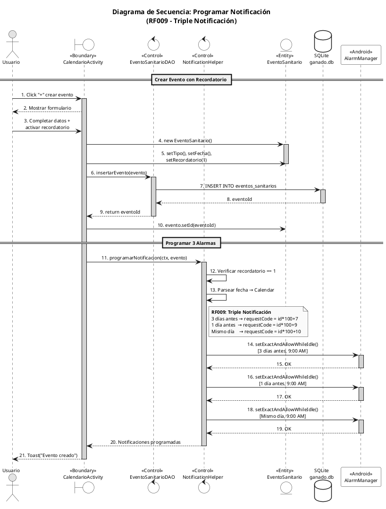
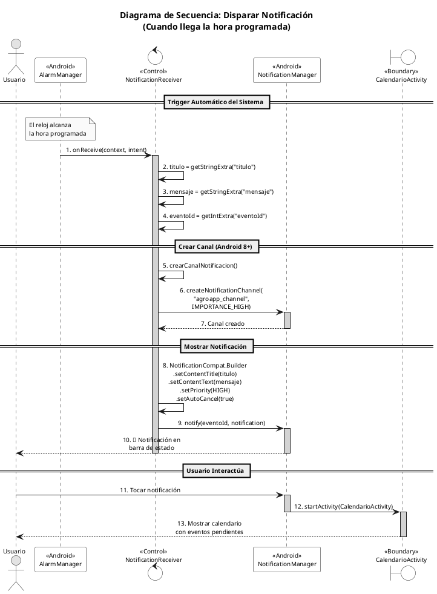
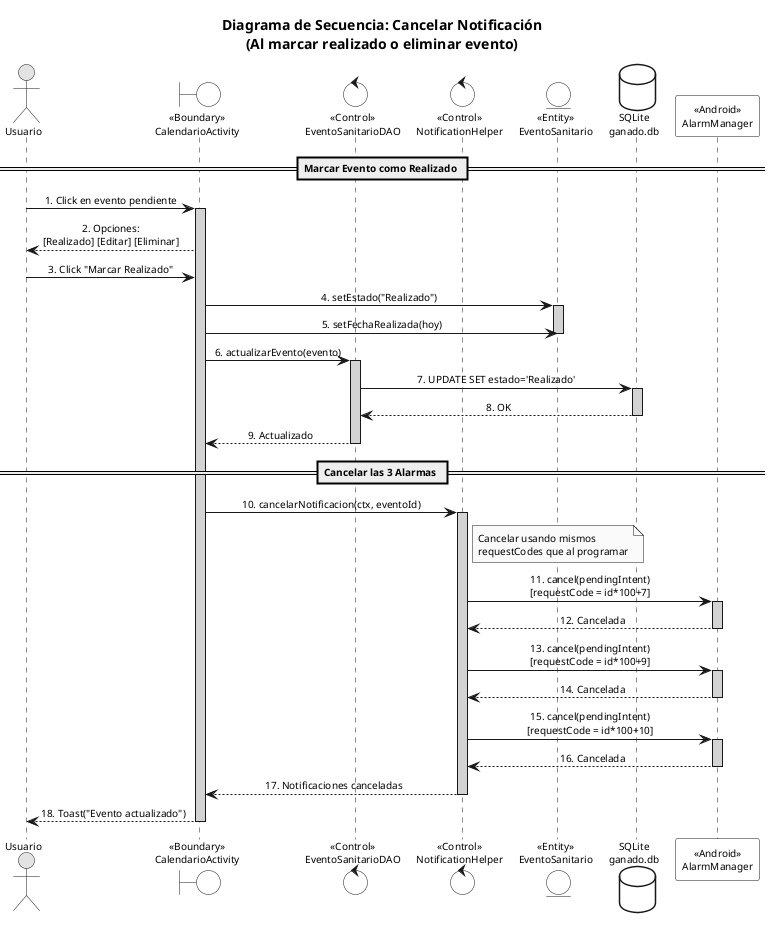
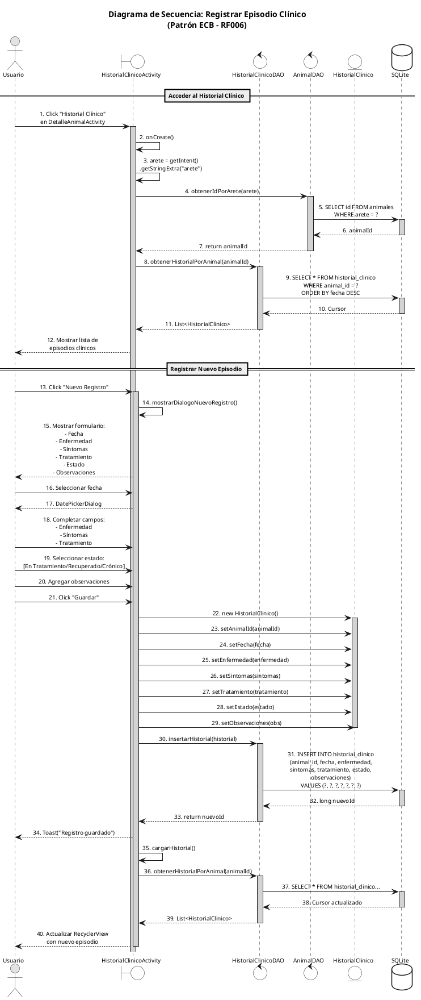
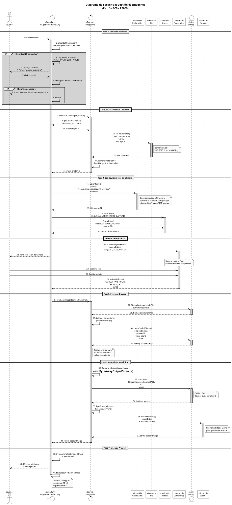

# Diagramas de Secuencia - Patrón ECB (Entity-Control-Boundary)

## Patrón ECB en AgroApp

El patrón ECB separa las responsabilidades en tres tipos de clases:
- **Boundary (Frontera)**: Interfaces de usuario (Activities, Layouts)
- **Control**: Lógica de negocio (Presenters, DAOs)
- **Entity (Entidad)**: Objetos de datos (Models)

---

## Ilustración 41 - Diagrama de Secuencia: Registrar Animal

```plantuml
@startuml DiagramaSecuencia_RegistrarAnimal_ECB
!pragma teoz true
skinparam monochrome true
skinparam shadowing false
skinparam defaultFontName Arial
skinparam defaultFontSize 11
skinparam sequenceMessageAlign center
skinparam responseMessageBelowArrow true
skinparam maxMessageSize 200
skinparam sequenceParticipant underline

title **Ilustración 41 - Diagrama de Secuencia ECB: Registrar Animal**\n(Patrón Entity-Control-Boundary)

' === DEFINICIÓN DE PARTICIPANTES CON ESTEREOTIPOS ECB ===
actor "Usuario\n(Productor)" as U
boundary "<<Boundary>>\nRegistroAnimal\nActivity" as B #white
control "<<Control>>\nAnimalPresenter" as CP #white
entity "<<Entity>>\nAnimal\n(Objeto)" as E #white
control "<<Control>>\nAnimalDAO\n(Gestor Datos)" as C #white
database "SQLite\nganado.db" as DB #white

' === FASE 1: INICIALIZACIÓN ===
== FASE 1: Inicialización de la Vista ==

U -> B : 1. Abrir Registro Animal
activate B #LightGray

B -> B : 2. onCreate()
B -> C : 3. <<create>> new AnimalDAO(dbHelper)
B -> CP : 4. <<create>> new AnimalPresenter(animalDAO, this)
B -> B : 5. inicializarVistas()
B -> B : 6. configurarSpinners()\n[Razas, Sexos, Estados]
B -> B : 7. configurarListeners()
B --> U : 8. Mostrar formulario vacío

' === FASE 2: CAPTURA DE DATOS ===
== FASE 2: Captura de Datos del Usuario ==

U -> B : 9. Ingresar número de arete\n(10 dígitos SINIGA)
U -> B : 10. Seleccionar raza
U -> B : 11. Seleccionar sexo
U -> B : 12. Seleccionar fecha nacimiento
U -> B : 13. Seleccionar fecha ingreso
U -> B : 14. Ingresar precio compra
U -> B : 15. Ingresar peso al nacer (kg)
U -> B : 16. Ingresar peso actual (kg)
U -> B : 17. Seleccionar/Tomar foto [opcional]
U -> B : 18. Ingresar observaciones [opcional]

' === FASE 3: VALIDACIÓN Y GUARDADO ===
== FASE 3: Validación y Persistencia ==

U -> B : 19. Click "Guardar"
activate B #LightGray

' Validaciones en el Boundary (Activity)
B -> B : 20. Validar campos obligatorios\n(arete, raza, sexo, fechas)
note right of B
  Validaciones locales con Toast:
  - Campo vacío → Toast error
  - Formato incorrecto → Toast error
end note

alt #LightGray Campos obligatorios vacíos
    B --> U : 21. Toast("Complete los campos obligatorios")
else Campos presentes
    
    ' Validación de formato de arete en Presenter
    B -> CP : 22. validarArete(arete)
    activate CP #LightGray
    CP -> CP : 23. Validar longitud == 10
    CP -> CP : 24. Validar solo dígitos
    CP --> B : 25. return boolean
    deactivate CP
    
    alt #LightGray Arete inválido
        B --> U : 26. Toast("Arete debe tener 10 dígitos numéricos")
    else Arete válido
        
        ' Validación de precio en Presenter
        B -> CP : 27. validarPrecio(precioCompra, "Precio de compra")
        activate CP #LightGray
        CP --> B : 28. return boolean
        deactivate CP
        
        ' Validación de coherencia de fechas en Presenter
        B -> CP : 29. validarFechasCoherentes(fechaNac, fechaIng)
        activate CP #LightGray
        CP -> CP : 30. Parsear fechas dd/MM/yyyy
        CP -> CP : 31. Validar fechaNac <= fechaIng
        CP --> B : 32. return boolean
        deactivate CP
        
        alt #LightGray Validaciones del Presenter fallan
            B --> U : 33. Toast(mensaje de error específico)
        else Todas las validaciones pasan
            
            ' Procesamiento de imagen en Presenter
            opt Foto seleccionada
                B -> CP : 34. procesarImagen(bitmap)
                activate CP #LightGray
                CP -> CP : 35. Redimensionar a max 800px
                CP -> CP : 36. Comprimir JPEG 70%
                CP -> CP : 37. Convertir a Base64
                CP --> B : 38. return String fotoBase64
                deactivate CP
            end
            
            ' Creación de la Entidad Animal
            B -> E : 39. <<create>> new Animal()
            activate E #LightGray
            B -> E : 40. setNumeroArete(arete)
            B -> E : 41. setRaza(raza)
            B -> E : 42. setSexo(sexo)
            B -> E : 43. setFechaNacimiento(fechaNac)
            B -> E : 44. setFechaIngreso(fechaIng)
            B -> E : 45. setPrecioCompra(precio)
            B -> E : 46. setPesoNacer(pesoNacer)
            B -> E : 47. setPesoActual(pesoActual)
            B -> E : 48. setFoto(fotoBase64)
            B -> E : 49. setObservaciones(obs)
            B -> E : 50. setEstado("Activo")
            deactivate E
            
            ' Guardado asíncrono vía Presenter
            B -> CP : 51. guardarAnimal(animal, false)
            activate CP #LightGray
            
            CP -> CP : 52. executorService.execute()
            note right of CP
              **RNF-001**: Ejecutar en
              hilo secundario para
              no bloquear UI
            end note
            
            ' El DAO verifica duplicados internamente
            CP -> C : 53. insertarAnimal(animal)
            activate C #LightGray
            
            ' Verificación interna de duplicados en DAO
            C -> C : 54. existeArete(animal.getNumeroArete())
            activate C #DarkGray
            C -> DB : 55. SELECT id FROM animales\nWHERE numero_arete = ?
            activate DB #LightGray
            DB --> C : 56. Cursor (resultado)
            deactivate DB
            C --> C : 57. return boolean (existe)
            deactivate C
            
            alt #LightGray Arete ya existe en BD
                C --> CP : 58. return -1 (error duplicado)
            else Arete disponible
                
                ' Inserción en base de datos
                C -> E : 59. getNumeroArete()
                activate E #LightGray
                E --> C : 60. return arete
                C -> E : 61. getRaza(), getSexo(), etc.
                E --> C : 62. return valores
                deactivate E
                
                C -> DB : 63. INSERT INTO animales\n(numero_arete, nombre, raza, sexo,\nfecha_nacimiento, fecha_ingreso,\nprecio_compra, peso_nacer, peso_actual,\nfoto, estado, observaciones)\nVALUES (?, ?, ?, ?, ?, ?, ?, ?, ?, ?, ?, ?)
                activate DB #LightGray
                DB --> C : 64. return long (nuevoId)
                deactivate DB
                
                C --> CP : 65. return long (nuevoId > 0)
            end
            deactivate C
            
            ' Callback al UI Thread
            CP -> CP : 66. view.ejecutarEnUIThread()
            
            alt #LightGray resultado == -1
                CP -> B : 67. mostrarError("Arete ya existe")
                B --> U : 68. Toast("El número de arete ya está registrado")
            else resultado > 0
                CP -> B : 69. mostrarExito("Animal registrado")
                B --> U : 70. Toast("Animal registrado exitosamente")
                CP -> B : 71. cerrarActividad()
                B -> B : 72. finish()
            end
            deactivate CP
        end
    end
end
deactivate B
deactivate B

' === NOTAS TÉCNICAS ===
note over CP
  **AnimalPresenter**:
  - Validaciones de formato
  - Procesamiento de imagen
  - Operaciones asíncronas
  - Interfaz con vista vía callbacks
end note

note over C
  **Patrón DAO**:
  - existeArete() es INTERNO
  - insertarAnimal() verifica
    duplicados automáticamente
end note

note over E
  **POJO**: Objeto de
  transferencia sin
  lógica de negocio
end note

' === LEYENDA ECB ===
legend right
  |= Componente |= Tipo ECB |= Clase Real |
  | Boundary | Activity | RegistroAnimalActivity |
  | Control | Presenter | AnimalPresenter |
  | Control | DAO | AnimalDAO |
  | Entity | Model | Animal |
endlegend

@enduml
```



### Descripción del Flujo - Registrar Animal

| Paso | Componente | Tipo ECB | Descripción |
|------|------------|----------|-------------|
| 1-8 | RegistroAnimalActivity | Boundary | Inicializa la interfaz de usuario, crea Presenter y DAO |
| 9-18 | RegistroAnimalActivity | Boundary | Captura datos del formulario del usuario |
| 19-21 | RegistroAnimalActivity | Boundary | Valida campos obligatorios localmente |
| 22-32 | AnimalPresenter | Control | Valida formato de arete, precio y coherencia de fechas |
| 34-38 | AnimalPresenter | Control | Procesa imagen (redimensiona, comprime, Base64) |
| 39-50 | Animal | Entity | Crea y configura objeto de datos |
| 51-52 | AnimalPresenter | Control | Inicia guardado asíncrono en hilo secundario |
| 53-65 | AnimalDAO | Control | Verifica duplicados internamente e inserta en BD |
| 66-72 | AnimalPresenter → Activity | Control → Boundary | Callback al UI thread y cierra actividad |

---

## Ilustración 42 - Diagrama de Secuencia: Cargar Animal

```plantuml
@startuml DiagramaSecuencia_CargarAnimal_ECB
!pragma teoz true
skinparam monochrome true
skinparam shadowing false
skinparam defaultFontName Arial
skinparam defaultFontSize 11
skinparam sequenceMessageAlign center
skinparam responseMessageBelowArrow true
skinparam maxMessageSize 200
skinparam sequenceParticipant underline

title **Ilustración 42 - Diagrama de Secuencia ECB: Cargar Animal**\n(Patrón Entity-Control-Boundary)

' === DEFINICIÓN DE PARTICIPANTES CON ESTEREOTIPOS ECB ===
actor "Usuario\n(Productor)" as U
boundary "<<Boundary>>\nGestionAnimales\nActivity" as B1 #white
boundary "<<Boundary>>\nDetalleAnimal\nActivity" as B2 #white
boundary "<<Boundary>>\nRegistroAnimal\nActivity" as B3 #white
control "<<Control>>\nAnimalPresenter" as CP #white
control "<<Control>>\nAnimalDAO\n(Gestor Datos)" as C #white
entity "<<Entity>>\nAnimal\n(Objeto)" as E #white
database "SQLite\nganado.db" as DB #white

' === ESCENARIO A: CARGAR LISTA ===
== ESCENARIO A: Cargar Lista de Animales ==

U -> B1 : 1. Abrir Gestión de Animales
activate B1 #LightGray

B1 -> B1 : 2. onCreate()
B1 -> B1 : 3. inicializarVistas()

B1 -> C : 4. obtenerTodosLosAnimales()
activate C #LightGray

C -> DB : 5. SELECT * FROM animales\nORDER BY nombre ASC
activate DB #LightGray
DB --> C : 6. Cursor (n registros)
deactivate DB

loop Para cada registro en Cursor
    C -> E : 7. <<create>> new Animal()
    activate E #LightGray
    C -> E : 8. cursorToAnimal(cursor)
    note right of E
      Mapeo de columnas:
      - id → setId()
      - numero_arete → setNumeroArete()
      - raza → setRaza()
      - sexo → setSexo()
      - peso_nacer → setPesoNacer()
      - peso_actual → setPesoActual()
      - estado → setEstado()
    end note
    E --> C : 9. Animal configurado
    deactivate E
    C -> C : 10. lista.add(animal)
end

C --> B1 : 11. return List<Animal>
deactivate C

B1 -> B1 : 12. adapter = new AnimalAdapter(lista)
B1 -> B1 : 13. recyclerView.setAdapter(adapter)
B1 --> U : 14. Mostrar lista de animales\nen RecyclerView

' === ESCENARIO B: CARGAR DETALLE ===
== ESCENARIO B: Cargar Detalle de Animal por Arete ==

U -> B1 : 15. Click en animal de la lista
B1 -> E : 16. animal.getNumeroArete()
activate E #LightGray
E --> B1 : 17. return String arete
deactivate E

B1 -> B2 : 18. Intent intent = new Intent()
B1 -> B2 : 19. intent.putExtra("arete", arete)
B1 -> B2 : 20. startActivity(intent)
deactivate B1

activate B2 #LightGray
B2 -> B2 : 21. onCreate()
B2 -> B2 : 22. arete = getIntent()\n.getStringExtra("arete")
B2 -> B2 : 23. inicializarVistas()

B2 -> C : 24. obtenerAnimalPorArete(arete)
activate C #LightGray

C -> DB : 25. SELECT * FROM animales\nWHERE numero_arete = ?
activate DB #LightGray
DB --> C : 26. Cursor (1 registro)
deactivate DB

C -> E : 27. <<create>> new Animal()
activate E #LightGray
C -> E : 28. cursorToAnimal(cursor)
E --> C : 29. Animal configurado
deactivate E

C --> B2 : 30. return Animal
deactivate C

B2 -> B2 : 31. cargarDatosEnVista(animal)
note right of B2
  Actualizar UI:
  - tvNombre.setText(nombre)
  - tvArete.setText(arete)
  - tvRaza.setText(raza)
  - tvSexo.setText(sexo)
  - tvPesoActual.setText(peso)
  - ivFoto.setImageBitmap(foto)
  - badgeEstado.setText(estado)
end note

B2 --> U : 32. Mostrar detalle del animal

' === ESCENARIO C: CARGAR PARA EDICIÓN ===
== ESCENARIO C: Cargar Animal para Edición ==

U -> B2 : 33. Click botón "Editar"

B2 -> B3 : 34. Intent intent = new Intent()
B2 -> B3 : 35. intent.putExtra("modo", "editar")
B2 -> B3 : 36. intent.putExtra("arete", arete)
B2 -> B3 : 37. startActivity(intent)
deactivate B2

activate B3 #LightGray
B3 -> B3 : 38. onCreate()
B3 -> B3 : 39. modo = getStringExtra("modo")
B3 -> B3 : 40. arete = getStringExtra("arete")

alt #LightGray modo == "editar" && arete != null
    B3 -> B3 : 41. etArete.setEnabled(false)
    B3 -> B3 : 42. etArete.setAlpha(0.5f)
    note right of B3
      Bloquear edición del arete
      (identificador único SINIGA)
    end note
    
    B3 -> CP : 43. cargarAnimalPorArete(arete, callback)
    activate CP #LightGray
    
    CP -> CP : 44. executorService.execute()
    note right of CP
      **RNF-001**: Ejecutar en
      hilo secundario para
      no bloquear UI
    end note
    
    CP -> C : 45. obtenerAnimalPorArete(arete)
    activate C #LightGray
    
    C -> DB : 46. SELECT * FROM animales\nWHERE numero_arete = ?
    activate DB #LightGray
    DB --> C : 47. Cursor (1 registro)
    deactivate DB
    
    C -> E : 48. <<create>> new Animal()
    activate E #LightGray
    C -> E : 49. cursorToAnimal(cursor)
    E --> C : 50. Animal configurado
    deactivate E
    
    C --> CP : 51. return Animal
    deactivate C
    
    CP -> CP : 52. view.ejecutarEnUIThread()
    CP --> B3 : 53. callback.onAnimalCargado(animal)
    deactivate CP
    
    B3 -> E : 54. animal.getNumeroArete()
    activate E #LightGray
    E --> B3 : 55. return arete
    B3 -> E : 56. animal.getRaza()
    E --> B3 : 57. return raza
    B3 -> E : 58. animal.getSexo()
    E --> B3 : 59. return sexo
    B3 -> E : 60. animal.getPesoNacer()
    E --> B3 : 61. return pesoNacer
    B3 -> E : 62. animal.getPesoActual()
    E --> B3 : 63. return pesoActual
    B3 -> E : 64. animal.getFoto()
    E --> B3 : 65. return fotoBase64
    deactivate E
    
    B3 -> B3 : 66. Poblar formulario con datos
    note right of B3
      Actualizar campos:
      - etArete.setText(arete)
      - spinnerRaza.setSelection(raza)
      - spinnerSexo.setSelection(sexo)
      - btnFechaNac.setText(fechaNac)
      - etPrecioCompra.setText(precio)
      - etPesoNacer.setText(pesoNacer)
      - etPesoActual.setText(pesoActual)
      - ivFoto.setImageBitmap(foto)
    end note
    
    B3 --> U : 67. Mostrar formulario\ncon datos del animal
end
deactivate B3

' === NOTAS TÉCNICAS ===
note over B1, B2, B3
  **BOUNDARY**: Todas las Activities
  actúan como frontera entre el
  usuario y la lógica del sistema
end note

note over C
  **CONTROL - AnimalDAO**:
  - Encapsula operaciones CRUD
  - Traduce objetos ↔ SQL
  - Maneja conexiones a BD
end note

note over E
  **ENTITY - Animal**:
  Objeto de transferencia (POJO)
  sin lógica de negocio
end note

' === LEYENDA ECB ===
legend right
  |= Estereotipo |= Símbolo UML |= Responsabilidad |
  | <<Boundary>> | Círculo con T | Interfaz de Usuario |
  | <<Control>> | Círculo con flecha | Lógica de Negocio |
  | <<Entity>> | Círculo con línea | Datos Persistentes |
  |= Patrón |= Implementación |= Clase |
  | Boundary | Activity | GestionAnimalesActivity |
  | Boundary | Activity | DetalleAnimalActivity |
  | Boundary | Activity | RegistroAnimalActivity |
  | Control | DAO | AnimalDAO |
  | Control | Presenter | AnimalPresenter |
  | Entity | Model | Animal |
endlegend

@enduml
```

### Descripción del Flujo - Cargar Animal

#### Escenario A: Cargar Lista de Animales (Pasos 1-14)

| Paso | Componente | Tipo ECB | Descripción |
|------|------------|----------|-------------|
| 1-3 | GestionAnimalesActivity | Boundary | Inicializa la actividad y vistas |
| 4 | AnimalDAO | Control | Solicita todos los animales |
| 5-6 | SQLite Database | - | Ejecuta consulta SELECT |
| 7-10 | Animal + AnimalDAO | Entity/Control | Crea objetos desde cursor |
| 11 | AnimalDAO | Control | Retorna lista de animales |
| 12-14 | GestionAnimalesActivity | Boundary | Configura adapter y muestra lista |

#### Escenario B: Cargar Detalle por Arete (Pasos 15-32)

| Paso | Componente | Tipo ECB | Descripción |
|------|------------|----------|-------------|
| 15-17 | GestionAnimalesActivity | Boundary | Obtiene arete del animal seleccionado |
| 18-20 | GestionAnimalesActivity | Boundary | Navega a DetalleAnimalActivity con arete |
| 21-23 | DetalleAnimalActivity | Boundary | Inicializa y extrae arete del intent |
| 24-30 | AnimalDAO | Control | Busca animal por arete en BD |
| 31-32 | DetalleAnimalActivity | Boundary | Muestra datos en la vista |

#### Escenario C: Cargar para Edición (Pasos 33-67)

| Paso | Componente | Tipo ECB | Descripción |
|------|------------|----------|-------------|
| 33-37 | DetalleAnimalActivity | Boundary | Navega a edición con modo y arete |
| 38-42 | RegistroAnimalActivity | Boundary | Valida modo y bloquea campo arete |
| 43-44 | AnimalPresenter | Control | Inicia carga asíncrona en hilo secundario |
| 45-51 | AnimalDAO | Control | Obtiene animal de BD por arete |
| 52-53 | AnimalPresenter | Control | Retorna al hilo UI vía callback |
| 54-66 | RegistroAnimalActivity | Boundary | Obtiene datos y pobla formulario |
| 67 | RegistroAnimalActivity | Boundary | Muestra formulario listo para edición |

---

## Mapeo de Clases al Patrón ECB

```plantuml
@startuml MapeoClases_ECB
skinparam monochrome true
skinparam shadowing false
skinparam defaultFontName Arial
skinparam defaultFontSize 10
skinparam packageStyle rectangle

title **Mapeo de Clases al Patrón ECB - AgroApp**

package "<<Boundary>>\nCapa de Presentación" as BP #white {
    class "RegistroAnimalActivity" as RA {
        - etArete: EditText
        - spinnerRaza: Spinner
        - btnGuardar: Button
        - presenter: AnimalPresenter
        --
        + onCreate()
        + validarCamposLocales()
        + guardarAnimal()
        + cargarDatosAnimal()
    }
    
    class "DetalleAnimalActivity" as DA {
        - tvNombre: TextView
        - tvArete: TextView
        - ivFoto: ImageView
        --
        + cargarDatos()
        + mostrarDetalle()
    }
    
    class "GestionAnimalesActivity" as GA {
        - recyclerView: RecyclerView
        - adapter: AnimalAdapter
        --
        + cargarAnimales()
        + filtrarPorEstado()
    }
    
    class "activity_registro_animal.xml" as XML1 <<Layout>>
    class "activity_detalle_animal.xml" as XML2 <<Layout>>
    class "activity_gestion_animales.xml" as XML3 <<Layout>>
}

package "<<Control>>\nCapa de Lógica" as CP #white {
    class "AnimalPresenter" as AP {
        - animalDAO: AnimalDAO
        - executorService: ExecutorService
        - view: AnimalView
        --
        **Validaciones:**
        + validarArete(String): boolean
        + validarPrecio(double, String): boolean
        + validarFechasCoherentes(String, String): boolean
        --
        **Procesamiento Imagen:**
        + procesarImagen(Bitmap): String
        --
        **Operaciones Asíncronas:**
        + guardarAnimal(Animal, boolean)
        + cargarAnimalPorArete(String, Callback)
    }
    
    class "AnimalDAO" as AD {
        - dbHelper: DatabaseHelper
        --
        + insertarAnimal(Animal): long
        + actualizarAnimal(Animal): int
        + obtenerAnimalPorArete(String): Animal
        + obtenerIdPorArete(String): int
        + eliminarAnimalPorArete(String): int
        - existeArete(String): boolean
        - cursorToAnimal(Cursor): Animal
    }
}

package "<<Entity>>\nCapa de Datos" as EP #white {
    class "Animal" as A {
        - id: int
        - numeroArete: String
        - nombre: String
        - raza: String
        - sexo: String
        - fechaNacimiento: String
        - pesoNacer: double
        - pesoActual: double
        - estado: String
        - foto: String
        --
        + getters()
        + setters()
    }
}

database "SQLite\nganado.db" as DB #white

' Relaciones
RA --> AP : usa
RA ..> AP : implements AnimalView
DA --> AD : usa
GA --> AD : usa
AP --> AD : delega persistencia
AD --> A : crea/manipula
AD --> DB : CRUD

note bottom of A
  **POJO (Plain Old Java Object)**
  Sin lógica de negocio,
  solo atributos y accessors
end note

note right of AP
  **Responsabilidades del Presenter:**
  • Validación de formato (arete, fechas, precios)
  • Procesamiento de imagen (resize, compress, Base64)
  • Operaciones asíncronas (ExecutorService)
  • Comunicación con View vía callbacks
end note

note left of AD
  **Métodos internos (privados):**
  - existeArete() → usado internamente
    por insertarAnimal()
  - cursorToAnimal() → mapeo de cursor
    a objeto Animal
end note

@enduml
```

---

## Flujo de Comunicación ECB

```plantuml
@startuml FlujoComunicacion_ECB
skinparam monochrome true
skinparam shadowing false
skinparam defaultFontName Arial
skinparam defaultFontSize 11

title **Flujo de Comunicación ECB - AgroApp**

rectangle "<<Boundary>>\n**FRONTERA**" as B #white {
    :Activity;
    :Layout XML;
    :Adapter;
}

rectangle "<<Control>>\n**CONTROL**" as C #white {
    :AnimalPresenter;
    :AnimalDAO;
}

rectangle "<<Entity>>\n**ENTIDAD**" as E #white {
    :Animal;
    :(POJO);
}

B -right-> C : "Solicita operación"
C -right-> E : "Crea/Modifica"
E -left-> C : "Retorna datos"
C -left-> B : "Notifica resultado\n(callback UI thread)"

note bottom of B
  **Responsabilidades:**
  • Captura entrada usuario
  • Muestra información (Toast, UI)
  • Navegación entre pantallas
  • Validaciones locales simples
  • Eventos UI (clicks, gestos)
end note

note bottom of C
  **Responsabilidades AnimalPresenter:**
  • Validaciones de formato
  • Procesamiento de imagen
  • Operaciones asíncronas
  • Callback a UI thread
  
  **Responsabilidades AnimalDAO:**
  • Operaciones CRUD en BD
  • Verificación de duplicados
  • Mapeo Cursor → Animal
end note

note bottom of E
  **Responsabilidades:**
  • Almacenar atributos
  • Getters y Setters
  • Sin lógica de negocio
  • Transferencia de datos
end note

@enduml
```

---

## Notas sobre la Implementación Real

### Estructura Real del Código

```
┌─────────────────────────────────────────────────────────────────┐
│                        BOUNDARY                                  │
│  RegistroAnimalActivity, DetalleAnimalActivity,                  │
│  GestionAnimalesActivity                                         │
│  - Implementan AnimalPresenter.AnimalView                        │
│  - Validaciones locales con Toast                                │
└───────────────────────────┬─────────────────────────────────────┘
                            │ usa
                            ▼
┌─────────────────────────────────────────────────────────────────┐
│                        CONTROL                                   │
│  AnimalPresenter                                                 │
│  - validarArete(), validarPrecio(), validarFechasCoherentes()   │
│  - procesarImagen() → redimensiona, comprime, Base64            │
│  - guardarAnimal() → ExecutorService (hilo secundario)          │
│  - cargarAnimalPorArete() → callback asíncrono                  │
└───────────────────────────┬─────────────────────────────────────┘
                            │ delega
                            ▼
┌─────────────────────────────────────────────────────────────────┐
│                        CONTROL (DAO)                             │
│  AnimalDAO                                                       │
│  - insertarAnimal() → llama existeArete() internamente          │
│  - obtenerAnimalPorArete() → busca por arete                    │
│  - obtenerIdPorArete() → convierte arete → ID                   │
│  - cursorToAnimal() → mapeo privado de cursor a objeto          │
└───────────────────────────┬─────────────────────────────────────┘
                            │ manipula
                            ▼
┌─────────────────────────────────────────────────────────────────┐
│                        ENTITY                                    │
│  Animal (POJO)                                                   │
│  - Atributos: id, numeroArete, raza, sexo, pesoNacer, etc.      │
│  - Solo getters y setters, sin lógica de negocio                │
└─────────────────────────────────────────────────────────────────┘
```

### Uso del Arete como Identificador Visible

El sistema usa el **número de arete** (SINIGA de 10 dígitos) como identificador visible para el usuario:

```java
// Navegación entre Activities usa arete (NO el ID interno):
intent.putExtra("arete", animal.getNumeroArete());  // ✅ Correcto
```

### Conversión Arete → ID Interno

Para operaciones con FK (gastos, eventos, historial), se convierte el arete a ID interno:

```java
// En actividades que necesitan el ID para consultas FK:
animalArete = getIntent().getStringExtra("arete");
if (animalArete != null && !animalArete.isEmpty()) {
    animalId = animalDAO.obtenerIdPorArete(animalArete);
}
```

### Métodos Principales del AnimalPresenter

```java
// Validaciones (retornan boolean, muestran error via view)
boolean validarArete(String arete)
boolean validarPrecio(double precio, String nombreCampo)
boolean validarFechasCoherentes(String fechaNac, String fechaIng)

// Procesamiento de imagen
String procesarImagen(Bitmap bitmap)  // → Base64

// Operaciones asíncronas
void guardarAnimal(Animal animal, boolean modoEdicion)
void cargarAnimalPorArete(String arete, CargarAnimalCallback callback)
```

### Métodos del AnimalDAO

```java
// Búsqueda por arete (identificador visible)
Animal obtenerAnimalPorArete(String arete)

// Conversión arete → ID interno
int obtenerIdPorArete(String arete)

// Inserción (verifica duplicados internamente)
long insertarAnimal(Animal animal)  // retorna -1 si arete ya existe

// Eliminación por arete
int eliminarAnimalPorArete(String arete)
```

---

## Ilustración 43 - Diagrama de Secuencia: Proceso de Gestión de Animales

```plantuml
@startuml DiagramaSecuencia_GestionAnimales_Completo
!pragma teoz true
skinparam monochrome true
skinparam shadowing false
skinparam defaultFontName Arial
skinparam defaultFontSize 10
skinparam sequenceMessageAlign center
skinparam responseMessageBelowArrow true
skinparam maxMessageSize 180
skinparam sequenceParticipant underline

title **Diagrama de Secuencia: Proceso de Gestión de Animales**\n(Flujo Completo CRUD)

' === PARTICIPANTES ===
actor "Usuario\n(Productor)" as U
boundary "<<Boundary>>\nGestionAnimales\nActivity" as BG #white
boundary "<<Boundary>>\nRegistroAnimal\nActivity" as BR #white
boundary "<<Boundary>>\nDetalleAnimal\nActivity" as BD #white
control "<<Control>>\nAnimalPresenter" as CP #white
control "<<Control>>\nAnimalDAO" as C #white
entity "<<Entity>>\nAnimal" as E #white
database "SQLite\nganado.db" as DB #white

' ═══════════════════════════════════════════════════════════════
' CASO DE USO 1: LISTAR ANIMALES
' ═══════════════════════════════════════════════════════════════
== CU-01: Listar Animales ==

U -> BG : 1. Abrir módulo\n"Gestión de Animales"
activate BG #LightGray

BG -> BG : 2. onCreate()
BG -> C : 3. <<create>> new AnimalDAO(dbHelper)
BG -> BG : 4. inicializarVistas()
BG -> BG : 5. configurarFiltros()\n[Todos, Activos, Vendidos, Muertos]

BG -> C : 6. obtenerTodosLosAnimales()
activate C #LightGray

C -> DB : 7. SELECT * FROM animales\nORDER BY nombre ASC
activate DB #LightGray
DB --> C : 8. Cursor (n registros)
deactivate DB

loop Para cada registro
    C -> E : 9. cursorToAnimal(cursor)
    activate E #LightGray
    E --> C : 10. Animal
    deactivate E
end

C --> BG : 11. List<Animal>
deactivate C

BG -> BG : 12. adapter.setAnimales(lista)
BG -> BG : 13. recyclerView.notifyDataSetChanged()
BG --> U : 14. Mostrar lista en RecyclerView\n(tarjetas con arete, raza, estado)

' ═══════════════════════════════════════════════════════════════
' CASO DE USO 2: FILTRAR POR ESTADO
' ═══════════════════════════════════════════════════════════════
== CU-02: Filtrar Animales por Estado ==

U -> BG : 15. Seleccionar filtro\n(ej: "Activos")

BG -> C : 16. obtenerAnimalesPorEstado("Activo")
activate C #LightGray

C -> DB : 17. SELECT * FROM animales\nWHERE estado = ?\nORDER BY nombre ASC
activate DB #LightGray
DB --> C : 18. Cursor (registros filtrados)
deactivate DB

C --> BG : 19. List<Animal> filtrada
deactivate C

BG -> BG : 20. adapter.setAnimales(listaFiltrada)
BG --> U : 21. Actualizar RecyclerView

' ═══════════════════════════════════════════════════════════════
' CASO DE USO 3: VER DETALLE
' ═══════════════════════════════════════════════════════════════
== CU-03: Ver Detalle de Animal ==

U -> BG : 22. Click en tarjeta de animal
BG -> E : 23. animal.getNumeroArete()
activate E #LightGray
E --> BG : 24. String arete
deactivate E

BG -> BD : 25. Intent(arete)
BG -> BD : 26. startActivity()
deactivate BG

activate BD #LightGray
BD -> BD : 27. onCreate()
BD -> BD : 28. arete = getIntent().getStringExtra("arete")
BD -> C : 29. <<create>> new AnimalDAO(dbHelper)

BD -> C : 30. obtenerAnimalPorArete(arete)
activate C #LightGray

C -> DB : 31. SELECT * FROM animales\nWHERE numero_arete = ?
activate DB #LightGray
DB --> C : 32. Cursor (1 registro)
deactivate DB

C -> E : 33. cursorToAnimal(cursor)
activate E #LightGray
E --> C : 34. Animal completo
deactivate E

C --> BD : 35. Animal
deactivate C

BD -> BD : 36. cargarDatosEnVista()
note right of BD
  Mostrar en UI:
  - Arete (10 dígitos SINIGA)
  - Raza, Sexo, Estado
  - Peso nacer / Peso actual
  - Fecha nacimiento / ingreso
  - Foto (si existe)
  - Observaciones
end note

BD --> U : 37. Mostrar pantalla de detalle

' ═══════════════════════════════════════════════════════════════
' CASO DE USO 4: REGISTRAR NUEVO ANIMAL
' ═══════════════════════════════════════════════════════════════
== CU-04: Registrar Nuevo Animal ==

U -> BG : 38. Click FAB "+"
activate BG #LightGray

BG -> BR : 39. Intent(modo="nuevo")
BG -> BR : 40. startActivity()
deactivate BG

activate BR #LightGray
BR -> BR : 41. onCreate()
BR -> C : 42. <<create>> new AnimalDAO(dbHelper)
BR -> CP : 43. <<create>> new AnimalPresenter(dao, this)
BR -> BR : 44. inicializarFormulario()
BR --> U : 45. Mostrar formulario vacío

U -> BR : 46. Ingresar datos del animal\n(arete, raza, sexo, fechas, pesos, foto)
U -> BR : 47. Click "Guardar"

BR -> BR : 48. Validar campos obligatorios
BR -> CP : 49. validarArete(arete)
activate CP #LightGray
CP --> BR : 50. boolean (válido)
deactivate CP

BR -> CP : 51. validarFechasCoherentes(fechaNac, fechaIng)
activate CP #LightGray
CP --> BR : 52. boolean (válido)
deactivate CP

opt Foto seleccionada
    BR -> CP : 53. procesarImagen(bitmap)
    activate CP #LightGray
    CP --> BR : 54. String fotoBase64
    deactivate CP
end

BR -> E : 55. <<create>> new Animal()
activate E #LightGray
BR -> E : 56. setNumeroArete(), setRaza(), setSexo(),\nsetFechas(), setPesos(), setFoto(), setEstado("Activo")
deactivate E

BR -> CP : 57. guardarAnimal(animal, false)
activate CP #LightGray

CP -> CP : 58. executorService.execute()
note right of CP
  **Hilo secundario**
  (no bloquea UI)
end note

CP -> C : 59. insertarAnimal(animal)
activate C #LightGray

C -> C : 60. existeArete(arete)
activate C #DarkGray
C -> DB : 61. SELECT id WHERE arete = ?
activate DB #LightGray
DB --> C : 62. Cursor
deactivate DB
C --> C : 63. boolean existe
deactivate C

alt Arete ya existe
    C --> CP : 64. return -1
    CP -> BR : 65. mostrarError("Arete ya registrado")
    BR --> U : 66. Toast error
else Arete disponible
    C -> DB : 67. INSERT INTO animales VALUES(...)
    activate DB #LightGray
    DB --> C : 68. long nuevoId
    deactivate DB
    C --> CP : 69. return nuevoId
    deactivate C
    
    CP -> CP : 70. view.ejecutarEnUIThread()
    CP -> BR : 71. mostrarExito("Animal registrado")
    CP -> BR : 72. cerrarActividad()
    deactivate CP
    
    BR --> U : 73. Toast éxito
    BR -> BR : 74. finish()
    deactivate BR
end

' ═══════════════════════════════════════════════════════════════
' CASO DE USO 5: EDITAR ANIMAL
' ═══════════════════════════════════════════════════════════════
== CU-05: Editar Animal Existente ==

U -> BD : 75. Click botón "Editar"
activate BD #LightGray

BD -> BR : 76. Intent(modo="editar", arete)
BD -> BR : 77. startActivity()
deactivate BD

activate BR #LightGray
BR -> BR : 78. onCreate()
BR -> BR : 79. modo = "editar"
BR -> BR : 80. arete = getStringExtra("arete")
BR -> BR : 81. etArete.setEnabled(false)
note right of BR
  Bloquear edición del arete
  (identificador único SINIGA)
end note

BR -> C : 82. <<create>> new AnimalDAO(dbHelper)
BR -> CP : 83. <<create>> new AnimalPresenter(dao, this)

BR -> CP : 84. cargarAnimalPorArete(arete, callback)
activate CP #LightGray

CP -> C : 85. obtenerAnimalPorArete(arete)
activate C #LightGray
C -> DB : 86. SELECT * WHERE arete = ?
activate DB #LightGray
DB --> C : 87. Cursor
deactivate DB
C -> E : 88. cursorToAnimal()
activate E #LightGray
E --> C : 89. Animal
deactivate E
C --> CP : 90. Animal
deactivate C

CP -> BR : 91. callback.onAnimalCargado(animal)
deactivate CP

BR -> BR : 92. Poblar formulario con datos actuales
BR --> U : 93. Mostrar formulario con datos

U -> BR : 94. Modificar campos (peso, estado, etc.)
U -> BR : 95. Click "Guardar"

BR -> BR : 96. Validaciones
BR -> C : 97. obtenerIdPorArete(arete)
activate C #LightGray
C --> BR : 98. int animalId
deactivate C

BR -> E : 99. animal.setId(animalId)
activate E #LightGray
BR -> E : 100. Actualizar atributos modificados
deactivate E

BR -> CP : 101. guardarAnimal(animal, true)
activate CP #LightGray

CP -> C : 102. actualizarAnimal(animal)
activate C #LightGray
C -> DB : 103. UPDATE animales SET ... WHERE id = ?
activate DB #LightGray
DB --> C : 104. int filasAfectadas
deactivate DB
C --> CP : 105. resultado
deactivate C

CP -> BR : 106. mostrarExito("Animal actualizado")
CP -> BR : 107. cerrarActividad()
deactivate CP

BR --> U : 108. Toast éxito
BR -> BR : 109. finish()
deactivate BR

' ═══════════════════════════════════════════════════════════════
' CASO DE USO 6: ELIMINAR ANIMAL
' ═══════════════════════════════════════════════════════════════
== CU-06: Eliminar Animal ==

U -> BD : 110. Click botón "Eliminar"
activate BD #LightGray

BD -> BD : 111. Mostrar AlertDialog\n"¿Confirmar eliminación?"
BD --> U : 112. Diálogo de confirmación

U -> BD : 113. Click "Confirmar"

BD -> C : 114. eliminarAnimalPorArete(arete)
activate C #LightGray

C -> DB : 115. DELETE FROM animales\nWHERE numero_arete = ?
activate DB #LightGray
DB --> C : 116. int filasEliminadas
deactivate DB

C --> BD : 117. resultado
deactivate C

alt Eliminación exitosa
    BD --> U : 118. Toast("Animal eliminado")
    BD -> BD : 119. finish()
    deactivate BD
else Error
    BD --> U : 120. Toast("Error al eliminar")
end

' ═══════════════════════════════════════════════════════════════
' NOTAS Y LEYENDA
' ═══════════════════════════════════════════════════════════════

note over BG, BR, BD
  **BOUNDARY (Frontera)**
  Activities que interactúan con el usuario
  • Capturan eventos UI
  • Muestran datos y mensajes
  • Navegan entre pantallas
end note

note over CP
  **CONTROL (Presenter)**
  • Validaciones de formato
  • Procesamiento de imagen
  • Operaciones asíncronas
  • Comunicación UI thread
end note

note over C
  **CONTROL (DAO)**
  • Operaciones CRUD
  • Mapeo Cursor → Animal
  • Verificación duplicados
end note

note over E
  **ENTITY (Modelo)**
  POJO sin lógica de negocio
  Solo atributos y accessors
end note

legend right
  |= Caso de Uso |= Operación |= Participantes |
  | CU-01 | Listar | GestionAnimales → DAO → BD |
  | CU-02 | Filtrar | GestionAnimales → DAO → BD |
  | CU-03 | Ver Detalle | Gestión → Detalle → DAO |
  | CU-04 | Registrar | Registro → Presenter → DAO |
  | CU-05 | Editar | Detalle → Registro → Presenter |
  | CU-06 | Eliminar | Detalle → DAO → BD |
endlegend

@enduml
```

### Descripción del Proceso de Gestión de Animales

| Caso de Uso | Pasos | Descripción |
|-------------|-------|-------------|
| **CU-01: Listar** | 1-14 | Carga inicial de todos los animales en RecyclerView |
| **CU-02: Filtrar** | 15-21 | Filtra animales por estado (Activo, Vendido, Muerto) |
| **CU-03: Ver Detalle** | 22-37 | Muestra información completa de un animal por su arete |
| **CU-04: Registrar** | 38-74 | Crea nuevo animal con validaciones y operación asíncrona |
| **CU-05: Editar** | 75-109 | Modifica datos existentes (excepto el arete) |
| **CU-06: Eliminar** | 110-120 | Elimina animal con confirmación previa |

### Flujo de Navegación

```
┌─────────────────────────────────────────────────────────────────┐
│                    GestionAnimalesActivity                       │
│  ┌─────────────┐                              ┌───────────────┐ │
│  │ RecyclerView│ ←── Lista de animales        │  FAB (+)      │ │
│  │ con tarjetas│                              │  Nuevo animal │ │
│  └──────┬──────┘                              └───────┬───────┘ │
└─────────┼─────────────────────────────────────────────┼─────────┘
          │ Click en tarjeta                            │
          ▼                                             ▼
┌─────────────────────────┐              ┌─────────────────────────┐
│  DetalleAnimalActivity  │              │  RegistroAnimalActivity │
│  - Ver datos completos  │──────────────│  - modo = "nuevo"       │
│  - Botón Editar ────────┼─────────────▶│  - modo = "editar"      │
│  - Botón Eliminar       │              │  - Formulario completo  │
└─────────────────────────┘              └─────────────────────────┘
```

---

## Ilustración 44 - Diagrama de Secuencia: Login (Iniciar Sesión)

```plantuml
@startuml DiagramaSecuencia_Login_ECB
!pragma teoz true
skinparam monochrome true
skinparam shadowing false
skinparam defaultFontName Arial
skinparam defaultFontSize 10
skinparam sequenceMessageAlign center
skinparam responseMessageBelowArrow true
skinparam maxMessageSize 180
skinparam sequenceParticipant underline

title **Diagrama de Secuencia: Login (Iniciar Sesión)**\n(Patrón Entity-Control-Boundary)

' === PARTICIPANTES ===
actor "Usuario\n(Productor)" as U
boundary "<<Boundary>>\nLoginActivity" as B #white
control "<<Control>>\nUsuarioDAO" as C #white
entity "<<Entity>>\nUsuario" as E #white
database "SQLite\nganado.db" as DB #white
collections "<<Android>>\nSharedPreferences" as SP #white
boundary "<<Boundary>>\nMainActivity" as BM #white

' ═══════════════════════════════════════════════════════════════
' ESCENARIO 0: VERIFICACIÓN DE SESIÓN ACTIVA
' ═══════════════════════════════════════════════════════════════
== Escenario 0: Verificación de Sesión Activa ==

U -> B : 1. Abrir aplicación AgroApp
activate B #LightGray

B -> B : 2. onCreate()
B -> C : 3. <<create>> new UsuarioDAO(dbHelper)

B -> SP : 4. getSharedPreferences("AgroAppPrefs")
activate SP #LightGray
B -> SP : 5. getBoolean("isLoggedIn", false)
SP --> B : 6. boolean isLoggedIn
deactivate SP

alt #LightGray Sesión activa (isLoggedIn == true)
    B -> BM : 7. Intent(MainActivity)
    B -> BM : 8. startActivity()
    B -> B : 9. finish()
    B --> U : 10. Ir directamente al menú principal
else Sin sesión activa
    B -> B : 11. inicializarVistas()
    B -> B : 12. configurarListeners()
    B --> U : 13. Mostrar pantalla de login
end

' ═══════════════════════════════════════════════════════════════
' ESCENARIO A: INICIO DE SESIÓN EXITOSO
' ═══════════════════════════════════════════════════════════════
== Escenario A: Inicio de Sesión Exitoso ==

U -> B : 14. Ingresar nombre de usuario
U -> B : 15. Ingresar contraseña
U -> B : 16. Click "Iniciar Sesión"

B -> B : 17. iniciarSesion()
activate B #LightGray

B -> B : 18. username = etUsuario.getText()
B -> B : 19. password = etPassword.getText()

' Validación de campos vacíos
alt #LightGray Campos vacíos
    B --> U : 20. Toast("Por favor complete todos los campos")
else Campos completos
    
    ' Validar credenciales en BD
    B -> C : 21. validarUsuario(username, password)
    activate C #LightGray
    
    C -> DB : 22. SELECT * FROM usuarios\nWHERE username = ?\nAND password = ?
    activate DB #LightGray
    DB --> C : 23. Cursor (resultado)
    deactivate DB
    
    alt #LightGray Usuario encontrado
        C -> E : 24. <<create>> new Usuario(id, username, password, nombre)
        activate E #LightGray
        E --> C : 25. Usuario
        deactivate E
        C --> B : 26. return Usuario
    else Usuario no encontrado
        C --> B : 27. return null
    end
    deactivate C
    
    alt #LightGray Usuario válido (usuario != null)
        ' Guardar sesión
        B -> B : 28. guardarSesion(usuario, password)
        
        B -> SP : 29. getSharedPreferences("AgroAppPrefs")
        activate SP #LightGray
        B -> SP : 30. editor.putBoolean("isLoggedIn", true)
        B -> SP : 31. editor.putInt("userId", usuario.getId())
        B -> SP : 32. editor.putString("userName", usuario.getNombre())
        B -> SP : 33. editor.putString("password", password)
        B -> SP : 34. editor.apply()
        SP --> B : 35. Sesión guardada
        deactivate SP
        
        B --> U : 36. Toast("Bienvenido " + nombre)
        
        ' Navegar a MainActivity
        B -> BM : 37. Intent(MainActivity)
        B -> BM : 38. startActivity()
        B -> B : 39. finish()
        deactivate B
        
        activate BM #LightGray
        BM --> U : 40. Mostrar menú principal
        deactivate BM
        
    else Usuario inválido (usuario == null)
        ' Verificar si el usuario existe pero contraseña incorrecta
        B -> C : 41. obtenerPorUsername(username)
        activate C #LightGray
        
        C -> DB : 42. SELECT * FROM usuarios\nWHERE username = ?
        activate DB #LightGray
        DB --> C : 43. Cursor
        deactivate DB
        
        alt Usuario existe
            C -> E : 44. <<create>> new Usuario(...)
            activate E #LightGray
            E --> C : 45. Usuario
            deactivate E
            C --> B : 46. return Usuario (sin validar password)
            deactivate C
            
            B --> U : 47. Toast("Contraseña incorrecta")
        else Usuario no existe
            C --> B : 48. return null
            deactivate C
            
            B --> U : 49. Toast("El usuario no existe.\nUse 'Registrar Usuario'")
        end
    end
end
deactivate B

' ═══════════════════════════════════════════════════════════════
' ESCENARIO B: REGISTRO DE NUEVO USUARIO
' ═══════════════════════════════════════════════════════════════
== Escenario B: Registro de Nuevo Usuario ==

U -> B : 50. Ingresar nombre de usuario
U -> B : 51. Ingresar contraseña
U -> B : 52. Click "Registrar Usuario"

B -> B : 53. registrarUsuario()
activate B #LightGray

B -> B : 54. username = etUsuario.getText()
B -> B : 55. password = etPassword.getText()

alt #LightGray Campos vacíos
    B --> U : 56. Toast("Complete todos los campos")
else Campos completos
    
    ' Verificar si ya existe algún usuario (sistema mono-usuario)
    B -> C : 57. existeAlgunUsuario()
    activate C #LightGray
    
    C -> DB : 58. SELECT COUNT(*) FROM usuarios
    activate DB #LightGray
    DB --> C : 59. int count
    deactivate DB
    
    C --> B : 60. return boolean (count > 0)
    deactivate C
    
    alt #LightGray Ya existe usuario
        B --> U : 61. Toast("Ya existe un usuario registrado.\nSolo se permite un usuario en el sistema")
        note right of B
          **Restricción del Sistema**
          AgroApp es mono-usuario
          (1 productor por dispositivo)
        end note
    else No existe usuario
        
        ' Verificar si el username ya existe (redundante pero seguro)
        B -> C : 62. obtenerPorUsername(username)
        activate C #LightGray
        C -> DB : 63. SELECT * WHERE username = ?
        activate DB #LightGray
        DB --> C : 64. Cursor
        deactivate DB
        C --> B : 65. Usuario o null
        deactivate C
        
        alt #LightGray Username ya existe
            B --> U : 66. Toast("El usuario ya existe")
        else Username disponible
            
            ' Crear nuevo usuario
            B -> E : 67. <<create>> new Usuario()
            activate E #LightGray
            B -> E : 68. setUsername(username)
            B -> E : 69. setPassword(password)
            B -> E : 70. setNombre(username)
            deactivate E
            
            B -> C : 71. insertar(nuevoUsuario)
            activate C #LightGray
            
            C -> DB : 72. INSERT INTO usuarios\n(username, password, nombre)\nVALUES (?, ?, ?)
            activate DB #LightGray
            DB --> C : 73. long nuevoId
            deactivate DB
            
            C --> B : 74. return nuevoId
            deactivate C
            
            alt #LightGray Inserción exitosa (id > 0)
                B -> E : 75. usuario.setId(nuevoId)
                activate E #LightGray
                deactivate E
                
                ' Guardar sesión automáticamente
                B -> B : 76. guardarSesion(nuevoUsuario, password)
                B -> SP : 77. Guardar credenciales en SharedPreferences
                activate SP #LightGray
                SP --> B : 78. OK
                deactivate SP
                
                B --> U : 79. Toast("¡Cuenta creada exitosamente!\nBienvenido " + nombre)
                
                ' Navegar a MainActivity
                B -> BM : 80. Intent(MainActivity)
                B -> BM : 81. startActivity()
                B -> B : 82. finish()
                deactivate B
                
                activate BM #LightGray
                BM --> U : 83. Mostrar menú principal
                deactivate BM
                
            else Error en inserción
                B --> U : 84. Toast("Error al crear la cuenta.\nIntente nuevamente")
            end
        end
    end
end
deactivate B

' ═══════════════════════════════════════════════════════════════
' NOTAS TÉCNICAS
' ═══════════════════════════════════════════════════════════════

note over B
  **LoginActivity (Boundary)**
  - Formulario de login/registro
  - Validaciones de campos vacíos
  - Navegación a MainActivity
end note

note over C
  **UsuarioDAO (Control)**
  - validarUsuario(user, pass)
  - obtenerPorUsername(user)
  - existeAlgunUsuario()
  - insertar(usuario)
end note

note over SP
  **SharedPreferences**
  Almacena sesión local:
  - isLoggedIn (boolean)
  - userId (int)
  - userName (String)
  - password (String)
end note

note over E
  **Usuario (Entity)**
  - id: int
  - username: String
  - password: String
  - nombre: String
end note

legend right
  |= Escenario |= Descripción |= Resultado |
  | 0 | Verificar sesión activa | Auto-login si existe sesión |
  | A | Login con credenciales | Validar en BD → Guardar sesión |
  | B | Registro nuevo usuario | Verificar mono-usuario → Crear cuenta |
  |= Validación |= Mensaje |
  | Campos vacíos | "Complete todos los campos" |
  | Usuario no existe | "Use 'Registrar Usuario'" |
  | Contraseña incorrecta | "Contraseña incorrecta" |
  | Ya existe usuario | "Solo 1 usuario en el sistema" |
endlegend

@enduml
```



### Descripción del Flujo de Login

| Escenario | Pasos | Descripción |
|-----------|-------|-------------|
| **0: Verificar Sesión** | 1-13 | Al abrir la app, verifica si hay sesión activa en SharedPreferences |
| **A: Login Exitoso** | 14-40 | Usuario ingresa credenciales → Valida en BD → Guarda sesión → MainActivity |
| **A: Login Fallido** | 41-49 | Si credenciales inválidas, verifica si es contraseña incorrecta o usuario inexistente |
| **B: Registro** | 50-84 | Usuario nuevo → Verifica restricción mono-usuario → Crea cuenta → Auto-login |

### Flujo de Autenticación

```
┌─────────────────────────────────────────────────────────────────┐
│                         APP INICIO                               │
└───────────────────────────┬─────────────────────────────────────┘
                            │
                            ▼
                    ┌───────────────┐
                    │ ¿Sesión activa│
                    │    en prefs?  │
                    └───────┬───────┘
                            │
              ┌─────────────┴─────────────┐
              ▼                           ▼
         [ Sí ]                        [ No ]
              │                           │
              ▼                           ▼
┌─────────────────────┐      ┌─────────────────────────────┐
│    MainActivity     │      │       LoginActivity          │
│  (Menú Principal)   │      │  ┌─────────────────────────┐ │
└─────────────────────┘      │  │ Usuario: [___________]  │ │
                             │  │ Password: [___________] │ │
                             │  │                         │ │
                             │  │ [Iniciar Sesión]        │ │
                             │  │ [Registrar Usuario]     │ │
                             │  └─────────────────────────┘ │
                             └──────────────┬──────────────┘
                                            │
                          ┌─────────────────┴─────────────────┐
                          ▼                                   ▼
                   [Iniciar Sesión]                   [Registrar Usuario]
                          │                                   │
                          ▼                                   ▼
               ┌─────────────────────┐           ┌─────────────────────┐
               │ validarUsuario()    │           │ existeAlgunUsuario()│
               │ en UsuarioDAO       │           │ → Solo 1 permitido  │
               └──────────┬──────────┘           └──────────┬──────────┘
                          │                                  │
                          ▼                                  ▼
               ┌─────────────────────┐           ┌─────────────────────┐
               │ Guardar en          │           │ insertar(usuario)   │
               │ SharedPreferences   │           │ en UsuarioDAO       │
               └──────────┬──────────┘           └──────────┬──────────┘
                          │                                  │
                          └─────────────┬────────────────────┘
                                        ▼
                             ┌─────────────────────┐
                             │    MainActivity     │
                             │  (Menú Principal)   │
                             └─────────────────────┘
```

### Métodos del UsuarioDAO

```java
// Validar credenciales completas
Usuario validarUsuario(String username, String password)

// Buscar usuario solo por username (para verificar existencia)
Usuario obtenerPorUsername(String username)

// Verificar si existe al menos un usuario (restricción mono-usuario)
boolean existeAlgunUsuario()

// Insertar nuevo usuario
long insertar(Usuario usuario)
```

### Datos en SharedPreferences

| Clave | Tipo | Descripción |
|-------|------|-------------|
| `isLoggedIn` | boolean | Indica si hay sesión activa |
| `userId` | int | ID del usuario en la BD |
| `userName` | String | Nombre del usuario para mostrar |
| `password` | String | Contraseña (para re-autenticación) |

---

## Ilustración 45 - Diagrama de Secuencia: Programar Notificación



---

## Ilustración 46 - Diagrama de Secuencia: Disparar Notificación



---

## Ilustración 47 - Diagrama de Secuencia: Cancelar Notificación



### Resumen del Sistema de Notificaciones

| Diagrama | Escenario | Descripción |
|----------|-----------|-------------|
| **Ilustración 45** | Programar | Crear evento → Programar 3 alarmas en AlarmManager |
| **Ilustración 46** | Disparar | Hora llega → NotificationReceiver → Mostrar notificación |
| **Ilustración 47** | Cancelar | Marcar realizado/Eliminar → Cancelar las 3 alarmas |

### Triple Notificación (RF009)

| Notificación | Cuándo | Prefijo | Request Code |
|--------------|--------|---------|--------------|
| 🔔 Primera | 3 días antes (9:00 AM) | "Recordatorio: " | eventoId × 100 + 7 |
| ⚠️ Segunda | 1 día antes (9:00 AM) | "Recordatorio urgente: " | eventoId × 100 + 9 |
| 🚨 Tercera | Mismo día (9:00 AM) | "¡HOY! " | eventoId × 100 + 10 |

### Componentes del Sistema

| Componente | Tipo ECB | Responsabilidad |
|------------|----------|-----------------|
| `CalendarioActivity` | Boundary | UI del calendario, CRUD eventos |
| `NotificationHelper` | Control | Programar/cancelar alarmas |
| `NotificationReceiver` | Control | Recibir alarma, mostrar notificación |
| `EventoSanitarioDAO` | Control | Persistencia en SQLite |
| `EventoSanitario` | Entity | Datos del evento |
| `AlarmManager` | Android | Gestión de alarmas del sistema |
| `NotificationManager` | Android | Mostrar notificaciones |

---

## Ilustración 48 - Diagrama de Secuencia: Registrar Episodio Clínico



### Descripción del Diagrama

| Fase | Pasos | Descripción |
|------|-------|-------------|
| **Acceso** | 1-12 | Abrir historial clínico del animal, cargar episodios existentes |
| **Registro** | 13-40 | Crear nuevo episodio clínico con todos los datos médicos |

### Campos del Episodio Clínico

| Campo | Descripción | Ejemplo |
|-------|-------------|---------|
| `fecha` | Fecha del episodio | "06/12/2025" |
| `enfermedad` | Diagnóstico | "Mastitis" |
| `sintomas` | Síntomas observados | "Inflamación, fiebre" |
| `tratamiento` | Medicamentos aplicados | "Antibiótico X, 5ml" |
| `estado` | Estado actual | "En Tratamiento", "Recuperado", "Crónico" |
| `observaciones` | Notas adicionales | "Control en 7 días" |

### Componentes ECB

| Componente | Estereotipo | Responsabilidad |
|------------|-------------|-----------------|
| `HistorialClinicoActivity` | Boundary | Formulario de episodios clínicos |
| `HistorialClinicoDAO` | Control | Persistencia en SQLite |
| `AnimalDAO` | Control | Obtener ID del animal por arete |
| `HistorialClinico` | Entity | Datos del episodio clínico |

---

## Ilustración 49 - Diagrama de Secuencia: Generación de Reporte PDF

```plantuml
@startuml DiagramaSecuencia_GenerarPDF
skinparam monochrome true
skinparam shadowing false
skinparam defaultFontName Arial
skinparam defaultFontSize 10
skinparam sequenceMessageAlign center
skinparam responseMessageBelowArrow true

title **Diagrama de Secuencia: Generación de Reporte PDF**\n(Patrón ECB - RF012)

actor "Usuario" as U
boundary "<<Boundary>>\nReportesActivity" as B #white
control "<<Control>>\nAnimalDAO" as AD #white
control "<<Control>>\nGastoDAO" as GD #white
entity "<<Entity>>\nAnimal" as E #white
database "SQLite\nganado.db" as DB #white
participant "<<Android>>\nPdfDocument" as PDF #white
participant "<<Java I/O>>\nFileOutputStream" as FOS #white
collections "<<Storage>>\nDownloads" as DL #white

== Cargar Estadísticas ==

U -> B : 1. Abrir módulo "Reportes"
activate B #LightGray

B -> B : 2. onCreate()
B -> B : 3. inicializarVistas()

B -> B : 4. cargarEstadisticas()
note right of B
  **ExecutorService**
  Hilo secundario
end note

B -> AD : 5. obtenerTodosLosAnimales()
activate AD #LightGray
AD -> DB : 6. SELECT * FROM animales
activate DB #LightGray
DB --> AD : 7. Cursor
deactivate DB
AD --> B : 8. List<Animal>
deactivate AD

B -> AD : 9. obtenerAnimalesPorEstado("Sano")
activate AD #LightGray
AD -> DB : 10. SELECT WHERE estado='Sano'
activate DB #LightGray
DB --> AD : 11. Cursor
deactivate DB
AD --> B : 12. List<Animal> sanos
deactivate AD

B -> AD : 13. obtenerAnimalesPorEstado("Enfermo")
activate AD #LightGray
AD --> B : 14. List<Animal> enfermos
deactivate AD

B -> AD : 15. obtenerAnimalesPorEstado("Vendido")
activate AD #LightGray
AD --> B : 16. List<Animal> vendidos
deactivate AD

B -> GD : 17. obtenerTotalGastos()
activate GD #LightGray
GD -> DB : 18. SELECT SUM(monto)\nFROM gastos
activate DB #LightGray
DB --> GD : 19. double totalGastos
deactivate DB
GD --> B : 20. return totalGastos
deactivate GD

B -> B : 21. mainHandler.post()
B --> U : 22. Mostrar estadísticas\nen pantalla

== Generar PDF ==

U -> B : 23. Click "Generar PDF"

B -> B : 24. generarReportePDF()
note right of B
  **ExecutorService**
  Hilo secundario para
  no bloquear UI
end note

B -> PDF : 25. new PdfDocument()
activate PDF #LightGray

B -> PDF : 26. PageInfo.Builder(\n595, 842, 1).create()
note right of PDF
  Tamaño A4:
  595 x 842 pts
end note

B -> PDF : 27. startPage(pageInfo)
PDF --> B : 28. Page

B -> B : 29. Paint paint = new Paint()
B -> B : 30. paint.setTextSize(16)

B -> PDF : 31. canvas.drawText(\n"Reporte AgroApp", 50, 50)

B -> B : 32. Obtener fecha actual
B -> PDF : 33. canvas.drawText(\n"Fecha: dd/MM/yyyy")

B -> AD : 34. obtenerTodosLosAnimales()
activate AD #LightGray
AD --> B : 35. List<Animal>
deactivate AD

B -> PDF : 36. canvas.drawText(\n"Total Animales: " + size)

B -> AD : 37. obtenerAnimalesPorEstado("Sano")
activate AD #LightGray
AD --> B : 38. List sanos
deactivate AD
B -> PDF : 39. canvas.drawText(\n"Animales Sanos: " + size)

B -> AD : 40. obtenerAnimalesPorEstado("Enfermo")
activate AD #LightGray
AD --> B : 41. List enfermos
deactivate AD
B -> PDF : 42. canvas.drawText(\n"Animales Enfermos: " + size)

B -> AD : 43. obtenerAnimalesPorEstado("Vendido")
activate AD #LightGray
AD --> B : 44. List vendidos
deactivate AD
B -> PDF : 45. canvas.drawText(\n"Animales Vendidos: " + size)

B -> GD : 46. obtenerTotalGastos()
activate GD #LightGray
GD --> B : 47. double totalGastos
deactivate GD

B -> B : 48. NumberFormat.format(total)
B -> PDF : 49. canvas.drawText(\n"Total Gastos: $X,XXX.XX")

B -> PDF : 50. finishPage(page)
deactivate PDF

== Guardar Archivo ==

B -> DL : 51. getExternalStoragePublicDirectory(\nDIRECTORY_DOWNLOADS)
activate DL #LightGray
DL --> B : 52. File downloadsDir
deactivate DL

B -> B : 53. fileName = "AgroApp_Reporte_"\n+ yyyyMMdd_HHmmss + ".pdf"

B -> FOS : 54. new FileOutputStream(file)
activate FOS #LightGray

B -> PDF : 55. writeTo(fos)
activate PDF #LightGray
PDF -> FOS : 56. Escribir bytes PDF
FOS --> PDF : 57. OK
PDF --> B : 58. PDF escrito
deactivate PDF

B -> PDF : 59. close()
B -> FOS : 60. close()
deactivate FOS

B -> B : 61. mainHandler.post()
B --> U : 62. Toast("PDF guardado en:\nDownloads/AgroApp_Reporte_*.pdf")

deactivate B

@enduml
```



### Descripción del Diagrama

| Fase | Pasos | Descripción |
|------|-------|-------------|
| **Cargar Estadísticas** | 1-22 | Al abrir, consulta BD y muestra estadísticas en UI |
| **Generar PDF** | 23-50 | Crea documento PDF con PdfDocument, dibuja contenido |
| **Guardar Archivo** | 51-62 | Guarda PDF en carpeta Downloads del dispositivo |

### Contenido del Reporte PDF

| Sección | Datos |
|---------|-------|
| **Encabezado** | "Reporte AgroApp" |
| **Fecha** | Fecha de generación (dd/MM/yyyy) |
| **Total Animales** | Cantidad total registrada |
| **Animales Sanos** | Cantidad con estado "Sano" |
| **Animales Enfermos** | Cantidad con estado "Enfermo" |
| **Animales Vendidos** | Cantidad con estado "Vendido" |
| **Total Gastos** | Suma de todos los gastos ($X,XXX.XX MXN) |

### Especificaciones del PDF

| Propiedad | Valor |
|-----------|-------|
| **Formato** | A4 (595 × 842 puntos) |
| **API** | `android.graphics.pdf.PdfDocument` |
| **Ubicación** | `/storage/emulated/0/Download/` |
| **Nombre** | `AgroApp_Reporte_yyyyMMdd_HHmmss.pdf` |
| **Formato moneda** | Pesos mexicanos (es-MX) |

### Componentes ECB

| Componente | Estereotipo | Responsabilidad |
|------------|-------------|-----------------|
| `ReportesActivity` | Boundary | UI de estadísticas, genera PDF |
| `AnimalDAO` | Control | Consulta animales por estado |
| `GastoDAO` | Control | Suma total de gastos |
| `PdfDocument` | Android | Creación del documento PDF |
| `FileOutputStream` | Java I/O | Escritura del archivo |

---

## Ilustración 50 - Diagrama de Secuencia: Gestión de Imágenes (Captura de Foto)



### Descripción del Diagrama

| Fase | Pasos | Descripción |
|------|-------|-------------|
| **1. Verificar Permisos** | 1-8 | Verificar/solicitar permiso de cámara al usuario |
| **2. Crear Archivo** | 9-15 | Crear archivo temporal con nombre único (timestamp) |
| **3. Configurar Intent** | 16-20 | Generar URI seguro con FileProvider y configurar Intent |
| **4. Lanzar Cámara** | 21-25 | Abrir app de cámara y esperar resultado |
| **5. Procesar Imagen** | 26-31 | Decodificar y redimensionar a 800x800 px máximo |
| **6. Comprimir/Codificar** | 32-38 | Comprimir JPEG 70% y convertir a Base64 |
| **7. Mostrar Preview** | 39-41 | Mostrar miniatura y guardar String para BD |

### Métodos por Capa ECB

#### Boundary (RegistroAnimalActivity)

| Método | Descripción |
|--------|-------------|
| `checkSelfPermission(String)` | Verifica permiso de cámara |
| `requestPermissions(String[], int)` | Solicita permiso al usuario |
| `startActivityForResult(Intent, int)` | Lanza app de cámara |
| `onActivityResult(int, int, Intent)` | Recibe resultado de cámara |
| `ivFotoAnimal.setImageBitmap(Bitmap)` | Muestra preview en UI |

#### Control (ImageUtils)

| Método | Descripción |
|--------|-------------|
| `crearArchivoImagen(Context)` | Crea archivo temporal único |
| `procesarImagen(String)` | Orquesta redimensión y codificación |
| `createScaledBitmap(Bitmap, int, int, boolean)` | Redimensiona a 800x800 px |
| `compress(CompressFormat, int, OutputStream)` | Comprime JPEG al 70% |
| `encodeToString(byte[], int)` | Convierte a Base64 para SQLite |

#### Android/Sistema

| Clase | Método | Descripción |
|-------|--------|-------------|
| `File` | `createTempFile(String, String, File)` | Crea archivo físico temporal |
| `Context` | `getExternalFilesDir(String)` | Obtiene ruta DIRECTORY_PICTURES |
| `FileProvider` | `getUriForFile(Context, String, File)` | Genera content:// URI seguro |
| `Intent` | `putExtra(String, Uri)` | Configura destino de foto |

### Flujo de Datos de la Imagen

```
┌─────────────────────────────────────────────────────────────────┐
│                    FLUJO DE CAPTURA DE IMAGEN                    │
└─────────────────────────────────────────────────────────────────┘

  ┌─────────────┐     ┌─────────────┐     ┌─────────────┐
  │   Usuario   │────▶│   Cámara    │────▶│  Archivo    │
  │  toma foto  │     │  del móvil  │     │  .JPG temp  │
  └─────────────┘     └─────────────┘     └──────┬──────┘
                                                  │
                                                  ▼
                                          ┌─────────────┐
                                          │ BitmapFactory│
                                          │ .decodeFile │
                                          └──────┬──────┘
                                                  │
                                                  ▼
  ┌─────────────┐     ┌─────────────┐     ┌─────────────┐
  │  ImageView  │◀────│ Bitmap      │◀────│ createScaled│
  │  (Preview)  │     │ escalado    │     │   Bitmap    │
  └─────────────┘     └──────┬──────┘     └─────────────┘
                             │
                             ▼
                      ┌─────────────┐
                      │  compress() │
                      │  JPEG 70%   │
                      └──────┬──────┘
                             │
                             ▼
                      ┌─────────────┐
                      │   Base64    │
                      │  .encode()  │
                      └──────┬──────┘
                             │
                             ▼
                      ┌─────────────┐
                      │   SQLite    │
                      │ Campo TEXT  │
                      │ (foto_base64)│
                      └─────────────┘
```

### Especificaciones Técnicas

| Propiedad | Valor |
|-----------|-------|
| **Tamaño máximo** | 800 × 800 píxeles |
| **Formato** | JPEG |
| **Calidad compresión** | 70% |
| **Codificación BD** | Base64 (TEXT) |
| **FileProvider Authority** | `com.example.agroapp.fileprovider` |
| **Directorio temporal** | `DIRECTORY_PICTURES` |
| **Nombre archivo** | `IMG_yyyyMMdd_HHmmss.jpg` |

### Componentes ECB

| Componente | Estereotipo | Responsabilidad |
|------------|-------------|-----------------|
| `RegistroAnimalActivity` | Boundary | UI, permisos, lanzar cámara |
| `ImageUtils` | Control | Crear archivo, procesar, codificar |
| `Bitmap` | Entity | Datos de la imagen en memoria |
| `FileProvider` | Android | URI seguro para compartir archivos |
| `File` | Android | Manejo de archivos temporales |
| `Base64` | Android | Codificación para SQLite |