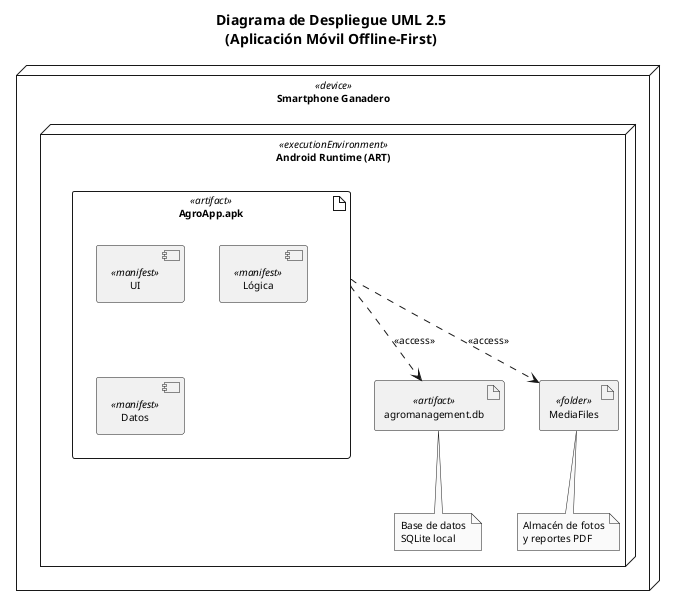
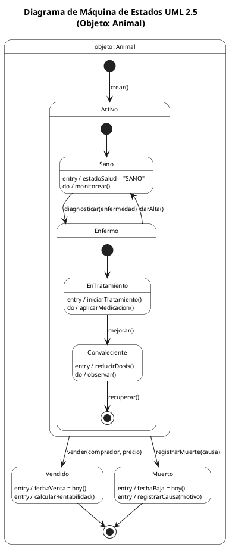
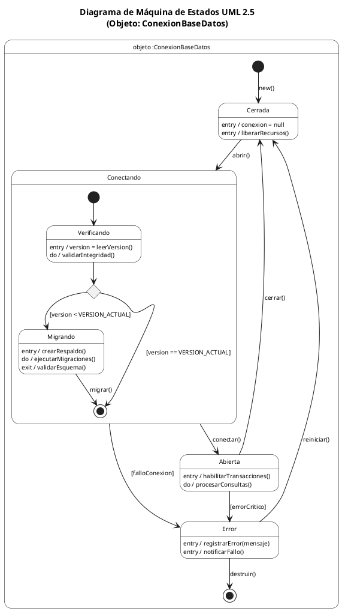
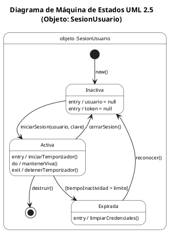
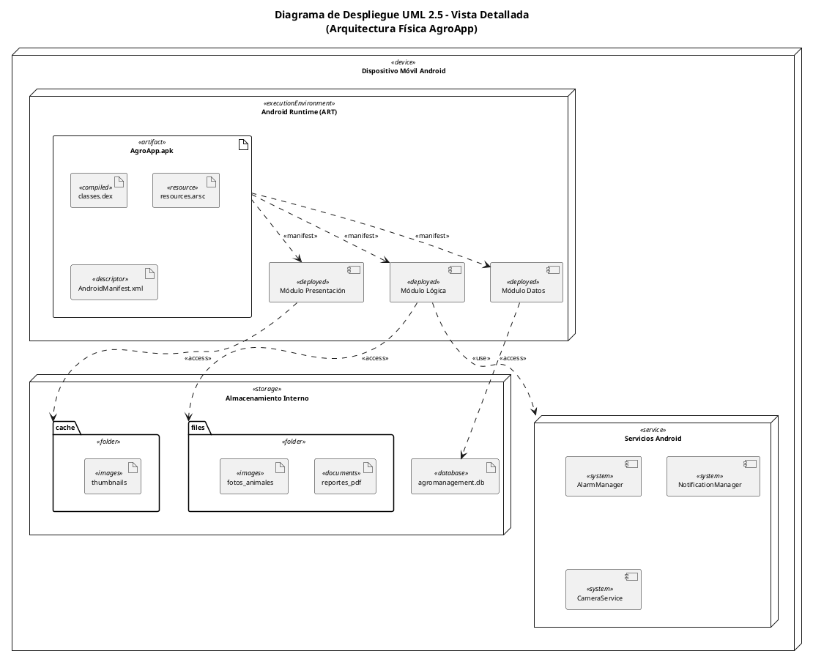

# Diagramas UML 2.5 - AgroApp
## Arquitectura de Software - Estándar OMG UML 2.5

---

## 1. Diagrama de Componentes - Módulo Gestión de Animales

```plantuml
@startuml DiagramaComponentes_GestionAnimales
skinparam monochrome true
skinparam shadowing false
skinparam defaultFontName Arial
skinparam defaultFontSize 10
skinparam componentStyle uml2

title **Diagrama de Componentes UML 2.5**\n(Módulo Gestión de Animales - AgroApp)

' ═══════════════════════════════════════════════════════════════
' INTERFACES (Definición)
' ═══════════════════════════════════════════════════════════════
interface "IGestorGanado" as IGestor
interface "IPersistenciaGanado" as IPersist
interface "IDriverBaseDatos" as IDriver

' ═══════════════════════════════════════════════════════════════
' COMPONENTES
' ═══════════════════════════════════════════════════════════════

component "Módulo Presentación" <<Subsystem>> as UI {
    port "pReqLogica" as UI_req
}
note right of UI
  Responsabilidad:
  Interfaz de usuario
  y captura de eventos
end note

component "Módulo Lógica de Negocio" <<Subsystem>> as LOGIC {
    port "pProvLogica" as LOGIC_prov
    port "pReqDatos" as LOGIC_req
    
    component "Validador SINIGA" <<Service>> as ValidadorSINIGA
}
note right of LOGIC
  Responsabilidad:
  Validaciones, cálculos
  y orquestación
end note

component "Módulo Acceso a Datos" <<Subsystem>> as DAO {
    port "pProvDatos" as DAO_prov
    port "pReqDriver" as DAO_req
}
note right of DAO
  Responsabilidad:
  Abstracción de
  persistencia
end note

database "Base de Datos\nEmbebida" <<Database>> as DB {
    port "pProvDriver" as DB_prov
}

' ═══════════════════════════════════════════════════════════════
' CONEXIONES BALL-AND-SOCKET (Assembly Connectors)
' ═══════════════════════════════════════════════════════════════

' UI requiere Lógica de Negocio
UI_req --( IGestor
LOGIC_prov -- IGestor

' Lógica requiere Persistencia
LOGIC_req --( IPersist
DAO_prov -- IPersist

' DAO requiere Driver BD
DAO_req --( IDriver
DB_prov -- IDriver

@enduml
```

---

## 2. Diagrama de Despliegue - Aplicación Móvil Offline-First

---

## 3A. Diagrama de Estados - Objeto :Animal

---

## 3B. Diagrama de Estados - Objeto :ConexionBaseDatos

---

## 4. Diagrama de Estados - Objeto :SesionUsuario

---

## 4B. Diagrama de Navegación de Usuario - Flujo entre Interfaces

```plantuml
@startuml DiagramaNavegacion_Usuario
skinparam monochrome true
skinparam shadowing false
skinparam defaultFontName Arial
skinparam defaultFontSize 10
skinparam state {
    BackgroundColor White
    BorderColor Black
}

title **Diagrama de Navegación de Usuario UML 2.5**\n(Flujo entre Interfaces del Sistema - AgroApp)

' ═══════════════════════════════════════════════════════════════
' INICIO DE LA APLICACIÓN
' ═══════════════════════════════════════════════════════════════
[*] --> PantallaLogin : Abrir aplicación

' ═══════════════════════════════════════════════════════════════
' PANTALLA DE AUTENTICACIÓN
' ═══════════════════════════════════════════════════════════════
state "Pantalla Login" as PantallaLogin <<screen>> {
    PantallaLogin : Formulario de acceso
    PantallaLogin : - Campo usuario
    PantallaLogin : - Campo contraseña
    PantallaLogin : - Botón "Entrar"
}

' ═══════════════════════════════════════════════════════════════
' PANTALLA PRINCIPAL
' ═══════════════════════════════════════════════════════════════
state "Pantalla Principal (Dashboard)" as Dashboard <<screen>> {
    Dashboard : Panel de control
    Dashboard : - Resumen de inventario
    Dashboard : - Alertas pendientes
    Dashboard : - Accesos rápidos
    Dashboard : - Menú de navegación
}

' ═══════════════════════════════════════════════════════════════
' MÓDULO INVENTARIO
' ═══════════════════════════════════════════════════════════════
state "Módulo Inventario" as ModuloInventario {
    
    state "Lista de Animales" as ListaAnimales <<screen>> {
        ListaAnimales : Catálogo de ganado
        ListaAnimales : - Lista con filtros
        ListaAnimales : - Barra de búsqueda
        ListaAnimales : - Botón "Agregar"
    }
    
    state "Ficha del Animal" as FichaAnimal <<screen>> {
        FichaAnimal : Detalle completo
        FichaAnimal : - Datos generales
        FichaAnimal : - Historial médico
        FichaAnimal : - Fotografías
        FichaAnimal : - Botón "Editar"
    }
    
    state "Formulario Animal" as FormularioAnimal <<screen>> {
        [*] --> ModoAlta
        
        state "Modo Alta" as ModoAlta {
            ModoAlta : Nuevo registro
            ModoAlta : - Campos vacíos
        }
        
        state "Modo Edición" as ModoEdicion {
            ModoEdicion : Modificar existente
            ModoEdicion : - Campos prellenados
        }
    }
    
    ' Navegación interna del módulo
    ListaAnimales --> FichaAnimal : Seleccionar animal
    FichaAnimal --> FormularioAnimal : Clic "Editar"
    ListaAnimales --> FormularioAnimal : Clic "Agregar"
    
    FormularioAnimal --> FichaAnimal : Guardar (edición)
    FormularioAnimal --> ListaAnimales : Guardar (alta)
    FormularioAnimal --> ListaAnimales : Cancelar
    
    FichaAnimal --> ListaAnimales : Volver
}

' ═══════════════════════════════════════════════════════════════
' MÓDULO CALENDARIO
' ═══════════════════════════════════════════════════════════════
state "Módulo Calendario" as ModuloCalendario {
    
    state "Vista Calendario" as VistaCalendario <<screen>> {
        VistaCalendario : Programación sanitaria
        VistaCalendario : - Vista mensual/semanal
        VistaCalendario : - Eventos marcados
        VistaCalendario : - Botón "Nuevo evento"
    }
    
    state "Detalle Evento" as DetalleEvento <<screen>> {
        DetalleEvento : Información del evento
        DetalleEvento : - Tipo de evento
        DetalleEvento : - Animales involucrados
        DetalleEvento : - Fecha y hora
    }
    
    state "Formulario Evento" as FormularioEvento <<screen>> {
        FormularioEvento : Crear/Editar evento
        FormularioEvento : - Selector de fecha
        FormularioEvento : - Selector de animales
        FormularioEvento : - Tipo de tratamiento
    }
    
    VistaCalendario --> DetalleEvento : Seleccionar evento
    VistaCalendario --> FormularioEvento : Clic "Nuevo evento"
    DetalleEvento --> FormularioEvento : Clic "Editar"
    FormularioEvento --> VistaCalendario : Guardar / Cancelar
    DetalleEvento --> VistaCalendario : Volver
}

' ═══════════════════════════════════════════════════════════════
' MÓDULO REPORTES
' ═══════════════════════════════════════════════════════════════
state "Módulo Reportes" as ModuloReportes {
    
    state "Panel de Reportes" as PanelReportes <<screen>> {
        PanelReportes : Centro de informes
        PanelReportes : - Lista de reportes disponibles
        PanelReportes : - Filtros de fecha
    }
    
    state "Visor de Reporte" as VisorReporte <<screen>> {
        VisorReporte : Reporte generado
        VisorReporte : - Gráficos y tablas
        VisorReporte : - Botón "Exportar PDF"
        VisorReporte : - Botón "Compartir"
    }
    
    PanelReportes --> VisorReporte : Generar reporte
    VisorReporte --> PanelReportes : Volver
}

' ═══════════════════════════════════════════════════════════════
' MÓDULO GASTOS
' ═══════════════════════════════════════════════════════════════
state "Módulo Gastos" as ModuloGastos {
    
    state "Lista de Gastos" as ListaGastos <<screen>> {
        ListaGastos : Registro financiero
        ListaGastos : - Lista de transacciones
        ListaGastos : - Filtros por categoría
        ListaGastos : - Botón "Nuevo gasto"
    }
    
    state "Formulario Gasto" as FormularioGasto <<screen>> {
        FormularioGasto : Registrar gasto
        FormularioGasto : - Monto
        FormularioGasto : - Categoría
        FormularioGasto : - Animal asociado
    }
    
    ListaGastos --> FormularioGasto : Clic "Nuevo gasto"
    FormularioGasto --> ListaGastos : Guardar / Cancelar
}

' ═══════════════════════════════════════════════════════════════
' MÓDULO CONFIGURACIÓN
' ═══════════════════════════════════════════════════════════════
state "Pantalla Configuración" as Configuracion <<screen>> {
    Configuracion : Ajustes del sistema
    Configuracion : - Perfil de usuario
    Configuracion : - Notificaciones
    Configuracion : - Respaldo de datos
    Configuracion : - Cerrar sesión
}

' ═══════════════════════════════════════════════════════════════
' TRANSICIONES PRINCIPALES (NAVEGACIÓN DEL USUARIO)
' ═══════════════════════════════════════════════════════════════

' Login → Dashboard
PantallaLogin --> Dashboard : Credenciales válidas

' Dashboard → Módulos (Menú principal)
Dashboard --> ListaAnimales : Clic "Inventario"
Dashboard --> VistaCalendario : Clic "Calendario"
Dashboard --> PanelReportes : Clic "Reportes"
Dashboard --> ListaGastos : Clic "Gastos"
Dashboard --> Configuracion : Clic "Configuración"
Dashboard --> FormularioAnimal : Acceso rápido\n"Nuevo Animal"

' Retorno al Dashboard
ListaAnimales --> Dashboard : Menú / Volver
VistaCalendario --> Dashboard : Menú / Volver
PanelReportes --> Dashboard : Menú / Volver
ListaGastos --> Dashboard : Menú / Volver
Configuracion --> Dashboard : Volver

' Cerrar sesión
Configuracion --> PantallaLogin : "Cerrar sesión"
Dashboard --> PantallaLogin : Sesión expirada

' Fin de aplicación
PantallaLogin --> [*] : Salir

@enduml
```

---

## 5. Diagrama de Componentes Completo - Arquitectura AgroApp

```plantuml
@startuml DiagramaComponentes_Completo
skinparam monochrome true
skinparam shadowing false
skinparam defaultFontName Arial
skinparam defaultFontSize 9
skinparam componentStyle uml2

title **Diagrama de Componentes UML 2.5 - Arquitectura Completa**\n(AgroApp - Patrón MVP por Capas)

' ═══════════════════════════════════════════════════════════════
' INTERFACES
' ═══════════════════════════════════════════════════════════════
interface "IVistaAnimal" as IVista
interface "IPresentadorAnimal" as IPresent
interface "IGestorAnimales" as IGestor
interface "IGestorEventos" as IEventos
interface "IGestorGastos" as IGastos
interface "IPersistencia" as IPersist
interface "INotificaciones" as INotif

' ═══════════════════════════════════════════════════════════════
' CAPA DE PRESENTACIÓN
' ═══════════════════════════════════════════════════════════════
package "Capa Presentación" <<Frame>> {
    
    component "Gestor de Vistas" <<Subsystem>> as Vistas {
        component [Formularios] <<UI>>
        component [Listas] <<UI>>
        component [Detalle] <<UI>>
        
        port "pProvVista" as V_prov
        port "pReqPresent" as V_req
    }
}

' ═══════════════════════════════════════════════════════════════
' CAPA DE LÓGICA DE NEGOCIO
' ═══════════════════════════════════════════════════════════════
package "Capa Lógica de Negocio" <<Frame>> {
    
    component "Controlador Principal" <<Subsystem>> as Controller {
        component [Presentador Animal] <<Controller>>
        component [Validador Reglas] <<Service>>
        component [Procesador Imágenes] <<Service>>
        
        port "pProvPresent" as C_prov
        port "pReqGestor" as C_req
    }
    
    component "Orquestador de Servicios" <<Subsystem>> as Services {
        component [Gestor Animales] <<Service>>
        component [Gestor Eventos] <<Service>>
        component [Gestor Gastos] <<Service>>
        
        port "pProvGestor" as S_prov
        port "pReqPersist" as S_req
    }
}

' ═══════════════════════════════════════════════════════════════
' CAPA DE ACCESO A DATOS
' ═══════════════════════════════════════════════════════════════
package "Capa Acceso a Datos" <<Frame>> {
    
    component "Repositorio Unificado" <<Subsystem>> as Repo {
        component [DAO Animales] <<Repository>>
        component [DAO Eventos] <<Repository>>
        component [DAO Gastos] <<Repository>>
        component [DAO Usuarios] <<Repository>>
        
        port "pProvPersist" as R_prov
        port "pReqDB" as R_req
    }
}

' ═══════════════════════════════════════════════════════════════
' CAPA DE INFRAESTRUCTURA
' ═══════════════════════════════════════════════════════════════
package "Capa Infraestructura" <<Frame>> {
    
    database "Motor SQLite" <<Database>> as DB {
        port "pProvDB" as DB_prov
    }
    
    component "Servicio Notificaciones" <<Service>> as Notif {
        port "pProvNotif" as N_prov
    }
    
    component "Almacén Archivos" <<Storage>> as Files {
    }
}

' ═══════════════════════════════════════════════════════════════
' CONEXIONES ASSEMBLY (Ball-and-Socket)
' ═══════════════════════════════════════════════════════════════

' Vista <-> Controlador
V_prov -- IVista
V_req --( IPresent
C_prov -- IPresent

' Controlador <-> Servicios
C_req --( IGestor
S_prov -- IGestor

' Servicios <-> Repositorio
S_req --( IPersist
R_prov -- IPersist

' Repositorio <-> Base de Datos
R_req --( IPersist
DB_prov -- IPersist

' Servicios <-> Notificaciones
Services ..> Notif : <<usa>>
N_prov -- INotif

' Repositorio <-> Archivos
Repo ..> Files : <<access>>

@enduml
```

---

## 6. Diagrama de Despliegue Detallado

---

## Resumen de Diagramas

| # | Diagrama | Tipo UML 2.5 | Propósito |
|---|----------|--------------|-----------|
| 1 | Componentes - Gestión Animales | Component Diagram | Arquitectura modular con interfaces Ball-and-Socket |
| 2 | Despliegue - Offline-First | Deployment Diagram | Nodos, artefactos y relaciones de despliegue |
| 3A | Estados - Objeto :Animal | State Machine | Ciclo de vida del objeto con métodos como triggers |
| 3B | Estados - Objeto :ConexionBaseDatos | State Machine | Estados del objeto conexión con nodo de decisión |
| 4 | Estados - Objeto :SesionUsuario | State Machine | Estados del objeto sesión de usuario |
| 4B | **Navegación de Usuario** | State Machine | **Flujo entre interfaces del sistema** |
| 5 | Componentes - Completo | Component Diagram | Arquitectura MVP por capas |
| 6 | Despliegue - Detallado | Deployment Diagram | Vista física con almacenamiento y servicios |

---

## Notación UML 2.5 Utilizada

### Conectores
- `--` → Asociación
- `-->` → Dependencia direccional
- `..>` → Dependencia con estereotipo
- `--(` → Socket (interfaz requerida)
- `--` con interfaz → Ball (interfaz provista)

### Estereotipos
- `<<device>>` → Nodo de hardware
- `<<executionEnvironment>>` → Entorno de ejecución
- `<<artifact>>` → Artefacto desplegable
- `<<Subsystem>>` → Subsistema/Componente
- `<<Service>>` → Servicio de negocio
- `<<Repository>>` → Patrón repositorio
- `<<Database>>` → Base de datos

### Estados
- `[*]` → Pseudoestado inicial/final
- `<<choice>>` → Nodo de decisión
- `<<end>>` → Estado terminal
- `<<concurrent>>` → Región ortogonal
