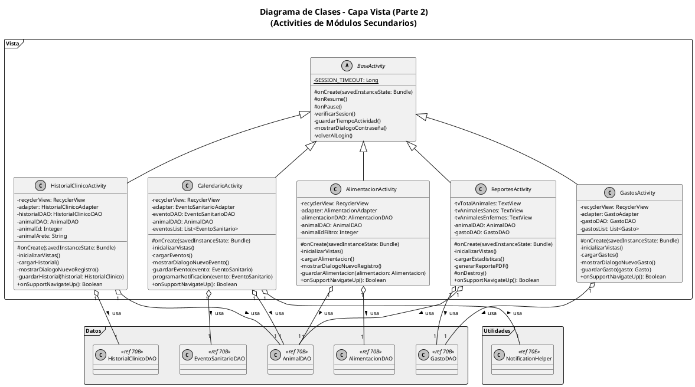
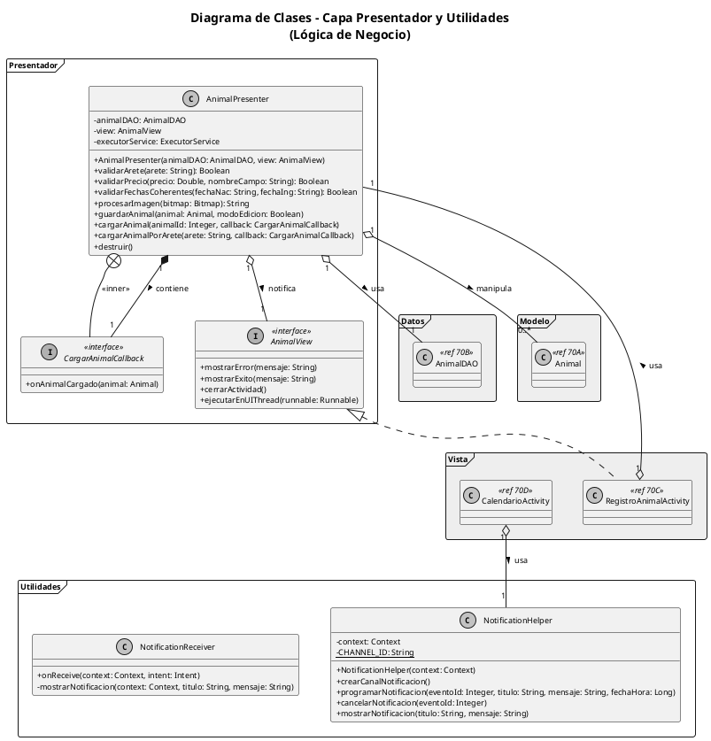
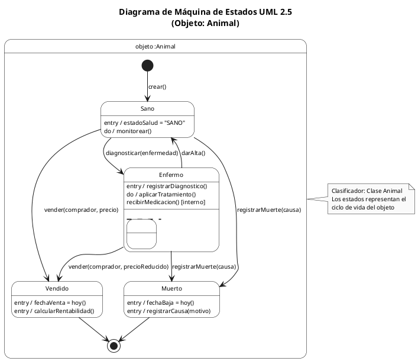
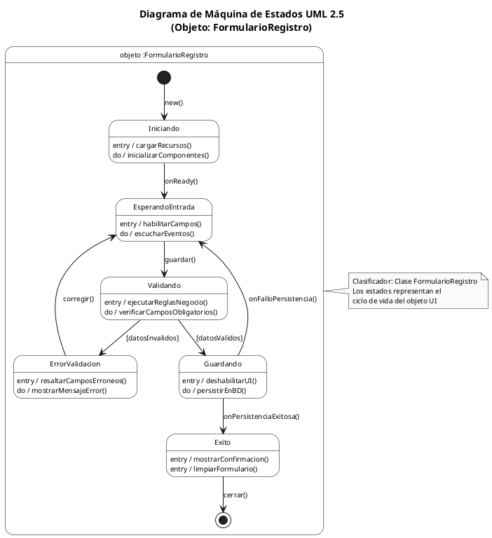
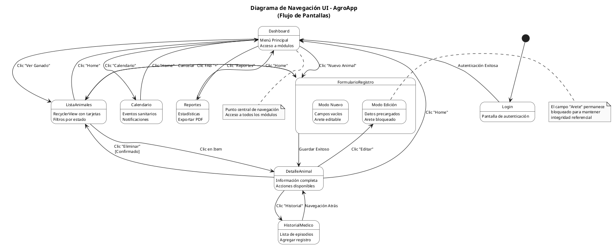
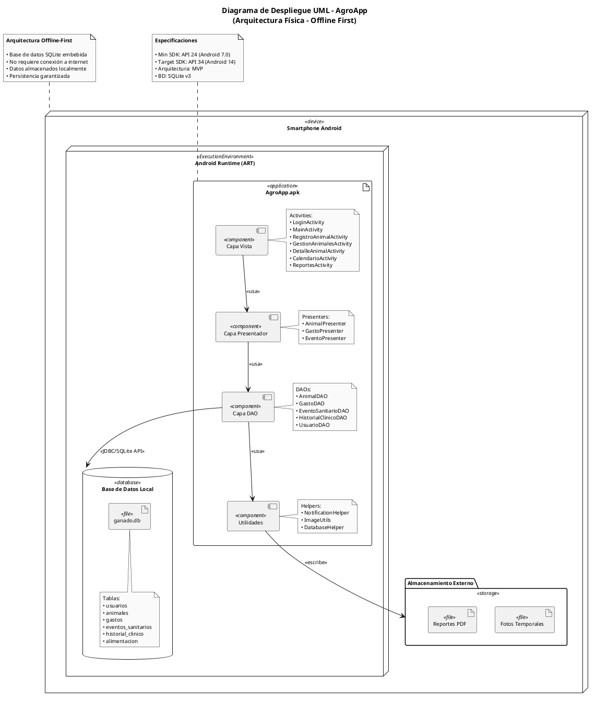

# Diagramas UML - AgroApp
## Estándar OMG UML 2.5

---

## Ilustración 70 - Diagrama de Clases (Patrón MVP)

> **Nota:** El diagrama de clases se presenta en 5 secciones para mejor visualización.

---

### Ilustración 70A - Capa Modelo (Entidades)

```plantuml
@startuml DiagramaClases_Modelo
skinparam monochrome true
skinparam shadowing false
skinparam defaultFontName Arial
skinparam defaultFontSize 9
skinparam packageStyle rectangle
skinparam classAttributeIconSize 0

title **Diagrama de Clases - Capa Modelo**\n(Entidades del Dominio)

package "Modelo" <<Frame>> {
    
    class Animal <<Entity>> {
        - id: Integer
        - numeroArete: String
        - nombre: String
        - raza: String
        - sexo: String
        - fechaNacimiento: String
        - fechaIngreso: String
        - fechaSalida: String
        - precioCompra: Double
        - precioVenta: Double
        - foto: String
        - estado: String
        - observaciones: String
        - pesoNacer: Double
        - pesoActual: Double
        __
        + Animal()
        + getId(): Integer
        + setId(id: Integer)
        + getNumeroArete(): String
        + setNumeroArete(numeroArete: String)
        + getNombre(): String
        + setNombre(nombre: String)
        + getRaza(): String
        + setRaza(raza: String)
        + getSexo(): String
        + setSexo(sexo: String)
        + getFechaNacimiento(): String
        + setFechaNacimiento(fecha: String)
        + getFechaIngreso(): String
        + setFechaIngreso(fecha: String)
        + getFechaSalida(): String
        + setFechaSalida(fecha: String)
        + getPrecioCompra(): Double
        + setPrecioCompra(precio: Double)
        + getPrecioVenta(): Double
        + setPrecioVenta(precio: Double)
        + getFoto(): String
        + setFoto(foto: String)
        + getEstado(): String
        + setEstado(estado: String)
        + getObservaciones(): String
        + setObservaciones(obs: String)
        + getPesoNacer(): Double
        + setPesoNacer(peso: Double)
        + getPesoActual(): Double
        + setPesoActual(peso: Double)
    }
    
    class Gasto <<Entity>> {
        - id: Integer
        - animalId: Integer
        - raza: String
        - tipo: String
        - concepto: String
        - monto: Double
        - fecha: String
        - observaciones: String
        __
        + Gasto()
        + getId(): Integer
        + setId(id: Integer)
        + getAnimalId(): Integer
        + setAnimalId(id: Integer)
        + getRaza(): String
        + setRaza(raza: String)
        + getTipo(): String
        + setTipo(tipo: String)
        + getConcepto(): String
        + setConcepto(concepto: String)
        + getMonto(): Double
        + setMonto(monto: Double)
        + getFecha(): String
        + setFecha(fecha: String)
        + getObservaciones(): String
        + setObservaciones(obs: String)
    }
    
    class HistorialClinico <<Entity>> {
        - id: Integer
        - animalId: Integer
        - fecha: String
        - enfermedad: String
        - sintomas: String
        - tratamiento: String
        - estado: String
        - observaciones: String
        __
        + HistorialClinico()
        + getId(): Integer
        + setId(id: Integer)
        + getAnimalId(): Integer
        + setAnimalId(id: Integer)
        + getFecha(): String
        + setFecha(fecha: String)
        + getEnfermedad(): String
        + setEnfermedad(enf: String)
        + getSintomas(): String
        + setSintomas(sint: String)
        + getTratamiento(): String
        + setTratamiento(trat: String)
        + getEstado(): String
        + setEstado(estado: String)
        + getObservaciones(): String
        + setObservaciones(obs: String)
    }
    
    class EventoSanitario <<Entity>> {
        - id: Integer
        - animalId: Integer
        - raza: String
        - tipo: String
        - fechaProgramada: String
        - fechaRealizada: String
        - descripcion: String
        - recordatorio: Integer
        - estado: String
        - horaRecordatorio: String
        - costo: Double
        __
        + EventoSanitario()
        + getId(): Integer
        + setId(id: Integer)
        + getAnimalId(): Integer
        + setAnimalId(id: Integer)
        + getRaza(): String
        + setRaza(raza: String)
        + getTipo(): String
        + setTipo(tipo: String)
        + getFechaProgramada(): String
        + setFechaProgramada(fecha: String)
        + getFechaRealizada(): String
        + setFechaRealizada(fecha: String)
        + getDescripcion(): String
        + setDescripcion(desc: String)
        + getRecordatorio(): Integer
        + setRecordatorio(rec: Integer)
        + getEstado(): String
        + setEstado(estado: String)
        + getHoraRecordatorio(): String
        + setHoraRecordatorio(hora: String)
        + getCosto(): Double
        + setCosto(costo: Double)
        + isRecordatorio(): Boolean
    }
    
    class Alimentacion <<Entity>> {
        - id: Integer
        - animalId: Integer
        - tipoAlimento: String
        - cantidad: Double
        - unidad: String
        - fecha: String
        - observaciones: String
        - costo: Double
        __
        + Alimentacion()
        + getId(): Integer
        + setId(id: Integer)
        + getAnimalId(): Integer
        + setAnimalId(id: Integer)
        + getTipoAlimento(): String
        + setTipoAlimento(tipo: String)
        + getCantidad(): Double
        + setCantidad(cant: Double)
        + getUnidad(): String
        + setUnidad(unidad: String)
        + getFecha(): String
        + setFecha(fecha: String)
        + getObservaciones(): String
        + setObservaciones(obs: String)
        + getCosto(): Double
        + setCosto(costo: Double)
    }
    
    class Usuario <<Entity>> {
        - id: Integer
        - username: String
        - password: String
        - nombre: String
        - rol: TipoUsuario
        __
        + Usuario()
        + getId(): Integer
        + setId(id: Integer)
        + getUsername(): String
        + setUsername(user: String)
        + getPassword(): String
        + setPassword(pass: String)
        + getNombre(): String
        + setNombre(nombre: String)
        + getRol(): TipoUsuario
        + setRol(rol: TipoUsuario)
        + esAdmin(): Boolean
    }
    
    enum TipoUsuario <<Enumeration>> {
        ADMIN
        USUARIO
    }
    
    Usuario --> TipoUsuario : tiene >
}

' ═══════════════════════════════════════════════════════════════
' REFERENCIAS A CAPA DATOS (ver Ilustración 70B)
' ═══════════════════════════════════════════════════════════════
package "Datos" <<Frame>> #EEEEEE {
    class AnimalDAO <<ref 70B>>
    class GastoDAO <<ref 70B>>
    class HistorialClinicoDAO <<ref 70B>>
    class EventoSanitarioDAO <<ref 70B>>
    class AlimentacionDAO <<ref 70B>>
    class UsuarioDAO <<ref 70B>>
}

' ═══════════════════════════════════════════════════════════════
' RELACIONES DE COMPOSICIÓN (Modelo)
' ═══════════════════════════════════════════════════════════════
Animal "1" *-down- "0..*" Gasto : tiene >
Animal "1" *-down- "0..*" HistorialClinico : tiene >
Animal "1" *-down- "0..*" EventoSanitario : tiene >
Animal "1" *-down- "0..*" Alimentacion : tiene >

' ═══════════════════════════════════════════════════════════════
' RELACIONES DE AGREGACIÓN (DAO -> Modelo)
' ═══════════════════════════════════════════════════════════════
AnimalDAO "1" o-- "0..*" Animal : gestiona >
GastoDAO "1" o-- "0..*" Gasto : gestiona >
HistorialClinicoDAO "1" o-- "0..*" HistorialClinico : gestiona >
EventoSanitarioDAO "1" o-- "0..*" EventoSanitario : gestiona >
AlimentacionDAO "1" o-- "0..*" Alimentacion : gestiona >
UsuarioDAO "1" o-- "0..2" Usuario : gestiona >

@enduml
```



---

### Ilustración 70B - Capa de Acceso a Datos (DAOs)

```plantuml
@startuml DiagramaClases_Datos
skinparam monochrome true
skinparam shadowing false
skinparam defaultFontName Arial
skinparam defaultFontSize 9
skinparam packageStyle rectangle
skinparam classAttributeIconSize 0

title **Diagrama de Clases - Capa de Datos**\n(Data Access Objects)

package "Datos" <<Frame>> {
    
    class DatabaseHelper <<Singleton>> {
        - {static} DATABASE_NAME: String
        - {static} DATABASE_VERSION: Integer
        - {static} instance: DatabaseHelper
        __
        + {static} getInstance(context: Context): DatabaseHelper
        - DatabaseHelper(context: Context)
        + onCreate(db: SQLiteDatabase)
        + onUpgrade(db: SQLiteDatabase, oldV: Int, newV: Int)
        + getReadableDatabase(): SQLiteDatabase
        + getWritableDatabase(): SQLiteDatabase
    }
    
    class AnimalDAO {
        - dbHelper: DatabaseHelper
        __
        + AnimalDAO(dbHelper: DatabaseHelper)
        + existeArete(numeroArete: String): Boolean
        + insertarAnimal(animal: Animal): Long
        + actualizarAnimal(animal: Animal): Integer
        + eliminarAnimal(id: Integer): Integer
        + eliminarAnimalPorArete(arete: String): Integer
        + obtenerAnimalPorId(id: Integer): Animal
        + obtenerAnimalPorArete(arete: String): Animal
        + obtenerIdPorArete(arete: String): Integer
        + obtenerTodosLosAnimales(): List<Animal>
        + obtenerTodos(): List<Animal>
        + obtenerAnimalesPorEstado(estado: String): List<Animal>
        - cursorToAnimal(cursor: Cursor): Animal
    }
    
    class GastoDAO {
        - dbHelper: DatabaseHelper
        __
        + GastoDAO(dbHelper: DatabaseHelper)
        + insertarGasto(gasto: Gasto): Long
        + actualizarGasto(gasto: Gasto): Integer
        + eliminarGasto(id: Integer): Integer
        + obtenerTodosLosGastos(): List<Gasto>
        + obtenerGastosPorAnimal(animalId: Integer): List<Gasto>
        + obtenerTotalGastos(): Double
        + obtenerTotalGastosPorAnimal(animalId: Integer): Double
        - cursorToGasto(cursor: Cursor): Gasto
    }
    
    class HistorialClinicoDAO {
        - dbHelper: DatabaseHelper
        __
        + HistorialClinicoDAO(dbHelper: DatabaseHelper)
        + insertarHistorial(historial: HistorialClinico): Long
        + actualizarHistorial(historial: HistorialClinico): Integer
        + eliminarHistorial(id: Integer): Integer
        + obtenerHistorialPorAnimal(animalId: Integer): List<HistorialClinico>
        - cursorToHistorial(cursor: Cursor): HistorialClinico
    }
    
    class EventoSanitarioDAO {
        - dbHelper: DatabaseHelper
        __
        + EventoSanitarioDAO(dbHelper: DatabaseHelper)
        + insertarEvento(evento: EventoSanitario): Long
        + actualizarEvento(evento: EventoSanitario): Integer
        + eliminarEvento(id: Integer): Integer
        + obtenerTodosLosEventos(): List<EventoSanitario>
        + obtenerEventosPorAnimal(animalId: Integer): List<EventoSanitario>
        + obtenerEventosPendientes(): List<EventoSanitario>
        - cursorToEvento(cursor: Cursor): EventoSanitario
    }
    
    class AlimentacionDAO {
        - dbHelper: DatabaseHelper
        __
        + AlimentacionDAO(dbHelper: DatabaseHelper)
        + insertarAlimentacion(alimentacion: Alimentacion): Long
        + actualizarAlimentacion(alimentacion: Alimentacion): Integer
        + eliminarAlimentacion(id: Integer): Integer
        + obtenerAlimentacionPorAnimal(animalId: Integer): List<Alimentacion>
        - cursorToAlimentacion(cursor: Cursor): Alimentacion
    }
    
    class UsuarioDAO {
        - dbHelper: DatabaseHelper
        - MAX_USUARIOS: Integer = 2
        __
        + UsuarioDAO(dbHelper: DatabaseHelper)
        + validarUsuario(username: String, password: String): Usuario
        + obtenerPorUsername(username: String): Usuario
        + obtenerAdmin(): Usuario
        + obtenerUsuarioNormal(): Usuario
        + insertarAdmin(usuario: Usuario): Long
        + insertarUsuario(usuario: Usuario): Long
        + actualizarUsuario(usuario: Usuario): Integer
        + existeAdmin(): Boolean
        + existeUsuarioNormal(): Boolean
        + contarUsuarios(): Integer
        + puedeCrearUsuario(): Boolean
        + obtenerTodosUsuarios(): List<Usuario>
    }
}

' ═══════════════════════════════════════════════════════════════
' REFERENCIAS A CAPA MODELO (ver Ilustración 70A)
' ═══════════════════════════════════════════════════════════════
package "Modelo" <<Frame>> #EEEEEE {
    class Animal <<ref 70A>>
    class Gasto <<ref 70A>>
    class HistorialClinico <<ref 70A>>
    class EventoSanitario <<ref 70A>>
    class Alimentacion <<ref 70A>>
    class Usuario <<ref 70A>>
}

' ═══════════════════════════════════════════════════════════════
' REFERENCIAS A CAPA VISTA (ver Ilustración 70C y 70D)
' ═══════════════════════════════════════════════════════════════
package "Vista" <<Frame>> #EEEEEE {
    class GestionAnimalesActivity <<ref 70C>>
    class DetalleAnimalActivity <<ref 70C>>
    class MainActivity <<ref 70C>>
    class LoginActivity <<ref 70C>>
    class CalendarioActivity <<ref 70D>>
    class ReportesActivity <<ref 70D>>
    class HistorialClinicoActivity <<ref 70D>>
    class AlimentacionActivity <<ref 70D>>
    class GastosActivity <<ref 70D>>
}

' ═══════════════════════════════════════════════════════════════
' RELACIONES DE AGREGACIÓN (DAO -> DatabaseHelper)
' ═══════════════════════════════════════════════════════════════
AnimalDAO "*" o-- "1" DatabaseHelper : usa >
GastoDAO "*" o-- "1" DatabaseHelper : usa >
HistorialClinicoDAO "*" o-- "1" DatabaseHelper : usa >
EventoSanitarioDAO "*" o-- "1" DatabaseHelper : usa >
AlimentacionDAO "*" o-- "1" DatabaseHelper : usa >
UsuarioDAO "*" o-- "1" DatabaseHelper : usa >

' ═══════════════════════════════════════════════════════════════
' RELACIONES DE AGREGACIÓN (DAO -> Modelo)
' ═══════════════════════════════════════════════════════════════
AnimalDAO "1" o-- "0..*" Animal : gestiona >
GastoDAO "1" o-- "0..*" Gasto : gestiona >
HistorialClinicoDAO "1" o-- "0..*" HistorialClinico : gestiona >
EventoSanitarioDAO "1" o-- "0..*" EventoSanitario : gestiona >
AlimentacionDAO "1" o-- "0..*" Alimentacion : gestiona >
UsuarioDAO "1" o-- "0..*" Usuario : gestiona >

' ═══════════════════════════════════════════════════════════════
' RELACIONES DE AGREGACIÓN (Vista -> DAO)
' ═══════════════════════════════════════════════════════════════
GestionAnimalesActivity "1" o-- "1" AnimalDAO : usa >
DetalleAnimalActivity "1" o-- "1" AnimalDAO : usa >
MainActivity "1" o-- "1" AnimalDAO : usa >
MainActivity "1" o-- "1" EventoSanitarioDAO : usa >
LoginActivity "1" o-- "1" UsuarioDAO : usa >
CalendarioActivity "1" o-- "1" EventoSanitarioDAO : usa >
CalendarioActivity "1" o-- "1" AnimalDAO : usa >
ReportesActivity "1" o-- "1" AnimalDAO : usa >
ReportesActivity "1" o-- "1" GastoDAO : usa >
HistorialClinicoActivity "1" o-- "1" HistorialClinicoDAO : usa >
AlimentacionActivity "1" o-- "1" AlimentacionDAO : usa >
GastosActivity "1" o-- "1" GastoDAO : usa >

@enduml
```



---

### Ilustración 70C - Capa Vista (Activities Principales)

```plantuml
@startuml DiagramaClases_Vista1
skinparam monochrome true
skinparam shadowing false
skinparam defaultFontName Arial
skinparam defaultFontSize 9
skinparam packageStyle rectangle
skinparam classAttributeIconSize 0

title **Diagrama de Clases - Capa Vista (Parte 1)**\n(Activities de Gestión de Animales)

package "Vista" <<Frame>> {
    
    abstract class BaseActivity {
        - {static} SESSION_TIMEOUT: Long
        __
        # onCreate(savedInstanceState: Bundle)
        # onResume()
        # onPause()
        - verificarSesion()
        - guardarTiempoActividad()
        - mostrarDialogoContraseña()
        - volverAlLogin()
    }
    
    class LoginActivity {
        - etUsername: EditText
        - etPassword: EditText
        - btnLogin: Button
        - btnRegistrar: Button
        - usuarioDAO: UsuarioDAO
        __
        # onCreate(savedInstanceState: Bundle)
        - iniciarSesion()
        - registrarUsuario()
        - navegarAMain()
    }
    
    class MainActivity {
        - tvBienvenida: TextView
        - tvTotalAnimales: TextView
        - tvEventosPendientes: TextView
        - animalDAO: AnimalDAO
        - eventoDAO: EventoSanitarioDAO
        __
        # onCreate(savedInstanceState: Bundle)
        - inicializarVistas()
        - cargarEstadisticas()
        - navegarAGestionAnimales()
        - navegarACalendario()
        - navegarAReportes()
        - cerrarSesion()
    }
    
    class RegistroAnimalActivity {
        - etArete: EditText
        - etPrecioCompra: EditText
        - etObservaciones: EditText
        - etPesoNacer: EditText
        - etPesoActual: EditText
        - spinnerRaza: Spinner
        - spinnerSexo: Spinner
        - spinnerEstado: Spinner
        - ivFotoAnimal: ImageView
        - presenter: AnimalPresenter
        - animalDAO: AnimalDAO
        - fotoBase64: String
        - modo: String
        - animalArete: String
        __
        # onCreate(savedInstanceState: Bundle)
        - inicializarVistas()
        - configurarSpinners()
        - configurarListeners()
        - mostrarDatePicker(esFechaNac: Boolean)
        - seleccionarFoto()
        - verificarPermisosCamara()
        - tomarFoto()
        - crearArchivoImagen(): File
        # onActivityResult(reqCode: Int, resCode: Int, data: Intent)
        - guardarAnimal()
        - cargarDatosAnimal()
        - setSpinnerValue(spinner: Spinner, value: String)
        + mostrarError(mensaje: String)
        + mostrarExito(mensaje: String)
        + cerrarActividad()
        + ejecutarEnUIThread(runnable: Runnable)
        # onDestroy()
        + onSupportNavigateUp(): Boolean
    }
    
    class DetalleAnimalActivity {
        - tvArete: TextView
        - tvRaza: TextView
        - tvSexo: TextView
        - tvEstado: TextView
        - tvFechaNacimiento: TextView
        - tvPesoNacer: TextView
        - tvPesoActual: TextView
        - ivFotoAnimal: ImageView
        - animalDAO: AnimalDAO
        - animalArete: String
        __
        # onCreate(savedInstanceState: Bundle)
        - inicializarVistas()
        - cargarDatosAnimal()
        - mostrarImagen(fotoBase64: String)
        - editarAnimal()
        - eliminarAnimal()
        - verHistorialClinico()
        - verAlimentacion()
        + onSupportNavigateUp(): Boolean
    }
    
    class GestionAnimalesActivity {
        - recyclerView: RecyclerView
        - adapter: AnimalAdapter
        - animalDAO: AnimalDAO
        - animalesList: List<Animal>
        - animalesListFull: List<Animal>
        - estadoFiltro: String
        __
        # onCreate(savedInstanceState: Bundle)
        # onResume()
        - cargarAnimales()
        - filtrarPorEstado(estado: String)
        - filtrarPorTexto(texto: String)
        - aplicarFiltros(texto: String)
        + onSupportNavigateUp(): Boolean
    }
    
    interface AnimalView <<interface>> {
        + mostrarError(mensaje: String)
        + mostrarExito(mensaje: String)
        + cerrarActividad()
        + ejecutarEnUIThread(runnable: Runnable)
    }
}

' ═══════════════════════════════════════════════════════════════
' REFERENCIAS A CAPA PRESENTADOR (ver Ilustración 70E)
' ═══════════════════════════════════════════════════════════════
package "Presentador" <<Frame>> #EEEEEE {
    class AnimalPresenter <<ref 70E>>
}

' ═══════════════════════════════════════════════════════════════
' REFERENCIAS A CAPA DATOS (ver Ilustración 70B)
' ═══════════════════════════════════════════════════════════════
package "Datos" <<Frame>> #EEEEEE {
    class AnimalDAO <<ref 70B>>
    class EventoSanitarioDAO <<ref 70B>>
    class UsuarioDAO <<ref 70B>>
}

' ═══════════════════════════════════════════════════════════════
' RELACIONES DE HERENCIA
' ═══════════════════════════════════════════════════════════════
BaseActivity <|-- LoginActivity
BaseActivity <|-- MainActivity
BaseActivity <|-- RegistroAnimalActivity
BaseActivity <|-- DetalleAnimalActivity
BaseActivity <|-- GestionAnimalesActivity

' ═══════════════════════════════════════════════════════════════
' RELACIONES DE IMPLEMENTACIÓN
' ═══════════════════════════════════════════════════════════════
RegistroAnimalActivity ..|> AnimalView : <<implements>>

' ═══════════════════════════════════════════════════════════════
' RELACIONES DE AGREGACIÓN (Vista -> Presentador)
' ═══════════════════════════════════════════════════════════════
RegistroAnimalActivity "1" o-- "1" AnimalPresenter : usa >
AnimalPresenter "1" o-- "1" AnimalView : notifica >

' ═══════════════════════════════════════════════════════════════
' RELACIONES DE AGREGACIÓN (Vista -> DAO)
' ═══════════════════════════════════════════════════════════════
LoginActivity "1" o-- "1" UsuarioDAO : usa >
MainActivity "1" o-- "1" AnimalDAO : usa >
MainActivity "1" o-- "1" EventoSanitarioDAO : usa >
RegistroAnimalActivity "1" o-- "1" AnimalDAO : usa >
DetalleAnimalActivity "1" o-- "1" AnimalDAO : usa >
GestionAnimalesActivity "1" o-- "1" AnimalDAO : usa >

@enduml
```



---

### Ilustración 70D - Capa Vista (Activities Secundarias)



---

### Ilustración 70E - Capa Presentador y Utilidades



---

### Ilustración 70F - Diagrama de Relaciones entre Capas

```plantuml
@startuml DiagramaClases_Relaciones
skinparam monochrome true
skinparam shadowing false
skinparam defaultFontName Arial
skinparam defaultFontSize 9
skinparam packageStyle rectangle
skinparam classAttributeIconSize 0

title **Diagrama de Clases - Relaciones entre Capas**\n(Arquitectura MVP Completa)

' ═══════════════════════════════════════════════════════════════
' DEFINICIÓN SIMPLIFICADA DE CLASES
' ═══════════════════════════════════════════════════════════════

package "Vista" <<Frame>> {
    class RegistroAnimalActivity
    class GestionAnimalesActivity
    class DetalleAnimalActivity
    class MainActivity
    class CalendarioActivity
    class ReportesActivity
    class HistorialClinicoActivity
    class AlimentacionActivity
    class GastosActivity
    class LoginActivity
    interface AnimalView <<interface>>
}

package "Presentador" <<Frame>> {
    class AnimalPresenter
}

package "Datos" <<Frame>> {
    class DatabaseHelper <<Singleton>>
    class AnimalDAO
    class GastoDAO
    class HistorialClinicoDAO
    class EventoSanitarioDAO
    class AlimentacionDAO
    class UsuarioDAO
}

package "Modelo" <<Frame>> {
    class Animal <<Entity>>
    class Gasto <<Entity>>
    class HistorialClinico <<Entity>>
    class EventoSanitario <<Entity>>
    class Alimentacion <<Entity>>
    class Usuario <<Entity>>
}

package "Utilidades" <<Frame>> {
    class NotificationHelper
}

' ═══════════════════════════════════════════════════════════════
' RELACIONES VISTA -> PRESENTADOR (Agregación)
' ═══════════════════════════════════════════════════════════════
RegistroAnimalActivity "1" o-- "1" AnimalPresenter : usa >
AnimalView <|.. RegistroAnimalActivity

' ═══════════════════════════════════════════════════════════════
' RELACIONES PRESENTADOR -> DATOS (Agregación)
' ═══════════════════════════════════════════════════════════════
AnimalPresenter "1" o-- "1" AnimalView : notifica >
AnimalPresenter "1" o-- "1" AnimalDAO : usa >

' ═══════════════════════════════════════════════════════════════
' RELACIONES VISTA -> DATOS (Agregación)
' ═══════════════════════════════════════════════════════════════
GestionAnimalesActivity "1" o-- "1" AnimalDAO
DetalleAnimalActivity "1" o-- "1" AnimalDAO
MainActivity "1" o-- "1" AnimalDAO
MainActivity "1" o-- "1" EventoSanitarioDAO
CalendarioActivity "1" o-- "1" EventoSanitarioDAO
CalendarioActivity "1" o-- "1" AnimalDAO
ReportesActivity "1" o-- "1" AnimalDAO
ReportesActivity "1" o-- "1" GastoDAO
HistorialClinicoActivity "1" o-- "1" HistorialClinicoDAO
HistorialClinicoActivity "1" o-- "1" AnimalDAO
AlimentacionActivity "1" o-- "1" AlimentacionDAO
AlimentacionActivity "1" o-- "1" AnimalDAO
GastosActivity "1" o-- "1" GastoDAO
LoginActivity "1" o-- "1" UsuarioDAO

' ═══════════════════════════════════════════════════════════════
' RELACIONES DATOS -> MODELO (Agregación)
' ═══════════════════════════════════════════════════════════════
AnimalDAO "1" o-- "0..*" Animal : gestiona >
GastoDAO "1" o-- "0..*" Gasto : gestiona >
HistorialClinicoDAO "1" o-- "0..*" HistorialClinico : gestiona >
EventoSanitarioDAO "1" o-- "0..*" EventoSanitario : gestiona >
AlimentacionDAO "1" o-- "0..*" Alimentacion : gestiona >
UsuarioDAO "1" o-- "0..*" Usuario : gestiona >

' ═══════════════════════════════════════════════════════════════
' RELACIONES DATOS -> DATABASEHELPER (Agregación)
' ═══════════════════════════════════════════════════════════════
AnimalDAO "*" o-- "1" DatabaseHelper
GastoDAO "*" o-- "1" DatabaseHelper
HistorialClinicoDAO "*" o-- "1" DatabaseHelper
EventoSanitarioDAO "*" o-- "1" DatabaseHelper
AlimentacionDAO "*" o-- "1" DatabaseHelper
UsuarioDAO "*" o-- "1" DatabaseHelper

' ═══════════════════════════════════════════════════════════════
' RELACIONES UTILIDADES (Agregación)
' ═══════════════════════════════════════════════════════════════
CalendarioActivity "1" o-- "1" NotificationHelper : usa >

' ═══════════════════════════════════════════════════════════════
' RELACIONES MODELO (Composición)
' ═══════════════════════════════════════════════════════════════
Animal "1" *-- "0..*" Gasto
Animal "1" *-- "0..*" HistorialClinico
Animal "1" *-- "0..*" EventoSanitario
Animal "1" *-- "0..*" Alimentacion

@enduml
```



---

## Ilustración 70 - Diagrama de Clases Completo (Versión Original)

```plantuml
@startuml DiagramaClases_MVP
skinparam monochrome true
skinparam shadowing false
skinparam defaultFontName Arial
skinparam defaultFontSize 9
skinparam packageStyle rectangle
skinparam classAttributeIconSize 0

title **Diagrama de Clases UML - AgroApp**\n(Patrón Model-View-Presenter)

' ═══════════════════════════════════════════════════════════════
' PAQUETE VISTA (VIEW)
' ═══════════════════════════════════════════════════════════════
package "Vista" <<Frame>> {
    
    abstract class BaseActivity {
        - {static} SESSION_TIMEOUT: Long
        __
        # onCreate(savedInstanceState: Bundle)
        # onResume()
        # onPause()
        - verificarSesion()
        - guardarTiempoActividad()
        - mostrarDialogoContraseña()
        - volverAlLogin()
    }
    
    class RegistroAnimalActivity {
        - etArete: EditText
        - etPrecioCompra: EditText
        - etObservaciones: EditText
        - etPesoNacer: EditText
        - etPesoActual: EditText
        - spinnerRaza: Spinner
        - spinnerSexo: Spinner
        - spinnerEstado: Spinner
        - ivFotoAnimal: ImageView
        - presenter: AnimalPresenter
        - animalDAO: AnimalDAO
        - fotoBase64: String
        - modo: String
        - animalArete: String
        __
        # onCreate(savedInstanceState: Bundle)
        - inicializarVistas()
        - configurarSpinners()
        - configurarListeners()
        - mostrarDatePicker(esFechaNacimiento: Boolean)
        - seleccionarFoto()
        - verificarPermisosCamara()
        - tomarFoto()
        - crearArchivoImagen(): File
        # onActivityResult(requestCode: Int, resultCode: Int, data: Intent)
        - guardarAnimal()
        - cargarDatosAnimal()
        - setSpinnerValue(spinner: Spinner, value: String)
        + mostrarError(mensaje: String)
        + mostrarExito(mensaje: String)
        + cerrarActividad()
        + ejecutarEnUIThread(runnable: Runnable)
        # onDestroy()
        + onSupportNavigateUp(): Boolean
    }
    
    class DetalleAnimalActivity {
        - tvArete: TextView
        - tvRaza: TextView
        - tvSexo: TextView
        - tvEstado: TextView
        - tvFechaNacimiento: TextView
        - tvPesoNacer: TextView
        - tvPesoActual: TextView
        - ivFotoAnimal: ImageView
        - animalDAO: AnimalDAO
        - animalArete: String
        __
        # onCreate(savedInstanceState: Bundle)
        - inicializarVistas()
        - cargarDatosAnimal()
        - mostrarImagen(fotoBase64: String)
        - editarAnimal()
        - eliminarAnimal()
        - verHistorialClinico()
        - verAlimentacion()
        + onSupportNavigateUp(): Boolean
    }
    
    class GestionAnimalesActivity {
        - recyclerView: RecyclerView
        - adapter: AnimalAdapter
        - animalDAO: AnimalDAO
        - animalesList: List<Animal>
        - animalesListFull: List<Animal>
        - estadoFiltro: String
        __
        # onCreate(savedInstanceState: Bundle)
        # onResume()
        - cargarAnimales()
        - filtrarPorEstado(estado: String)
        - filtrarPorTexto(texto: String)
        - aplicarFiltros(texto: String)
        + onSupportNavigateUp(): Boolean
    }
    
    class MainActivity {
        - tvBienvenida: TextView
        - tvTotalAnimales: TextView
        - tvEventosPendientes: TextView
        - animalDAO: AnimalDAO
        - eventoDAO: EventoSanitarioDAO
        __
        # onCreate(savedInstanceState: Bundle)
        - inicializarVistas()
        - cargarEstadisticas()
        - navegarAGestionAnimales()
        - navegarACalendario()
        - navegarAReportes()
        - cerrarSesion()
    }
    
    class CalendarioActivity {
        - recyclerView: RecyclerView
        - adapter: EventoSanitarioAdapter
        - eventoDAO: EventoSanitarioDAO
        - animalDAO: AnimalDAO
        - eventosList: List<EventoSanitario>
        __
        # onCreate(savedInstanceState: Bundle)
        - inicializarVistas()
        - cargarEventos()
        - mostrarDialogoNuevoEvento()
        - guardarEvento(evento: EventoSanitario)
        - programarNotificacion(evento: EventoSanitario)
        + onSupportNavigateUp(): Boolean
    }
    
    class ReportesActivity {
        - tvTotalAnimales: TextView
        - tvAnimalesSanos: TextView
        - tvAnimalesEnfermos: TextView
        - animalDAO: AnimalDAO
        - gastoDAO: GastoDAO
        __
        # onCreate(savedInstanceState: Bundle)
        - inicializarVistas()
        - cargarEstadisticas()
        - generarReportePDF()
        # onDestroy()
        + onSupportNavigateUp(): Boolean
    }
    
    class HistorialClinicoActivity {
        - recyclerView: RecyclerView
        - adapter: HistorialClinicoAdapter
        - historialDAO: HistorialClinicoDAO
        - animalDAO: AnimalDAO
        - animalId: Integer
        - animalArete: String
        __
        # onCreate(savedInstanceState: Bundle)
        - inicializarVistas()
        - cargarHistorial()
        - mostrarDialogoNuevoRegistro()
        - guardarHistorial(historial: HistorialClinico)
        + onSupportNavigateUp(): Boolean
    }
    
    class AlimentacionActivity {
        - recyclerView: RecyclerView
        - adapter: AlimentacionAdapter
        - alimentacionDAO: AlimentacionDAO
        - animalDAO: AnimalDAO
        - animalIdFiltro: Integer
        __
        # onCreate(savedInstanceState: Bundle)
        - inicializarVistas()
        - cargarAlimentacion()
        - mostrarDialogoNuevoRegistro()
        - guardarAlimentacion(alimentacion: Alimentacion)
        + onSupportNavigateUp(): Boolean
    }
    
    class GastosActivity {
        - recyclerView: RecyclerView
        - adapter: GastoAdapter
        - gastoDAO: GastoDAO
        - gastosList: List<Gasto>
        __
        # onCreate(savedInstanceState: Bundle)
        - inicializarVistas()
        - cargarGastos()
        - mostrarDialogoNuevoGasto()
        - guardarGasto(gasto: Gasto)
        + onSupportNavigateUp(): Boolean
    }
    
    class LoginActivity {
        - etUsername: EditText
        - etPassword: EditText
        - btnLogin: Button
        - btnRegistrar: Button
        - usuarioDAO: UsuarioDAO
        __
        # onCreate(savedInstanceState: Bundle)
        - iniciarSesion()
        - registrarUsuario()
        - navegarAMain()
    }
    
    interface AnimalView <<interface>> {
        + mostrarError(mensaje: String)
        + mostrarExito(mensaje: String)
        + cerrarActividad()
        + ejecutarEnUIThread(runnable: Runnable)
    }
    
    BaseActivity <|-- RegistroAnimalActivity
    BaseActivity <|-- DetalleAnimalActivity
    BaseActivity <|-- GestionAnimalesActivity
    BaseActivity <|-- MainActivity
    BaseActivity <|-- CalendarioActivity
    BaseActivity <|-- ReportesActivity
    BaseActivity <|-- HistorialClinicoActivity
    BaseActivity <|-- AlimentacionActivity
    BaseActivity <|-- GastosActivity
    
    RegistroAnimalActivity ..|> AnimalView
}

' ═══════════════════════════════════════════════════════════════
' PAQUETE PRESENTADOR (PRESENTER)
' ═══════════════════════════════════════════════════════════════
package "Presentador" <<Frame>> {
    
    class AnimalPresenter {
        - animalDAO: AnimalDAO
        - view: AnimalView
        - executorService: ExecutorService
        __
        + AnimalPresenter(animalDAO: AnimalDAO, view: AnimalView)
        + validarArete(arete: String): Boolean
        + validarPrecio(precio: Double, nombreCampo: String): Boolean
        + validarFechasCoherentes(fechaNacimiento: String, fechaIngreso: String): Boolean
        + procesarImagen(bitmap: Bitmap): String
        + guardarAnimal(animal: Animal, modoEdicion: Boolean)
        + cargarAnimal(animalId: Integer, callback: CargarAnimalCallback)
        + cargarAnimalPorArete(arete: String, callback: CargarAnimalCallback)
        + destruir()
    }
    
    interface CargarAnimalCallback <<interface>> {
        + onAnimalCargado(animal: Animal)
    }
    
    AnimalPresenter +-- CargarAnimalCallback
}

' ═══════════════════════════════════════════════════════════════
' PAQUETE ACCESO A DATOS (DATA ACCESS)
' ═══════════════════════════════════════════════════════════════
package "Datos" <<Frame>> {
    
    class DatabaseHelper <<Singleton>> {
        - {static} DATABASE_NAME: String
        - {static} DATABASE_VERSION: Integer
        - {static} instance: DatabaseHelper
        __
        + {static} getInstance(context: Context): DatabaseHelper
        - DatabaseHelper(context: Context)
        + onCreate(db: SQLiteDatabase)
        + onUpgrade(db: SQLiteDatabase, oldVersion: Int, newVersion: Int)
        + getReadableDatabase(): SQLiteDatabase
        + getWritableDatabase(): SQLiteDatabase
    }
    
    class AnimalDAO {
        - dbHelper: DatabaseHelper
        __
        + AnimalDAO(dbHelper: DatabaseHelper)
        + existeArete(numeroArete: String): Boolean
        + insertarAnimal(animal: Animal): Long
        + actualizarAnimal(animal: Animal): Integer
        + eliminarAnimal(id: Integer): Integer
        + eliminarAnimalPorArete(arete: String): Integer
        + obtenerAnimalPorId(id: Integer): Animal
        + obtenerAnimalPorArete(arete: String): Animal
        + obtenerIdPorArete(arete: String): Integer
        + obtenerTodosLosAnimales(): List<Animal>
        + obtenerTodos(): List<Animal>
        + obtenerAnimalesPorEstado(estado: String): List<Animal>
        - cursorToAnimal(cursor: Cursor): Animal
    }
    
    class GastoDAO {
        - dbHelper: DatabaseHelper
        __
        + GastoDAO(dbHelper: DatabaseHelper)
        + insertarGasto(gasto: Gasto): Long
        + actualizarGasto(gasto: Gasto): Integer
        + eliminarGasto(id: Integer): Integer
        + obtenerTodosLosGastos(): List<Gasto>
        + obtenerGastosPorAnimal(animalId: Integer): List<Gasto>
        + obtenerTotalGastos(): Double
        + obtenerTotalGastosPorAnimal(animalId: Integer): Double
        - cursorToGasto(cursor: Cursor): Gasto
    }
    
    class HistorialClinicoDAO {
        - dbHelper: DatabaseHelper
        __
        + HistorialClinicoDAO(dbHelper: DatabaseHelper)
        + insertarHistorial(historial: HistorialClinico): Long
        + actualizarHistorial(historial: HistorialClinico): Integer
        + eliminarHistorial(id: Integer): Integer
        + obtenerHistorialPorAnimal(animalId: Integer): List<HistorialClinico>
        - cursorToHistorial(cursor: Cursor): HistorialClinico
    }
    
    class EventoSanitarioDAO {
        - dbHelper: DatabaseHelper
        __
        + EventoSanitarioDAO(dbHelper: DatabaseHelper)
        + insertarEvento(evento: EventoSanitario): Long
        + actualizarEvento(evento: EventoSanitario): Integer
        + eliminarEvento(id: Integer): Integer
        + obtenerTodosLosEventos(): List<EventoSanitario>
        + obtenerEventosPorAnimal(animalId: Integer): List<EventoSanitario>
        + obtenerEventosPendientes(): List<EventoSanitario>
        - cursorToEvento(cursor: Cursor): EventoSanitario
    }
    
    class AlimentacionDAO {
        - dbHelper: DatabaseHelper
        __
        + AlimentacionDAO(dbHelper: DatabaseHelper)
        + insertarAlimentacion(alimentacion: Alimentacion): Long
        + actualizarAlimentacion(alimentacion: Alimentacion): Integer
        + eliminarAlimentacion(id: Integer): Integer
        + obtenerAlimentacionPorAnimal(animalId: Integer): List<Alimentacion>
        - cursorToAlimentacion(cursor: Cursor): Alimentacion
    }
    
    class UsuarioDAO {
        - dbHelper: DatabaseHelper
        - MAX_USUARIOS: Integer = 2
        __
        + UsuarioDAO(dbHelper: DatabaseHelper)
        + validarUsuario(username: String, password: String): Usuario
        + obtenerPorUsername(username: String): Usuario
        + obtenerAdmin(): Usuario
        + obtenerUsuarioNormal(): Usuario
        + insertarAdmin(usuario: Usuario): Long
        + insertarUsuario(usuario: Usuario): Long
        + actualizarUsuario(usuario: Usuario): Integer
        + existeAdmin(): Boolean
        + existeUsuarioNormal(): Boolean
        + contarUsuarios(): Integer
        + puedeCrearUsuario(): Boolean
        + obtenerTodosUsuarios(): List<Usuario>
    }
    
    AnimalDAO --> DatabaseHelper : <<usa>>
    GastoDAO --> DatabaseHelper : <<usa>>
    HistorialClinicoDAO --> DatabaseHelper : <<usa>>
    EventoSanitarioDAO --> DatabaseHelper : <<usa>>
    AlimentacionDAO --> DatabaseHelper : <<usa>>
    UsuarioDAO --> DatabaseHelper : <<usa>>
}

' ═══════════════════════════════════════════════════════════════
' PAQUETE MODELO (MODEL/ENTITY)
' ═══════════════════════════════════════════════════════════════
package "Modelo" <<Frame>> {
    
    class Animal <<Entity>> {
        - id: Integer
        - numeroArete: String
        - nombre: String
        - raza: String
        - sexo: String
        - fechaNacimiento: String
        - fechaIngreso: String
        - fechaSalida: String
        - precioCompra: Double
        - precioVenta: Double
        - foto: String
        - estado: String
        - observaciones: String
        - pesoNacer: Double
        - pesoActual: Double
        __
        + Animal()
        + Animal(id, numeroArete, nombre, raza, sexo, fechaNacimiento, fechaIngreso, fechaSalida, precioCompra, precioVenta, foto, estado, observaciones)
        + getId(): Integer
        + setId(id: Integer)
        + getNumeroArete(): String
        + setNumeroArete(numeroArete: String)
        + getNombre(): String
        + setNombre(nombre: String)
        + getRaza(): String
        + setRaza(raza: String)
        + getSexo(): String
        + setSexo(sexo: String)
        + getFechaNacimiento(): String
        + setFechaNacimiento(fechaNacimiento: String)
        + getFechaIngreso(): String
        + setFechaIngreso(fechaIngreso: String)
        + getFechaSalida(): String
        + setFechaSalida(fechaSalida: String)
        + getPrecioCompra(): Double
        + setPrecioCompra(precioCompra: Double)
        + getPrecioVenta(): Double
        + setPrecioVenta(precioVenta: Double)
        + getFoto(): String
        + setFoto(foto: String)
        + getEstado(): String
        + setEstado(estado: String)
        + getObservaciones(): String
        + setObservaciones(observaciones: String)
        + getPesoNacer(): Double
        + setPesoNacer(pesoNacer: Double)
        + getPesoActual(): Double
        + setPesoActual(pesoActual: Double)
    }
    
    class Gasto <<Entity>> {
        - id: Integer
        - animalId: Integer
        - raza: String
        - tipo: String
        - concepto: String
        - monto: Double
        - fecha: String
        - observaciones: String
        __
        + Gasto()
        + Gasto(id, animalId, tipo, concepto, monto, fecha, observaciones)
        + getId(): Integer
        + setId(id: Integer)
        + getAnimalId(): Integer
        + setAnimalId(animalId: Integer)
        + getRaza(): String
        + setRaza(raza: String)
        + getTipo(): String
        + setTipo(tipo: String)
        + getConcepto(): String
        + setConcepto(concepto: String)
        + getMonto(): Double
        + setMonto(monto: Double)
        + getFecha(): String
        + setFecha(fecha: String)
        + getObservaciones(): String
        + setObservaciones(observaciones: String)
    }
    
    class HistorialClinico <<Entity>> {
        - id: Integer
        - animalId: Integer
        - fecha: String
        - enfermedad: String
        - sintomas: String
        - tratamiento: String
        - estado: String
        - observaciones: String
        __
        + HistorialClinico()
        + HistorialClinico(id, animalId, fecha, enfermedad, sintomas, tratamiento, estado, observaciones)
        + getId(): Integer
        + setId(id: Integer)
        + getAnimalId(): Integer
        + setAnimalId(animalId: Integer)
        + getFecha(): String
        + setFecha(fecha: String)
        + getEnfermedad(): String
        + setEnfermedad(enfermedad: String)
        + getSintomas(): String
        + setSintomas(sintomas: String)
        + getTratamiento(): String
        + setTratamiento(tratamiento: String)
        + getEstado(): String
        + setEstado(estado: String)
        + getObservaciones(): String
        + setObservaciones(observaciones: String)
    }
    
    class EventoSanitario <<Entity>> {
        - id: Integer
        - animalId: Integer
        - raza: String
        - tipo: String
        - fechaProgramada: String
        - fechaRealizada: String
        - descripcion: String
        - recordatorio: Integer
        - estado: String
        - fechaEvento: Date
        - horaRecordatorio: String
        - costo: Double
        __
        + EventoSanitario()
        + EventoSanitario(id, animalId, tipo, fechaProgramada, fechaRealizada, descripcion, recordatorio, estado)
        + getId(): Integer
        + setId(id: Integer)
        + getAnimalId(): Integer
        + setAnimalId(animalId: Integer)
        + getRaza(): String
        + setRaza(raza: String)
        + getTipo(): String
        + setTipo(tipo: String)
        + getFechaProgramada(): String
        + setFechaProgramada(fechaProgramada: String)
        + getFechaRealizada(): String
        + setFechaRealizada(fechaRealizada: String)
        + getDescripcion(): String
        + setDescripcion(descripcion: String)
        + getRecordatorio(): Integer
        + setRecordatorio(recordatorio: Integer)
        + getEstado(): String
        + setEstado(estado: String)
        + getFechaEvento(): Date
        + setFechaEvento(fechaEvento: Date)
        + getHoraRecordatorio(): String
        + setHoraRecordatorio(horaRecordatorio: String)
        + getCosto(): Double
        + setCosto(costo: Double)
        + isRecordatorio(): Boolean
    }
    
    class Alimentacion <<Entity>> {
        - id: Integer
        - animalId: Integer
        - tipoAlimento: String
        - cantidad: Double
        - unidad: String
        - fecha: String
        - observaciones: String
        - costo: Double
        __
        + Alimentacion()
        + Alimentacion(id, animalId, tipoAlimento, cantidad, unidad, fecha, costo, observaciones)
        + getId(): Integer
        + setId(id: Integer)
        + getAnimalId(): Integer
        + setAnimalId(animalId: Integer)
        + getTipoAlimento(): String
        + setTipoAlimento(tipoAlimento: String)
        + getCantidad(): Double
        + setCantidad(cantidad: Double)
        + getUnidad(): String
        + setUnidad(unidad: String)
        + getFecha(): String
        + setFecha(fecha: String)
        + getObservaciones(): String
        + setObservaciones(observaciones: String)
        + getCosto(): Double
        + setCosto(costo: Double)
    }
    
    class Usuario <<Entity>> {
        - id: Integer
        - username: String
        - password: String
        - nombre: String
        - rol: TipoUsuario
        __
        + Usuario()
        + Usuario(id, username, password, nombre, rol)
        + getId(): Integer
        + setId(id: Integer)
        + getUsername(): String
        + setUsername(username: String)
        + getPassword(): String
        + setPassword(password: String)
        + getNombre(): String
        + setNombre(nombre: String)
        + getRol(): TipoUsuario
        + setRol(rol: TipoUsuario)
        + esAdmin(): Boolean
    }
    
    enum TipoUsuario <<Enumeration>> {
        ADMIN
        USUARIO
    }
    
    Usuario --> TipoUsuario : tiene >
}

' ═══════════════════════════════════════════════════════════════
' PAQUETE UTILIDADES (UTILS)
' ═══════════════════════════════════════════════════════════════
package "Utilidades" <<Frame>> {
    
    class NotificationHelper {
        - context: Context
        - {static} CHANNEL_ID: String
        __
        + NotificationHelper(context: Context)
        + crearCanalNotificacion()
        + programarNotificacion(eventoId: Integer, titulo: String, mensaje: String, fechaHora: Long)
        + cancelarNotificacion(eventoId: Integer)
        + mostrarNotificacion(titulo: String, mensaje: String)
    }
    
    class NotificationReceiver {
        __
        + onReceive(context: Context, intent: Intent)
        - mostrarNotificacion(context: Context, titulo: String, mensaje: String)
    }
}

' ═══════════════════════════════════════════════════════════════
' RELACIONES ENTRE PAQUETES
' ═══════════════════════════════════════════════════════════════

' Vista conoce al Presentador
RegistroAnimalActivity --> AnimalPresenter : <<usa>>

' Presentador conoce a la Vista (por interfaz)
AnimalPresenter --> AnimalView : <<notifica>>

' Presentador usa DAO
AnimalPresenter --> AnimalDAO : <<usa>>

' DAO manipula Modelo
AnimalDAO --> Animal : <<manipula>>
GastoDAO --> Gasto : <<manipula>>
HistorialClinicoDAO --> HistorialClinico : <<manipula>>
EventoSanitarioDAO --> EventoSanitario : <<manipula>>
AlimentacionDAO --> Alimentacion : <<manipula>>
UsuarioDAO --> Usuario : <<manipula>>

' Vista usa DAO directamente (Activities)
GestionAnimalesActivity --> AnimalDAO : <<usa>>
DetalleAnimalActivity --> AnimalDAO : <<usa>>
MainActivity --> AnimalDAO : <<usa>>
MainActivity --> EventoSanitarioDAO : <<usa>>
CalendarioActivity --> EventoSanitarioDAO : <<usa>>
ReportesActivity --> AnimalDAO : <<usa>>
ReportesActivity --> GastoDAO : <<usa>>
HistorialClinicoActivity --> HistorialClinicoDAO : <<usa>>
AlimentacionActivity --> AlimentacionDAO : <<usa>>
GastosActivity --> GastoDAO : <<usa>>
LoginActivity --> UsuarioDAO : <<usa>>

' Utilidades
CalendarioActivity --> NotificationHelper : <<usa>>

' Relaciones de composición
Animal "1" *-- "0..*" Gasto : tiene
Animal "1" *-- "0..*" HistorialClinico : tiene
Animal "1" *-- "0..*" EventoSanitario : tiene
Animal "1" *-- "0..*" Alimentacion : tiene

@enduml
```

---

## Ilustración 73 - Diagrama de Componentes

```plantuml
@startuml DiagramaComponentes_AgroApp
skinparam monochrome true
skinparam shadowing false
skinparam defaultFontName Arial
skinparam defaultFontSize 10
skinparam componentStyle rectangle

title **Diagrama de Componentes UML - AgroApp**\n(Arquitectura por Capas)

' ═══════════════════════════════════════════════════════════════
' NODO DISPOSITIVO
' ═══════════════════════════════════════════════════════════════
node "Dispositivo Android" <<device>> {
    
    node "Android Runtime (ART)" <<ExecutionEnvironment>> {
        
        ' ═══════════════════════════════════════════════════════
        ' COMPONENTE UI MÓVIL
        ' ═══════════════════════════════════════════════════════
        package "Capa de Presentación" {
            component [UI Móvil] <<component>> as UI {
                port " " as UI_req
            }
            
            note right of UI
                Actividades:
                • RegistroAnimalActivity
                • GestionAnimalesActivity
                • DetalleAnimalActivity
            end note
        }
        
        ' ═══════════════════════════════════════════════════════
        ' COMPONENTE CONTROLADOR DE NEGOCIO
        ' ═══════════════════════════════════════════════════════
        package "Capa de Lógica de Negocio" {
            component [Controlador de Negocio] <<component>> as LOGIC {
                port " " as LOGIC_prov
                port " " as LOGIC_req
            }
            
            note right of LOGIC
                Presentadores:
                • AnimalPresenter
                • GastoPresenter
                Validaciones de negocio
            end note
        }
        
        ' ═══════════════════════════════════════════════════════
        ' COMPONENTE GESTOR DE DATOS
        ' ═══════════════════════════════════════════════════════
        package "Capa de Acceso a Datos" {
            component [Gestor de Datos] <<component>> as DAO {
                port " " as DAO_prov
                port " " as DAO_req
            }
            
            note right of DAO
                DAOs:
                • AnimalDAO
                • GastoDAO
                • HistorialClinicoDAO
                • UsuarioDAO
            end note
        }
        
        ' ═══════════════════════════════════════════════════════
        ' COMPONENTE SERVICIOS EXTERNOS
        ' ═══════════════════════════════════════════════════════
        package "Utilidades" {
            component [ImageProcessor] <<component>> as IMG
            component [NotificationService] <<component>> as NOTIF
        }
    }
    
    ' ═══════════════════════════════════════════════════════════
    ' COMPONENTE BASE DE DATOS
    ' ═══════════════════════════════════════════════════════════
    database "Motor de Base de Datos" <<database>> as DB {
        component [SQLite] <<component>>
    }
}

' ═══════════════════════════════════════════════════════════════
' INTERFACES
' ═══════════════════════════════════════════════════════════════
interface "ILogicaNegocio" as ILogica
interface "IPersistencia" as IPersist
interface "IDriverBD" as IDriver
interface "IImageService" as IImage

' ═══════════════════════════════════════════════════════════════
' CONEXIONES (Notación Ball-and-Socket)
' ═══════════════════════════════════════════════════════════════

' UI requiere Lógica de Negocio
UI_req --( ILogica
LOGIC_prov -up- ILogica

' Lógica requiere Persistencia
LOGIC_req --( IPersist
DAO_prov -up- IPersist

' DAO requiere Driver BD
DAO_req --( IDriver
DB -up- IDriver

' Lógica usa ImageProcessor
LOGIC ..> IMG : <<usa>>
IMG -up- IImage

' Lógica usa NotificationService
LOGIC ..> NOTIF : <<usa>>

@enduml
```

---

## Ilustración 72A - Diagrama de Estados: Objeto :Animal



---

## Ilustración 72B - Diagrama de Estados: Objeto :FormularioRegistro



---

## Ilustración 16 - Diagrama de Navegación UI



---

## Ilustración 1 - Diagrama de Despliegue



---

## Resumen de Diagramas

| Ilustración | Tipo de Diagrama | Descripción |
|-------------|------------------|-------------|
| **70** | Diagrama de Clases | Arquitectura MVP completa con 4 paquetes |
| **73** | Diagrama de Componentes | Arquitectura por capas con interfaces |
| **72A** | Diagrama de Estados | Ciclo de vida del negocio (Animal) |
| **72B** | Diagrama de Estados | Ciclo de vida técnico (Formulario) |
| **16** | Diagrama de Navegación | Flujo de pantallas UI |
| **1** | Diagrama de Despliegue | Arquitectura física Offline-First |

### Cumplimiento de Reglas UML 2.5

| Regla | Cumplimiento |
|-------|--------------|
| Sintaxis estándar UML | ✅ Solo notación oficial |
| Abstracción total | ✅ Sin detalles de implementación |
| Nombres lógicos | ✅ Métodos de negocio |
| Diseño limpio | ✅ Monocromático y profesional |
